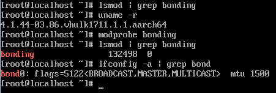

# 初始设置

## 设置网络和主机名

配置许可信息完成后，系统会显示[图1](#zh-cn_topic_0090571616_fig12429121720485)所示界面，需要用户对网络进行设置，可参考[设置网络和主机名](设置网络和主机名.md)。系统安装成功之后，用户可以通过**modprobe bonding**  命令手动增加bond0，如[图2](#zh-cn_topic_0090571616_fig4657324115317)。

完成配置后，单击“完成”，进入初始设置界面，单击“完成配置”，即可进入用户登录界面，如[图3](#zh-cn_topic_0090571616_zh-cn_topic_0084097773_zh-cn_topic_0072985183_zh-cn_topic_0050852534_zh-cn_topic_0023047520_fig11453122164219)所示。

**图 1**  网络和主机名  

**图 2**  手动添加bond0  

**图 3**  登录界面  

## 查看kdump服务状态

登录服务器之后，进入命令行界面，在界面中执行** systemctl status kdump**，查看kdump服务是否正常。如果kdump不处于active状态，常见原因是内核启动参数中crashkernel配置不正确，请参考“调试指南”-\>"kdump"中配置kdump参数说明章节。

