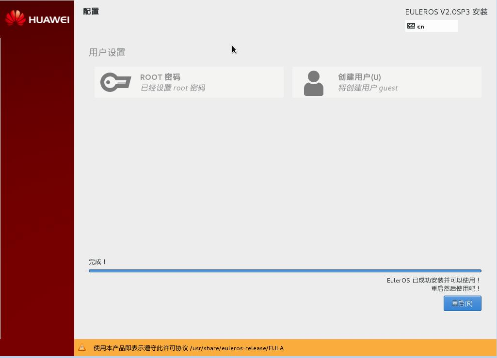

# 安装完成

此刻，EulerOS V2.0操作系统完成安装，如[图1](#fig89461337184111)所示。单击“完成配置”，然后再单击“重启”，系统重新启动。

**图 1**  完成安装  

> **说明：**   
>请记住如果在重启过程中安装光盘没有自动弹出，则请手动取出。  

重启完成后，根据用户在[选择安装软件](选择安装软件.md)的设置，会产生不同的结果：

-   若用户选择“基础系统”，则可以直接进入EulerOS命令行登录界面。
-   若用户选择“带GUI的服务器”，则需要用户进行一些[初始设置](初始设置.md)，然后就可以开始使用EulerOS。

