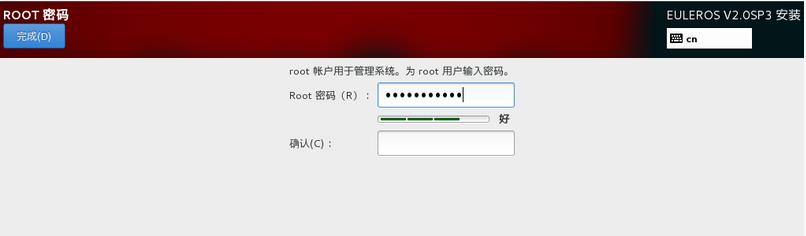

# 安装过程配置

开始安装后会出现进度页面，显示安装进度及所选软件包写入系统的进度。

**图 1**  安装过程  

安装软件包的过程中，需要用户配置root密码、创建用户。

## 密码复杂度

用户在设置root用户密码或者新创建用户密码时，需要满足密码复杂度要求，否则会设置失败。设置密码的复杂度的要求如下：

1.  口令长度至少8个字符。
2.  口令至少包含大写字母、小写字母、数字和特殊字符中的任意3种。
3.  口令不能和账号一样。
4.  口令不能使用字典词汇。

## 设置root密码

单击“ROOT密码”，弹出设置密码界面如[图2](#zh-cn_topic_0090571614_zh-cn_topic_0084097771_zh-cn_topic_0072985013_zh-cn_topic_0050852532_zh-cn_topic_0022427724_fig2801928162949)所示，输入密码并重新输入确认。

> **说明：**   
>root密码需要在安装软件包的同时进行配置，如果不配置该密码则无法完成安装。root账户是用来执行关键系统管理任务，不建议您在日常工作及系统访问时使用root账户。  

**图 2**  root密码  

完成设置后，单击左上角的“完成”，返回安装过程界面。

## 创建用户

单击“创建用户”，弹出创建用户的界面如[图3](#zh-cn_topic_0090571614_zh-cn_topic_0084097771_zh-cn_topic_0072985013_zh-cn_topic_0050852532_zh-cn_topic_0022427724_fig3095814216301)所示。输入用户名，并设置密码。另外您还可以通过“高级”选项设置用户主目录、用户组等，如[图4](#zh-cn_topic_0090571614_zh-cn_topic_0084097771_zh-cn_topic_0072985013_zh-cn_topic_0050852532_zh-cn_topic_0022427724_fig4494915816301)所示。

> **说明：**   
>出于系统安全考虑，EulerOS禁止root用户直接ssh远程登录。建议您在此创建普通用户，并加入wheel群组，方便您在系统安装完成后远程登录。  

**图 3**  创建用户  

**图 4**  高级用户配置  

完成设置后，单击左上角的“完成”，返回安装过程界面。

