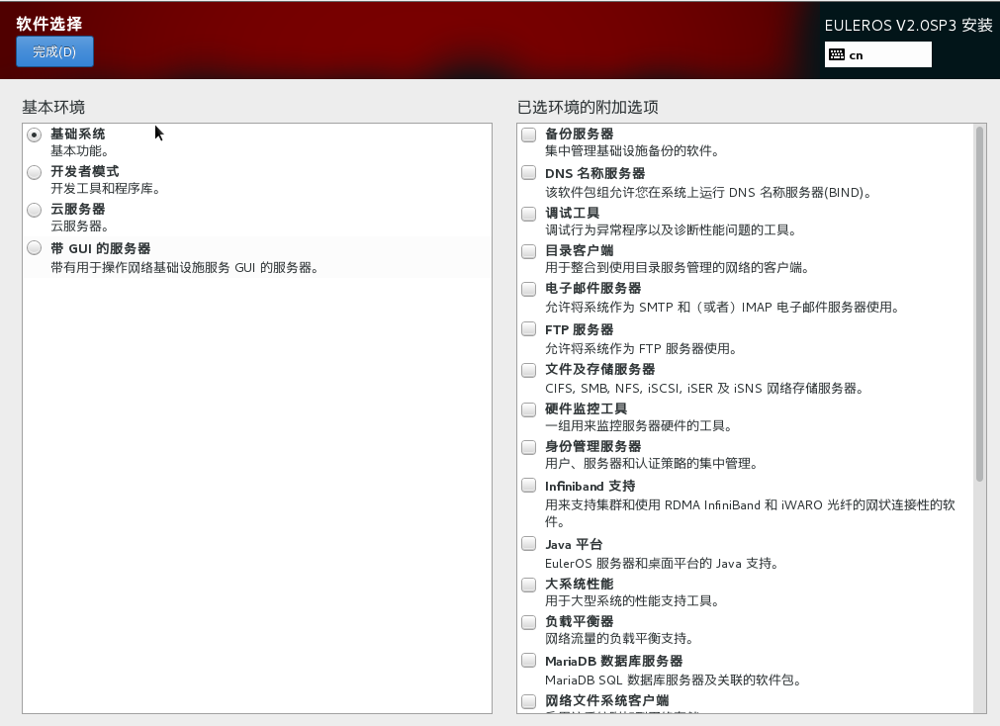

# 选择安装软件

在[安装概览](进入安装设置界面.md#zh-cn_topic_0090571602_zh-cn_topic_0084097759_zh-cn_topic_0072985224_zh-cn_topic_0050852521_zh-cn_topic_0022427576_fig40696565144837)页面中选择“软件选择”，指定需要安装的软件包。

用户需要根据实际的业务需求，在左侧选择一个“基本环境”，然后在右侧选择需要安装的软件包，如[图1](#zh-cn_topic_0090571609_zh-cn_topic_0084097766_fig4011257161812)所示。如果要使用桌面环境，则用户必须选择“带GUI的服务器”，系统安装后才能通过桌面进行操作。

**图 1**  安装软件  

设置完成后，请单击左上角“完成”，返回[安装概览](进入安装设置界面.md#zh-cn_topic_0090571602_zh-cn_topic_0084097759_zh-cn_topic_0072985224_zh-cn_topic_0050852521_zh-cn_topic_0022427576_fig40696565144837)安装配置主页面。

【介绍各种模式的差别，以及推荐安装模式】

