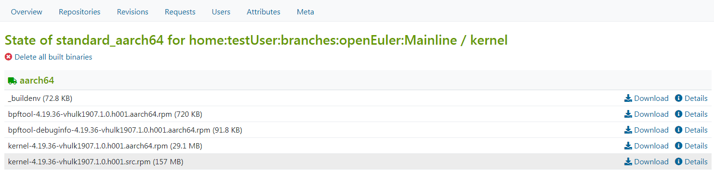

# Obtaining the Software Package

After the RPM software package is built, perform the following operations to obtain the RPM software package on the web page:

1.  Log in to the OBS console.
2.  Click  **All Projects**  and find the project corresponding to the required software package, for example,  **openEuler:Mainline**.
3.  Click the name of the required software package in the project. The software package details page is displayed, for example, the  **kernel**  page in the preceding example.

1.  Click the  **Repositories**  tab. On the software repository management page that is displayed, click  **Enable**  in  **Publish Flag**  to enable the RPM software package download function \(the status changes from    to  \), as shown in  [Figure 1](#fig17480830144217).

    **Figure  1** **Repositories**  page  
    

2.  Click the project name in the  **Repository**  column. On the RPM software package download page that is displayed, click  **Download**  on the right of the RPM software package to download the RPM software package, as shown in  [Figure 2](#fig12152145615438).

    **Figure  2**  RPM software package download page  
    

