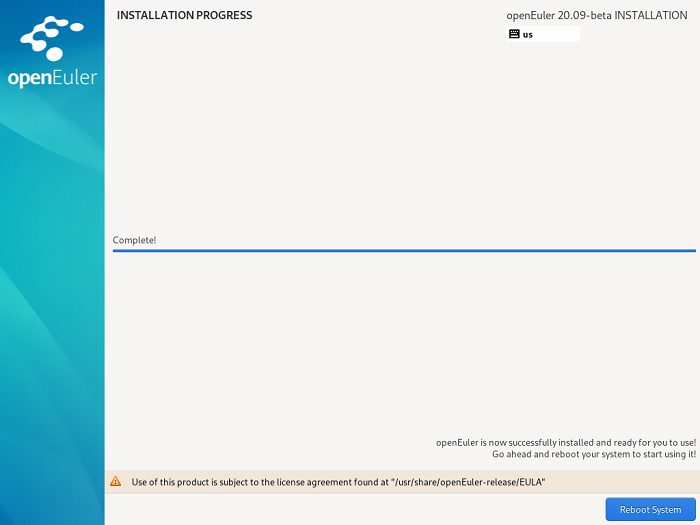

# Completing the Installation

openEuler has been installed, as shown in  [Figure 1](#en-us_topic_0186390267_en-us_topic_0122145917_fig1429512116338). Click  **Reboot**  to restart the system.

**Figure  1**  Completing the installation  

-   If the physical DVD-ROM is used to install the OS and the DVD-ROM drive is not automatically ejected during the restart, manually remove the DVD-ROM. Then, the openEuler CLI login page is displayed.
-   If the virtual DVD-ROM drive is used to install the OS, change the server boot option to  **Hard Disk**  and restart the server. Then, the openEuler CLI login page is displayed.

