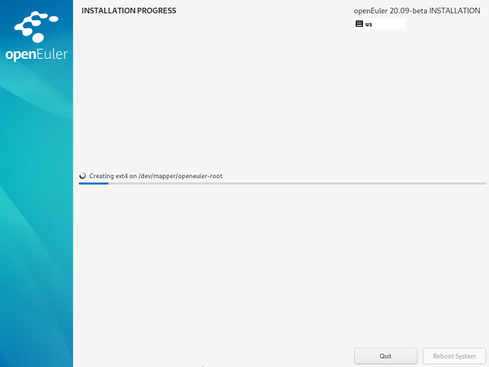
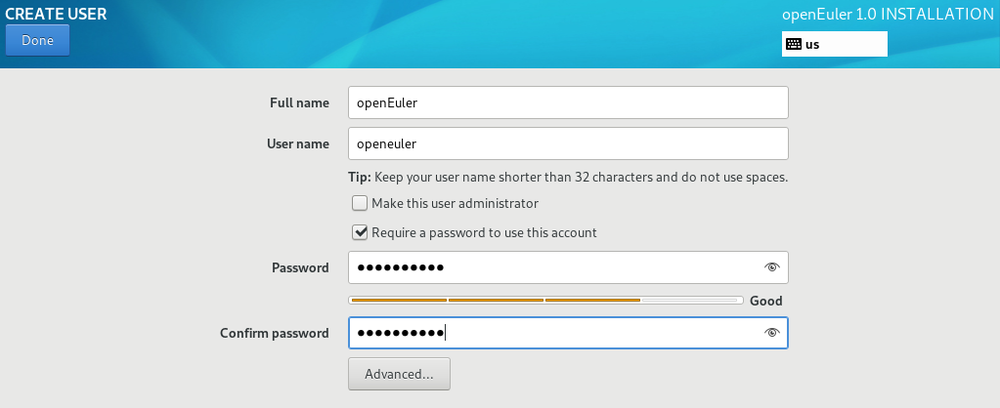
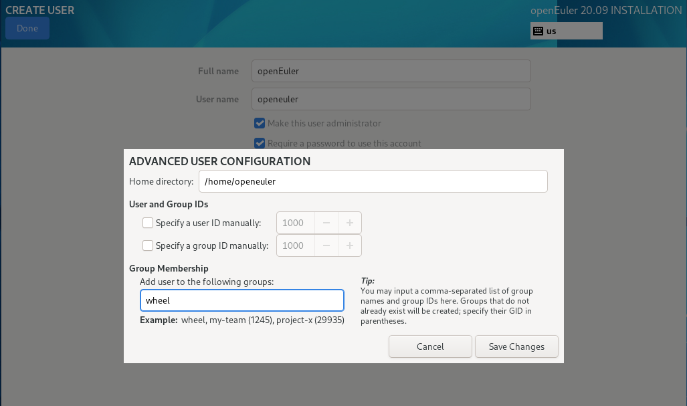

# Configurations During Installation<a name="EN-US_TOPIC_0214071096"></a>

After the installation starts, the overall installation progress and the progress of writing the software package to the system are displayed.

**Figure  1**  Installation process<a name="en-us_topic_0186390266_en-us_topic_0122145909_fig1590863119306"></a>  


During the process of installing software packages, you need to configure the root password and create users.

## Password Complexity<a name="en-us_topic_0186390266_en-us_topic_0122145909_sde5f91f1b197422180f50c693caff342"></a>

The password of the root user or the password of the new user must meet the password complexity requirements. Otherwise, the password configuration or user creation will fail. The password complexity requirements are as follows:

1.  A password must contain at least eight characters.
2.  A password must contain at least three of the following types: uppercase letters, lowercase letters, digits, and special characters.
3.  A password must be different from the account name.
4.  A password cannot contain words in the dictionary.
    -   Querying a dictionary

        In the installed openEuler environment, you can run the following command to export the dictionary library file  **dictionary.txt**, and then check whether the password is in the dictionary.

        ```
        cracklib-unpacker /usr/share/cracklib/pw_dict > dictionary.txt
        ```

    -   Modifying a dictionary
        1.  Modify the exported dictionary library file, and then run the following command to update the dictionary library:

            ```
            # create-cracklib-dict dictionary.txt
            ```

        2.  Run the following command to add another dictionary file  **custom.txt**  to the original dictionary library.

            ```
            # create-cracklib-dict dictionary.txt custom.txt
            ```


## Setting the root User Password<a name="en-us_topic_0186390266_en-us_topic_0122145909_sba63f974590848d1a6110d6aa9d145ab"></a>

Click  **Root Password**. In the displayed dialog box, as shown in  [Figure 2](#en-us_topic_0186390266_en-us_topic_0122145909_fig1323165793018), enter a password and re-enter to confirm.

> **NOTE:**   
>The password of root is required to configure at the same time of installing software packages. Otherwise, the installation will fail. A root account is used for performing critical system administrative tasks. It is not recommended to use this account for daily work or system access.  

**Figure  2**  root password<a name="en-us_topic_0186390266_en-us_topic_0122145909_fig1323165793018"></a>  


After configuration, click  **Done**  in the left-upper corner to switch back to the installation process interface.

## Creating a User<a name="en-us_topic_0186390266_en-us_topic_0122145909_sb88f63af2daa4e55959c0bb72fea0a52"></a>

Click  **User Creation**.  [Figure 3](#en-us_topic_0186390266_en-us_topic_0122145909_fig1237715313319)  shows the interface for creating a user. Enter a user name and set a password. By clicking  **Advanced**, you can also configure a home directory and a user group, as shown in  [Figure 4](#en-us_topic_0186390266_en-us_topic_0122145909_fig128716531312).

**Figure  3**  Creating a user<a name="en-us_topic_0186390266_en-us_topic_0122145909_fig1237715313319"></a>  


**Figure  4**  Advanced user configuration<a name="en-us_topic_0186390266_en-us_topic_0122145909_fig128716531312"></a>  


After configuration, click  **Done**  in the left-upper corner to switch back to the installation process interface.
Click  **Finish**. The configuration of openEuler is complete.


