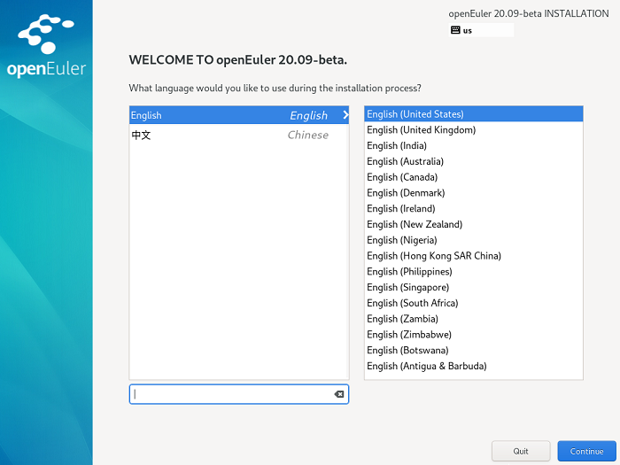

# Configuring an Installation Program Language

After the installation starts, the system will prompt the language that is used during the configuration installation process. English is configured by default, as shown in  [Figure 1](#en-us_topic_0186390093_en-us_topic_0122145864_fig144630179151). Configure another language as required.

**Figure  1**  Selecting a language  

After configurations, click  **Continue**. The main installation configuration page is displayed.

If you want to exit the installation, click  **Exit**. The message "Are you sure you want to exit the installation program?" is displayed. Click  **Yes**  in the dialog box to go back to the installation wizard page.

