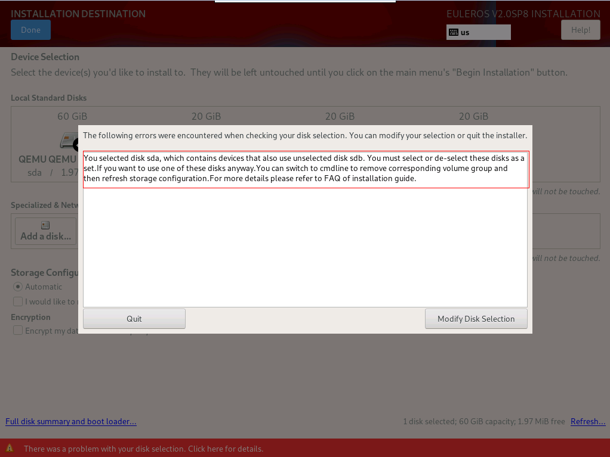

# Failed to Selected Only One Disk for Reinstallation When openEuler Was Installed on a Logical Volume Consisting of Multiple Disks<a name="EN-US_TOPIC_0231657928"></a>

## Symptom<a name="section17737537102215"></a>

If openEuler was installed on a logical volume consisting of multiple disks, an error message will be displayed as shown in  [Figure 1](#fig115949762617)  when you attempt to select one of the disks for reinstallation. 

**Figure  1**  Error message<a name="fig115949762617"></a>  


## Possible Cause<a name="section1129713599228"></a>

The previous logical volume contains multiple disks. If you select one of the disks for reinstallation, the logical volume will be damaged.

## Solution<a name="section7927961239"></a>

The logical volume formed by multiple disks is equivalent to a volume group. Therefore, you only need to delete the corresponding volume group.

1.  Press  **Ctrl**+**Alt**+**F2**  to switch to the CLI and run the following command to find the volume group:

    ```
    vgs
    ```

    

2.  Run the following command to delete the volume group:

    ```
    vgremove euleros
    ```

3.  Run the following command to restart the installation program for the modification to take effect:

    ```
    systemctl restart anaconda
    ```

    > **NOTE:**   
    >You can also press  **Ctrl**+**Alt**+**F6**  to return to the GUI and click  **Refresh**  in the lower right corner to refresh the storage configuration.  


