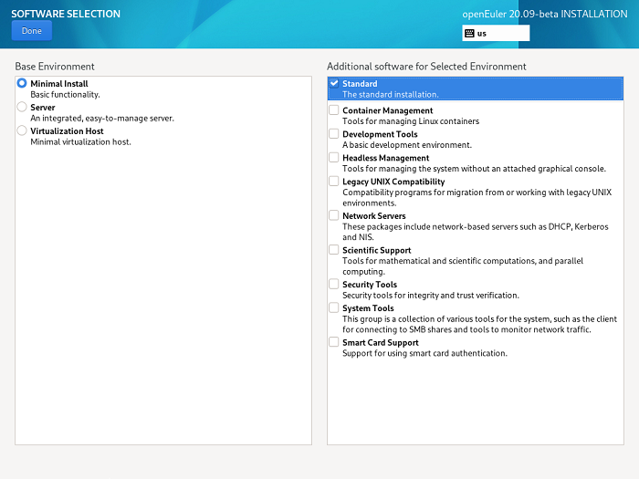

# Selecting Installation Software

On the  **INSTALLATION SUMMARY**  page, click  **SOFTWARE SELECTION**  to specify the software package to be installed.

Based on the site requirements, select  **Minimal Install**  on the left box and select the additional option under the  **Add-Ons for Selected Environment**  area on the right, as shown in  [Figure 1](#en-us_topic_0186390261_en-us_topic_0122145865_fig03031519101414).

**Figure  1**  Selecting installation software  

> **NOTE:**   
>In Minimal Install mode, not all packages in the installation source will be installed. If the required package is not installed, you can mount the installation source to the local PC and configure a repository source, and use DNF to install the package.  

After the setting is complete, click  **Done**  in the upper left corner to go back to the  **INSTALLATION SUMMARY**  page.

