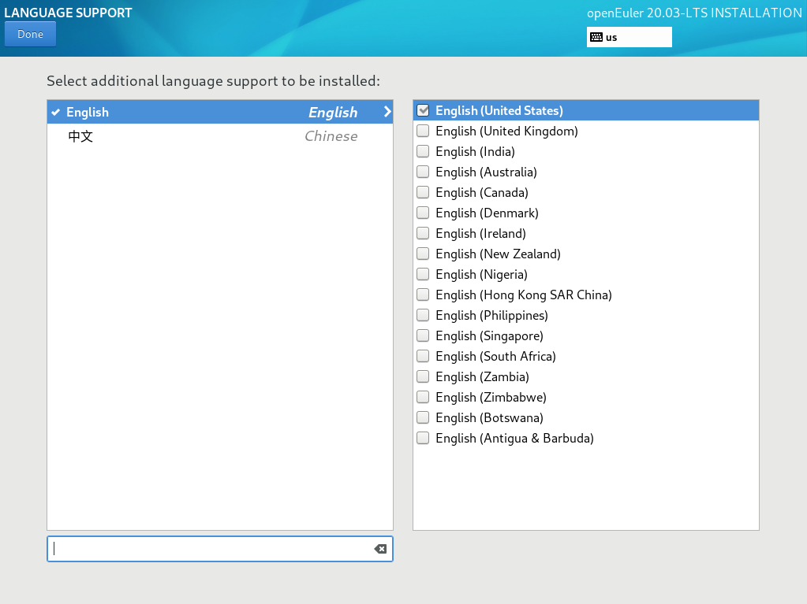

# Setting a System Language

On the  **INSTALLATION SUMMARY**  page, click  **LANGUAGE SUPPORT**  to set the system language. Set another language as required, such as Chinese, as shown in  [Figure 1](#en-us_topic_0186390098_en-us_topic_0122145772_fig187301927172619).

> **NOTE:**   
>-   If you select Chinese, the system does not display Chinese characters after you log in to the system using VNC, because VNC does not support Chinese characters. If you log in to the system in SSH mode, Chinese characters will be displayed.   
>-   If you select English, there will be no impact.  

**Figure  1**  Setting a system language  

After the setting is complete, click  **Done**  in the upper left corner to go back to the  **INSTALLATION SUMMARY**  page.

