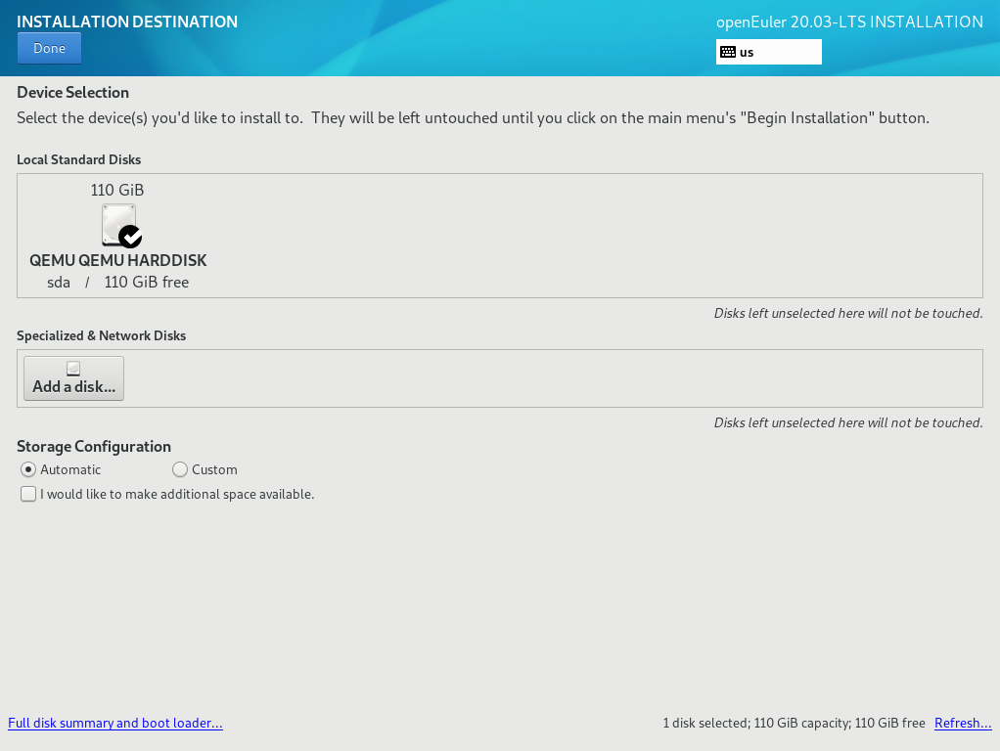
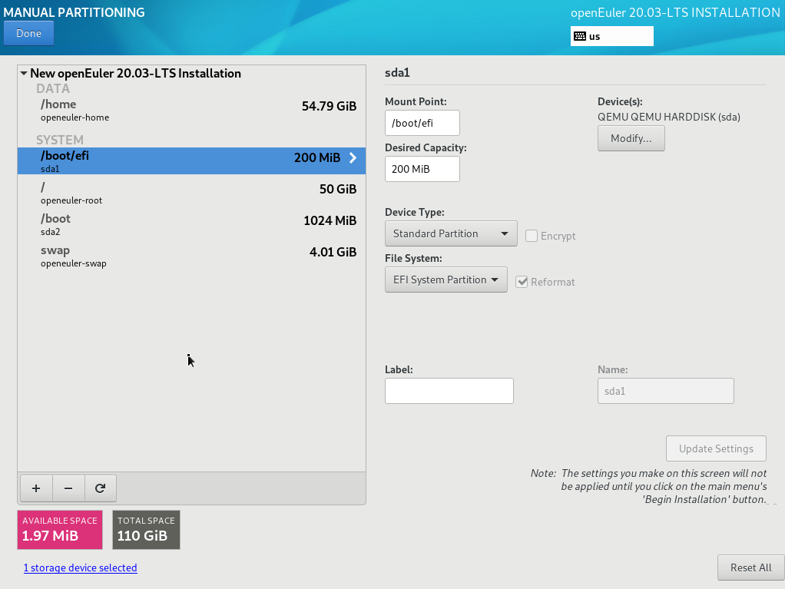

# Setting the Installation Destination

On the  **INSTALLATION SUMMARY**  page, click  **INSTALLATION DESTINATION**  to select the operating system installation disk and partition.

You can view available local storage devices in  [Figure 1](#fig1195417125015). You can also add an attached device or a network disk specified by clicking  **Add a disk**.

**Figure  1**  Setting the installation destination  

## Storage Configuration

On the  **INSTALLATION DESTINATION**  page, set storage configurations for system partition. You can either manually configure partitions or select  **Automatic**  to automatically configure partitioning.

> **NOTE:**   
>-   During partitioning, to ensure system security and performance, you are advised to divide the device into the following partitions:  **/boot**,  **/var**,  **/var/log**,  **/var/log/audit**,  **/home**,  **/tmp**.  
>-   If the system is configured with the swap partition, the swap partition is used when the physical memory of the system is insufficient. Although the swap partition can be used to expand the physical memory, if the swap partition is used due to insufficient memory, the system response time increases and the system performance deteriorates. Therefore, you are not advised to configure the swap partition in the system with sufficient physical memory or the performance sensitive system.  
>-   If you need to split a logical volume group, select  **Custom**  to manually partition the logical volume group. On the  **MANUAL PARTITIONING**  page, click  **Modify**  in the  **Volume Group**  area to reconfigure the logical volume group.  

**Automatic**

Select  **Automatic**  if the software is installed in a new storage device or the data in the storage device is not required.

**Customize**

If you need to manually partition the disk, click  **Customize**  and click  **Done**  in the upper left corner. The following page is displayed.

**Figure  2**  MANUAL PARTITIONING page  

On the  **MANUAL PARTITIONING**  page, you can partition the disk in either of the following ways:

-   Automatic creation: Click  **Click here to create them automatically**. The system automatically assigns four mount points according to the available storage space:  **/boot**,  **/**,  **/boot/efi**, and  **swap**.
-   Manual creation: Click    to add a mount point. It is recommended that the expected capacity of each mount point not exceed the available space.

    > **NOTE:**   
    >If the expected capacity of the mount point exceeds the available space, the system allocates the remaining available space to the mount point.  

After the setting is complete, click  **Done**  in the upper left corner to go back to the  **INSTALLATION SUMMARY**  page.

