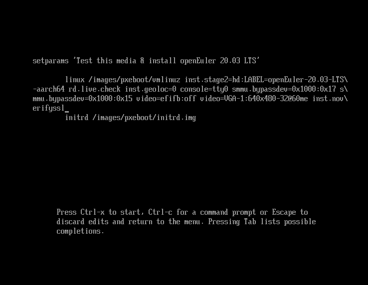

# Setting the Installation Source

On the  **INSTALLATION SUMMARY**  page, click  **INSTALLATION SOURCE**  to locate the installation source.

If you use a CD/DVD-ROM for installation, the installation program automatically detects and displays the installation source information. You can use the default settings.  [Figure 1](#en-us_topic_0186390100_en-us_topic_0144427079_fig93633295132)  shows an example.

**Figure  1**  Setting the installation source  

When you use the network for installation, if the HTTPS server uses a private certificate, press  **e**  on the installation wizard page to go to the parameter editing page and add the  **inst.noverifyssl**  parameter, as shown in  [Figure 2](#fig113517811415).

**Figure  2**  Adding the  **inst.noverifyssl**  parameter  

After the setting is complete, click  **Done**  in the upper left corner to go back to the  **INSTALLATION SUMMARY**  page.

> **NOTE:**   
>During the installation, if you have any questions about configuring the installation source, see  [An Exception Occurs During the Selection of the Installation Source](an-exception-occurs-during-the-selection-of-the-installation-source.md).  

