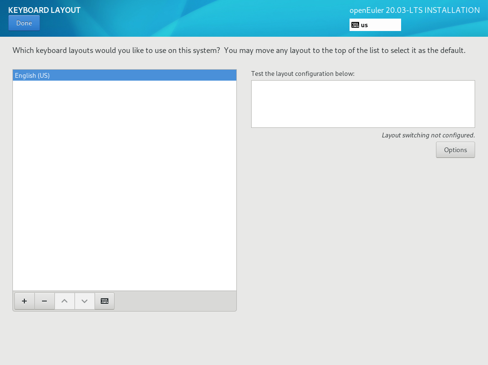

# Setting the Keyboard Layout

On the  **INSTALLATION SUMMARY**  page, click  **KEYBOARD**. You can add or delete multiple keyboard layouts in the system.

-   On the left white box, click to select the keyboard layout and click the keyboard under the box.
-   To test the keyboard layout: On the left white box, click to select the keyboard layout, click the inside of the right text box, and enter the text to ensure that the keyboard layout can work properly.

**Figure  1**  Setting the keyboard layout  

After the setting is complete, click  **Done**  in the upper left corner to go back to the  **INSTALLATION SUMMARY**  page.

