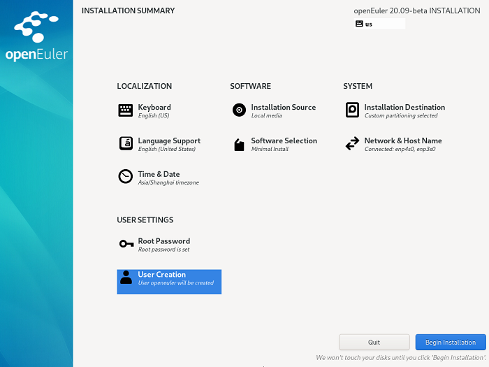

# Starting Installation

On the installation interface, after all the mandatory items are configured, the safety symbols will disappear. Then, you can click  **Begin Installation**  to install the system.

**Figure  1**  Starting installation  

