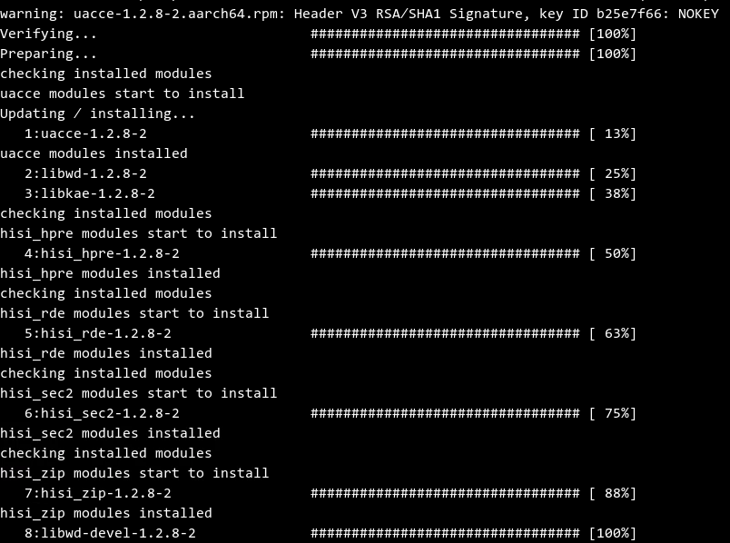

# 安装加速器软件包<a name="ZH-CN_TOPIC_0231142819"></a>

## 前提条件<a name="section21702605"></a>

-   已在本地安装远程SSH登录工具
-   已安装openEuler操作系统
-   RPM工具能正常使用。
-   已安装OpenSSL 1.1.1a或以上版本。

    使用如下命令查询OpenSSL的版本号

    -   openssl version


## 安装步骤<a name="section61105724"></a>

1.  以root帐号登录openEuler OS命令行界面。
2.  新建目录用于存放加速器引擎软件包。
3.  使用SSH远程登录工具，将所有加速引擎软件包拷贝到已建好的目录下。
4.  在存放加速引擎软件包目录下，使用rpm -ivh命令安装加速器引擎软件包。

    > **说明：**   
    >由于libkae包的安装依赖libwd包，所以libwd的安装必须先于libkae。  

    

    

5.  使用rpm -qa命令，查看加速器软件包是否已正常安装到系统内。使用rpm -ql命令 ，查看软件包的文件是否正确。示例如下。

    

    

    

    

6.  重启系统或通过命令行手动依次加载加速器引擎驱动到内核，并查看是否加载成功。

    ```
    # modprobe uacce 
    # lsmod | grep uacce 
    # modprobe hisi_qm
    # lsmod | grep hisi_qm 
    # modprobe hisi_qm
    # modprobe hisi_sec2 #加载hisi_sec2驱动时将根据/etc/modprobe.d/hisi_sec2.conf 下的配置文件加载到内核
    # modprobe hisi_hpre #加载hisi_hpre驱动时将根据/etc/modprobe.d/hisi_hpre.conf 下的配置文件加载到内核
    ```


## 设置环境变量<a name="section135512333542"></a>

通过以下命令导出环境变量：如果用户指定安装路径，则下面/usr/local应根据实际安装路径进行修改。

```
export OPENSSL_ENGINES=/usr/local/lib/engines-1.1
```

## 安装后检查<a name="section13080605"></a>

执行**rpm -qa**命令查看加速器引擎软件包是否安装成功。

打印信息中包含“_软件包名_-_版本号-_”表示该软件包安装成功。示例如下。


