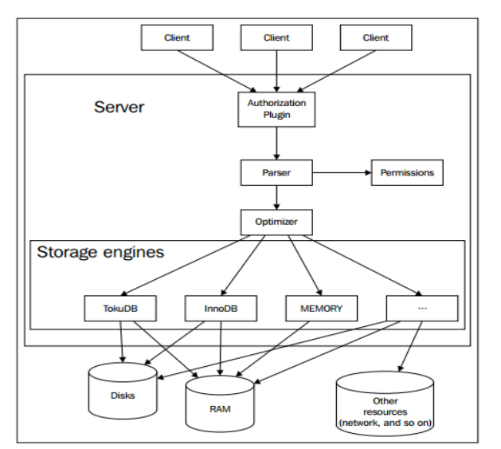

# 软件介绍

MariaDB数据库管理系统是MySQL的一个分支，主要由开源社区在维护，采用GPL授权许可。MariaDB的目的是完全兼容MySQL，包括API和命令行，使之能轻松成为MySQL的代替品，MariaDB还提供了许多更好的新特性。

MariaDB的架构如[图1](#fig13492418164520)所示。

**图 1**  MariaDB逻辑架构  

当Mariadb接受到Sql语句时，其详细的执行过程如下：

1.  当客户端连接到mariadb的时候，会认证客户端的主机名、用户、密码，认证功能可以做成插件。
2.  如果登录成功，客户端发送sql命令到服务端。由解析器解析sql语句。
3.  服务端检查客户端是否有权限去获取它想要的资源。
4.  如果查询已经存储在query cache当中，那么结果立即返回。
5.  优化器将会找出最快的执行策略，或者是执行计划，也就是说优化器可以决定什么表将会被读，以及哪些索引会被访问，哪些临时表会被使用，一个好的策略能够减少大量的磁盘访问和排序操作等。
6.  存储引擎读写数据和索引文件，cache用来加速这些操作，其他的诸如事物和外键特性，都是在存储引擎层处理的。

存储引擎在物理层管控数据，它负责数据文件、数据、索引、cache等的管理，这使得管理和读取数据变得更高效，每一张表，都有一个.frm文件，这些文件包含着表的定义。

每一个存储引擎管理、存储数据的方式都是不同的，所支持的特性和性能也不尽相同。例如：

-   MyISAM，适合读多写少的环境，且不支持事务，支持全文索引等。
-   noDB，支持事务，支持行锁和外键等。
-   MEMORY，将数据存储在内存当中。
-   CSV，将数据存储为CSV格式。

