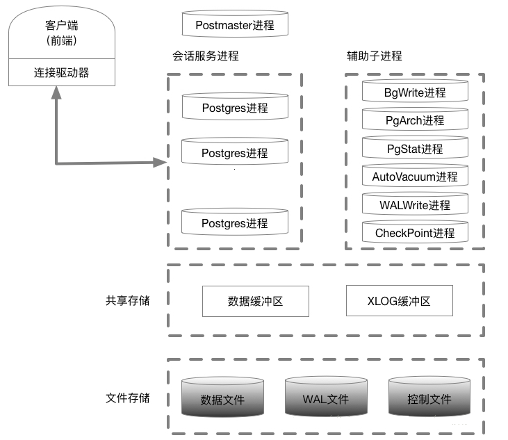

# 软件介绍

## 简要介绍

PostgreSQL的架构如[图1](#fig26022387391)所示，主要进程说明如[表1](#table62020913417)所示。

**图 1**  PostgreSql架构  

**表 1**  PostgreSql中的主要进程说明

<table><thead align="left"><tr id="row23365171"><th class="cellrowborder" valign="top" width="7.07%" id="mcps1.2.4.1.1">
进程类别

</th>
<th class="cellrowborder" valign="top" width="21.21%" id="mcps1.2.4.1.2">
进程名称

</th>
<th class="cellrowborder" valign="top" width="71.72%" id="mcps1.2.4.1.3">
说明

</th>
</tr>
</thead>
<tbody><tr id="row6848741"><td class="cellrowborder" valign="top" width="7.07%" headers="mcps1.2.4.1.1 ">
主进程

</td>
<td class="cellrowborder" valign="top" width="21.21%" headers="mcps1.2.4.1.2 ">
Postmaster

</td>
<td class="cellrowborder" valign="top" width="71.72%" headers="mcps1.2.4.1.3 ">
Postmaster是整个数据库实例的总控进程，负责启动和关闭该数据库实例。

</td>
</tr>
<tr id="row5827850"><td class="cellrowborder" valign="top" width="7.07%" headers="mcps1.2.4.1.1 ">
常驻进程

</td>
<td class="cellrowborder" valign="top" width="21.21%" headers="mcps1.2.4.1.2 ">
Potgres（常驻进程）

</td>
<td class="cellrowborder" valign="top" width="71.72%" headers="mcps1.2.4.1.3 ">
管理后端的常驻进程，也称为“postmaster”。其默认监听UNIXDomain Socket和TCP/IP（Windows等，一部分的平台只监听TCP/IP）的5432端口，等待来自前端的的连接处理。监听的端口号可以在PostgreSql的设置文件postgresql.conf中修改。

</td>
</tr>
<tr id="row23801241"><td class="cellrowborder" valign="top" width="7.07%" headers="mcps1.2.4.1.1 ">
子进程

</td>
<td class="cellrowborder" valign="top" width="21.21%" headers="mcps1.2.4.1.2 ">
Postgres（子进程）

</td>
<td class="cellrowborder" valign="top" width="71.72%" headers="mcps1.2.4.1.3 ">
子进程根据pg_hba.conf定义的安全策略来判断是否允许进行连接，根据策略，会拒绝某些特定的IP及网络，或者也可以只允许某些特定的用户或者对某些数据库进行连接。

Postgres会接受前端过来的查询，然后对数据库进行检索，最后把结果返回，有时也会对数据库进行更新。更新的数据同时还会记录在事务日志里面（PostgreSQL称为WAL日志）。这个主要是当停电、服务器宕机、重新启动的时候进行恢复处理的时候使用。另外，把日志归档保存起来，可在需要进行恢复的时候使用。在PostgreSQL 9.0以后，通过把WAL日志传送其他的postgreSQL，可以实时的进行数据库复制，这就是所谓的“数据库复制”功能。

</td>
</tr>
<tr id="row22474561"><td class="cellrowborder" rowspan="7" valign="top" width="7.07%" headers="mcps1.2.4.1.1 ">
辅助进程

</td>
<td class="cellrowborder" valign="top" width="21.21%" headers="mcps1.2.4.1.2 ">
SysLogger（系统日志）

</td>
<td class="cellrowborder" valign="top" width="71.72%" headers="mcps1.2.4.1.3 ">
需要在Postgres.conf中logging_collection设置为on，此时主进程才会启动Syslogger辅助进程。

</td>
</tr>
<tr id="row17482700"><td class="cellrowborder" valign="top" headers="mcps1.2.4.1.1 ">
BgWriter（后台写）

</td>
<td class="cellrowborder" valign="top" headers="mcps1.2.4.1.2 ">
把共享内存中的脏页写到磁盘上的进程。主要是为了提高插入、更新和删除数据的性能。

</td>
</tr>
<tr id="row329795"><td class="cellrowborder" valign="top" headers="mcps1.2.4.1.1 ">
WALWrite（预写式日志）

</td>
<td class="cellrowborder" valign="top" headers="mcps1.2.4.1.2 ">
在修改数据之前把修改操作记录到磁盘中，以便后面更新实时数据时就不需要数据持久化到文件中。

</td>
</tr>
<tr id="row12538797"><td class="cellrowborder" valign="top" headers="mcps1.2.4.1.1 ">
PgArch（归档）

</td>
<td class="cellrowborder" valign="top" headers="mcps1.2.4.1.2 ">
WAL日志会被循环使用，PgArch在归档前会把WAL日志备份出来。通过PITY（Point in Time Recovery）技术，可以对数据库进行一次全量备份后，该技术将备份时间点之后的WAL日志通过归档进行备份，使用数据库的全量备份再加上后面产生的WAL日志，即可把数据库向前推到全量备份后的任意一个时间点。

</td>
</tr>
<tr id="row58441133"><td class="cellrowborder" valign="top" headers="mcps1.2.4.1.1 ">
AutoVacuum（系统自动清理）

</td>
<td class="cellrowborder" valign="top" headers="mcps1.2.4.1.2 ">
在PostgreSQL数据库中，对表进行DELETE操作后，旧的数据并不会立即被删除，并且，在更新数据时，也并不会在旧的数据上做更新，而是新生成一行数据。旧的数据只是被标识为删除状态，只有在没有并发的其他事务读到这些就数据时，它们才会被清除。这个清除工作就由AutoVacuum进程完成。

</td>
</tr>
<tr id="row18489394"><td class="cellrowborder" valign="top" headers="mcps1.2.4.1.1 ">
PgStat（统计收集）

</td>
<td class="cellrowborder" valign="top" headers="mcps1.2.4.1.2 ">
做数据的统计收集工作。主要用于查询优化时的代价估算，包括一个表和索引进行了多少次的插入、更新、删除操作，磁盘块读写的次数、行的读次数。pg_statistic中存储了PgStat收集的各类信息。

</td>
</tr>
<tr id="row53233327"><td class="cellrowborder" valign="top" headers="mcps1.2.4.1.1 ">
CheckPoint（检查点）

</td>
<td class="cellrowborder" valign="top" headers="mcps1.2.4.1.2 ">
检查点是系统设置的事务序列点，设置检查点保证检查点前的日志信息刷到磁盘中。

</td>
</tr>
</tbody>
</table>

