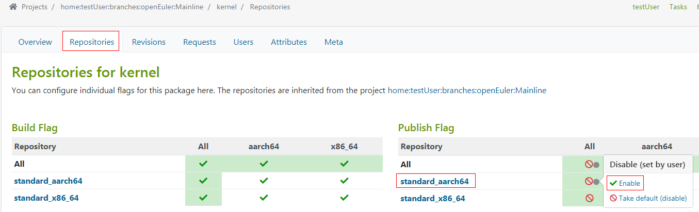

# 构建RPM包

本章介绍通过本地或OBS构建RPM软件包的方法。详见[打包规则](https://gitee.com/openeuler/community/blob/master/zh/contributors/packaging.md)。
<!-- TOC -->

- [构建RPM包](#构建rpm包)
    - [打包说明](#打包说明)
        - [原理介绍](#原理介绍)
        - [打包流程](#打包流程)
        - [打包选项](#打包选项)
    - [本地构建](#本地构建)
        - [搭建开发环境](#搭建开发环境)
        - [创建Hello World RPM包](#创建hello-world-rpm包)
    - [使用OBS构建](#使用obs构建)
        - [OBS简介](#obs简介)
        - [在线构建软件包](#在线构建软件包)
        - [使用osc构建软件包](#使用osc构建软件包)

<!-- /TOC -->

## 打包说明

### 原理介绍
RPM打包的时候需要编译源码，需要把编译好的配置文件、二进制命令文件等放到合适的位置，还要根据需要对RPM的包进行测试，这些都需要先有一个“工作空间”。rpmbuild命令使用一套标准化的“工作空间”：

```
$ rpmdev-setuptree
```

rpmdev-setuptree这个命令就是安装 rpmdevtools 带来的。可以看到运行了这个命令之后，在“/root“目录（非root用户为“/home/用户名“目录）下多了一个 rpmbuild 的文件夹，目录结构如下：

```
$ tree rpmbuild
rpmbuild
├── BUILD
├── RPMS
├── SOURCES
├── SPECS
└── SRPMS
```

内容相关的说明如下：

<a name="zh-cn_topic_0184337290_table1268115913017"></a>
<table><thead align="left"><tr id="zh-cn_topic_0184337290_row673319549321"><th class="cellrowborder" valign="top" width="27.1%" id="mcps1.1.5.1.1"><p id="zh-cn_topic_0184337290_p1673485453210"><a name="zh-cn_topic_0184337290_p1673485453210"></a><a name="zh-cn_topic_0184337290_p1673485453210"></a><strong id="zh-cn_topic_0184337290_b215284143812"><a name="zh-cn_topic_0184337290_b215284143812"></a><a name="zh-cn_topic_0184337290_b215284143812"></a>目录</strong></p>
</th>
<th class="cellrowborder" valign="top" width="18.38%" id="mcps1.1.5.1.2"><p id="zh-cn_topic_0184337290_p167341354193219"><a name="zh-cn_topic_0184337290_p167341354193219"></a><a name="zh-cn_topic_0184337290_p167341354193219"></a><strong id="zh-cn_topic_0184337290_b151541483812"><a name="zh-cn_topic_0184337290_b151541483812"></a><a name="zh-cn_topic_0184337290_b151541483812"></a>宏代码</strong></p>
</th>
<th class="cellrowborder" valign="top" width="17.76%" id="mcps1.1.5.1.3"><p id="zh-cn_topic_0184337290_p157341854103211"><a name="zh-cn_topic_0184337290_p157341854103211"></a><a name="zh-cn_topic_0184337290_p157341854103211"></a><strong id="zh-cn_topic_0184337290_b121547463819"><a name="zh-cn_topic_0184337290_b121547463819"></a><a name="zh-cn_topic_0184337290_b121547463819"></a>名称</strong></p>
</th>
<th class="cellrowborder" valign="top" width="36.76%" id="mcps1.1.5.1.4"><p id="zh-cn_topic_0184337290_p1273465410328"><a name="zh-cn_topic_0184337290_p1273465410328"></a><a name="zh-cn_topic_0184337290_p1273465410328"></a><strong id="zh-cn_topic_0184337290_b191551414388"><a name="zh-cn_topic_0184337290_b191551414388"></a><a name="zh-cn_topic_0184337290_b191551414388"></a>功能</strong></p>
</th>
</tr>
</thead>
<tbody><tr id="zh-cn_topic_0184337290_row107541059163020"><td class="cellrowborder" valign="top" width="27.1%" headers="mcps1.1.5.1.1 "><p id="zh-cn_topic_0184337290_p675425913015"><a name="zh-cn_topic_0184337290_p675425913015"></a><a name="zh-cn_topic_0184337290_p675425913015"></a>~/rpmbuild/BUILD</p>
</td>
<td class="cellrowborder" valign="top" width="18.38%" headers="mcps1.1.5.1.2 "><p id="zh-cn_topic_0184337290_p175405917305"><a name="zh-cn_topic_0184337290_p175405917305"></a><a name="zh-cn_topic_0184337290_p175405917305"></a>%_builddir</p>
</td>
<td class="cellrowborder" valign="top" width="17.76%" headers="mcps1.1.5.1.3 "><p id="zh-cn_topic_0184337290_p1754175903010"><a name="zh-cn_topic_0184337290_p1754175903010"></a><a name="zh-cn_topic_0184337290_p1754175903010"></a>构建目录</p>
</td>
<td class="cellrowborder" valign="top" width="36.76%" headers="mcps1.1.5.1.4 "><p id="zh-cn_topic_0184337290_p875415916306"><a name="zh-cn_topic_0184337290_p875415916306"></a><a name="zh-cn_topic_0184337290_p875415916306"></a>源码包被解压至此，并在该目录的子目录完成编译</p>
</td>
</tr>
<tr id="zh-cn_topic_0184337290_row117541859183017"><td class="cellrowborder" valign="top" width="27.1%" headers="mcps1.1.5.1.1 "><p id="zh-cn_topic_0184337290_p87541259163017"><a name="zh-cn_topic_0184337290_p87541259163017"></a><a name="zh-cn_topic_0184337290_p87541259163017"></a>~/rpmbuild/RPMS</p>
</td>
<td class="cellrowborder" valign="top" width="18.38%" headers="mcps1.1.5.1.2 "><p id="zh-cn_topic_0184337290_p9754125913018"><a name="zh-cn_topic_0184337290_p9754125913018"></a><a name="zh-cn_topic_0184337290_p9754125913018"></a>%_rpmdir</p>
</td>
<td class="cellrowborder" valign="top" width="17.76%" headers="mcps1.1.5.1.3 "><p id="zh-cn_topic_0184337290_p12754205963018"><a name="zh-cn_topic_0184337290_p12754205963018"></a><a name="zh-cn_topic_0184337290_p12754205963018"></a>标准 RPM 包目录</p>
</td>
<td class="cellrowborder" valign="top" width="36.76%" headers="mcps1.1.5.1.4 "><p id="zh-cn_topic_0184337290_p177548599306"><a name="zh-cn_topic_0184337290_p177548599306"></a><a name="zh-cn_topic_0184337290_p177548599306"></a>生成/保存二进制 RPM 包</p>
</td>
</tr>
<tr id="zh-cn_topic_0184337290_row88505117359"><td class="cellrowborder" valign="top" width="27.1%" headers="mcps1.1.5.1.1 "><p id="zh-cn_topic_0184337290_p3753759173019"><a name="zh-cn_topic_0184337290_p3753759173019"></a><a name="zh-cn_topic_0184337290_p3753759173019"></a>~/rpmbuild/SOURCES</p>
</td>
<td class="cellrowborder" valign="top" width="18.38%" headers="mcps1.1.5.1.2 "><p id="zh-cn_topic_0184337290_p9753185903013"><a name="zh-cn_topic_0184337290_p9753185903013"></a><a name="zh-cn_topic_0184337290_p9753185903013"></a>%_sourcedir</p>
</td>
<td class="cellrowborder" valign="top" width="17.76%" headers="mcps1.1.5.1.3 "><p id="zh-cn_topic_0184337290_p10753135913308"><a name="zh-cn_topic_0184337290_p10753135913308"></a><a name="zh-cn_topic_0184337290_p10753135913308"></a>源代码目录</p>
</td>
<td class="cellrowborder" valign="top" width="36.76%" headers="mcps1.1.5.1.4 "><p id="zh-cn_topic_0184337290_p675495933018"><a name="zh-cn_topic_0184337290_p675495933018"></a><a name="zh-cn_topic_0184337290_p675495933018"></a>保存源码包（如 .tar 包）和所有 patch 补丁</p>
</td>
</tr>
<tr id="zh-cn_topic_0184337290_row1868513113357"><td class="cellrowborder" valign="top" width="27.1%" headers="mcps1.1.5.1.1 "><p id="zh-cn_topic_0184337290_p3753135912308"><a name="zh-cn_topic_0184337290_p3753135912308"></a><a name="zh-cn_topic_0184337290_p3753135912308"></a>~/rpmbuild/SPECS</p>
</td>
<td class="cellrowborder" valign="top" width="18.38%" headers="mcps1.1.5.1.2 "><p id="zh-cn_topic_0184337290_p147534598305"><a name="zh-cn_topic_0184337290_p147534598305"></a><a name="zh-cn_topic_0184337290_p147534598305"></a>%_specdir</p>
</td>
<td class="cellrowborder" valign="top" width="17.76%" headers="mcps1.1.5.1.3 "><p id="zh-cn_topic_0184337290_p17753105910308"><a name="zh-cn_topic_0184337290_p17753105910308"></a><a name="zh-cn_topic_0184337290_p17753105910308"></a>Spec 文件目录</p>
</td>
<td class="cellrowborder" valign="top" width="36.76%" headers="mcps1.1.5.1.4 "><p id="zh-cn_topic_0184337290_p4753125918302"><a name="zh-cn_topic_0184337290_p4753125918302"></a><a name="zh-cn_topic_0184337290_p4753125918302"></a>保存 RPM 包配置（.spec）文件</p>
</td>
</tr>
<tr id="zh-cn_topic_0184337290_row275418594301"><td class="cellrowborder" valign="top" width="27.1%" headers="mcps1.1.5.1.1 "><p id="zh-cn_topic_0184337290_p9754115973018"><a name="zh-cn_topic_0184337290_p9754115973018"></a><a name="zh-cn_topic_0184337290_p9754115973018"></a>~/rpmbuild/SRPMS</p>
</td>
<td class="cellrowborder" valign="top" width="18.38%" headers="mcps1.1.5.1.2 "><p id="zh-cn_topic_0184337290_p14754559163011"><a name="zh-cn_topic_0184337290_p14754559163011"></a><a name="zh-cn_topic_0184337290_p14754559163011"></a>%_srcrpmdir</p>
</td>
<td class="cellrowborder" valign="top" width="17.76%" headers="mcps1.1.5.1.3 "><p id="zh-cn_topic_0184337290_p7754115923010"><a name="zh-cn_topic_0184337290_p7754115923010"></a><a name="zh-cn_topic_0184337290_p7754115923010"></a>源代码 RPM 包目录</p>
</td>
<td class="cellrowborder" valign="top" width="36.76%" headers="mcps1.1.5.1.4 "><p id="zh-cn_topic_0184337290_p10754165933017"><a name="zh-cn_topic_0184337290_p10754165933017"></a><a name="zh-cn_topic_0184337290_p10754165933017"></a>生成/保存源码 RPM 包(SRPM)</p>
</td>
</tr>
</tbody>
</table>

SPECS 下是RPM包的配置文件，是RPM打包的“图纸”，这个文件会告诉rpmbuild命令如何去打包。“宏代码”这一列就可以在SPEC文件中用来代指所对应的目录，类似于编程语言中的宏或全局变量。

### 打包流程
打包的过程主要分为如下步骤：

1.  把源代码放到%\_sourcedir中。
2.  进行编译，编译的过程是在%\_builddir中完成的，一般情况下，源代码是压缩包格式，需要先进行解压。
3.  进行“安装”，类似于预先组装软件包，把软件包应该包含的内容（比如二进制文件、配置文件、man文档等）复制到%\_buildrootdir中，并按照实际安装后的目录结构组装，比如二进制命令可能会放在/usr/bin下，那么就在%\_buildrootdir下也按照同样的目录结构放置。
4.  做一些必要的配置，比如在实际安装前的准备，安装后的清理等等。这些都是通过配置在SPEC文件中来告诉rpmbuild命令。
5.  检查软件是否正常运行。
6.  生成的RPM包放置到%\_rpmdir，源码包放置到%\_srpmdir下。

在SPEC文件中的，各个阶段说明如下：

<a name="zh-cn_topic_0184337290_table14621920105410"></a>
<table><thead align="left"><tr id="zh-cn_topic_0184337290_row1416062025411"><th class="cellrowborder" valign="top" width="7.75077507750775%" id="mcps1.1.5.1.1"><p id="zh-cn_topic_0184337290_p141601200544"><a name="zh-cn_topic_0184337290_p141601200544"></a><a name="zh-cn_topic_0184337290_p141601200544"></a><strong id="zh-cn_topic_0184337290_b18160102005415"><a name="zh-cn_topic_0184337290_b18160102005415"></a><a name="zh-cn_topic_0184337290_b18160102005415"></a><span>阶段</span></strong></p>
</th>
<th class="cellrowborder" valign="top" width="13.931393139313933%" id="mcps1.1.5.1.2"><p id="zh-cn_topic_0184337290_p8160122017546"><a name="zh-cn_topic_0184337290_p8160122017546"></a><a name="zh-cn_topic_0184337290_p8160122017546"></a><strong id="zh-cn_topic_0184337290_b2016052095418"><a name="zh-cn_topic_0184337290_b2016052095418"></a><a name="zh-cn_topic_0184337290_b2016052095418"></a><span>读取的目录</span></strong></p>
</th>
<th class="cellrowborder" valign="top" width="10.391039103910392%" id="mcps1.1.5.1.3"><p id="zh-cn_topic_0184337290_p816015207540"><a name="zh-cn_topic_0184337290_p816015207540"></a><a name="zh-cn_topic_0184337290_p816015207540"></a><strong id="zh-cn_topic_0184337290_b18160920145418"><a name="zh-cn_topic_0184337290_b18160920145418"></a><a name="zh-cn_topic_0184337290_b18160920145418"></a><span>写入的目录</span></strong></p>
</th>
<th class="cellrowborder" valign="top" width="67.92679267926793%" id="mcps1.1.5.1.4"><p id="zh-cn_topic_0184337290_p1016072017548"><a name="zh-cn_topic_0184337290_p1016072017548"></a><a name="zh-cn_topic_0184337290_p1016072017548"></a><strong id="zh-cn_topic_0184337290_b1116032015420"><a name="zh-cn_topic_0184337290_b1116032015420"></a><a name="zh-cn_topic_0184337290_b1116032015420"></a><span>具体动作</span></strong></p>
</th>
</tr>
</thead>
<tbody><tr id="zh-cn_topic_0184337290_row13160102085419"><td class="cellrowborder" valign="top" width="7.75077507750775%" headers="mcps1.1.5.1.1 "><p id="zh-cn_topic_0184337290_p2160152017546"><a name="zh-cn_topic_0184337290_p2160152017546"></a><a name="zh-cn_topic_0184337290_p2160152017546"></a><span>%prep</span></p>
</td>
<td class="cellrowborder" valign="top" width="13.931393139313933%" headers="mcps1.1.5.1.2 "><p id="zh-cn_topic_0184337290_p16160122010543"><a name="zh-cn_topic_0184337290_p16160122010543"></a><a name="zh-cn_topic_0184337290_p16160122010543"></a><span>%_sourcedir</span></p>
</td>
<td class="cellrowborder" valign="top" width="10.391039103910392%" headers="mcps1.1.5.1.3 "><p id="zh-cn_topic_0184337290_p71609207547"><a name="zh-cn_topic_0184337290_p71609207547"></a><a name="zh-cn_topic_0184337290_p71609207547"></a><span>%_builddir</span></p>
</td>
<td class="cellrowborder" valign="top" width="67.92679267926793%" headers="mcps1.1.5.1.4 "><p id="zh-cn_topic_0184337290_p1716017206546"><a name="zh-cn_topic_0184337290_p1716017206546"></a><a name="zh-cn_topic_0184337290_p1716017206546"></a><span>读取位于</span> <span>%_sourcedir</span> <span>目录的源代码和</span><span> patch </span><span>。之后，解压源代码至</span> <span>%_builddir</span> <span>的子目录并应用所有</span><span> patch</span><span>。</span></p>
</td>
</tr>
<tr id="zh-cn_topic_0184337290_row14161122015418"><td class="cellrowborder" valign="top" width="7.75077507750775%" headers="mcps1.1.5.1.1 "><p id="zh-cn_topic_0184337290_p13161172012545"><a name="zh-cn_topic_0184337290_p13161172012545"></a><a name="zh-cn_topic_0184337290_p13161172012545"></a><span>%build</span></p>
</td>
<td class="cellrowborder" valign="top" width="13.931393139313933%" headers="mcps1.1.5.1.2 "><p id="zh-cn_topic_0184337290_p1416132055420"><a name="zh-cn_topic_0184337290_p1416132055420"></a><a name="zh-cn_topic_0184337290_p1416132055420"></a><span>%_builddir</span></p>
</td>
<td class="cellrowborder" valign="top" width="10.391039103910392%" headers="mcps1.1.5.1.3 "><p id="zh-cn_topic_0184337290_p1116182015544"><a name="zh-cn_topic_0184337290_p1116182015544"></a><a name="zh-cn_topic_0184337290_p1116182015544"></a><span>%_builddir</span></p>
</td>
<td class="cellrowborder" valign="top" width="67.92679267926793%" headers="mcps1.1.5.1.4 "><p id="zh-cn_topic_0184337290_p1216122017542"><a name="zh-cn_topic_0184337290_p1216122017542"></a><a name="zh-cn_topic_0184337290_p1216122017542"></a><span>编译位于</span> <span>%_builddir</span> <span>构建目录下的文件。通过执行类似</span> <span>./configure </span><span>&amp;</span><span>&amp;</span><span> make</span> <span>的命令实现。</span></p>
</td>
</tr>
<tr id="zh-cn_topic_0184337290_row9161320155419"><td class="cellrowborder" valign="top" width="7.75077507750775%" headers="mcps1.1.5.1.1 "><p id="zh-cn_topic_0184337290_p916162025419"><a name="zh-cn_topic_0184337290_p916162025419"></a><a name="zh-cn_topic_0184337290_p916162025419"></a><span>%install</span></p>
</td>
<td class="cellrowborder" valign="top" width="13.931393139313933%" headers="mcps1.1.5.1.2 "><p id="zh-cn_topic_0184337290_p13161720135415"><a name="zh-cn_topic_0184337290_p13161720135415"></a><a name="zh-cn_topic_0184337290_p13161720135415"></a><span>%_builddir</span></p>
</td>
<td class="cellrowborder" valign="top" width="10.391039103910392%" headers="mcps1.1.5.1.3 "><p id="zh-cn_topic_0184337290_p13161192085414"><a name="zh-cn_topic_0184337290_p13161192085414"></a><a name="zh-cn_topic_0184337290_p13161192085414"></a><span>%_buildrootdir</span></p>
</td>
<td class="cellrowborder" valign="top" width="67.92679267926793%" headers="mcps1.1.5.1.4 "><p id="zh-cn_topic_0184337290_p1216162011546"><a name="zh-cn_topic_0184337290_p1216162011546"></a><a name="zh-cn_topic_0184337290_p1216162011546"></a><span>读取位于</span> <span>%_builddir</span> <span>构建目录下的文件并将其安装至</span> <span>%_buildrootdir</span> <span>目录。这些文件就是用户安装</span><span> RPM </span><span>后，最终得到的文件。</span></p>
</td>
</tr>
<tr id="zh-cn_topic_0184337290_row5161172035417"><td class="cellrowborder" valign="top" width="7.75077507750775%" headers="mcps1.1.5.1.1 "><p id="zh-cn_topic_0184337290_p2161132065410"><a name="zh-cn_topic_0184337290_p2161132065410"></a><a name="zh-cn_topic_0184337290_p2161132065410"></a><span>%check</span></p>
</td>
<td class="cellrowborder" valign="top" width="13.931393139313933%" headers="mcps1.1.5.1.2 "><p id="zh-cn_topic_0184337290_p4161162010548"><a name="zh-cn_topic_0184337290_p4161162010548"></a><a name="zh-cn_topic_0184337290_p4161162010548"></a><span>%_builddir</span></p>
</td>
<td class="cellrowborder" valign="top" width="10.391039103910392%" headers="mcps1.1.5.1.3 "><p id="zh-cn_topic_0184337290_p18161202019544"><a name="zh-cn_topic_0184337290_p18161202019544"></a><a name="zh-cn_topic_0184337290_p18161202019544"></a><span>%_builddir</span></p>
</td>
<td class="cellrowborder" valign="top" width="67.92679267926793%" headers="mcps1.1.5.1.4 "><p id="zh-cn_topic_0184337290_p15161152013541"><a name="zh-cn_topic_0184337290_p15161152013541"></a><a name="zh-cn_topic_0184337290_p15161152013541"></a><span>检查软件是否正常运行。通过执行类似</span> <span>make test</span> <span>的命令实现。</span></p>
</td>
</tr>
<tr id="zh-cn_topic_0184337290_row19161202035419"><td class="cellrowborder" valign="top" width="7.75077507750775%" headers="mcps1.1.5.1.1 "><p id="zh-cn_topic_0184337290_p111617208547"><a name="zh-cn_topic_0184337290_p111617208547"></a><a name="zh-cn_topic_0184337290_p111617208547"></a><span>bin</span></p>
</td>
<td class="cellrowborder" valign="top" width="13.931393139313933%" headers="mcps1.1.5.1.2 "><p id="zh-cn_topic_0184337290_p161613204544"><a name="zh-cn_topic_0184337290_p161613204544"></a><a name="zh-cn_topic_0184337290_p161613204544"></a><span>%_buildrootdir</span></p>
</td>
<td class="cellrowborder" valign="top" width="10.391039103910392%" headers="mcps1.1.5.1.3 "><p id="zh-cn_topic_0184337290_p141611120175410"><a name="zh-cn_topic_0184337290_p141611120175410"></a><a name="zh-cn_topic_0184337290_p141611120175410"></a><span>%_rpmdir</span></p>
</td>
<td class="cellrowborder" valign="top" width="67.92679267926793%" headers="mcps1.1.5.1.4 "><p id="zh-cn_topic_0184337290_p12161162018541"><a name="zh-cn_topic_0184337290_p12161162018541"></a><a name="zh-cn_topic_0184337290_p12161162018541"></a><span>读取位于</span> <span>%_buildrootdir</span> <span>最终安装目录下的文件，以便最终在</span> <span>%_rpmdir</span> <span>目录下创建</span><span> RPM </span><span>包。在该目录下，不同架构的</span><span> RPM </span><span>包会分别保存至不同子目录，</span> <span>noarch</span> <span>目录保存适用于所有架构的</span><span> RPM </span><span>包。这些</span><span> RPM </span><span>文件就是用户最终安装的</span><span> RPM </span><span>包。</span></p>
</td>
</tr>
<tr id="zh-cn_topic_0184337290_row416213208540"><td class="cellrowborder" valign="top" width="7.75077507750775%" headers="mcps1.1.5.1.1 "><p id="zh-cn_topic_0184337290_p1416262085419"><a name="zh-cn_topic_0184337290_p1416262085419"></a><a name="zh-cn_topic_0184337290_p1416262085419"></a><span>src</span></p>
</td>
<td class="cellrowborder" valign="top" width="13.931393139313933%" headers="mcps1.1.5.1.2 "><p id="zh-cn_topic_0184337290_p716282015541"><a name="zh-cn_topic_0184337290_p716282015541"></a><a name="zh-cn_topic_0184337290_p716282015541"></a><span>%_sourcedir</span></p>
</td>
<td class="cellrowborder" valign="top" width="10.391039103910392%" headers="mcps1.1.5.1.3 "><p id="zh-cn_topic_0184337290_p17162142010547"><a name="zh-cn_topic_0184337290_p17162142010547"></a><a name="zh-cn_topic_0184337290_p17162142010547"></a><span>%_srcrpmdir</span></p>
</td>
<td class="cellrowborder" valign="top" width="67.92679267926793%" headers="mcps1.1.5.1.4 "><p id="zh-cn_topic_0184337290_p2162182011543"><a name="zh-cn_topic_0184337290_p2162182011543"></a><a name="zh-cn_topic_0184337290_p2162182011543"></a><span>创建源码</span><span> RPM </span><span>包（简称</span><span> SRPM</span><span>，以</span><span>.src.rpm</span> <span>作为后缀名），并保存至</span> <span>%_srcrpmdir</span> <span>目录。</span><span>SRPM </span><span>包通常用于审核和升级软件包。</span></p>
</td>
</tr>
</tbody>
</table>

### 打包选项

通过rpmbuild命令构建软件包。rpmbuild构建软件包一般可以通过构建SPEC文件、tar文件、source文件实现。

rpmbuild命令格式为：rpmbuild \[_option_...\]

常用的rpmbuild打包选项如[表1](#table1342946175212)所示。

**表 1**  rpmbuild打包选项

<a name="table1342946175212"></a>
<table><thead align="left"><tr id="row1242184611523"><th class="cellrowborder" valign="top" width="50%" id="mcps1.2.3.1.1"><p id="p1142134616527"><a name="p1142134616527"></a><a name="p1142134616527"></a><em id="i196115187577"><a name="i196115187577"></a><a name="i196115187577"></a>option</em>取值</p>
</th>
<th class="cellrowborder" valign="top" width="50%" id="mcps1.2.3.1.2"><p id="p174244605210"><a name="p174244605210"></a><a name="p174244605210"></a>说明</p>
</th>
</tr>
</thead>
<tbody><tr id="row1642124685214"><td class="cellrowborder" valign="top" width="50%" headers="mcps1.2.3.1.1 "><p id="p44294645211"><a name="p44294645211"></a><a name="p44294645211"></a>-bp <em id="i142674211316"><a name="i142674211316"></a><a name="i142674211316"></a>specfile</em></p>
</td>
<td class="cellrowborder" valign="top" width="50%" headers="mcps1.2.3.1.2 "><p id="p5504192417282"><a name="p5504192417282"></a><a name="p5504192417282"></a>从<em id="i276214508223"><a name="i276214508223"></a><a name="i276214508223"></a>specfile</em>文件的%prep段开始构建（解开源码包并打补丁）。</p>
</td>
</tr>
<tr id="row375616513198"><td class="cellrowborder" valign="top" width="50%" headers="mcps1.2.3.1.1 "><p id="p663152652313"><a name="p663152652313"></a><a name="p663152652313"></a>-bc <em id="i17281843152313"><a name="i17281843152313"></a><a name="i17281843152313"></a>specfile</em></p>
</td>
<td class="cellrowborder" valign="top" width="50%" headers="mcps1.2.3.1.2 "><p id="p1475675181912"><a name="p1475675181912"></a><a name="p1475675181912"></a>从<em id="i11191112514"><a name="i11191112514"></a><a name="i11191112514"></a>specfile</em>文件的%build段开始构建。</p>
</td>
</tr>
<tr id="row3421646125214"><td class="cellrowborder" valign="top" width="50%" headers="mcps1.2.3.1.1 "><p id="p143521654132516"><a name="p143521654132516"></a><a name="p143521654132516"></a>-bi <em id="i1312330192911"><a name="i1312330192911"></a><a name="i1312330192911"></a>specfile</em></p>
</td>
<td class="cellrowborder" valign="top" width="50%" headers="mcps1.2.3.1.2 "><p id="p134949360269"><a name="p134949360269"></a><a name="p134949360269"></a>从<em id="i8494173617262"><a name="i8494173617262"></a><a name="i8494173617262"></a>specfile</em>文件的%install段开始构建。</p>
</td>
</tr>
<tr id="row642846145211"><td class="cellrowborder" valign="top" width="50%" headers="mcps1.2.3.1.1 "><p id="p1342746115211"><a name="p1342746115211"></a><a name="p1342746115211"></a>-bl <em id="i1654526296"><a name="i1654526296"></a><a name="i1654526296"></a>specfile</em></p>
</td>
<td class="cellrowborder" valign="top" width="50%" headers="mcps1.2.3.1.2 "><p id="p14710104517231"><a name="p14710104517231"></a><a name="p14710104517231"></a>从<em id="i793315305278"><a name="i793315305278"></a><a name="i793315305278"></a>specfile</em>文件的%file段开始检查。</p>
</td>
</tr>
<tr id="row2428463528"><td class="cellrowborder" valign="top" width="50%" headers="mcps1.2.3.1.1 "><p id="p56839482271"><a name="p56839482271"></a><a name="p56839482271"></a>-ba <em id="i182405318294"><a name="i182405318294"></a><a name="i182405318294"></a>specfile</em></p>
</td>
<td class="cellrowborder" valign="top" width="50%" headers="mcps1.2.3.1.2 "><p id="p1983024422919"><a name="p1983024422919"></a><a name="p1983024422919"></a><span>通过</span><em id="i622172017295"><a name="i622172017295"></a><a name="i622172017295"></a>specfile</em><span>文件构建源码包和二进制包。</span></p>
</td>
</tr>
<tr id="row176441743349"><td class="cellrowborder" valign="top" width="50%" headers="mcps1.2.3.1.1 "><p id="p176441749342"><a name="p176441749342"></a><a name="p176441749342"></a>-bb <em id="i1815358294"><a name="i1815358294"></a><a name="i1815358294"></a>specfile</em></p>
</td>
<td class="cellrowborder" valign="top" width="50%" headers="mcps1.2.3.1.2 "><p id="p26440463410"><a name="p26440463410"></a><a name="p26440463410"></a><span>通过</span><em id="i1950512552910"><a name="i1950512552910"></a><a name="i1950512552910"></a>specfile</em><span>文件构建二进制包</span>。</p>
</td>
</tr>
<tr id="row143691297164"><td class="cellrowborder" valign="top" width="50%" headers="mcps1.2.3.1.1 "><p id="p913185619293"><a name="p913185619293"></a><a name="p913185619293"></a>-bs <em id="i18577144710301"><a name="i18577144710301"></a><a name="i18577144710301"></a>specfile</em></p>
</td>
<td class="cellrowborder" valign="top" width="50%" headers="mcps1.2.3.1.2 "><p id="p8707203214307"><a name="p8707203214307"></a><a name="p8707203214307"></a><span>通过</span><em id="i99441330193010"><a name="i99441330193010"></a><a name="i99441330193010"></a>specfile</em><span>文件构建源码包。</span></p>
</td>
</tr>
<tr id="row1399650113119"><td class="cellrowborder" valign="top" width="50%" headers="mcps1.2.3.1.1 "><p id="p6756203383111"><a name="p6756203383111"></a><a name="p6756203383111"></a>-rp <em id="i18757173312312"><a name="i18757173312312"></a><a name="i18757173312312"></a>sourcefile</em></p>
</td>
<td class="cellrowborder" valign="top" width="50%" headers="mcps1.2.3.1.2 "><p id="p11757183311317"><a name="p11757183311317"></a><a name="p11757183311317"></a>从<em id="i197751147153619"><a name="i197751147153619"></a><a name="i197751147153619"></a>sourcefile</em>文件的%prep段开始构建（解开源码包并打补丁）。</p>
</td>
</tr>
<tr id="row114161423119"><td class="cellrowborder" valign="top" width="50%" headers="mcps1.2.3.1.1 "><p id="p2757183312313"><a name="p2757183312313"></a><a name="p2757183312313"></a>-rc <em id="i7716153183620"><a name="i7716153183620"></a><a name="i7716153183620"></a>sourcefile</em></p>
</td>
<td class="cellrowborder" valign="top" width="50%" headers="mcps1.2.3.1.2 "><p id="p67571733133114"><a name="p67571733133114"></a><a name="p67571733133114"></a>从<em id="i9194650163619"><a name="i9194650163619"></a><a name="i9194650163619"></a>sourcefile</em>文件的%build段开始构建。</p>
</td>
</tr>
<tr id="row1787181019319"><td class="cellrowborder" valign="top" width="50%" headers="mcps1.2.3.1.1 "><p id="p1275773373119"><a name="p1275773373119"></a><a name="p1275773373119"></a>-ri <em id="i1963616335362"><a name="i1963616335362"></a><a name="i1963616335362"></a>sourcefile</em></p>
</td>
<td class="cellrowborder" valign="top" width="50%" headers="mcps1.2.3.1.2 "><p id="p0757143320319"><a name="p0757143320319"></a><a name="p0757143320319"></a>从<em id="i196145217369"><a name="i196145217369"></a><a name="i196145217369"></a>sourcefile</em>文件的%install段开始构建。</p>
</td>
</tr>
<tr id="row0937171213317"><td class="cellrowborder" valign="top" width="50%" headers="mcps1.2.3.1.1 "><p id="p167579334315"><a name="p167579334315"></a><a name="p167579334315"></a>-rl <em id="i1483914353366"><a name="i1483914353366"></a><a name="i1483914353366"></a>sourcefile</em></p>
</td>
<td class="cellrowborder" valign="top" width="50%" headers="mcps1.2.3.1.2 "><p id="p12757933103117"><a name="p12757933103117"></a><a name="p12757933103117"></a>从<em id="i666418540369"><a name="i666418540369"></a><a name="i666418540369"></a>sourcefile</em>文件的%file段开始检查。</p>
</td>
</tr>
<tr id="row15609181543116"><td class="cellrowborder" valign="top" width="50%" headers="mcps1.2.3.1.1 "><p id="p167572332315"><a name="p167572332315"></a><a name="p167572332315"></a>-ra <em id="i195041839133617"><a name="i195041839133617"></a><a name="i195041839133617"></a>sourcefile</em></p>
</td>
<td class="cellrowborder" valign="top" width="50%" headers="mcps1.2.3.1.2 "><p id="p1475713334313"><a name="p1475713334313"></a><a name="p1475713334313"></a><span>通过</span><em id="i11175457133613"><a name="i11175457133613"></a><a name="i11175457133613"></a>sourcefile</em><span>文件构建源码包和二进制包。</span></p>
</td>
</tr>
<tr id="row346418223315"><td class="cellrowborder" valign="top" width="50%" headers="mcps1.2.3.1.1 "><p id="p1875753320313"><a name="p1875753320313"></a><a name="p1875753320313"></a>-rb <em id="i9950941153618"><a name="i9950941153618"></a><a name="i9950941153618"></a>sourcefile</em></p>
</td>
<td class="cellrowborder" valign="top" width="50%" headers="mcps1.2.3.1.2 "><p id="p675783333115"><a name="p675783333115"></a><a name="p675783333115"></a><span>通过</span><em id="i13566059153619"><a name="i13566059153619"></a><a name="i13566059153619"></a>sourcefile</em><span>文件构建二进制包</span>。</p>
</td>
</tr>
<tr id="row4848131918311"><td class="cellrowborder" valign="top" width="50%" headers="mcps1.2.3.1.1 "><p id="p187575336317"><a name="p187575336317"></a><a name="p187575336317"></a>-rs <em id="i5943643133613"><a name="i5943643133613"></a><a name="i5943643133613"></a>sourcefile</em></p>
</td>
<td class="cellrowborder" valign="top" width="50%" headers="mcps1.2.3.1.2 "><p id="p12757123383112"><a name="p12757123383112"></a><a name="p12757123383112"></a><span>通过</span><em id="i6891141113712"><a name="i6891141113712"></a><a name="i6891141113712"></a>sourcefile</em><span>文件构建源码包。</span></p>
</td>
</tr>
<tr id="row24008816315"><td class="cellrowborder" valign="top" width="50%" headers="mcps1.2.3.1.1 "><p id="p1864848133917"><a name="p1864848133917"></a><a name="p1864848133917"></a>-tp <em id="i1164815843917"><a name="i1164815843917"></a><a name="i1164815843917"></a>tarfile</em></p>
</td>
<td class="cellrowborder" valign="top" width="50%" headers="mcps1.2.3.1.2 "><p id="p1664812814397"><a name="p1664812814397"></a><a name="p1664812814397"></a>从<em id="i10204153654013"><a name="i10204153654013"></a><a name="i10204153654013"></a>tarfile</em>文件的%prep段开始构建（解开源码包并打补丁）。</p>
</td>
</tr>
<tr id="row73977115386"><td class="cellrowborder" valign="top" width="50%" headers="mcps1.2.3.1.1 "><p id="p7648168153911"><a name="p7648168153911"></a><a name="p7648168153911"></a>-tc <em id="i352342324018"><a name="i352342324018"></a><a name="i352342324018"></a>tarfile</em></p>
</td>
<td class="cellrowborder" valign="top" width="50%" headers="mcps1.2.3.1.2 "><p id="p664808173911"><a name="p664808173911"></a><a name="p664808173911"></a>从<em id="i1299733764014"><a name="i1299733764014"></a><a name="i1299733764014"></a>tarfile</em>文件的%build段开始构建。</p>
</td>
</tr>
<tr id="row1867693203810"><td class="cellrowborder" valign="top" width="50%" headers="mcps1.2.3.1.1 "><p id="p1464911811392"><a name="p1464911811392"></a><a name="p1464911811392"></a>-ti <em id="i50102611402"><a name="i50102611402"></a><a name="i50102611402"></a>tarfile</em></p>
</td>
<td class="cellrowborder" valign="top" width="50%" headers="mcps1.2.3.1.2 "><p id="p764910818397"><a name="p764910818397"></a><a name="p764910818397"></a>从<em id="i68861339114018"><a name="i68861339114018"></a><a name="i68861339114018"></a>tarfile</em>文件的%install段开始构建。</p>
</td>
</tr>
<tr id="row1831910143813"><td class="cellrowborder" valign="top" width="50%" headers="mcps1.2.3.1.1 "><p id="p176494814391"><a name="p176494814391"></a><a name="p176494814391"></a>-ta <em id="i1598822734013"><a name="i1598822734013"></a><a name="i1598822734013"></a>tarfile</em></p>
</td>
<td class="cellrowborder" valign="top" width="50%" headers="mcps1.2.3.1.2 "><p id="p1164938153915"><a name="p1164938153915"></a><a name="p1164938153915"></a><span>通过</span><em id="i5555114184019"><a name="i5555114184019"></a><a name="i5555114184019"></a>tarfile</em><span>文件构建源码包和二进制包。</span></p>
</td>
</tr>
<tr id="row16858111273820"><td class="cellrowborder" valign="top" width="50%" headers="mcps1.2.3.1.1 "><p id="p964912883913"><a name="p964912883913"></a><a name="p964912883913"></a>-tb <em id="i1985417296405"><a name="i1985417296405"></a><a name="i1985417296405"></a>tarfile</em></p>
</td>
<td class="cellrowborder" valign="top" width="50%" headers="mcps1.2.3.1.2 "><p id="p1564916811399"><a name="p1564916811399"></a><a name="p1564916811399"></a><span>通过</span><em id="i1033434614408"><a name="i1033434614408"></a><a name="i1033434614408"></a>tarfile</em><span>文件构建二进制包</span>。</p>
</td>
</tr>
<tr id="row163391515123813"><td class="cellrowborder" valign="top" width="50%" headers="mcps1.2.3.1.1 "><p id="p176495811391"><a name="p176495811391"></a><a name="p176495811391"></a>-ts <em id="i990815311403"><a name="i990815311403"></a><a name="i990815311403"></a>tarfile</em></p>
</td>
<td class="cellrowborder" valign="top" width="50%" headers="mcps1.2.3.1.2 "><p id="p56490810392"><a name="p56490810392"></a><a name="p56490810392"></a><span>通过</span><em id="i3924248114020"><a name="i3924248114020"></a><a name="i3924248114020"></a>tarfile</em><span>文件构建源码包。</span></p>
</td>
</tr>
<tr id="row2443719144118"><td class="cellrowborder" valign="top" width="50%" headers="mcps1.2.3.1.1 "><p id="p7444191984111"><a name="p7444191984111"></a><a name="p7444191984111"></a>\-\-buildroot=<em id="i39711271427"><a name="i39711271427"></a><a name="i39711271427"></a>DIRECTORY</em></p>
</td>
<td class="cellrowborder" valign="top" width="50%" headers="mcps1.2.3.1.2 "><p id="p553719220506"><a name="p553719220506"></a><a name="p553719220506"></a>在构建时，使用<em id="i1820717188507"><a name="i1820717188507"></a><a name="i1820717188507"></a>DIRECTORY</em>目录覆盖默认的/root目录。</p>
</td>
</tr>
<tr id="row1794104355716"><td class="cellrowborder" valign="top" width="50%" headers="mcps1.2.3.1.1 "><p id="p5941184375717"><a name="p5941184375717"></a><a name="p5941184375717"></a>\-\-clean</p>
</td>
<td class="cellrowborder" valign="top" width="50%" headers="mcps1.2.3.1.2 "><p id="p1094144315577"><a name="p1094144315577"></a><a name="p1094144315577"></a>完成打包后清除BUILD目录下的文件。</p>
</td>
</tr>
<tr id="row12405112795814"><td class="cellrowborder" valign="top" width="50%" headers="mcps1.2.3.1.1 "><p id="p440562735814"><a name="p440562735814"></a><a name="p440562735814"></a>\-\-nobuild</p>
</td>
<td class="cellrowborder" valign="top" width="50%" headers="mcps1.2.3.1.2 "><p id="p0405182714588"><a name="p0405182714588"></a><a name="p0405182714588"></a>不执行任何实际的构建步骤。可用于测试spec文件。</p>
</td>
</tr>
<tr id="row10784164615815"><td class="cellrowborder" valign="top" width="50%" headers="mcps1.2.3.1.1 "><p id="p1784154655815"><a name="p1784154655815"></a><a name="p1784154655815"></a>\-\-noclean</p>
</td>
<td class="cellrowborder" valign="top" width="50%" headers="mcps1.2.3.1.2 "><p id="p57851946185814"><a name="p57851946185814"></a><a name="p57851946185814"></a>不执行spec文件的"%clean"阶段(即使它确实存在)。</p>
</td>
</tr>
<tr id="row5585102605911"><td class="cellrowborder" valign="top" width="50%" headers="mcps1.2.3.1.1 "><p id="p10585132665911"><a name="p10585132665911"></a><a name="p10585132665911"></a>\-\-nocheck</p>
</td>
<td class="cellrowborder" valign="top" width="50%" headers="mcps1.2.3.1.2 "><p id="p85851226135913"><a name="p85851226135913"></a><a name="p85851226135913"></a>不执行spec文件的"%check"阶段(即使它确实存在)。</p>
</td>
</tr>
<tr id="row6577145616591"><td class="cellrowborder" valign="top" width="50%" headers="mcps1.2.3.1.1 "><p id="p7577165625910"><a name="p7577165625910"></a><a name="p7577165625910"></a>\-\-dbpath <em id="i20573371107"><a name="i20573371107"></a><a name="i20573371107"></a>DIRECTORY</em></p>
</td>
<td class="cellrowborder" valign="top" width="50%" headers="mcps1.2.3.1.2 "><p id="p16578456185911"><a name="p16578456185911"></a><a name="p16578456185911"></a>使用<em id="i194539583018"><a name="i194539583018"></a><a name="i194539583018"></a>DIRECTORY</em>中的数据库，而不是默认的 /var/lib/rpm。</p>
</td>
</tr>
<tr id="row1424515812017"><td class="cellrowborder" valign="top" width="50%" headers="mcps1.2.3.1.1 "><p id="p132451184010"><a name="p132451184010"></a><a name="p132451184010"></a>\-\-root <em id="i1163110211911"><a name="i1163110211911"></a><a name="i1163110211911"></a>DIRECTORY</em></p>
</td>
<td class="cellrowborder" valign="top" width="50%" headers="mcps1.2.3.1.2 "><p id="p1424548908"><a name="p1424548908"></a><a name="p1424548908"></a>使<em id="i1034445918119"><a name="i1034445918119"></a><a name="i1034445918119"></a>DIRECTORY</em>为最高级别的路径，默认为“/”为最高路径。</p>
</td>
</tr>
<tr id="row2477041403"><td class="cellrowborder" valign="top" width="50%" headers="mcps1.2.3.1.1 "><p id="p1247744907"><a name="p1247744907"></a><a name="p1247744907"></a>\-\-rebuild <em id="i45014485219"><a name="i45014485219"></a><a name="i45014485219"></a>sourcefile</em></p>
</td>
<td class="cellrowborder" valign="top" width="50%" headers="mcps1.2.3.1.2 "><p id="p2477747013"><a name="p2477747013"></a><a name="p2477747013"></a>将安装指定的源代码包<em id="i128666361454"><a name="i128666361454"></a><a name="i128666361454"></a>sourcefile</em>，然后进行准备、编译、安装。</p>
</td>
</tr>
<tr id="row15893211013"><td class="cellrowborder" valign="top" width="50%" headers="mcps1.2.3.1.1 "><p id="p168931212018"><a name="p168931212018"></a><a name="p168931212018"></a>\-\-recompile <em id="i182834913220"><a name="i182834913220"></a><a name="i182834913220"></a>sourcefile</em></p>
</td>
<td class="cellrowborder" valign="top" width="50%" headers="mcps1.2.3.1.2 "><p id="p113161298620"><a name="p113161298620"></a><a name="p113161298620"></a>在\-\-recompile 的基础上额外构建一个新的二进制包。在构建结束时，构建目录、源代码和 spec 文件都将被删除。</p>
<p id="p39465919516"><a name="p39465919516"></a><a name="p39465919516"></a>将被删除(就好像用了 \-\-clean)，</p>
</td>
</tr>
<tr id="row1783829436"><td class="cellrowborder" valign="top" width="50%" headers="mcps1.2.3.1.1 "><p id="p198332910318"><a name="p198332910318"></a><a name="p198332910318"></a>-?，\-\-help</p>
</td>
<td class="cellrowborder" valign="top" width="50%" headers="mcps1.2.3.1.2 "><p id="p108312912320"><a name="p108312912320"></a><a name="p108312912320"></a>打印详细的帮助信息。</p>
</td>
</tr>
<tr id="row1123916251135"><td class="cellrowborder" valign="top" width="50%" headers="mcps1.2.3.1.1 "><p id="p1023913255315"><a name="p1023913255315"></a><a name="p1023913255315"></a>\-\-version</p>
</td>
<td class="cellrowborder" valign="top" width="50%" headers="mcps1.2.3.1.2 "><p id="p1923952518312"><a name="p1923952518312"></a><a name="p1923952518312"></a>打印详细的版本信息。</p>
</td>
</tr>
</tbody>
</table>

## 本地构建

本章通过一个简单的示例介绍如何在本地构建RPM软件包的方法。


### 搭建开发环境

#### 前提条件
需要root权限，已设置openEuler的repo软件源。

#### 操作步骤
用户可以直接使用DNF工具安装 rpmdevtools，其中包含 rpm-build 等命令以及相关依赖（例如make、gdb）。使用如下命令：

```
# dnf install rpmdevtools*
```

### 创建Hello World RPM包

这里以GNU “Hello World” 项目的打包过程作为示例，包含了典型的FOSS（Free and Open Source Software） 软件项目相关的最常用的外围组件，其中包括配置/编译/安装环境、文档、国际化等等。


#### 下载源码

我们直接下载官方例子的源码，使用如下命令：

```
$ cd ~/rpmbuild/SOURCES
$ wget http://ftp.gnu.org/gnu/hello/hello-2.10.tar.gz
```

#### 编辑SPEC文件

在**~/rpmbuild/SPECS**目录下新建spec文件，参考命令如下：

```
$ cd ~/rpmbuild/SPECS
$ vi hello.spec 
```

在文件中写入对应内容后保存文件。文件内容示例如下，请根据实际情况修改相应字段。

```
Name:     hello
Version:  2.10
Release:  1%{?dist}
Summary:  The "Hello World" program from GNU
Summary(zh_CN):  GNU "Hello World" 程序
License:  GPLv3+
URL:      http://ftp.gnu.org/gnu/hello
Source0:  http://ftp.gnu.org/gnu/hello/%{name}-%{version}.tar.gz

BuildRequires:  gettext
Requires(post): info
Requires(preun): info

%description
The "Hello World" program, done with all bells and whistles of a proper FOSS
project, including configuration, build, internationalization, help files, etc.

%description -l zh_CN
"Hello World" 程序, 包含 FOSS 项目所需的所有部分, 包括配置, 构建, 国际化, 帮助文件等.

%prep
%setup -q

%build
%configure
make %{?_smp_mflags}

%install
make install DESTDIR=%{buildroot}
%find_lang %{name}
rm -f %{buildroot}/%{_infodir}/dir

%post
/sbin/install-info %{_infodir}/%{name}.info %{_infodir}/dir || :

%preun
if [ $1 = 0 ] ; then
/sbin/install-info --delete %{_infodir}/%{name}.info %{_infodir}/dir || :
fi

%files -f %{name}.lang
%doc AUTHORS ChangeLog NEWS README THANKS TODO
%license COPYING
%{_mandir}/man1/hello.1.*
%{_infodir}/hello.info.*
%{_bindir}/hello

%changelog
* Thu Dec 26 2019 Your Name <youremail@xxx.xxx> - 2.10-1
- Update to 2.10
* Sat Dec 3 2016 Your Name <youremail@xxx.xxx> - 2.9-1
- Update to 2.9
```

-   Name 标签是软件名，Version 标签是版本号，而 Release 标签是发布编号。
-   Summary 标签是简要说明，英文的话第一个字母应大写，以避免 rpmlint 工具（打包检查工具）警告。
-   License 标签说明软件包的协议版本，审查软件的 License 状态是打包者的职责，这可以通过检查源码或 LICENSE 文件，或与作者沟通来完成。
-   Group 标签过去用于按照 /usr/share/doc/rpm-/GROUPS 分类软件包。目前该标记已丢弃，vim的模板还有这一条，删掉即可，不过添加该标记也不会有任何影响。%changelog 标签应包含每个 Release 所做的更改日志，尤其应包含上游的安全/漏洞补丁的说明。%changelog 条目应包含版本字符串，以避免 rpmlint 工具警告。
-   多行的部分，如 %changelog 或 %description 由指令下一行开始，空行结束。
-   一些不需要的行 \(如 BuildRequires 和 Requires\) 可在行首使用 ‘\#’ 注释。
-   %prep、%build、%install、%file暂时用默认的，未做任何修改。

#### 构建RPM包

构建源码、二进制和包含调试信息的软件包，在spec文件所在目录执行如下命令：

```
$ rpmbuild -ba hello.spec 
```

执行成功后，查看结果，使用如下命令：

```
$ tree ~/rpmbuild/*RPMS

/home/testUser/rpmbuild/RPMS
└── aarch64
    ├── hello-2.10-1.aarch64.rpm
    ├── hello-debuginfo-2.10-1.aarch64.rpm
    └── hello-debugsource-2.10-1.aarch64.rpm
/home/testUser/rpmbuild/SRPMS
└── hello-2.10-1.src.rpm
```

## 使用OBS构建

本章介绍通过网页和osc构建RPM软件包的方法。主要包括如下两类：

-   修改已有软件包：修改已有软件包源代码，然后将修改后的源代码构建成一个RPM软件包。
-   新增软件包：从无到有全新开发一个新的软件源文件，并将新开发的源文件构建成一个RPM软件包。


### OBS简介

OBS是基于openSUSE发行版的通用编译框架，用于将源码包构建为RPM软件包或Linux镜像。OBS采用自动化的分布式编译方式，支持多种Linux操作系统发行版（openEuler、SUSE、Debian等）镜像和安装包的编译，且支持在多种架构平台（x86、ARM64等）上编译。

OBS由后端和前端组成，后端实现所有核心功能，前端提供了网页应用和API，用于与后端进行交互。此外，OBS还有一个API命令行客户端osc，osc是在一个单独的存储库中开发的。

OBS使用工程组织软件包。基础的权限控制、相关的存仓库和构建目标（操作系统和架构）都可以在工程中定义。一个工程可以包含多个子工程，各个子工程可以独立配置，共同完成任务。

### 在线构建软件包

本章介绍通过OBS网页端在线构建RPM软件包的方法。


#### 构建已有软件包

> **说明：**   
>-   若为首次使用，请首先在OBS网页注册个人账号。  
>-   该方法需要拷贝修改后的代码，因此，请在执行下述操作前完成代码修改并提交到正确的代码路径。代码路径会在\_service文件中指定。  

使用OBS网页端，修改已有软件的源代码，并将修改后的源文件构建为RPM软件包的操作方法如下：

1.  登录OBS界面，地址为：[https://build.openeuler.org/](https://build.openeuler.org/)。
2.  单击“All Projects”进入所有工程页面。
3.  单击需要修改的对应工程，进入该工程的详情页面，例如单击“openEuler:Mainline”。
4.  在工程详情页面的搜索框查找需要修改的软件包，然后单击该软件包包名，进入该软件包详请页面。
5.  单击“Branch package”，在弹出的确认页面单击“Accept”确认创建子工程，如[图1](#fig77646143214)所示。

    **图 1**  Branch Confirmation页面<a name="fig77646143214"></a>  
    

6.  单击“\_service”文件进入编辑页面，修改\_service内容后点击“Save”保存该文件。\_service内容示例如下，其中 _userCodeURL_、 _userCommitID_ 分别为用户代码托管路径、用户代码提交版本号或分支。

    ```
    <services>
        <service name="tar_scm_kernel">
            <param name="scm">git</param>
            <param name="url">userCodeURL</param>
    	<param name="revision">userCommitID</param>
        </service>
        <service name="recompress">
    	<param name="compression">bz2</param>
    	<param name="file">*.tar</param>
         </service>
    </services>
    ```

    > **说明：**   
    >单击“Save”保存\_service文件后，OBS服务会根据\_service文件描述，从指定的url下载源码到OBS对应工程的软件目录下并替换原有文件，例如上述例子中 “openEuler:Mainline”工程的kernel目录。  

7.  文件拷贝并替换完成后，OBS会自动开始构建RPM软件包。等待构建完成，并查看右侧状态栏的构建状态。
    -   succeeded：构建成功。用户可以单击“succeeded”查看构建日志，如[图2](#fig10319114217337)所示。

        **图 2**  succeeded的页面<a name="fig10319114217337"></a>  
        

    -   failed：构建失败。请单击“failed”查看错误日志进行问题定位后重新构建。
    -   unresolvable：未进行构建，可能由于缺失依赖。
    -   disabled：构建被手动关闭或正在排队构建。
    -   excluded：构建被禁止，可能由于缺少spec文件或者spec文件中禁止了目标架构的编译。


#### 新增软件包

使用OBS网页端，新增一个全新软件包的操作方法如下：

1.  登录OBS界面。
2.  根据新增软件包的依赖情况，选择合适的工程，即单击“All Projects”选择对应工程，例如“openEuler:Mainline”。
3.  单击工程下任一软件包，进入该软件包的详情页面。
4.  单击“Branch package”，在弹出的确认页面单击“Accept”确认创建子工程。
5.  单击“Delete package”，删除新创建子工程中的软件包，如[图3](#fig18306181103615)所示。

    **图 3**  删除子工程中软件包<a name="fig18306181103615"></a>  
    

    > **说明：**   
    >通过已有软件创建新工程是为了继承环境等依赖，而不需要实际的文件，所以这里需要把这些文件删除。  

6.  单击“Create Package”，在弹出的页面输入软件包名称、标题和软件包描述，然后单击“Create”创建软件包，分别如[图4](#fig6762111693811)、[图5](#fig18351153518389)所示。

    **图 4**  Create Package页面<a name="fig6762111693811"></a>  
    

    **图 5**  创建软件包信息填写页面<a name="fig18351153518389"></a>  
    

7.  在页面中单击“Add file”上传spec文件和需要编译的文件（在spec文件中指定），如[图6](#fig1475845284011)所示。

    **图 6**  Add file页面<a name="fig1475845284011"></a>  
    

8.  文件上传成功后，OBS会自动开始构建RPM软件包。等待构建完成，并查看右侧状态栏的构建状态。
    -   succeed：构建成功。用户可以单击“succeeded”查看构建日志。
    -   failed：构建失败。请单击“failed”查看错误日志进行问题定位后重新构建。
    -   unresolvable：未进行构建，可能由于缺失依赖。
    -   disabled：构建被手动关闭或正在排队构建。
    -   excluded：构建被禁止，可能由于缺少spec文件或者spec文件中禁止了目标架构的编译。


#### 获取软件包

RPM软件包构建完成后，通过网页端获取对应RPM软件包的方法如下：

1.  登录OBS界面。
2.  单击“All Projects”找到所需软件包的对应工程，例如“openEuler:Mainline”。
3.  在工程下单击所需软件包的包名，进入该软件包详请页面。例如上述例子中的kernel页面。

1.  选择Repositories页签进入软件包的软件仓库管理页面，在Publish Flag中通过单击选择“Enable”开启（状态由变为）对应的RPM软件包下载功能，如[图7](#fig17480830144217)所示。

    **图 7**  Repositories页面<a name="fig17480830144217"></a>  
    

2.  单击Repository列的构建工程名称，进入RPM软件包下载页面，单击RPM软件包右侧的“Download”即可下载对应RPM软件包，如[图8](#fig12152145615438)所示。

    **图 8**  RPM软件包下载页面<a name="fig12152145615438"></a>  
    


### 使用osc构建软件包

本章介绍使用OBS的命令行工具osc创建工程并构建RPM软件包的方法。


#### 安装并配置osc

##### 前提条件
需要root权限，已设置openEuler的repo软件源。

##### 操作步骤
1.  使用root用户安装osc命令行工具及依赖。

    ```
    # dnf install osc build
    ```

    > **说明：**   
    >编译RPM软件包的过程中会依赖build。  

2.  配置osc。
    1.  打开\~/.oscrc，命令如下：

        ```
        $ vi ~/.oscrc
        ```

    2.  在\~/.oscrc中添加user和pass字段，如下所示，它们的取值  _userName_ 和 _passWord_  分别是用户在OBS网页（[https://build.openeuler.org/](https://build.openeuler.org/)）上已经注册的账号和密码。

        ```
        [general]
        apiurl = https://build.openeuler.org/
        [https://build.openeuler.org/]
        user=userName
        pass=passWord
        ```


#### 构建已有软件包

**创建工程**

1.  通过拷贝已有工程，创建属于用户自己的子工程。例如将openEuler:Mainline工程下的zlib软件包到新分支，参考命令如下：

    ```
    $ osc branch openEuler:Mainline zlib
    ```

    回显如下所示，说明在用户testUser下创建了新的分支工程home:testUser:branches:openEuler:Mainline。

    ```
    A working copy of the branched package can be checked out with:
    osc co home:testUser:branches:openEuler:Mainline/zlib
    ```

2.  将需要修改软件包的相关配置文件（例如\_service）下载到本地当前路径。其中  _testUser_  为\~/.oscrc配置文件中配置的账户名称，请根据实际情况修改。

    ```
    $ osc co home:testUser:branches:openEuler:Mainline/zlib
    ```

    回显如下所示：

    ```
    A    home:testUser:branches:openEuler:Mainline
    A    home:testUser:branches:openEuler:Mainline/zlib
    A    home:testUser:branches:openEuler:Mainline/zlib/_service
    ```

3.  进入本地子工程目录，并将软件包远程代码同步到本地。

    ```
    $ cd home:testUser:branches:openEuler:Mainline/zlib
    $ osc up -S
    ```

    回显如下所示：

    ```
    A    _service:tar_scm_kernel_repo:0001-Neon-Optimized-hash-chain-rebase.patch
    A    _service:tar_scm_kernel_repo:0002-Porting-optimized-longest_match.patch
    A    _service:tar_scm_kernel_repo:0003-arm64-specific-build-patch.patch
    A    _service:tar_scm_kernel_repo:zlib-1.2.11-optimized-s390.patch
    A    _service:tar_scm_kernel_repo:zlib-1.2.11.tar.xz
    A    _service:tar_scm_kernel_repo:zlib-1.2.5-minizip-fixuncrypt.patch
    A    _service:tar_scm_kernel_repo:zlib.spec
    ```


**构建RPM包**

1.  重命名源文件，然后将重命名后的源文件添加到OBS暂存中。

    ```
    $ rm -f _service;for file in `ls | grep -v .osc`;do new_file=${file##*:};mv $file $new_file;done
    $ osc addremove *
    ```

2.  修改源代码和spec文件，并将对应软件包的所有修改同步到OBS服务器。参考命令如下，-m参数后的信息为提交记录。

    ```
    $ osc ci -m "commit log"
    ```

3.  获取当前工程的仓库名称和架构，参考命令如下：

    ```
    $ osc repos home:testUser:branches:openEuler:Mainline
    ```

4.  修改提交成功后，OBS会自动开始编译软件包。可以通过如下命令，查看对应仓库的编译日志，其中 _standard_aarch64_ 、 _aarch64_ 分别为查询所得仓库名称和架构。

    ```
    $ osc buildlog standard_aarch64  aarch64
    ```

    > **说明：**   
    >用户也可以通过网页端打开自己创建的对应工程，查看构建日志。  


#### 新增软件包

使用OBS的osc工具新增一个全新软件包的操作方法如下：

**创建工程**

1.  根据新增软件包的依赖情况，基于合适的工程，创建属于用户自己的个人工程。例如基于  _openEuler:Mainline_  工程的 zlib 创建工程的参考命令如下，zlib 为工程下的任一软件包。

    ```
    $ osc branch openEuler:Mainline zlib
    ```

2.  删除创建工程时新增的无用软件包。例如删除zlib软件包的参考命令如下：

    ```
    $ cd home:testUser:branches:openEuler:Mainline
    $ osc rm zlib
    $ osc commit -m "commit log"
    ```

3.  在个人工程下创建新增的软件包。例如新增软件包 my-first-obs-package命令如下：

    ```
    $ mkdir my-first-obs-package 
    $ cd my-first-obs-package
    ```


**构建RPM包**

1.  添加准备的源文件和spec文件到软件包目录。
2.  修改源代码和spec文件，并将对应软件包的所有文件上传到OBS服务器。参考命令如下，-m 参数后的信息为提交记录。

    ```
    $ cd home:testUser:branches:openEuler:Mainline
    $ osc add my-first-obs-package
    $ osc ci -m "commit log"
    ```

3.  获取当前工程的仓库名称和架构，参考命令如下：

    ```
    $ osc repos home:testUser:branches:openEuler:Mainline
    ```

4.  修改提交成功后，OBS会自动开始编译软件包。可以通过如下命令，查看对应仓库的编译日志，其中 _standard_aarch64_ 、 _aarch64_ 分别为查询所得仓库名称和架构。

    ```
    $ cd home:testUser:branches:openEuler:Mainline/my-first-obs-package
    $ osc buildlog standard_aarch64  aarch64
    ```

    > **说明：**   
    >用户也可以通过网页端打开自己创建的对应工程，查看构建日志。  


#### 获取软件包

RPM软件包构建完成后，使用osc获取对应RPM软件包的命令如下：

```
$ osc getbinaries home:testUser:branches:openEuler:Mainline my-first-obs-package standard_aarch64 aarch64
```

命令中的各参数含义如下，请用户根据实际情况修改：

-   _home:testUser:branches:openEuler:Mainline_  ：软件包所在工程名称
-   _my-first-obs-package_  ：软件包名称
-   _standard\_aarch64_  ：仓库名称
-   _aarch64_  ：仓库架构名称

> **说明：**   
>使用osc构建的软件包也可以在网页端获取，获取方式请参见[获取软件包](#获取软件包)。  
