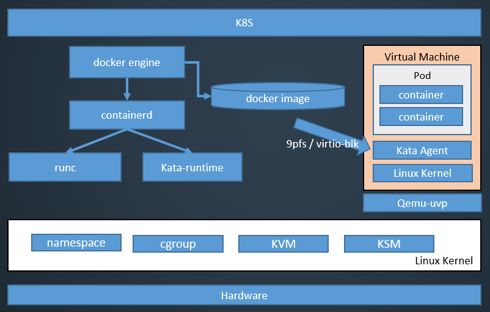
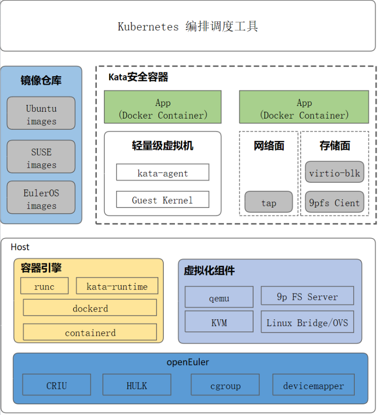

# 概述

安全容器是虚拟化技术和容器技术的有机结合，相比普通linux容器，安全容器具有更好的隔离性。

普通linux容器利用namespace进行进程间运行环境的隔离，并使用cgroup进行资源限制；因此普通linux容器本质上还是共用同一个内核，单个容器有意或无意影响到内核都会影响到整台宿主机上的容器。

安全容器是使用虚拟化层进行容器间的隔离，同一个主机上不同的容器间运行互相不受影响。

**图 1**  安全容器架构  

安全容器与Kubernetes中的Pod概念紧密联系，Kubernetes为容器调度管理平台的开源生态标准，它定义了一组容器操作相关接口（Container Runtime Interface 简称CRI）。

在CRI标准中，Pod为完成一组服务需要的一组容器集合，是编排调度的最小单元，通常共享IPC和网络namespace；一个Pod必然包含一个占位容器（pause容器）以及一个或多个业务容器，其中pause容器与的生命周期相同。

其中安全容器中的一个轻量级虚拟机对应为一个Pod，在此虚拟机中启动的第一个容器为pause容器，以后依次启动的容器为业务容器。

安全容器同时提供启动单个容器与启动Pod的功能。

安全容器与周边组件的关系如[图2](#fig17734185518269)所示。

**图 2**  安全容器与周边组件的关系  

