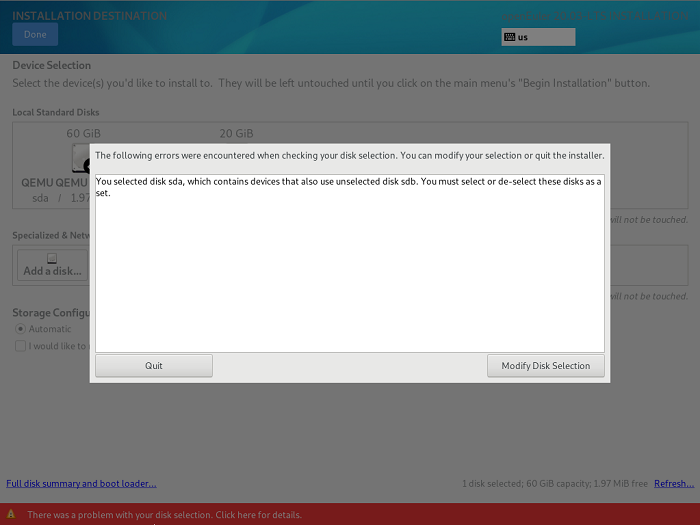
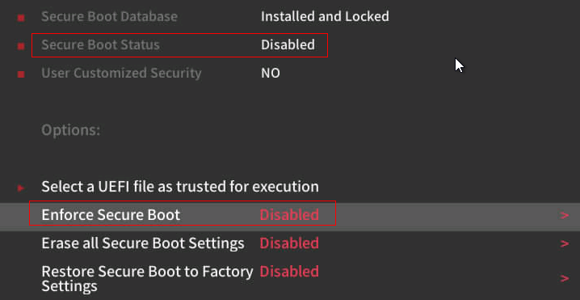

# FAQ
<!-- TOC -->

- [FAQ](#faq)
    - [安装openEuler时选择第二盘位为安装目标，操作系统无法启动](#安装openeuler时选择第二盘位为安装目标操作系统无法启动)
    - [网络配置约束限制](#网络配置约束限制)
    - [openEuler开机后进入emergency模式](#openeuler开机后进入emergency模式)
    - [系统中存在无法激活的逻辑卷组时，重装系统失败](#系统中存在无法激活的逻辑卷组时重装系统失败)
    - [选择安装源出现异常](#选择安装源出现异常)
    - [如何手动开启kdump服务](#如何手动开启kdump服务)
    - [多块磁盘组成逻辑卷安装系统后，再次安装不能只选其中一块磁盘](#多块磁盘组成逻辑卷安装系统后再次安装不能只选其中一块磁盘)
    - [x86物理机UEFI模式由于security boot安全选项问题无法安装](#x86物理机uefi模式由于security-boot安全选项问题无法安装)

<!-- /TOC -->

## 安装openEuler时选择第二盘位为安装目标，操作系统无法启动

### 问题现象

安装操作系统时，直接将系统安装到第二块磁盘sdb，重启系统后启动失败。

### 原因分析

当安装系统到第二块磁盘时，MBR和GRUB会默认安装到第二块磁盘sdb。这样会有下面两种情况：

1.  如果第一块磁盘中有完整系统，则加载第一块磁盘中的系统启动。
2.  如果第一块磁盘中没有完好的操作系统，则会导致硬盘启动失败。

以上两种情况都是因为BIOS默认从第一块磁盘sda中加载引导程序启动系统，如果sda没有系统，则会导致启动失败。

### 解决方法

有以下两种解决方案：

-   当系统处于安装过程中，在选择磁盘（选择第一块或者两块都选择）后，指定引导程序安装到第一块盘sda中。
-   当系统已经安装完成，若BIOS支持选择从哪个磁盘启动，则可以通过修改BIOS中磁盘启动顺序，尝试重新启动系统。

## 网络配置约束限制

NetworkManager、network两个服务均是网络服务管理包，两个服务之间存在部分功能重叠。

-   如果使用NetworkManager管理服务，则必须使用nmcli命令或修改配置文件来配置网络（如IP、路由等），而不能使用ip/ifconfig/route命令来配置。

    > **说明：**   
    >在开启NetworkManager服务的场景下，使用ip/ifconfig/route等命令配置网络，则一段时间后配置会被NetworkManager覆盖，导致 ip/ifconfig/route配置不生效。  

    查看NetworkManager 服务是否开启：

    ```
    systemctl status NetworkManager
    ```

    > **说明：**   
    >nmcli命令使用参考“nmcli \--help”或者“man  nmcli”。  

-   如果要使用ip/ifconfig/route等命令来管理网络，请先关闭NetworkManager服务，使用如下命令：

    ```
    systemctl stop NetworkManager
    ```


## openEuler开机后进入emergency模式

### 问题现象

openEuler系统开机后进入emergency模式，如下图所示：


### 原因分析

操作系统文件系统损坏导致磁盘挂载失败，或者io压力过大导致磁盘挂载超时（超时时间为90秒）。

系统异常掉电、物理磁盘io性能低等情况都可能导致该问题。

### 解决方法

1.  用户直接输入root账号的密码，登录系统。
2.  使用fsck工具，检测并修复文件系统，然后重启。

    > **说明：**   
    >fsck（file system check）用来检查和维护不一致的文件系统。若系统掉电或磁盘发生问题，可利用fsck命令对文件系统进行检查。 用户可以通过“fsck.ext3 -h”、“fsck.ext4 -h”命令查看fsck的使用方法。  


另外，如果用户需要取消磁盘挂载超时时间，可以直接在“/etc/fstab”文件中添加“x-systemd.device-timeout=0”。如下：

```
#
# /etc/fstab
# Created by anaconda on Mon Sep 14 17:25:48 2015
#
# Accessible filesystems, by reference, are maintained under '/dev/disk'
# See man pages fstab(5), findfs(8), mount(8) and/or blkid(8) for more info
#
/dev/mapper/openEuler-root / ext4 defaults,x-systemd.device-timeout=0 0 0
UUID=afcc811f-4b20-42fc-9d31-7307a8cfe0df /boot ext4 defaults,x-systemd.device-timeout=0 0 0
/dev/mapper/openEuler-home /home ext4 defaults 0 0
/dev/mapper/openEuler-swap swap swap defaults 0 0
```

## 系统中存在无法激活的逻辑卷组时，重装系统失败

### 问题现象

由于磁盘故障，系统中存在无法激活的逻辑卷组，重装系统出现异常。

### 原因分析

安装时有激活逻辑卷组的操作，无法激活时会抛出异常。

### 解决方法

重装系统前如果系统中存在无法激活的逻辑卷组，为了避免重装系统过程出现异常，需在重装前将逻辑卷组恢复到正常状态或者清除这些逻辑卷组。举例如下：

-   恢复逻辑卷组状态
    1.  使用以下命令清除vg激活状态， 防止出现“Can't open /dev/sdc exclusively mounted filesystem”。

        ```
         vgchange -a n testvg32947
        ```

    2.  根据备份文件重新创建pv。

        ```
        pvcreate --uuid JT7zlL-K5G4-izjB-3i5L-e94f-7yuX-rhkLjL --restorefile /etc/lvm/backup/testvg32947 /dev/sdc
        ```

    3.  恢复vg信息。

        ```
        vgcfgrestore testvg32947
        ```

    4.  重新激活vg。

        ```
         vgchange -ay testvg32947
        ```


-   清除逻辑卷组

    ```
    vgchange -a n testvg32947
    vgremove -y testvg32947
    ```


## 选择安装源出现异常

### 问题现象

选择安装源后出现："Error checking software selection"。

### 原因分析

这种现象是由于安装源中的软件包依赖存在问题。

### 解决方法

检查安装源是否存在异常。使用新的安装源。

## 如何手动开启kdump服务

### 问题现象

执行systemctl status kdump命令，显示状态信息如下，提示无预留内存。


### 原因分析

kdump服务需要系统预留一段内存用于运行kdump内核，而当前系统没有为kdump服务预留内存，所以无法运行kdump服务。

### 解决方法

已安装操作系统的场景

1.  修改/boot/efi/EFI/openEuler/grub.cfg，添加crashkernel=1024M,high。
2.  重启系统使配置生效。
3.  执行如下命令，检查kdump状态：

    ```
    systemctl status kdump
    ```

    若回显如下，即kdump的状态为active，说明kdump已使能，操作结束。

    


### 参数说明

kdump内核预留内存参数说明如下：

**表 1**  crashkernel参数说明

<a name="table467312804815"></a>
<table><thead align="left"><tr id="row967318810483"><th class="cellrowborder" valign="top" width="25%" id="mcps1.2.5.1.1"><p id="p188941929182618"><a name="p188941929182618"></a><a name="p188941929182618"></a>内核启动参数</p>
</th>
<th class="cellrowborder" valign="top" width="25%" id="mcps1.2.5.1.2"><p id="p389410298262"><a name="p389410298262"></a><a name="p389410298262"></a>描述</p>
</th>
<th class="cellrowborder" valign="top" width="25%" id="mcps1.2.5.1.3"><p id="p158944290262"><a name="p158944290262"></a><a name="p158944290262"></a>默认值</p>
</th>
<th class="cellrowborder" valign="top" width="25%" id="mcps1.2.5.1.4"><p id="p18894429132612"><a name="p18894429132612"></a><a name="p18894429132612"></a>备注</p>
</th>
</tr>
</thead>
<tbody><tr id="row26739804810"><td class="cellrowborder" valign="top" width="25%" headers="mcps1.2.5.1.1 "><p id="p1089402918267"><a name="p1089402918267"></a><a name="p1089402918267"></a>crashkernel=X</p>
</td>
<td class="cellrowborder" valign="top" width="25%" headers="mcps1.2.5.1.2 "><p id="p10894142915265"><a name="p10894142915265"></a><a name="p10894142915265"></a>在4G以下的物理内存预留X大小的内存给kdump使用</p>
</td>
<td class="cellrowborder" valign="top" width="25%" headers="mcps1.2.5.1.3 "><p id="p1894229162614"><a name="p1894229162614"></a><a name="p1894229162614"></a>无，用户根据实际情况调整</p>
</td>
<td class="cellrowborder" valign="top" width="25%" headers="mcps1.2.5.1.4 "><p id="p2895429202612"><a name="p2895429202612"></a><a name="p2895429202612"></a>该配置方法只在4G以下内存预留，必须保证4G以下连续可用内存足够预留</p>
</td>
</tr>
<tr id="row16731682484"><td class="cellrowborder" valign="top" width="25%" headers="mcps1.2.5.1.1 "><p id="p589512962618"><a name="p589512962618"></a><a name="p589512962618"></a>crashkernel=X@Y</p>
</td>
<td class="cellrowborder" valign="top" width="25%" headers="mcps1.2.5.1.2 "><p id="p10895329112616"><a name="p10895329112616"></a><a name="p10895329112616"></a>在Y起始地址预留X大小的内存给kdump使用</p>
</td>
<td class="cellrowborder" valign="top" width="25%" headers="mcps1.2.5.1.3 "><p id="p1989572917263"><a name="p1989572917263"></a><a name="p1989572917263"></a>无，用户根据实际情况调整</p>
</td>
<td class="cellrowborder" valign="top" width="25%" headers="mcps1.2.5.1.4 "><p id="p6895329142617"><a name="p6895329142617"></a><a name="p6895329142617"></a>需要确保Y起始地址的X大小内存未被其他模块预留</p>
</td>
</tr>
<tr id="row6674198124814"><td class="cellrowborder" valign="top" width="25%" headers="mcps1.2.5.1.1 "><p id="p3895829132620"><a name="p3895829132620"></a><a name="p3895829132620"></a>crashkernel=X,high</p>
</td>
<td class="cellrowborder" valign="top" width="25%" headers="mcps1.2.5.1.2 "><p id="p589582910260"><a name="p589582910260"></a><a name="p589582910260"></a>在4G以下的物理内存中预留256M大小，在4G以上预留X大小内存给kdump使用</p>
</td>
<td class="cellrowborder" valign="top" width="25%" headers="mcps1.2.5.1.3 "><p id="p589516295260"><a name="p589516295260"></a><a name="p589516295260"></a>无，用户根据实际情况调整，推荐值为1024M,high</p>
</td>
<td class="cellrowborder" valign="top" width="25%" headers="mcps1.2.5.1.4 "><p id="p389520290261"><a name="p389520290261"></a><a name="p389520290261"></a>确保4G以下内存有256M连续可用内存，4G以上有连续X大小内存可预留。实际预留内存大小为256M+X</p>
</td>
</tr>
<tr id="row18674138204811"><td class="cellrowborder" valign="top" width="25%" headers="mcps1.2.5.1.1 "><p id="p189512918262"><a name="p189512918262"></a><a name="p189512918262"></a>crashkernel=X,low</p>
<p id="p2895162915268"><a name="p2895162915268"></a><a name="p2895162915268"></a>crashkernel=Y,high</p>
</td>
<td class="cellrowborder" valign="top" width="25%" headers="mcps1.2.5.1.2 "><p id="p15895102916261"><a name="p15895102916261"></a><a name="p15895102916261"></a>在4G以下的物理内存中预留X大小，在4G以上预留Y大小内存给kdump使用</p>
</td>
<td class="cellrowborder" valign="top" width="25%" headers="mcps1.2.5.1.3 "><p id="p68951429102617"><a name="p68951429102617"></a><a name="p68951429102617"></a>无，用户根据实际情况调整</p>
</td>
<td class="cellrowborder" valign="top" width="25%" headers="mcps1.2.5.1.4 "><p id="p14895132942617"><a name="p14895132942617"></a><a name="p14895132942617"></a>需要确保4G以下有X大小连续可用内存，4G以上有Y大小连续可用内存。实际预留内存大小为X+Y</p>
</td>
</tr>
</tbody>
</table>

## 多块磁盘组成逻辑卷安装系统后，再次安装不能只选其中一块磁盘

### 问题现象

在安装系统时，如果之前的系统选择多块磁盘组成逻辑卷进行安装，再次安装时，如果只选择了其中的一块或几块磁盘，没有全部选择，在保存配置时提示配置错误，如[图1](#fig115949762617)所示。

**图 1**  配置错误提示<a name="fig115949762617"></a>  


### 原因分析

之前的逻辑卷包含了多块磁盘，只在一块磁盘上安装会破坏逻辑卷。

### 解决方法

因为多块磁盘组成逻辑卷相当于一个整体，所以只需要删除对应的卷组即可。

1.  按“Ctrl+Alt+F2”可以切换到命令行，执行如下命令找到卷组。

    ```
    vgs
    ```

    

2.  执行如下命令，删除卷组。

    ```
    vgremove euleros
    ```

3.  执行如下命令，重启安装程序即可生效。

    ```
    systemctl restart anaconda
    ```

    > **说明：**   
    >图形模式下也可以按“Ctrl+Alt+F6”回到图形界面，点击[图1](#fig115949762617)右下角的“Refresh”刷新存储配置生效。  


## x86物理机UEFI模式由于security boot安全选项问题无法安装

### 问题现象

x86物理机安装系统时，由于设置了BIOS选项security boot 为enable（默认是disable），导致系统一直停留在“No bootable device”提示界面，无法继续安装，如[图2](#fig115949762617)所示。

**图 2**  “No bootable device”提示界面<a name="fig115949762617"></a>  


### 原因分析

开启security boot后，主板会验证引导程序及操作系统 ，若没有用对应的私钥进行签名，则无法通过主板上内置公钥的认证。

### 解决方法

进入BIOS，设置security boot为disable，重新安装即可。

1.  系统启动时，按“F11”，输入密码“Admin@9000”进入BIOS。

    

2.  选择进入Administer Secure Boot。

    

3.  设置Enforce Secure Boot为Disabled。

    

    > **说明：**   
    >设置security boot为disable之后，保存退出，重新安装即可。  

