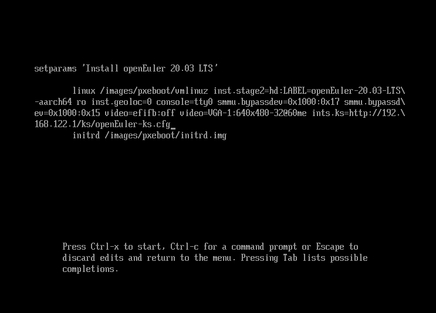

# 使用kickstart自动化安装
<!-- TOC -->

- [使用kickstart自动化安装](#使用kickstart自动化安装)
    - [总体介绍](#总体介绍)
        - [概述](#概述)
        - [优缺点对比](#优缺点对比)
        - [背景知识](#背景知识)
    - [半自动化安装指导](#半自动化安装指导)
        - [环境要求](#环境要求)
        - [操作步骤](#操作步骤)
    - [全自动化安装指导](#全自动化安装指导)
        - [环境要求](#环境要求-1)
        - [操作步骤](#操作步骤-1)

<!-- /TOC -->

## 总体介绍

### 概述

用户可以使用kickstart工具进行openEuler系统的自动化安装，包括如下两种方式：

-   半自动化安装：安装人员不需要手动设定操作系统的键盘、语言、分区等具体属性（通过kickstart实现自动化），但是需要手动指定kickstart文件的位置。
-   全自动化安装：实现操作系统的安装过程全自动化。

### 优缺点对比

使用kickstart工具进行半自动化安装和全自动化安装的优缺点对比如[表1](#table1388812373315)所示，用户可以自行选择安装方式。

**表 1**  优缺点对比

<a name="table1388812373315"></a>
<table><thead align="left"><tr id="row988915233338"><th class="cellrowborder" valign="top" width="11.91119111911191%" id="mcps1.2.4.1.1"><p id="p688992343311"><a name="p688992343311"></a><a name="p688992343311"></a>安装方式</p>
</th>
<th class="cellrowborder" valign="top" width="34.003400340034005%" id="mcps1.2.4.1.2"><p id="p08895233338"><a name="p08895233338"></a><a name="p08895233338"></a>优点</p>
</th>
<th class="cellrowborder" valign="top" width="54.085408540854075%" id="mcps1.2.4.1.3"><p id="p688912323314"><a name="p688912323314"></a><a name="p688912323314"></a>缺点</p>
</th>
</tr>
</thead>
<tbody><tr id="row5889132303318"><td class="cellrowborder" valign="top" width="11.91119111911191%" headers="mcps1.2.4.1.1 "><p id="p1588922333319"><a name="p1588922333319"></a><a name="p1588922333319"></a>半自动化安装</p>
</td>
<td class="cellrowborder" valign="top" width="34.003400340034005%" headers="mcps1.2.4.1.2 "><p id="p10889142333314"><a name="p10889142333314"></a><a name="p10889142333314"></a>不需要准备tftp，pxe，dhcp等服务</p>
</td>
<td class="cellrowborder" valign="top" width="54.085408540854075%" headers="mcps1.2.4.1.3 "><p id="p88891223183319"><a name="p88891223183319"></a><a name="p88891223183319"></a>需要手动指定kickstart文件的位置</p>
</td>
</tr>
<tr id="row688917233332"><td class="cellrowborder" valign="top" width="11.91119111911191%" headers="mcps1.2.4.1.1 "><p id="p13889192373312"><a name="p13889192373312"></a><a name="p13889192373312"></a>全自动化安装</p>
</td>
<td class="cellrowborder" valign="top" width="34.003400340034005%" headers="mcps1.2.4.1.2 "><p id="p2889102319334"><a name="p2889102319334"></a><a name="p2889102319334"></a>操作系统的全自动化安装</p>
</td>
<td class="cellrowborder" valign="top" width="54.085408540854075%" headers="mcps1.2.4.1.3 "><p id="p20889823113311"><a name="p20889823113311"></a><a name="p20889823113311"></a>需要配置tftp，dhcpd，pxe等服务</p>
</td>
</tr>
</tbody>
</table>

### 背景知识

**kickstart**

kickstart是一种无人值守的安装方式。它的工作原理是在安装过程中记录典型的需要人工干预填写的各种参数，并生成一个配置文件（ks.cfg），在安装过程中，安装程序首先会去查找ks配置文件，如果找到合适的参数，就采用所找到的参数；如果没有找到合适的参数，便需要安装者手工设定。所以，如果kickstart文件涵盖了安装过程中需要设定的所有参数，安装者只需要告诉安装程序从何处取ks.cfg文件，就能实现系统安装的自动化。

kickstart 安装提供一个安装过程自动化的方法，可以是部分自动化，也可以是完全自动化。

**PXE**

PXE（Pre-boot Execution Environment，预启动执行环境），工作于Client/Server的网络模式，支持PXE的客户端在启动过程中，能够从DHCP服务器获取IP结合TFTP（trivial file transfer protocol）等协议可以实现客户端的网络引导和安装。

**TFTP**

TFTP（Trivial File Transfer Protocol，简单文件传输协议），该协议用来实现客户机与服务器之间的简单文件传输，它提供不复杂、开销不大的文件传输服务。

## 半自动化安装指导

### 环境要求

使用kickstart进行openEuler系统的半自动化安装的环境要求如下：

-   物理机/虚拟机（虚拟机创建可参考对应厂商的资料）。包括使用kickstart工具进行自动化安装的计算机和被安装的计算机。
-   httpd：存放kickstart文件。
-   ISO： openEuler-20.03-LTS-aarch64-dvd.iso

### 操作步骤

使用kickstart进行openEuler系统的半自动化安装的操作步骤如下：

**环境准备**

> **说明：**   
>安装之前，请确保http服务器的防火墙处于关闭状态。关闭防火墙可参照如下命令：  
>```  
>iptables -F  
>```  

1.  httpd的安装与服务启动。

    ```
    # dnf install httpd -y
    # systemctl start httpd
    # systemctl enable httpd
    ```

2.  kickstart文件的准备。

    ```
    # mkdir /var/www/html/ks
    # vim /var/www/html/ks/openEuler-ks.cfg ===>根据已安装openEuler系统自动生成的anaconda-ks.cfg修改得到，也可以使用system-config-kickstart工具做成
    ====================================
    ***以下内容需要根据实际需求进行修改***
    #version=DEVEL
    ignoredisk --only-use=sda
    autopart --type=lvm
    # Partition clearing information
    clearpart --none --initlabel
    # Use graphical install
    graphical
    # Use CDROM installation media
    cdrom
    # Keyboard layouts
    keyboard --vckeymap=cn --xlayouts='cn'
    # System language
    lang zh_CN.UTF-8
    
    # Network information
    network  --bootproto=dhcp --device=enp4s0 --ipv6=auto --activate
    network  --hostname=openeuler.com
    # Root password
    rootpw --iscrypted $6$fQE83lxEZ48Or4zc$j7/PlUMHn29yTjCD4Fi44WTZL/RzVGxJ/7MGsZMl6QfE3KjIVT7M4UrhFXbafvRq2lUddAFcyWHd5WRmXfEK20
    # Run the Setup Agent on first boot
    firstboot --enable
    # Do not configure the X Window System
    skipx
    # System services
    services --disabled="chronyd"
    # System timezone
    timezone Asia/Shanghai --isUtc--nontp
    
    %packages
    @^minimal-environment
    @standard
    
    %end
    
    %anaconda
    pwpolicy root --minlen=8 --minquality=1 --notstrict --nochanges --notempty
    pwpolicy user --minlen=8 --minquality=1 --notstrict --nochanges --emptyok
    pwpolicy luks --minlen=8 --minquality=1 --notstrict --nochanges --notempty
    %end
    
    %post
    #enable kdump
    sed  -i "s/ ro / ro crashkernel=1024M,high /" /boot/efi/EFI/openEuler/grub.cfg
    %end
    =====================================
    ```

    > **说明：**   
    >密码密文生成方式：  
    >\# python3  
    >Python 3.7.0 \(default, Apr  1 2019, 00:00:00\)  
    >\[GCC 7.3.0\] on linux  
    >Type "help", "copyright", "credits" or "license" for more information.  
    >\>\>\> import crypt  
    >\>\>\> passwd = crypt.crypt\("myPasswd"\)  
    >\>\>\> print\(passwd\)  
    >$6$63c4tDmQGn5SDayV$mZoZC4pa9Jdt6/ALgaaDq6mIExiOO2EjzomB.Rf6V1BkEMJDcMddZeGdp17cMyc9l9ML9ldthytBEPVcnboR/0  

3.  将ISO镜像文件挂载到需要安装openEuler计算机的光驱上。

    另外，也可以选择NFS等网络安装，kickstart文件中需要指定安装源位置（默认是cdrom）。


**安装系统**

1.  启动系统进入安装选择界面。
    1.  在“[启动安装](安装指导.html#启动安装)”中的“安装引导界面”中选择“Install openEuler 20.03 LTS”，并按下“e”键。
    2.  启动参数中追加“inst.ks=http://server ip/ks/openEuler-ks.cfg”。

        

    3.  按“Ctrl+x”，开始系统的自动安装。

2.  确认系统安装完毕。

    系统安装完毕以后会自动重启，然后再次进入到安装界面，此时关闭计算机，调整启动顺序（优先从硬盘启动）。

    


## 全自动化安装指导

### 环境要求

使用kickstart进行openEuler系统的全自动化安装的环境要求如下：

-   物理机/虚拟机（虚拟机创建可参考对应厂商的资料）。包括使用kickstart工具进行自动化安装的计算机和被安装的计算机。
-   httpd：存放kickstart文件。
-   tftp：提供vmlinuz和initrd文件。
-   dhcpd/pxe：提供DHCP服务。
-   ISO：openEuler-20.03-LTS-aarch64-dvd.iso。

### 操作步骤

使用kickstart进行openEuler系统的全自动化安装的操作步骤如下：

**环境准备**

> **说明：**   
>安装之前，请确保http服务器的防火墙处于关闭状态。关闭防火墙可参照如下命令：  
>```  
>iptables -F  
>```  

1.  httpd的安装与服务启动。

    ```
    # dnf install httpd -y
    # systemctl start httpd
    # systemctl enable httpd
    ```

2.  tftp的安装与配置。

    ```
    # dnf install tftp-server -y
    # vim /etc/xinetd.d/tftp
    service tftp
    {
    socket_type = dgram
    protocol = udp
    wait = yes
    user = root
    server = /usr/sbin/in.tftpd
    server_args = -s /var/lib/tftpboot
    disable = no
    per_source = 11
    cps = 100 2
    flags = IPv4
    }
    # systemctl start tftp
    # systemctl enable tftp
    # systemctl start xinetd
    # systemctl status xinetd
    # systemctl enable xinetd
    ```

3.  <a name="zh-cn_topic_0151920754_l1692f6b9284e493683ffa2ef804bc7ca"></a>安装源的制作。

    ```
    # mount openEuler-20.03-LTS-aarch64-dvd.iso /mnt
    # cp -r /mnt/* /var/www/html/openEuler/
    ```

4.  设置和修改kickstart配置文件 openEuler-ks.cfg，参考[3](#zh-cn_topic_0151920754_l1692f6b9284e493683ffa2ef804bc7ca)安装源的目录，此处选择http安装源。

    ```
    #vim  /var/www/html/ks/openEuler-ks.cfg
    ====================================
    ***以下内容根据实际需求进行修改***
    #version=DEVEL
    ignoredisk --only-use=sda
    autopart --type=lvm
    # Partition clearing information
    clearpart --none --initlabel
    # Use graphical install
    graphical
    # Keyboard layouts
    keyboard --vckeymap=cn --xlayouts='cn'
    # System language
    lang zh_CN.UTF-8
    #Use http installation source
    url  --url=//192.168.122.1/openEuler/
    %post
    #enable kdump
    sed  -i "s/ ro / ro crashkernel=1024M,high /" /boot/efi/EFI/openEuler/grub.cfg
    %end
    ...
    ```

5.  修改pxe配置文件grub.cfg， 可参考如下内容。

    ```
    # cp -r /mnt/images/pxeboot/* /var/lib/tftpboot/
    # cp /mnt/EFI/BOOT/grubaa64.efi /var/lib/tftpboot/
    # cp /mnt/EFI/BOOT/grub.cfg /var/lib/tftpboot/
    # ls /var/lib/tftpboot/
    grubaa64.efi  grub.cfg  initrd.img  TRANS.TBL  vmlinuz
    # vim /var/lib/tftpboot/grub.cfg
    set default="1"
    
    function load_video {
      if [ x$feature_all_video_module = xy ]; then
        insmod all_video
      else
        insmod efi_gop
        insmod efi_uga
        insmod ieee1275_fb
        insmod vbe
        insmod vga
        insmod video_bochs
        insmod video_cirrus
      fi
    }
    
    load_video
    set gfxpayload=keep
    insmod gzio
    insmod part_gpt
    insmod ext2
    
    set timeout=60
    
    
    ### BEGIN /etc/grub.d/10_linux ###
    menuentry 'Install openEuler 20.03 LTS' --class red --class gnu-linux --class gnu --class os {
            set root=(tftp,192.168.1.1)
            linux /vmlinuz ro inst.geoloc=0 console=ttyAMA0 console=tty0 rd.iscsi.waitnet=0 inst.ks=http://192.168.122.1/ks/openEuler-ks.cfg
            initrd /initrd.img
    }
    ```

6.  DHCP的配置（可以使用dnsmasq代替 ）。

    ```
    # dnf install dhcp -y
    #
    # DHCP Server Configuration file.
    #   see /usr/share/doc/dhcp-server/dhcpd.conf.example
    #   see dhcpd.conf(5) man page
    #
    # vim /etc/dhcp/dhcpd.conf
    ddns-update-style interim;
    ignore client-updates;
    filename "grubaa64.efi"; 　　 # pxelinux 启动文件位置;
    next-server 192.168.122.1;　　# (重要)TFTP Server 的IP地址;
    subnet 192.168.122.0 netmask 255.255.255.0 {
    option routers 192.168.111.1; # 网关地址
    option subnet-mask 255.255.255.0; # 子网掩码
    range dynamic-bootp 192.168.122.50 192.168.122.200; # 动态ip范围
    default-lease-time 21600;
    max-lease-time 43200;
    }
    # systemctl start dhcpd
    # systemctl enable dhcpd
    ```


**安装系统**

1.  在“Start boot option”界面按下“F2”选择从网络pxe启动，开始自动化安装。

    

    

    

2.  进入系统全自动化安装界面。
3.  确认系统安装完毕。

    

