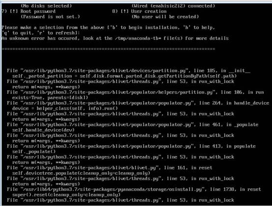
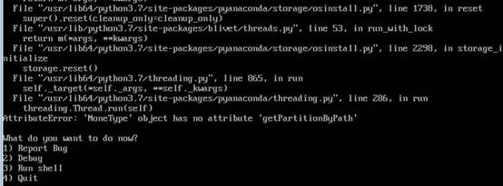
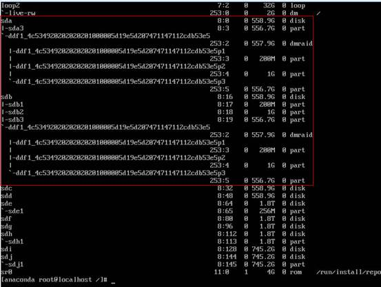
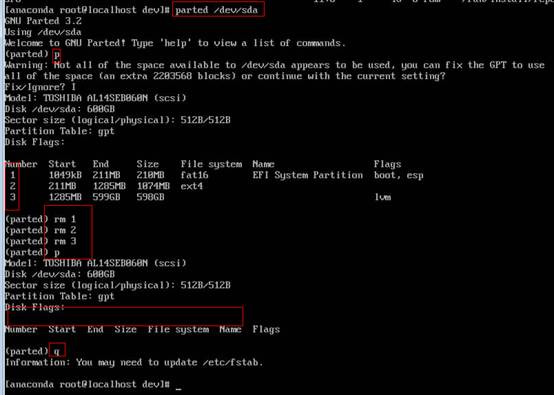

# 原raid盘安装系统时lvm服务卡住<a name="ZH-CN_TOPIC_0187280647"></a>

## 问题现象<a name="zh-cn_topic_0162742550_section345795731712"></a>

在raid1上安装系统，装完拔掉raid卡，将磁盘插到sas控制器，再次安装时在lvm服务卡住无法继续安装。





## 原因分析<a name="zh-cn_topic_0162742550_section8111958182"></a>

系统安装在raid盘上之后拔掉raid卡，使磁盘的raid信息丢失，在激活lvm时因为有残留数据，但信息不完整而失败。

## 解决方法<a name="zh-cn_topic_0162742550_section102511102189"></a>

1.  按“Ctrl+Alt+F2”切换控制台，执行lsblk命令找到原来装了系统的两块raid盘sda、sdb。以下步骤中以sda盘为例，如果有更多有问题的磁盘，执行同样的操作即可。

    

2.  执行如下命令，清除磁盘上分区。

    ```
    parted /dev/sda
    ```

    

3.  执行以下命令（不用等执行完，执行几秒钟强制退出即可），清理磁盘头信息。

    ```
    dd if=/dev/zero of=/dev/sda
    ```

4.  执行parted /dev/sda命令，进入parted执行mklabel gpt命令，退出parted。
5.  再次执行以下命令，清除分区表信息。

    ```
    dd if=/dev/zero of=/dev/sda
    ```

6.  重复步骤2到步骤5的操作，清除sdb的数据残留。
7.  重启机器。使用lsblk命令查看sda、sdb已成为普通磁盘，安装时的磁盘选择也能找到sda和sdb。

