# 安装指导

本章以光盘安装为例介绍安装openEuler，其他安装方式除在启动安装时的引导方式不同外，待启动安装后则安装流程相同，在此不再说明。
<!-- TOC -->

- [安装指导](#安装指导)
    - [启动安装](#启动安装)
        - [使用光盘引导安装](#使用光盘引导安装)
        - [安装引导界面](#安装引导界面)
        - [图形化模式安装](#图形化模式安装)
    - [设置安装程序语言](#设置安装程序语言)
    - [进入安装界面](#进入安装界面)
    - [设置键盘](#设置键盘)
    - [设置系统语言](#设置系统语言)
    - [设置时间和日期](#设置时间和日期)
    - [设置安装源](#设置安装源)
    - [选择安装软件](#选择安装软件)
    - [设置安装位置](#设置安装位置)
        - [存储配置](#存储配置)
    - [设置网络和主机名](#设置网络和主机名)
    - [开始安装](#开始安装)
    - [安装过程配置](#安装过程配置)
        - [密码复杂度](#密码复杂度)
        - [设置root密码](#设置root密码)
        - [创建用户](#创建用户)
    - [安装完成](#安装完成)

<!-- /TOC -->

## 启动安装

### 使用光盘引导安装

在服务器的光驱中加载openEuler安装镜像，重启服务器，具体步骤如下。

> **说明：**   
>在安装开始前，需要保证服务器启动选项为光驱优先。安装步骤以BMC挂载虚拟光驱进行光盘安装的操作举例。通过物理光驱安装的操作简单，启动安装后的流程相同，在此不再说明。  

1.  在虚拟界面工具栏中，单击虚拟光驱工具如下图所示。

    **图 1**  光驱图标<a name="zh-cn_topic_0151920806_f6ff7658b349942ea87f4521c0256c32e"></a>  
    

    弹出镜像对话框，如下图所示。

    **图 2**  镜像对话框<a name="zh-cn_topic_0151920806_fb74fb37f86cd423aacf34bddedd6841a"></a>  
    

2.  在镜像对话框中，选择“镜像文件”， 并单击“浏览”。弹出“打开”对话框。
3.  选择镜像文件，单击“打开”。然后在镜像对话框中，单击“连接”。当“连接”显示为“断开”后，表示虚拟光驱已连接到服务器。
4.  在工具栏中，单击重启工具重启设备，如下图所示。

    **图 3**  重启图标<a name="zh-cn_topic_0151920806_f0d1f4f5f96de47b48c64b3535b2b60d1"></a>  
    


### 安装引导界面

系统使用引导介质完成引导后会显示引导菜单。该引导菜单除启动安装程序外还提供一些选项。安装系统时，默认采用“Test this media & install openEuler 20.03 LTS”方式进行安装。如果要选择默认选项之外的选项，请使用键盘中的“↑”和“↓”方向键进行选择，并在选项为高亮状态时按“Enter”。

> **说明：**   
>-   如果60秒内未按任何键，系统将从默认选项“Test this media & install openEuler 20.03 LTS”自动进入安装界面。  
>-   安装物理机时，如果使用键盘上下键无法选择启动选项，按“Enter”键无响应，可以单击BMC界面上的鼠标控制图标“”，设置“键鼠复位”。  

**图 4**  安装引导界面<a name="fig1601161484619"></a>  
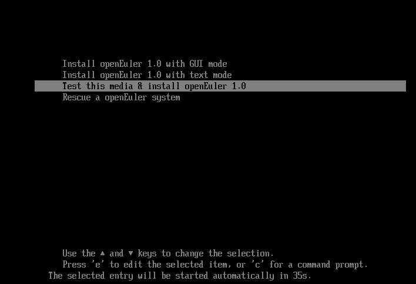

安装引导选项说明如下：

-   Install openEuler 20.03 LTS —— 在您的服务器上使用图形用户界面模式安装。

-   Test this media & install openEuler 20.03 LTS —— 默认选项，在您的服务器上使用图形用户界面模式安装，但在启动安装程序前会进行安装介质的完整性检查。

-   Troubleshooting —— 问题定位模式，系统无法正常安装时使用。进入问题定位模式后，有如下两个选项。
    -   Install openEuler 20.03-LTS in basic graphics mode —— 简单图形安装模式，该模式下在系统启动并运行之前不启动视频驱动程序。
    -   Rescue the openEuler system —— 救援模式，用于修复系统。该模式下输出定向到VNC或BMC（Baseboard Management Controller）端，串口不可用。

在安装引导界面，按“e”进入已选选项的参数编辑界面，按“c”进入命令行模式。

### 图形化模式安装

在“安装引导界面”中选择“Test this media & install openEuler 20.03 LTS”进入图形化模式安装。

可以通过键盘操作图形化安装程序。

-   “Tab”、“shift Tab”：界面控件（按钮、区域框、复选框等）间的移动。
-   “↑”、“↓”方向键：列表里的移动。
-   “←”、“→”方向键：水平工具条和表条间移动。
-   “空格”、“Enter”：选择或删除高亮显示的选项、展开或折叠下拉菜单。
-   “Alt”+“快捷键”：选择快捷键所在的控件，其中快捷键可通过按住Alt高亮（加下划线）显示。

## 设置安装程序语言

启动安装后，在进入安装程序主界面之前，系统会提示用户设置安装过程中使用的语言。当前默认为英语，用户可根据实际情况进行调整，如[图5](#zh-cn_topic_0186390093_zh-cn_topic_0122145864_fig144630179151)所示，选择“中文”。

**图 5**  选择语言<a name="zh-cn_topic_0186390093_zh-cn_topic_0122145864_fig144630179151"></a>  
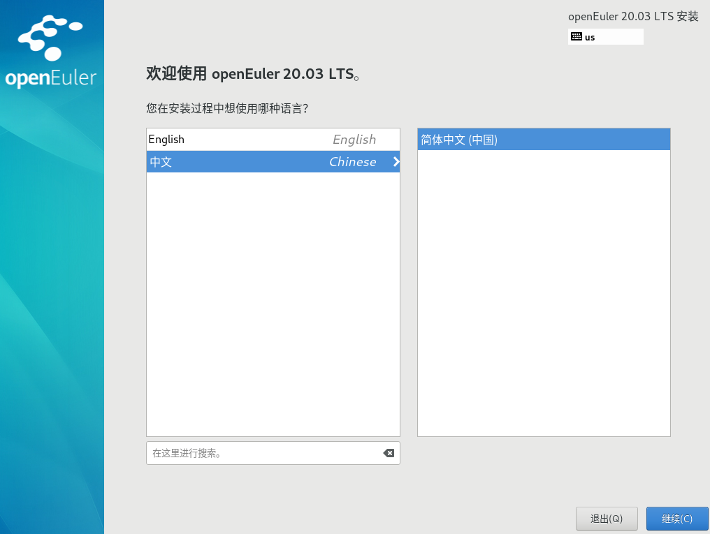

完成设置后，单击“继续”，进入安装设置主界面。

如果您想退出安装，可以单击“退出”并在弹出的“您确定要退出安装程序吗？”对话框中单击“是”重新进入“安装引导界面”。

## 进入安装界面

系统安装程序正常启动后，会进入[图6](#zh-cn_topic_0186390094_zh-cn_topic_0122145883_fig5969171592212)所示的安装设置主界面。用户可以进行时间、语言、安装源、网络、安装位置等相关设置。

部分配置项会有告警符号，用户完成该选项配置后，告警符号消失。当界面上不存在告警符号时，用户才能单击“开始安装”进行系统安装。

如果您想退出安装，可以单击“退出”并在弹出的“您确定要退出安装程序吗？”对话框中单击“是”重新进入“安装引导界面”。

**图 6**  安装概览<a name="zh-cn_topic_0186390094_zh-cn_topic_0122145883_fig5969171592212"></a>  
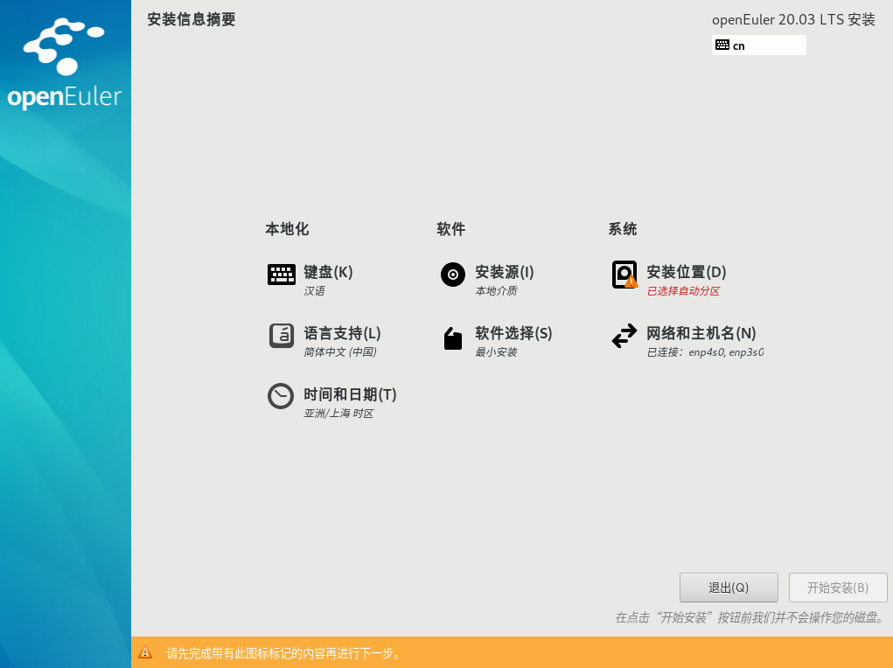

## 设置键盘

在“安装概览”页面中选择“键盘”，用户可以在系统中添加或者删除多个键盘布局。

-   要查看键盘布局，请在左侧选框中单击选中该键盘布局，然后单击下面的“键盘”按钮。
-   要测试键盘布局，请在左侧选框中添加键盘布局，然后在右上角键盘图标处进行点击切换为目标键盘，单击右侧文本框内部，输入文本以确认所选键盘布局可正常工作。

**图 7**  键盘布局<a name="zh-cn_topic_0186390097_zh-cn_topic_0122145868_fig17366454247"></a>  


设置完成后，请单击左上角“完成”返回“安装概览”页面。

## 设置系统语言

在“安装概览”页面中选择“语言支持”，设置系统的语言。如[图8](#zh-cn_topic_0186390098_zh-cn_topic_0122145772_fig187301927172619)所示，用户也可根据实际情况进行调整，选择“中文”。

> **说明：**   
>若选择“中文”，系统安装完成后，使用VNC登录不支持中文显示，使用串口或者SSH等方式登录支持中文显示。若选择“English”，则无影响。  

**图 8**  语言支持<a name="zh-cn_topic_0186390098_zh-cn_topic_0122145772_fig187301927172619"></a>  


设置完成后，请单击左上角“完成”返回“安装概览”页面。

## 设置时间和日期

在“安装概览”页面中选择“时间和日期”，设置系统的时区、日期、时间等。

设置时区时，用户可通过鼠标在地图上单击指定的城市，也可以通过页面顶部的“地区”和“城市”下拉菜单中进行选择，如[图9](#zh-cn_topic_0186390096_zh-cn_topic_0122145900_fig1260162652312)所示。

如果您所在城市没有出现在地图或下拉菜单中，请选择同一时区中离您最近的城市。

> **说明：**   
>-   手动设置时区时，请先关闭右上角“网络时间”同步开关。  
>-   如需使用网络时间，请保证网络能连通远程NTP服务器，设置网络具体请参见“[设置网络和主机名](#设置网络和主机名)”。  

**图 9**  日期和时间<a name="zh-cn_topic_0186390096_zh-cn_topic_0122145900_fig1260162652312"></a>  


设置完成后，请单击左上角“完成”返回“安装概览”页面。

## 设置安装源

在“安装概览”页面中选择“安装源”，指定安装源的位置。

当使用完整光盘安装，安装程序会自动探测并显示安装源信息，用户直接使用默认配置即可，不需要进行设置，如[图10](#zh-cn_topic_0186390100_zh-cn_topic_0144427079_fig93633295132)所示。

**图 10**  安装源<a name="zh-cn_topic_0186390100_zh-cn_topic_0144427079_fig93633295132"></a>  
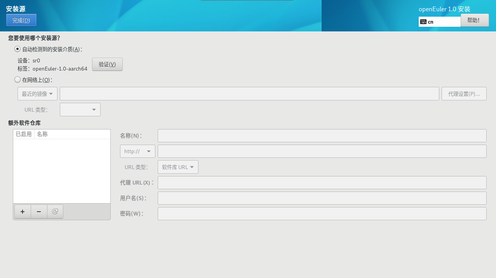

当使用网络https源进行安装的时候，如果https服务器使用的是私有证书，则需要在安装引导界面按“e”进入已选选项的参数编辑界面，在参数中增加inst.noverifyssl参数，如[图11](#fig113517811415)所示。

**图 11**  增加inst.noverifyssl参数<a name="fig113517811415"></a>  


设置完成后，请单击左上角“完成”返回“安装概览”页面。

> **说明：**   
>安装过程中，如果“设置安装源”有疑问，可参考“[选择安装源出现异常](FAQ.html#选择安装源出现异常)”。  

## 选择安装软件

在“安装概览”页面中选择“软件选择”，指定需要安装的软件包。

用户需要根据实际的业务需求，在左侧选择一个“最小安装”，在右侧选择安装环境的附加选项，如[图12](#zh-cn_topic_0186390261_zh-cn_topic_0122145865_fig03031519101414)所示。

**图 12**  软件选择<a name="zh-cn_topic_0186390261_zh-cn_topic_0122145865_fig03031519101414"></a>  
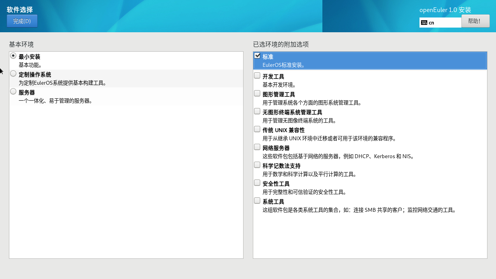

> **说明：**   
>-   在最小安装的环境下，并非安装源中所有的包都会安装。如果用户需要使用的包未安装，可将安装源挂载到本地制作repo源，通过DNF工具单独安装。  
>-   选择“虚拟化主机”时会默认安装虚拟化组件qemu、libvirt、edk2，且可在附件选项处选择是否安装ovs等组件。    

设置完成后，请单击左上角“完成”返回“安装概览”页面。

## 设置安装位置

在“安装概览”页面中选择“安装位置”，设置操作系统的安装磁盘及分区。

在[图13](#fig1195417125015)所示的页面中您可以看到计算机中的本地可用存储设备。您还可以通过单击“添加磁盘”，添加指定的附加设备或者网络设备。

> **须知：**   
>在选择您需要安装的设备时，建议不要选择NVMe SSD存储介质作为操作系统的安装磁盘。  

**图 13**  安装目标位置<a name="fig1195417125015"></a>  
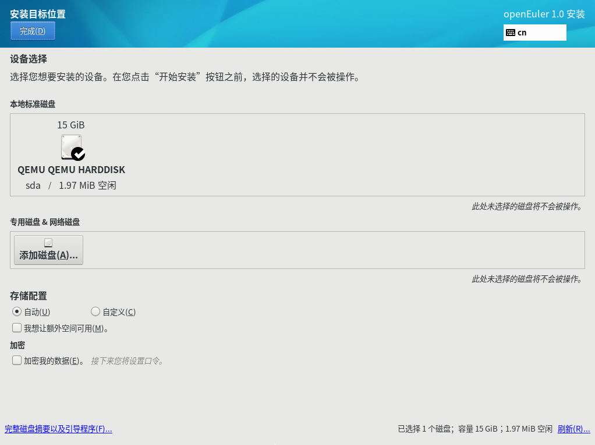

### 存储配置

在“安装目标位置”界面，您需要进行存储配置以便对系统分区。您可以手动配置分区，也可以选择让安装程序自动分区。

> **说明：**   
>-   在进行分区时，出于系统性能和安全的考虑，建议您划分如下单独分区：/boot、/var、/var/log 、/var/log/audit、/home、/tmp。  
>-   系统如果配置了swap分区，当系统的物理内存不够用时，会使用swap分区。虽然 swap分区可以增大物理内存大小的限制，但是如果由于内存不足使用到swap分区，会增加系统的响应时间，性能变差。因此在物理内存充足或者性能敏感的系统中，不建议配置swap分区。  
>-   如果需要拆分逻辑卷组则需要选择“自定义”进行手动分区，并在“手动分区”界面单击“卷组”区域中的“修改”按钮重新配置卷组。  

**自动**

如果是在未使用过的存储设备中执行全新安装，或者不需要保留该存储设备中任何数据，建议选择“自动”进行自动分区。

**自定义**

若用户需进行手动分区，选择“自定义”按钮，并单击左上角“完成”，出现如下手动分区界面。

**图 14**  手动分区<a name="fig1277151815248"></a>  
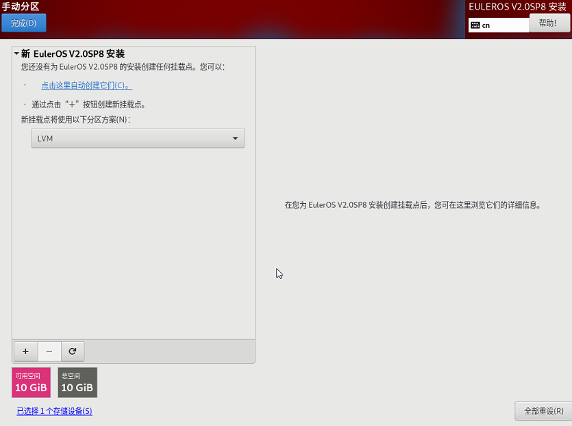

在“手动分区”界面可以通过如下两种方式进行分区。

-   自动创建：在界面单击“点击这里自动创建它们”，系统会根据可用的存储空间，自动分出4个挂载点：/boot 、/、/boot/efi、swap。
-   手动创建：单击“”添加新挂载点，建议每个挂载点的期望容量不超过可用空间。

    > **说明：**   
    >若设置的挂载点期望容量超过了可用空间，系统将剩余的可用空间全部分配给该挂载点。  


设置完成后，请单击左上角“完成”返回“安装概览”页面。

## 设置网络和主机名

在“安装概览”页面中选择“网络和主机名”，设置系统的网络功能。

安装程序会自动探测可本地访问的接口。探测到的接口列在左侧方框中，右侧显示相应的接口详情，如[图15](#zh-cn_topic_0186390264_zh-cn_topic_0122145831_fig123700157297)所示。用户可以通过页面右上角的开关，来开启或者关闭网络接口。用户还可以单击“配置”以配置选中的接口。

用户可在页面下方“主机名”字段输入主机名。主机名可以是完全限定域名（FQDN），其格式为hostname.domainname；也可以是简要主机名，其格式为hostname。

**图 15**  网络和主机名<a name="zh-cn_topic_0186390264_zh-cn_topic_0122145831_fig123700157297"></a>  
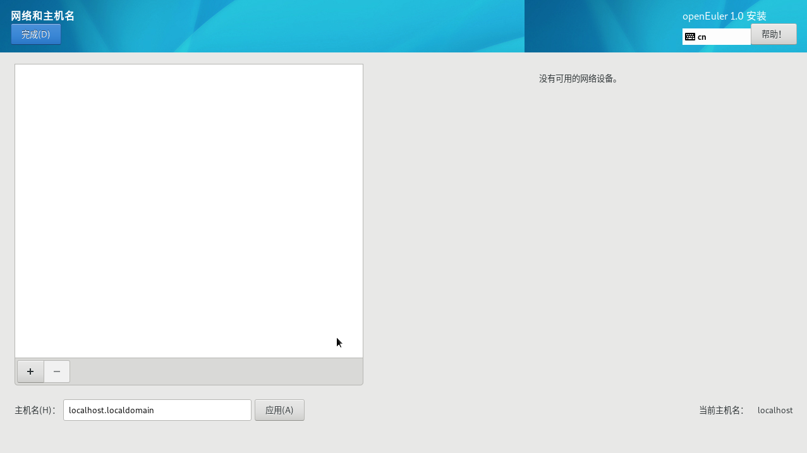

设置完成后，请单击左上角“完成”返回“安装概览”页面。

## 开始安装

在安装界面上完成所有必填选项的配置后，界面上的警告会消失。此时，用户可以单击“开始安装”进行系统安装。

**图 16**  开始安装<a name="zh-cn_topic_0186390265_zh-cn_topic_0122145912_fig75022040305"></a>  
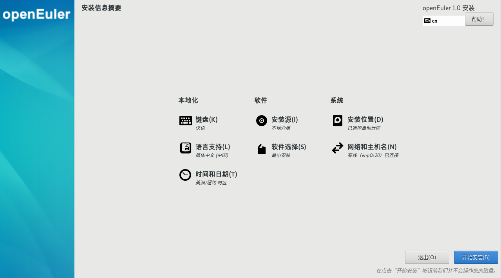

## 安装过程配置

开始安装后会出现进度页面，显示安装进度及所选软件包写入系统的进度。

**图 17**  安装过程<a name="zh-cn_topic_0186390266_zh-cn_topic_0122145909_fig1590863119306"></a>  


安装软件包的过程中，需要用户配置root密码、根据个人需求可以创建用户。

### 密码复杂度

用户设置的root用户密码或新创建用户的密码均需要满足密码复杂度要求，否则会导致密码设置或用户创建失败。设置密码的复杂度的要求如下：

1.  口令长度至少8个字符。
2.  口令至少包含大写字母、小写字母、数字和特殊字符中的任意3种。
3.  口令不能和账号一样。
4.  口令不能使用字典词汇。
    -   查询字典

        在已装好的openEuler环境中，可以通过如下命令导出字典库文件dictionary.txt，用户可以查询密码是否在该字典中。

        ```
        cracklib-unpacker /usr/share/cracklib/pw_dict > dictionary.txt
        ```

    -   修改字典
        1.  修改上面导出的字典文件，执行如下命令更新系统字典库。

            ```
            # create-cracklib-dict dictionary.txt
            ```

        2.  在原字典库基础上新增其他字典内容custom.txt。

            ```
            # create-cracklib-dict dictionary.txt custom.txt
            ```


### 设置root密码

单击“root密码”，弹出设置密码界面如[图18](#zh-cn_topic_0186390266_zh-cn_topic_0122145909_fig1323165793018)所示，输入密码并再次输入密码进行确认。

> **说明：**   
>root密码需要在安装软件包的同时进行配置，如果不配置该密码则无法完成安装。root账户是用来执行关键系统管理任务，不建议您在日常工作及系统访问时使用root账户。  

**图 18**  root密码<a name="zh-cn_topic_0186390266_zh-cn_topic_0122145909_fig1323165793018"></a>  


完成设置后，单击左上角的“完成”返回安装过程界面。

### 创建用户

单击“创建用户”，弹出创建用户的界面如[图19](#zh-cn_topic_0186390266_zh-cn_topic_0122145909_fig1237715313319)所示。输入用户名，并设置密码。另外您还可以通过“高级”选项设置用户主目录、用户组等，如[图20](#zh-cn_topic_0186390266_zh-cn_topic_0122145909_fig128716531312)所示。

**图 19**  创建用户<a name="zh-cn_topic_0186390266_zh-cn_topic_0122145909_fig1237715313319"></a>  


**图 20**  高级用户配置<a name="zh-cn_topic_0186390266_zh-cn_topic_0122145909_fig128716531312"></a>  


完成设置后，单击左上角的“完成”返回安装过程界面。

单击“结束配置”，完成openEuler的相关配置。

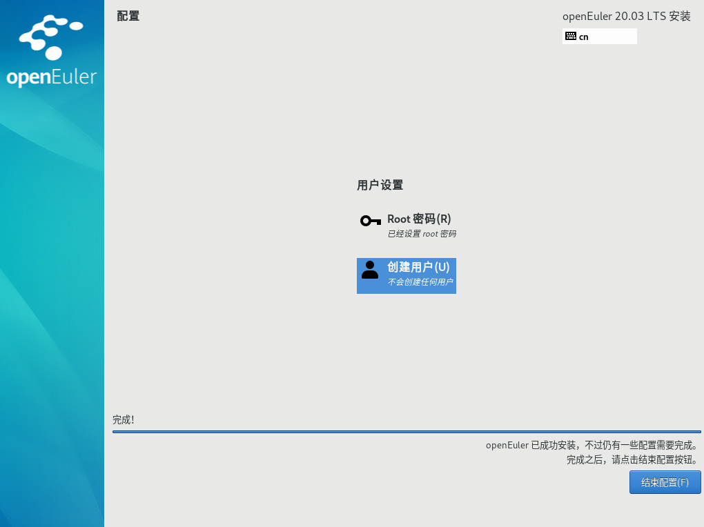

## 安装完成

此刻，openEuler已完成安装，如[图21](#zh-cn_topic_0186390267_zh-cn_topic_0122145917_fig1429512116338)所示。单击“重启”后，系统将重新启动。

**图 21**  完成安装<a name="zh-cn_topic_0186390267_zh-cn_topic_0122145917_fig1429512116338"></a>  
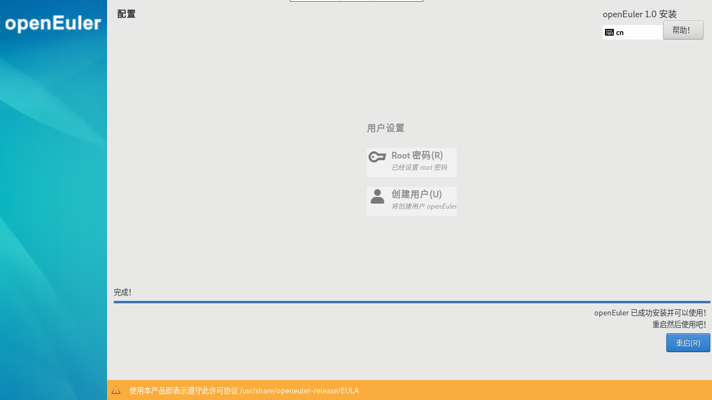

-   如果当前使用物理光盘安装操作系统，且在重启过程中安装光盘没有自动弹出，请手动取出光盘，则可以直接进入openEuler命令行登录界面。
-   如果当前使用虚拟光驱安装操作系统，则需要修改服务器的启动项为“硬盘”，然后重启服务器，则可以直接进入openEuler命令行登录界面。
