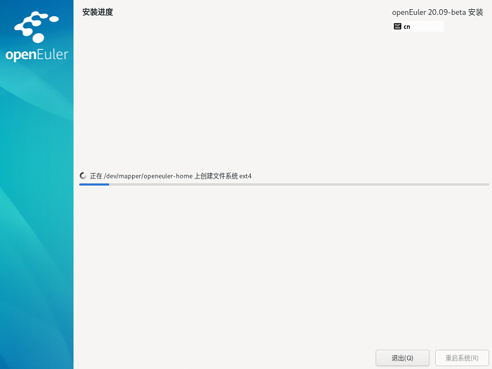
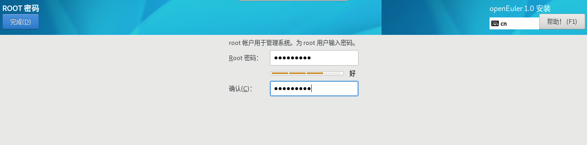
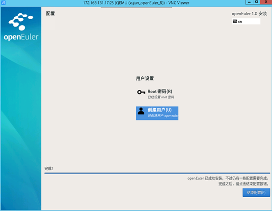

# 安装过程配置<a name="ZH-CN_TOPIC_0220373236"></a>

开始安装后会出现进度页面，显示安装进度及所选软件包写入系统的进度。

**图 1**  安装过程<a name="zh-cn_topic_0186390266_zh-cn_topic_0122145909_fig1590863119306"></a>  


安装软件包的过程中，需要用户配置root密码、根据个人需求可以创建用户。

## 密码复杂度<a name="zh-cn_topic_0186390266_zh-cn_topic_0122145909_sde5f91f1b197422180f50c693caff342"></a>

用户设置的root用户密码或新创建用户的密码均需要满足密码复杂度要求，否则会导致密码设置或用户创建失败。设置密码的复杂度的要求如下：

1.  口令长度至少8个字符。
2.  口令至少包含大写字母、小写字母、数字和特殊字符中的任意3种。
3.  口令不能和账号一样。
4.  口令不能使用字典词汇。
    -   查询字典

        在已装好的openEuler环境中，可以通过如下命令导出字典库文件dictionary.txt，用户可以查询密码是否在该字典中。

        ```
        cracklib-unpacker /usr/share/cracklib/pw_dict > dictionary.txt
        ```

    -   修改字典
        1.  修改上面导出的字典文件，执行如下命令更新系统字典库。

            ```
            # create-cracklib-dict dictionary.txt
            ```

        2.  在原字典库基础上新增其他字典内容custom.txt。

            ```
            # create-cracklib-dict dictionary.txt custom.txt
            ```


## 设置root密码<a name="zh-cn_topic_0186390266_zh-cn_topic_0122145909_sba63f974590848d1a6110d6aa9d145ab"></a>

单击“root密码”，弹出设置密码界面如[图2](#zh-cn_topic_0186390266_zh-cn_topic_0122145909_fig1323165793018)所示，输入密码并再次输入密码进行确认。

> **说明：**   
>root密码需要在安装软件包的同时进行配置，如果不配置该密码则无法完成安装。root账户是用来执行关键系统管理任务，不建议您在日常工作及系统访问时使用root账户。  

**图 2**  root密码<a name="zh-cn_topic_0186390266_zh-cn_topic_0122145909_fig1323165793018"></a>  


完成设置后，单击左上角的“完成”返回安装过程界面。

## 创建用户<a name="zh-cn_topic_0186390266_zh-cn_topic_0122145909_sb88f63af2daa4e55959c0bb72fea0a52"></a>

单击“创建用户”，弹出创建用户的界面如[图3](#zh-cn_topic_0186390266_zh-cn_topic_0122145909_fig1237715313319)所示。输入用户名，并设置密码。另外您还可以通过“高级”选项设置用户主目录、用户组等，如[图4](#zh-cn_topic_0186390266_zh-cn_topic_0122145909_fig128716531312)所示。

**图 3**  创建用户<a name="zh-cn_topic_0186390266_zh-cn_topic_0122145909_fig1237715313319"></a>  


**图 4**  高级用户配置<a name="zh-cn_topic_0186390266_zh-cn_topic_0122145909_fig128716531312"></a>  


完成设置后，单击左上角的“完成”返回安装过程界面。

单击“结束配置”，完成openEuler的相关配置。



