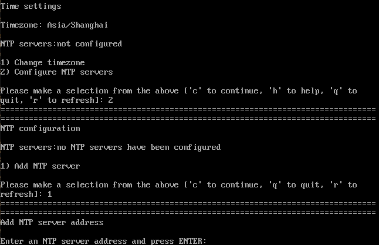

# 设置时区、NTP服务

设置系统的时区（时间/日期）、配置NTP服务。

## 设置时区

在“安装概览”页面中输入“2”并按“Enter”，进入配置时区和NTP服务界面。

在[图1](#zh-cn_topic_0155778951_zh-cn_topic_0151920790_fc6f125c2c19540b0828071e05fe8b8db)所示界面中输入“1”并按“Enter”，进入系统时区设置。用户可根据实际情况调整和设置系统的时区和城市。

**图 1**  时区  

选择城市时，由于城市数量较多将会分页显示。在出现“Press ENTER to continue”提示时，可以按“Enter”键以显示全部的城市信息。

## 设置NTP服务

设置时区完成之后，回到系统安装主界面（如“安装概览”页面所示），输入“2”并按“Enter”，进入配置时区和NTP服务界面。

输入“2”并按“Enter”，配置NTP服务。

**图 2**  NTP服务器  

设置完成后，在界面输入“c”，返回“安装概览”页面。

