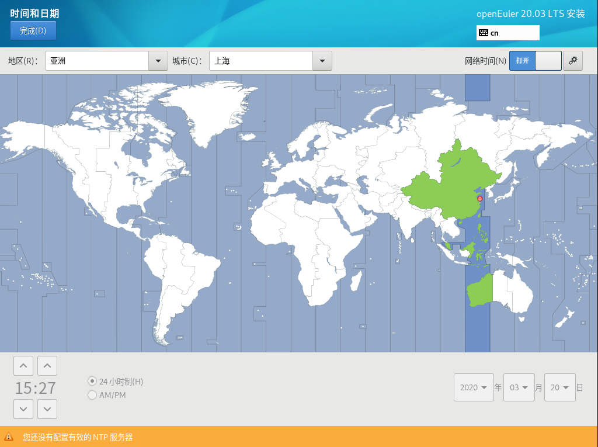

# 设置时间和日期

在“安装概览”页面中选择“时间和日期”，设置系统的时区、日期、时间等。

设置时区时，用户可通过鼠标在地图上单击指定的城市，也可以通过页面顶部的“地区”和“城市”下拉菜单中进行选择，如[图1](#zh-cn_topic_0186390096_zh-cn_topic_0122145900_fig1260162652312)所示。

如果您所在城市没有出现在地图或下拉菜单中，请选择同一时区中离您最近的城市。

> **说明：**   
>-   手动设置时区时，请先关闭右上角“网络时间”同步开关。  
>-   如需使用网络时间，请保证网络能连通远程NTP服务器，设置网络具体请参见“安装指导 \>  （推荐）通过图形化模式安装 \> 设置安装参数 \> 设置网络和主机名”章节。  

**图 1**  日期和时间  

设置完成后，请单击左上角“完成”返回“安装概览”页面。

