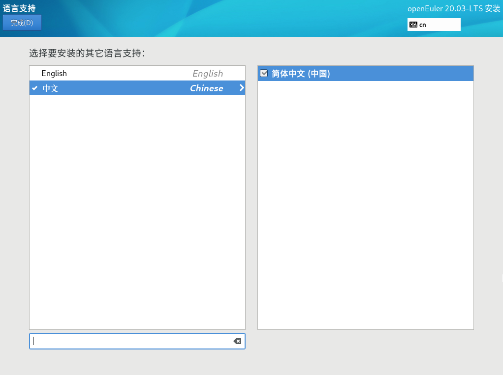

# 设置系统语言

在“安装概览”页面中选择“语言支持”，设置系统的语言。如[图1](#zh-cn_topic_0186390098_zh-cn_topic_0122145772_fig187301927172619)所示，用户也可根据实际情况进行调整，选择“中文”。

> **说明：**   
>-   若选择“中文”，系统安装完成后，使用VNC登录不支持中文显示，使用串口或者SSH等方式登录支持中文显示。  
>-   若选择“English”，则无影响。  

**图 1**  语言支持  

设置完成后，请单击左上角“完成”返回“安装概览”页面。

