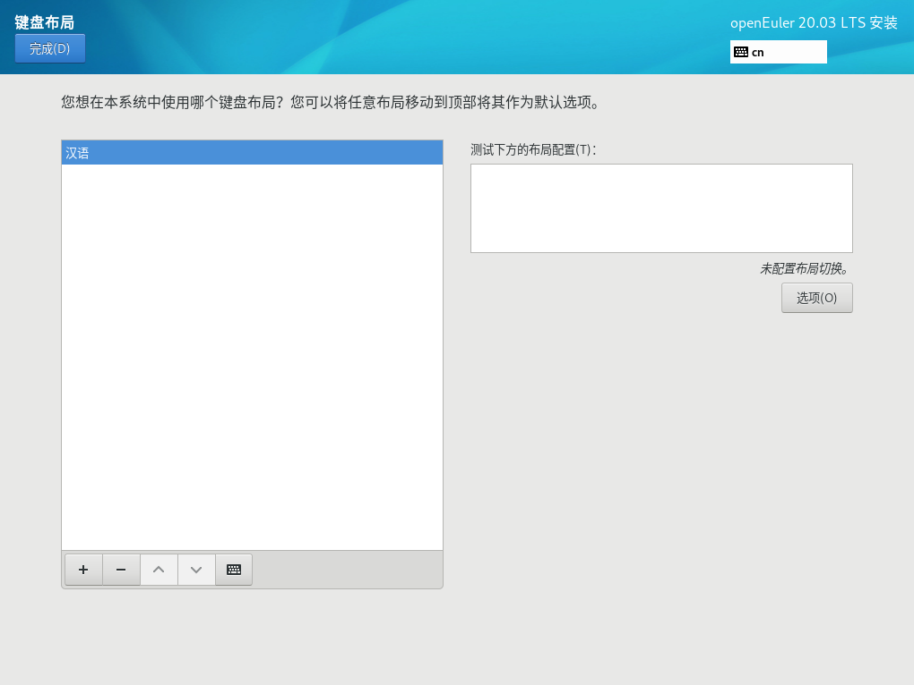

# 设置键盘

在“安装概览”页面中选择“键盘”，用户可以在系统中添加或者删除多个键盘布局。

-   要查看键盘布局，请在左侧选框中单击选中该键盘布局，然后单击下面的“键盘”按钮。
-   要测试键盘布局，请在左侧选框中添加键盘布局，然后在右上角键盘图标处进行点击切换为目标键盘，单击右侧文本框内部，输入文本以确认所选键盘布局可正常工作。

**图 1**  键盘布局  

设置完成后，请单击左上角“完成”返回“安装概览”页面。

