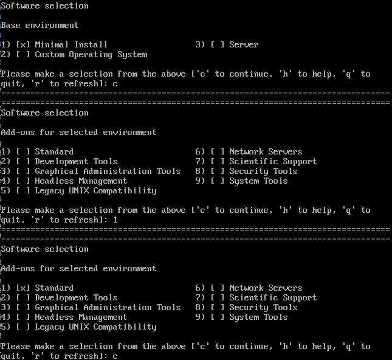

# 选择安装软件

在“安装概览”页面中输入“4”，然后按“Enter”，指定需要安装的软件包。

-   Minimal Install：最小环境。提供openEuler基本功能，默认为最小环境安装。

在安装环境界面输入”c“后，可以通过附加选项“Add-ons”来选择需要安装的软件包，如下图所示。

**图 1**  安装软件  

输入“1”，选择标准安装后输入”c“。

不同安装环境的可选附加包会有差异：

-   Standard：标准。openEuler标准安装。
-   Development Tools：开发工具。基本开发环境。
-   Headless Management：无图形终端系统管理工具。用于管理无图像终端系统的工具。
-   Legacy UNIX Compatiblity：传统UNIX兼容性。用于从继承UNIX环境中迁移或者可用于该环境的兼容程序。
-   Network Servers：网络服务器。这些软件包包括基于网络的服务器，例如DHCP、Kerberos和NIS。
-   Scientific Support：科学计数法支持。用于数学和科学计算以及平行计算的工具。
-   Security Tools：安全性工具。用于完整性和可信验证的安全性工具。
-   System Tools：系统工具。这组软件包是各类系统工具的集合，如：连接SMB共享的客户；监控网络交通的工具。

设置完成后，在界面输入“c”，返回“安装概览”页面。

