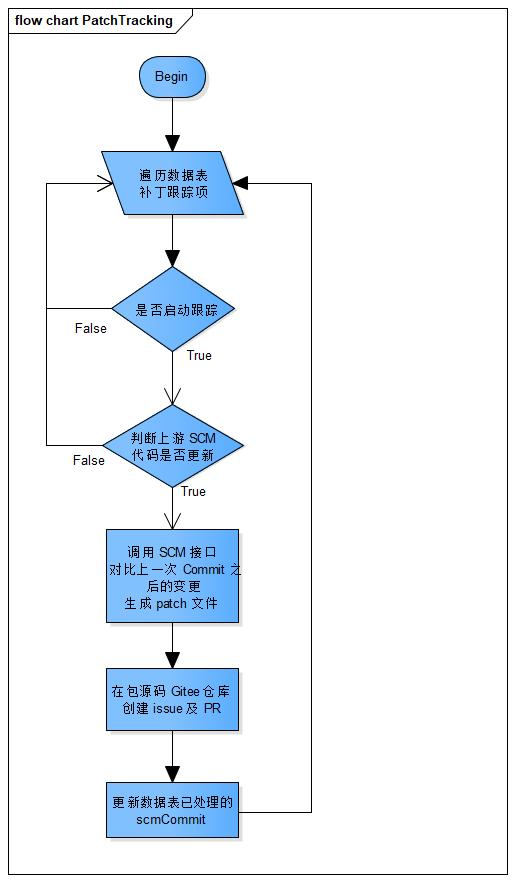

补丁跟踪
===


# 简介

在 openEuler 发行版开发过程，需要及时更新上游社区各个软件包的最新代码，修改功能 bug 及安全问题，确保发布的 openEuler 发行版尽可能避免缺陷和漏洞。

本工具对软件包进行补丁管理，主动监控上游社区提交，自动生成补丁，并自动提交 issue 给对应的 maintainer，同时自动验证补丁基础功能，减少验证工作量支持 maintainer 快速决策。

# 架构

## CS架构

补丁跟踪工具采用 C/S 架构。

* 服务端(patch-tracking) ：负责执行补丁跟踪任务，包括维护跟踪项，识别上游仓库分支代码变更并形成补丁文件，向 Gitee 提交 issue 及 PR，同时 patch-tracking 提供 RESTful 接口，用于对跟踪项进行增删改查操作。

* 客户端：即命令行工具（patch-tracking-cli），通过调用 patch-tracking 的 RESTful 接口，实现对跟踪项的增删改查操作。 

## 核心流程

* 补丁跟踪服务流程

**主要步骤：**

1. 命令行工具写入跟踪项。
2. 自动从跟踪项配置的上游仓库（例如Github）获取补丁文件。
3. 创建临时分支，将获取到的补丁文件提交到临时分支。
4. 自动提交issue到对应项目，并生成关联 issue 的 PR。



* Maintainer对提交的补丁处理流程

**主要步骤：**
1. Maintainer分析临时分支中的补丁文件，判断是否合入。
2. 执行构建，构建成功后判断是否合入PR。


## 数据结构

* Tracking表

| 序号 | 名称 | 说明 | 类型 | 键 | 允许空 |
|:----:| ----| ----| ----| ----| ----|
| 1 | id | 自增补丁跟踪项序号 | int | - | NO |
| 2 | version_control | 上游SCM的版本控制系统类型 | String | - | NO |
| 3 | scm_repo | 上游SCM仓库地址 | String | - | NO |
| 4 | scm_branch | 上游SCM跟踪分支 | String | - | NO |
| 5 | scm_commit | 上游代码最新处理过的Commit ID | String | - | YES |
| 6 | repo | 包源码在Gitee的仓库地址 | String | Primary	| NO |
| 7 | branch | 包源码在Gitee的仓库分支 | String | Primary | NO |
| 8 | enabled | 是否启动跟踪 | Boolean | -| NO |

* Issue表

| 序号 | 名称 | 说明 | 类型 | 键 | 允许空 |
|:----:| ----| ----| ----| ----| ----|
| 1 | issue | issue编号 | String | Primary | NO |
| 2 | repo | 包源码在Gitee的仓库地址 | String | - | NO |
| 3 | branch | 包源码在Gitee的仓库分支 | String | - | NO |

# 工具安装

## 环境要求

>* 已安装 Python 3.7及以上版本
>* 已安装 pip3。


## 安装依赖

执行如下指令安装依赖包。

```shell script
yum install -y gcc python3-devel openssl-devel
pip3 install flask flask-sqlalchemy flask-apscheduler requests flask_httpauth
pip3 install -I uwsgi
```

## 安装工具

执行如下指令安装工具（其中”xxx”表示版本号，请用实际情况代替）。

```shell script
rpm -ivh patch-tracking-xxx.rpm
```

##  配置参数

在配置文件中对相应参数进行配置，配置文件路径为 `/etc/patch-tracking/settings.conf`。

1. 配置服务监听地址。

    ```
    LISTEN = "127.0.0.1:5001"
    ```

2. GitHub Token，用于访问托管在GitHub上游开源软件仓的仓库信息。生成GitHub Token的方法请参考 [Creating a personal access token](https://docs.github.com/en/github/authenticating-to-github/creating-a-personal-access-token) 。

    ```
    GITHUB_ACCESS_TOKEN = ""
    ```

3. 对于托管在gitee上的需要跟踪的仓库，配置一个有该仓库权限的gitee的token，用于提交patch文件，提交issue，提交PR等操作。

    ```
    GITEE_ACCESS_TOKEN = ""
    ```

4. 定时扫描数据库中是否有新增或修改的跟踪项，对扫描到的跟踪项执行获取上游补丁任务，在这里配置扫描的时间间隔，数字单位是秒。

    ```
    SCAN_DB_INTERVAL = 3600
    ```

5. 命令行工具运行过程中，POST接口需要填写进行认证的用户名和口令哈希值。

    ```
    USER = "admin"
    
    PASSWORD = ""
    ```
