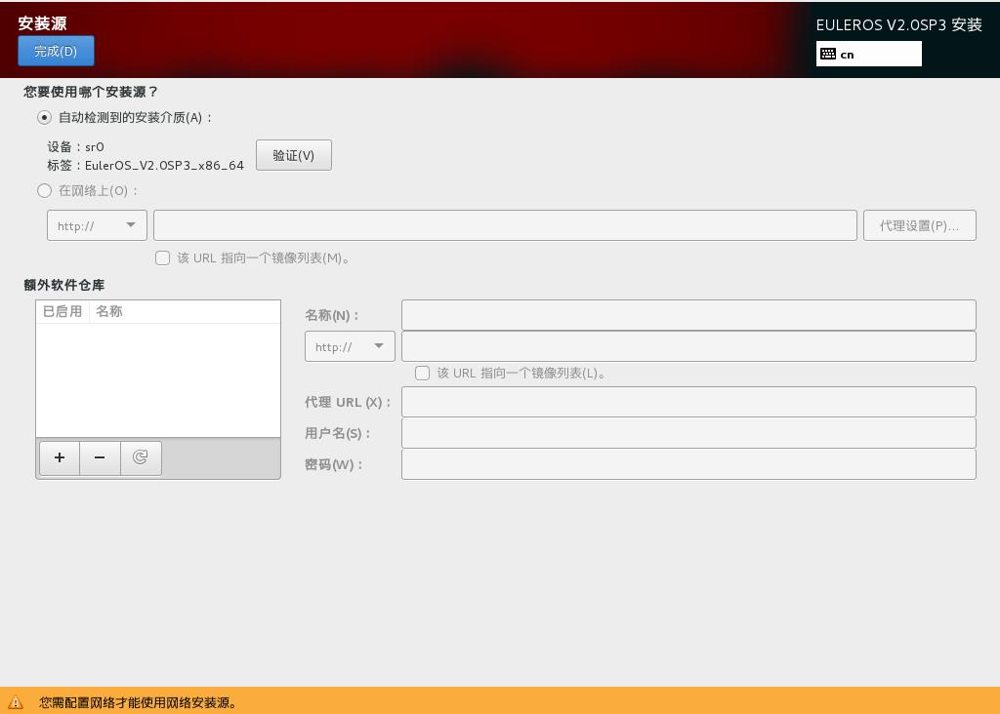

# 设置安装源

在[安装概览](进入安装设置界面.md#zh-cn_topic_0090571602_zh-cn_topic_0084097759_zh-cn_topic_0072985224_zh-cn_topic_0050852521_zh-cn_topic_0022427576_fig40696565144837)页面中选择“安装源”，指定安装源的位置。

您可以选择可本地访问的安装源，也可以选择网络位置，如[图1](#zh-cn_topic_0090571608_zh-cn_topic_0084097765_zh-cn_topic_0072985232_zh-cn_topic_0050852526_zh-cn_topic_0022427670_fig2728417145551)所示。当前使用完整光盘安装，安装程序会自动探测并显示安装源信息，用户直接使用默认配置即可，不需要进行设置。

**图 1**  安装源  

设置完成后，请单击左上角“完成”，返回[安装概览](进入安装设置界面.md#zh-cn_topic_0090571602_zh-cn_topic_0084097759_zh-cn_topic_0072985224_zh-cn_topic_0050852521_zh-cn_topic_0022427576_fig40696565144837)安装配置主页面。

