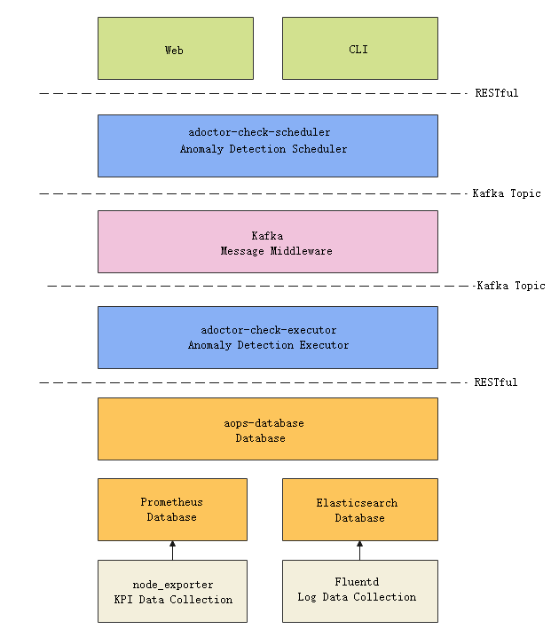
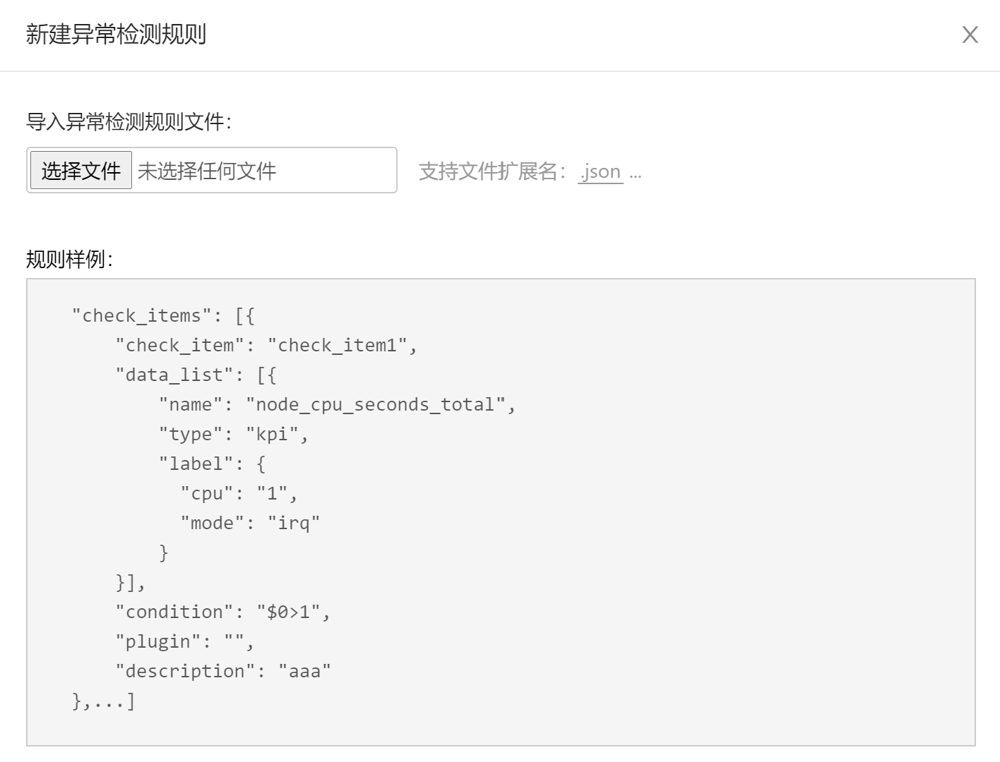
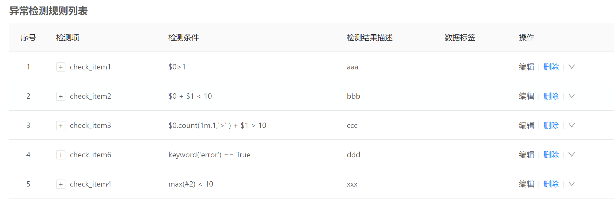
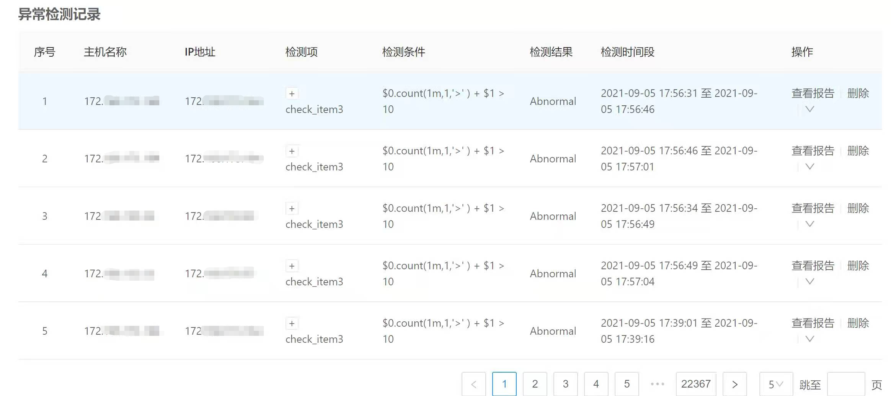
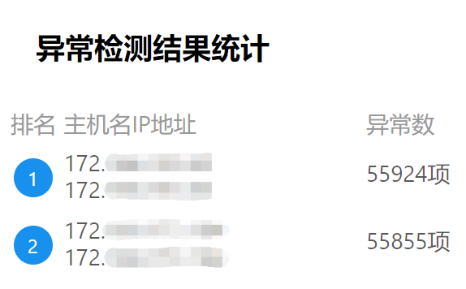

# adoctor-check Anomaly Detection Module

# 1 Description

The adoctor-check anomaly detection module is a tool that calculates and analyzes various running data collected from the nodes in the cluster to check whether there are abnormal data items.

# 2 Architecture

The anomaly detection tool depends on the A-Ops framework and consists of the scheduler and executor modules.



# 3 Software Download

- Repo source ISO official release: [https://repo.openeuler.org/](https://repo.openeuler.org/)
- Source code download: [https://gitee.com/openeuler/A-Ops](https://gitee.com/openeuler/A-Ops)
- RPM package download: [https://117.78.1.88/project/show/openEuler:Mainline](https://117.78.1.88/project/show/openEuler:Mainline)

# 4 Operating Environment

- Hardware configuration:


  | Configuration Item | Recommended Specification |
  | -------------------- | --------------------------- |
  | CPU                | 8 cores                   |
  | Memory             | 32 GB (minimum: 4 GB)     |
  | Network bandwidth  | 300 Mbps                  |
  | I/O                | 375 MB/s                  |
- Software configuration:


  | Software                     | Version and Specifications |
  | ------------------------------ | ---------------------------- |
  | Python                       | Version 3.8 or later       |
  | MySQL                        | 8.0.26                     |
  | Kafka                        | 2.6.0                      |
  | ZooKeeper                    | 3.6.2                      |
  | Elasticsearch                | 7.14.0                     |
  | Prometheus                   | 2.20.0                     |
  | node_exporter                | 1.0.1                      |
  | aops-database                | 1.0.1                      |
  | aops-manager                 | 1.0.1                      |
  | Fluentd                      | 1.13.3                     |
  | fluentd-plugin-elasticsearch | 5.0.5                      |

# 5 Installation

## 5.1 Installing the A-Ops Framework

The anomaly detection module depend on the A-ops framework. For details about how to install the framework, see the [Service Deployment Manual](./service-deployment-manual.md).

## 5.2 Installing the Dependent Components

The anomaly detection module depends on the message middlewares and the data collection modules. Ensure that the ZooKeeper, Kafka, Prometheus, node_exporter, Elasticsearch, and Fluentd components are deployed in the environment. Elasticsearch is deployed during the installation of the A-Ops framework. You need to modify the related configurations to receive the push of the data collected by Fluentd on multiple hosts.

### 5.2.1 Installing Using the A-Ops Deployment Service

You can also install adoctor-check-scheduler and adoctor-check-executor in this step.

#### 5.2.1.1 Editing the Task List

Modify the deployment task list and enable the steps for the ZooKeeper, Kafka, Prometheus, node_exporter, and Fluentd components:

```yaml
---
step_list:
 zookeeper:
  enable: true
  continue: false
 kafka:
  enable: true
  continue: false
 prometheus:
  enable: true
  continue: false
 node_exporter:
   enable: true
   continue: false
 fluentd:
   enable: true
   continue: false
 ...
```

#### 5.2.1.2 Editing the Host List

For details about the host configurations, see section 2.2.2 in the [Automatic Service Deployment Manual](./auto-service-deployment-manual.md).

#### 5.2.1.3 Editing the Variable List

For details about the variable configurations, see section 2.2.2 in the [Automatic Service Deployment Manual](./auto-service-deployment-manual.md).

#### 5.2.1.4 Executing the Deployment Task

1. ##### Executing on the Web Page:

   For details, see section 1.10.2 in the [Service Deployment Manual](./service-deployment-manual.md).
2. ##### Executing Using the CLI:

   - Log in to the server where the services are to be installed.
   - Run the following command:

     ```shell
     aops task --action execute --task_list a --access_token token
     ```

### 5.2.2 Manual Installation

You can configure the openEuler Repo source to install the preceding dependent components. For details about the parameter configuration and cluster deployment , see the official documents of the softwares.

## 5.3 Installing the adoctor-check

### 5.3.1 Manual Installation

- Installing using the repo source mounted by DNF.

  Use DNF to mount the repo source that contains the adoctor-check-scheduler and adoctor-check-executor softwares (For details, see the [Application Development Guide](https://openeuler.org/en/docs/20.09/docs/ApplicationDev/application-development.html)), and run the following commands to download the pkgship and its dependencies.

  ```shell
  dnf install adoctor-check-scheduler
  dnf install adoctor-check-executor
  ```
- Installing using the RPM packages. Download adoctor-check-scheduler, adoctor-check-executor, and aops-utils, and run the following command to install the modules (`x.x-x` indicates the version. Replace it with the actual version number.):

  ```shell
  rpm -ivh adoctor-check-scheduler-x.x-x.oe1.noarch.rpm
  rpm -ivh adoctor-check-executor-x.x-x.oe1.noarch.rpm
  ```

### 5.3.2 Installing Using the A-Ops Deployment Service

You can install this module with the dependent components in section 5.2.1.

#### 5.3.2.1 Editing the Task List

Modify the deployment task list and enable the steps for adoctor-check-scheduler and adoctor-check-executor:

```yaml
---
step_list:
 ...
 adoctor_check_executor:
   enable: true
   continue: false
 adoctor_check_scheduler:
   enable: true
   continue: false
 ...
```

#### 5.3.2.2 Editing the Host List

For details about the host configuration, see section 2.2.3.8 in the [Automatic Service Deployment Manual](./auto-service-deployment-manual.md).

#### 5.3.2.3 Editing the Variable List

For details about the variable configuration, see section 2.2.3.8 in the [Automatic Service Deployment Manual](./auto-service-deployment-manual.md).

#### 5.3.2.4 Executing the Deployment Task

See [section 5.2.1.4](#5.2.1.4-executing-the-deployment-task) to execute the deployment task.

# 6 Defining the Anomaly Detection Rules

Anomaly detection rules are defined based on the data that can be collected by the system.

## 6.1 Anomaly Detection Rule File Format

Anomaly detection rules must be imported in JSON format. Different users can import different detection rules. The detection rule list consists of check items. The following is an example of a check item:

```json
"check_items": [
    {
        "check_item": "check_item2",
        "data_list": [
            {
                "name": "data1",
                "type": "kpi",
                "label": {
                    "cpu": "1",
                    "mode": "irq"
                 }
            }
        ],
        "condition": "$0>1",
        "plugin": "",
        "description": "data 1"
    },
    {
        "check_item": "check_item2",
        ...
    }
]
```

An anomaly detection rule contains the following fields:


| Field       | Description                                      | Type   | Remarks                                                                                                                                                                                                   |
| ------------- | -------------------------------------------------- | -------- | ----------------------------------------------------------------------------------------------------------------------------------------------------------------------------------------------------------- |
| check_item  | Name of the anomaly detection rule.              | string | The name of the anomaly detection rule imported by a user must be unique.                                                                                                                                 |
| data_list   | List of data required for the anomaly detection. | list   |                                                                                                                                                                                                           |
| condition   | Detection rule description.                      | string | A string to describe the anomaly. It is a condition for determining that the data in data_list is abnormal.                                                                                               |
| plugin      | Name of the anomaly detection rule plugin.       | string | If you use a custom anomaly detection rule plugin, set this parameter to the plugin name. If this parameter is left empty, the built-in expression plugin is used to parse the detection rule by default. |
| description | Description of the anomaly detection check item. | string |                                                                                                                                                                                                           |

## 6.2 Description of the Anomaly Detection Data Items

You need to describe the data required for calculation for each anomaly detection check item. The data is listed in data_list. The description of key fields in data_list is as follows:


| Field | Description            | Type   | Remarks                                                                                                                                                                                                                                |
| ------- | ------------------------ | -------- | ---------------------------------------------------------------------------------------------------------------------------------------------------------------------------------------------------------------------------------------- |
| name  | Name of the data item. | string | The data item name is unique within the data_list.                                                                                                                                                                                     |
| type  | Type of the data.      | string | The value can be kpi (indicator data) or log (log data).                                                                                                                                                                               |
| label | Data label.            | dict   | Key-value pairs of data items recorded in the dictionary. You need to describe all labels of the data item. For details about the values of KPI data, see the metrics list of node_exporter. The label field is optional for log data. |

- KPI data

  Currently, KPI data is collected by node_exporter and stored in Prometheus. The data indicators that can be collected vary according to the node_exporter version. The supported data items are subject to the deployed node_exporter version.

  - Data categories

  The following categories are included:


  | Data Item                                    | Data Category               |
  | ---------------------------------------------- | ----------------------------- |
  | node_cpu*                                    | System CPU metrics          |
  | node_disk*                                   | Disk I/O metrics            |
  | node_filesystem*                             | File system metrics         |
  | node_memory*, node_zoneinfo*                 | System memory usage metrics |
  | node_netstat*, node_network*, node_sockstat* | Network metrics             |
  | node_load*                                   | System load metrics         |
  | node_systemd*                                | Service metrics             |
  | node_time*                                   | Time-related metrics        |
  | process*                                     | Prometheus process metrics  |
  | go_*                                         | Go environment metrics      |


  - Data labels

    The KPI data usually carries labels that represent its own characteristics. The labels are described in the form of a dictionary in the **label** field. A group of labels uniquely identifies a metric data record. The dimensions of the label may include the status, the feature, the environment definition, or the like of the monitoring data. An example is as follows:

    ```
    node_cpu_seconds_total{cpu="0",mode="idle"} 
    node_cpu_seconds_total{cpu="0",mode="iowait"}
    node_cpu_seconds_total{cpu="0",mode="irq"}
    node_cpu_seconds_total{cpu="0",mode="nice"} 
    node_cpu_seconds_total{cpu="0",mode="softirq"} 
    node_cpu_seconds_total{cpu="0",mode="steal"}
    node_cpu_seconds_total{cpu="0",mode="system"} 
    node_cpu_seconds_total{cpu="0",mode="user"} 
    ...
    node_cpu_seconds_total{cpu="95",mode="softirq"} 
    node_cpu_seconds_total{cpu="95",mode="steal"
    node_cpu_seconds_total{cpu="95",mode="system"} 
    node_cpu_seconds_total{cpu="95",mode="user"}
    ```

    Each of the data items above has the **cpu** and **mode** labels. The **cpu** label indicates the CPU core to which the data belongs. There are 96 CPU cores in total. The **mode** indicates the status of the CPU core. There are 8 status, such as idle (idle), user space process usage (user), and system space process usage (system).

  For details about the data items supported by node_exporter, see the node_exporter [official document](https://prometheus.io/docs/guides/node-exporter/).
- Log data

  Log data is collected by Fluentd and stored in Elasticsearch. Currently, the history logs and demesg logs of the system can be collected.

## 6.3 Conditions of the Anomaly Detection Rules

### 6.3.1 Anomaly Detection Expressions

By default, the anomaly detection rules use expressions to create the description of the collected data. The standard expressions look like follows:

```
<expression><operator><constant>
<expression><operator><expression>
```

**expression** is an expression that contains data variables. The data variables are described in **data_list** and are expressed following the order in **data_list** using $i macros.

For example, if **data_list** is as follows:

```json
"data_list": 
[{
	"name": "node_cpu_frequency_min_hertz",
	"type": "kpi",

},
{
	"name": "node_cpu_guest_seconds_total",
	"type": "kpi",
	"label": {
		"cpu": "1",

	}
},
{
	"name": "node_cpu_seconds_total",
	"type": "kpi"
}]
```

In this case, the **condition** should be similar to the following:

```
$0 + $1 * $2 >100
```

The meaning of the expression is as follows:

```
node_cpu_frequency_min_hertz + node_cpu_guest_seconds_total * node_cpu_seconds_total > 100
```

### 6.3.2 Operators

Currently, the following operators are supported:


| Priority | Operator | Definition               | Usage                                                                                       |
| ---------- | ---------- | -------------------------- | --------------------------------------------------------------------------------------------- |
| 1        | ()       | Parenthesis              | (expression), function(parameter)                                                           |
| 2        | -        | Minus sign operator      | -expression                                                                                 |
|          | +        | Plus sign operator       | +expression                                                                                 |
| +        | !        | Logical NOT              | !expression                                                                                 |
|          | ~        | Bitwise NOT              | ~expression                                                                                 |
| 3        | /        | Division                 | expression1 / expression2                                                                   |
|          | *        | Multiplication           | expression1 * expression2                                                                   |
|          | %        | Remainder (modulo)       | expression1 % expression2                                                                   |
| 4        | +        | Addition                 | expression1 + expression2                                                                   |
|          | -        | Subtraction              | expression1 - expression2                                                                   |
| 5        | <<       | Left shift               | expression1 << expression2                                                                  |
|          | >>       | Right shift              | expression1 >> expression2                                                                  |
| 6        | >        | Greater than             | expression1 > expression2                                                                   |
|          | >=       | Greater than or equal to | expression1 >= expression2                                                                  |
|          | <        | Less than                | expression1 < expression2                                                                   |
|          | <=       | Less than or equal to    | expression1 <= expression2                                                                  |
| 7        | ==       | Equal to                 | expression1 == expression2                                                                  |
|          | !=       | Not equal to             | expression1 != expression2                                                                  |
|          | in       | Included by              | {key: value} in {ke1:value1, key2:value2, ...}. **key** and **value** can be expressions.    |
|          | notin    | Not included by          | {key: value} notin {ke1:value1, key2:value2, ...}. **key** and **value** can be expressions. |
| 8        | &        | Bitwise AND              | expression1 & expression2                                                                   |
| 9        | ^        | Bitwise XOR              | expression1 ^ expression2                                                                   |
| 10       | \|       | Bitwise OR               | expression1 \| expression2                                                                   |
| 11       | &&       | Logical AND              | expression1 && expression2                                                                  |
| 12       | \|\|     | Logical OR               | expression1 \|\| expression2                                                                 |
| 13       | ?:       | Condition operator       | judege_expression ? expression_true : expression_false                                      |

### 6.3.3 Functions

You can use functions to calculate the data in the expressions. The expression format is as follows:

```
# Compare the function calculation result of the specified data_name with constant:
<data_name>.function(<parameter>)<operator><constant>
# Compare the function calculation result of $0 with constant:
function(<parameter>)<operator><constant>
```

- Function parameters

  You can use time and quantity as filters in the functions.


  | Function Invocation | Description                                       |
  | --------------------- | --------------------------------------------------- |
  | max(30s)            | Maximum value of the data in the last 30 seconds. |
  | max(#5)             | Maximum value of the latest 5 data records.       |

  The unit of the time offset can be s (second), m (minute), or h (hour).
- Function list


  | Function Name                       | Description                                                                                    | Parameter                                                                                              | Data Type       | Remarks                                                                                                                                                                                      |
  | ------------------------------------- | ------------------------------------------------------------------------------------------------ | -------------------------------------------------------------------------------------------------------- | ----------------- | ---------------------------------------------------------------------------------------------------------------------------------------------------------------------------------------------- |
  | count(sec\|#num, pattern, operator) | Counts the data records that meet the conditions within a specified range of data.             | sec\|#num: Offset in time or quantity; \<pattern>: Value to be compared; \<operator>: Logical relationship | float, int,str  | count(10m,1,">"): Quantity of data records greater than 1 in the last 10 minutes. count(#15,"error","=="): Quantity of data records that are equal to "error" in the latest 15 data records. |
  | max(sec\|#num)                      | Calculates the maximum value of a specified range of data.                                     | sec\|#num: Offset in time or quantity                                                                  | float, int      | max(#5): The maximum value of the latest 5 data records. max(5s): The maximum value of the data records in the last 5 seconds.                                                               |
  | min(sec\|#num)                      | Calculates the minimum value of a specified range of data.                                     | sec\|#num: Offset in time or quantity                                                                  | float, int      | min(#5): The minimum value of the latest 5 data records. min(5s): The minimum value of data records in the last 5 seconds.                                                                   |
  | sum(sec\|#num)                      | Calculates the sum of a specified range of data.                                               | sec\|#num: Offset in time or quantity                                                                  | float, int      | sum(#5): The sum of the latest 5 data records. sum(5s): The sum of data records in the last 5 seconds.                                                                                       |
  | avg(sec\|#num)                      | Calculates the average value of a specified range of data.                                     | sec\|#num: Offset in time or quantity                                                                  | float, int      | avg(#5): The average value of the latest 5 data records. avg(5s): The average value of data records in the last 5 seconds.                                                                   |
  | keyword(pattern)                    | Determines whether the current data contains the specified keyword string.                     | pattern: Keyword string                                                                                | str             | keyword("error"): If the data contains the keyword "error", true is returned. Otherwise, false is returned.                                                                                  |
  | diff(sec\|#num)                     | Determines whether the current value is the same as a historical value.                           | sec\|#num: Offset in time or quantity                                                                  | float,int, str, | true: The two values are the same. false: The two values are different.                                                                                                                      |
  | abschange(sec\|#num)                | Calculates the absolute value of the difference between the current value and a history value. | sec\|#num: Offset in time or quantity                                                                  | float,int       | pre:1 cur:5 return: 4       pre:3 cur:1 return:2             pre:0 cur:-2.5 return 2.5                                                                                                       |
  | change(sec\|#num)                   | Calculates the difference between the current value and a historical value.                       | sec\|#num: Offset in time or quantity                                                                  | float,int       | pre:1 cur:5 return: 4        pre:3 cur:1 return:-2             pre:0 cur:-2.5 return -2.5                                                                                                    |

## 6.4 Custom Anomaly Detection Plugin

- Customizing the anomaly detection plugin interface.

  The custom anomaly detection plugin needs to inherit the CheckRulePlugin class in adoctor_check_executor.check_rule_plugins.check_rule_plugin.


  | Interface       | Function                 | Input Value                                                                                                         | Return Value                                    |
  | ----------------- | -------------------------- | --------------------------------------------------------------------------------------------------------------------- | ------------------------------------------------- |
  | judge_condition | Checks for anomalies.    | index: Coordinate in the time series data segment; data_vector: Time series data segment; main_data_name: Main data | true: Anomalies found. false: No anomaly found. |
  |                 | Sets the Plugin Manager. | plugin_manager: Plugin manager                                                                                      |                                                 |
- Configuring the plugin file.

  Add your custom anomaly detection rule plugin in `/etc/aops/check_rule_plugin.yml`.

  ```yaml
  ---
  plugin_list:
    - plugin_name: expression_rule_plugin
      file_name: expression_rule
      module_name: ExpressionCheckRule
    - plugin_name: my_plugin #Plugin name
    	file_name: my_plugin #Plugin file
    	module_name: Myplugin #Plugin class name
  ```

  1. Move `my_plugin.py` and the files to be referenced to the installation directory of adoctor_check_executor `adoctor_check_executor/check_rule_plugins`.
  2. Restart the adoctor-check-executor to load the custom plugins.

# 7 Parameter Configuration

## 7.1 Configuring the adoctor-check-scheduler

By default, the adoctor-check-scheduler configuration file is stored as `/etc/aops/check_scheduler.ini`. Modify the file as required.

```shell
vim /etc/aops/check_scheduler.ini
```

```ini
; Kafka producer parameters.
[producer] 
; List of Kafka hosts, which is in HOST:PORT format. The default port number is 9092, and the default IP address is localhost.
kafka_server_list = 192.168.1.1:9092
; Kafka API version. The default value is 0.11.5.
api_version = 0.11.5
; The number of ACK messages received by the Kafka leader before the leader confirms a request is complete. The default value is 1.
; 0: The producer does not wait for the ACK message from the server. The message is immediately added to the socket buffer and set as already sent. There is not guarantee that the server has received the message. The offset returned for each message is always -1.
; 1: The leader writes the record only to the local host. The broker does not wait for responses from all followers.
; all: The producer waits for all synchronized replications to write the record.
acks = 1
; If the value is greater than 0, the client resends the message when the message fails to be sent.
retries = 3
; The time to wait before the producer retries a failed request, in milliseconds.
retry_backoff_ms = 100

; Kafka consumer parameters.
[consumer]
; List of Kafka hosts, which is in HOST:PORT format. The default port number is 9092, and the default IP address is localhost.
kafka_server_list = 192.168.1.1:9092
; If the value is True, the consumer periodically commits the offset in the background.
enable_auto_commit = False
; Policy for resetting the offset when the OffsetOutOfRange error occurs.
; earliest: Move the offset to the earliest available message.
; latest: Move the offset to the latest message.
auto_offset_reset = earliest
; The time that the consumer spends waiting if there is no data in the buffer when the consumer performs the poll operation. If the value is 0, the current available records in the buffer are returned immediately. Otherwise, null is returned.
timeout_ms = 5
; Maximum number of records returned by a single poll of the consumer.
max_records = 3

; check scheduler configuration parameters.
[check_scheduler]
; check scheduler listening address.
ip = 127.0.0.1
; check scheduler listening port.
port = 11112
; Maximum number of task retry times when no data is available or an internal error occurs during anomaly detection.
max_retry_num = 3
; The cooldown period before the next retry if a retry fails.
cool_down_time = 120
; Maximum number of task IDs recorded in the cache of the dead tasks, that is, the tasks whose number of retry time exceeds the maximum. The cache is cleared when the maximum number is reached.
max_dead_retry_task = 10000
; Percentage of dead tasks to be cleared. By default, 50% of the cache is deleted when the number of recorded dead task IDs exceeds 10000.
dead_retry_task_discount = 0.5
; Time step of the backward detection task (following the reversed timeline) after the check scheduler is started.
backward_task_step = 60
; Interval for triggering the backward tasks.
backward_task_interval = 30
; Interval for triggering the forward tasks (following the timeline).
forward_task_interval = 30
; Maximum interval for triggering a new forward task.
forward_max_task_step = 86400

; uWSGI configuration parameters.
[uwsgi]
; Script for starting the uWSGI.
wsgi-file=manage.py
; Log of the check uwsgi service .
daemonize=/var/log/aops/uwsgi/check_scheduler.log
; Timeout interval of HTTP connections.
http-timeout=600
; Server response timeout interval.
harakiri=600
```

Note that if the listening IP address and port of the check_scheduler service are changed, the IP address and port of check_scheduler in `/etc/aops/system.ini` must be changed accordingly.

## 7.2 Configuring the adoctor-check-executor

### 7.2.1 Basic Parameter Configuration

The default configuration file of the adoctor-check-executor is stored as `/etc/aops/check_executor.ini`. Modify the file as needed:

```shell
vim /etc/aops/check_executor.ini
```

```ini
; check scheduler configuration parameters.
[consumer]
; List of Kafka hosts, which is in HOST:PORT format. The default port number is 9092, and the default IP address is localhost.
kafka_server_list=192.168.1.1:9092
; If the value is True, the consumer periodically commits the offset in the background.
enable_auto_commit=False
; Policy for resetting the offset when the OffsetOutOfRange error occurs.
; earliest: Move to the earliest available message.
; latest: Move to the latest message.
auto_offset_reset=earliest
; The time that the consumer spends waiting if there is no data in the buffer when the consumer performs the poll operation. If the value is 0, the current available records in the buffer are returned immediately. Otherwise, null is returned.
timeout_ms=5
; Maximum number of records returned by a single poll invocation of the consumer.
max_records=3

; Kafka producer parameters.
[producer]
; List of Kafka hosts, which is in HOST:PORT format. The default port number is 9092, and the default IP address is localhost.
kafka_server_list=192.168.1.1:9092
; Kafka API version. The default value is 0.11.5.
api_version=0.11.5
; The number of ACK messages received by the Kafka leader before the leader confirms a request is complete. The default value is 1.
; 0: The producer does not wait for the ACK message from the server. The message is immediately added to the socket buffer and set as already sent. There is not guarantee that the server has received the message. The offset returned for each message is always -1.
; 1: The leader writes the record only to the local host. The broker does not wait for responses from all followers.
; all: The producer waits for all synchronized replications to write the record.
acks=1
; If the value is greater than 0, the client resends the message when the message fails to be sent.
retries=3
; The time to wait before the producer retries a failed request, in milliseconds.
retry_backoff_ms=100

; check executor configuration parameters.
[executor]
; Relative path for loading the plugin. The relative path is referenced from the Python package of adoctor_check_executor.
plugin_path = adoctor_check_executor.check_rule_plugins
; Number of consumers for which anomaly detection is performed.
do_check_consumer_num = 2
; The sampling period for collecting data. It must be the same as the scraping interval in Prometheus configuration. Otherwise, the detection result will be inaccurate.
sample_period = 15
```

### 7.2.2 Custom Anomaly Detection Rule Plugin Configuration

The rule plugins for anomaly detection are configured in `/etc/aops/check_rule_plugin.yml`. By default, the built-in **expression_rule_plugin** is configured. You can add custom plugins by referring to the configuration in section 6.4.

# 8 Anomaly Detection Rule Management

## 8.1 Importing Anomaly Detection Rules

### 8.1.1 Using the Web Page

1. Prepare the JSON file of anomaly detection rules.
2. Open the Rule Management page and create anomaly detection rules.



### 8.1.2 Using the CLI

1. Log in to the server where adoctor-check-scheduler is deployed.
2. Prepare the JSON file of anomaly detection rules and copy the file to the server.
3. Run the following command:

   ```shell
   adoctor checkrule [--action] add [--conf] [check.json] [--access_token] [token]
   ```

   Parameter description:

   - action: The value **add** indicates the add operation.
   - conf: Indicates the rule file to be imported.
   - access_token: Access token.
4. For example, to import the `check_rule.json` file, run the following command:

   ```shell
   adoctor checkrule --action add --conf check_rule.json --access_token "1111"
   ```

## 8.2 Deleting Anomaly Detection Rules

### 8.2.1 Using the Web Page

1. Open the Rule Management page.
2. Delete the rule from the rule list.


### 8.2.2 Using the CLI

1. Log in to the server where adoctor-check-scheduler is deployed.
2. Run the following command:

   ```shell
   adoctor checkrule [--action] delete [--check_items] [items] [--access_token] [token]
   ```

   Parameter description:

   - action: The value **delete** indicates the delete operation.
   - check_items: Indicates the check items to be deleted. Multiple check items are separated by commas (,). If this parameter is left empty, no check item is deleted.
   - access_token: Access token.
3. For example, to delete the check item **cpu_usage_overflow**, run the following command:

   ```shell
   adoctor checkrule --action delete --check_items cpu_usage_overflow --access_token "1111"
   ```

## 8.3 Obtaining Anomaly Detection Rules

### 8.3.1 Using the Web Page

1. Open the Anomaly Detection Rule List to view the anomaly detection rules.



### 8.3.2 Using the CLI

1. Log in to the server where adoctor-check-scheduler is deployed.
2. Run the following command:

   ```shell
   adoctor checkrule [--action] get [--check_items] [items] [--export] [path] [--sort] [{check_item}] [--direction] [{asc, desc}] [--page] [page] [--per_page] [per_page] [--access_token] [token]
   ```

   Parameter description:

   - action: The value**get** indicates the obtain operation.
   - check_items: Indicates the check items to be obtained. Multiple check items are separated by commas (,). If this parameter is left empty, all check items are obtained.
   - sort: Sorts anomaly detection results. The value can be **start**, **end**, or **check_item**. If the value is empty, the results are not sorted.
   - direction: Specifies the order of abnormal results. The value can be **asc** (ascending order) or **desc** (descending order). The default value is **asc**.
   - page: Current page number.
   - per_page: Number of records on each page. The maximum value is 50.
   - access_token: Access token.
3. For example, to export the check item **cpu_usage_overflow**, obtain only the first page, display 30 items on each page by **check_item** in ascending order, and save the results to the `/tmp` directory, run the following command:

```shell
adoctor checkrule --action get --check_items cpu_usage_overflow --export /tmp --sort check_item --direction asc --page 1 --per_page 30 --access_token "1111"
```

# 9 Using the Anomaly Detection Functions

## 9.1 Executing Anomaly Detection

When started, the adoctor-check-scheduler and adoctor-check-executor services begin to perform both real-time and historical anomaly detection. The historical anomaly detection is performed backwards in timeline based on the configured time step.

## 9.2 Obtaining Anomaly Detection Results

### 9.2.1 Using the Web Page

1. View the Anomaly Detection Records list.



2. View the the Anomaly Detection Result Statistics.



### 9.2.2 Using the CLI

1. Log in to the server where adoctor-check-scheduler is deployed.
2. Run the following command:

   ```shell
   adoctor check [--check_items] [items] [--host_list] [list] [--start] [time1] [--end] [time2] [--sort] [{check_item, start, end}] [--direction] [{asc, desc}] [--page] [page] [--per_page] [per_page] [--access_token] [token]
   ```

   Parameter description:

   - check_items: Specifies the check items. Multiple check items are separated by commas (,). If this parameter is left empty, all check items are specified.
   - host_list: Specifies the list of hosts. Multiple hosts are separated by commas (,). If this parameter is left empty, all hosts are specifies.
   - start: Specifies the start time of anomaly detection. The format is similar to 20200101-11:11:11. If this parameter is not specified, the start time is one hour before the end time by default.
   - end: Specifies the end time of anomaly detection. If this parameter is not specified, the current time is used by default.
   - sort: Sorts anomaly detection results. The value can be **start**, **end**, or **check_item**. If the value is empty, the results are not sorted.
   - direction: Specifies the order of abnormal results. The value can be **asc** (ascending order) or **desc** (descending order). The default value is **asc**.
   - page: Current page number.
   - per_page: Number of records on each page. The maximum value is 50.
   - access_token: Access token.
3. For example, to obtain the anomaly detection results of check_item1 on host1 from 2021-9-8 11:24:10 to 2021-9-9 09:00:00 on the first page only, display 30 results on each page, and sort the results in ascending order by **check_item**, run the following command:

   ```shell
   adoctor check --check_items check_item1 --host_list host1 --start 20210908-11:24:10 --end 20210909-09:00:00 --sort check_item --direction asc --page 1 --per_page 30 --access_token "1111"
   ```

# 10 Viewing and Dumping Logs

1. adoctor-check-scheduler logs
   - Path: `/var/log/aops/uwsgi/check_scheduler.log`
   - Function: Records internal running logs of the code to facilitate fault locating.
   - Permission: The path permission is 755. The log file permission is 644. Common users can view the logs.
   - Debug log switch: **log_level** in the `/etc/aops/system.ini` file.
2. adoctor-check-executor logs
   - Path: `/var/log/aops/aops.log`
   - Function: Records internal running logs of the code to facilitate fault locating.
   - Permission: The path permission is 755. The log file permission is 600. Common users can view the logs.
   - Toggling Debug log: **log_level** in the `/etc/aops/system.ini` file.
