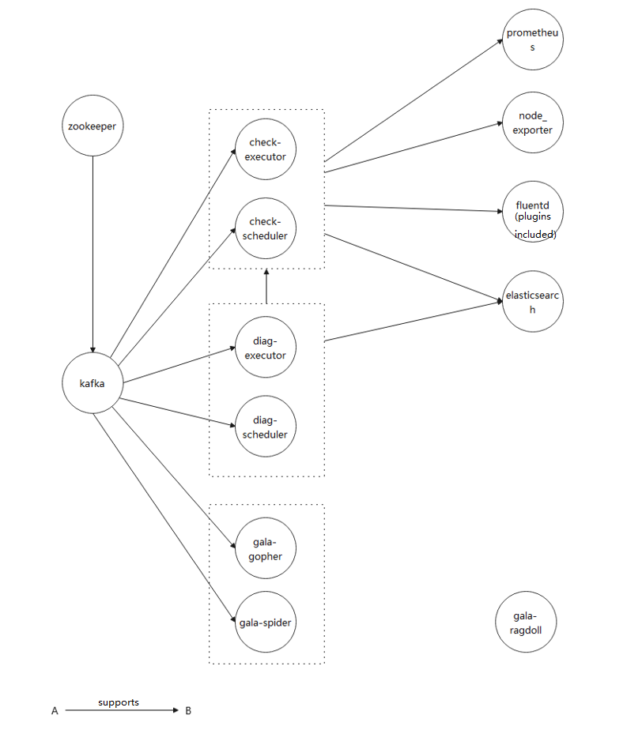

# 1 Framework Overview

The deployment management is mainly about installing components using Ansible.

```yaml
│  
├─ansible_handler
│  │  README.md
│  │  
│  ├─example # Template example.
│  │  │  example_playbooks.yml # Playbook example.
│  │  │  example_vars.yml # Variable file example.
│  │  │  
│  │  └─example # Role task example.
│  │      ├─files # The directory of files required by the component. The files can be software packages or other files required for running the component.
│  │      │      readme.md
│  │      │      
│  │      ├─tasks # Task examples.
│  │      │      config_example.yml # Configuration example.
│  │      │      install_example.yml # Installation example.
│  │      │      main.yml # Task entry example.
│  │      │      start_example.yml # Startup example.
│  │      │      
│  │      └─templates # Template file.
│  │              example.j2 # Template configuration example.
│  │              
│  ├─inventory # The list of the hosts of the component.
│  │      elasticsearch
│  │      fluentd
│  │      ...
│  │      
│  ├─playbooks # The playbook entry files of the component.
│  │      elasticsearch.yml
│  │      fluentd.yml
│  │      ...
│  │      
│  ├─roles # Role tasks of the component.
│  │  ├─elasticsearch
│  │  │  ├─tasks # Task steps in the playbook of the component.
│  │  │  │      config_elasticsearch.yml # Defines the steps of configuration.
│  │  │  │      install_elasticsearch.yml # Defines the steps of installation.
│  │  │  │      main.yml # Main script file executed by the task. The file includes the yml files for installing, configuring, and starting the role, and custom yml files.
│  │  │  │      start_elasticsearch.yml # Defines the steps of startup.
│  │  │  │      
│  │  │  └─templates # Template file required during the component installation. The actual file is generated based on the configured value.
│  │  │          elasticsearch.j2
│  │  │          
│  │  └─...
│  │              
│  └─vars # Variable files of the component.
│          elasticsearch_vars.yml
│          fluentd_vars.yml
│          ...
│          
├─ansible_runner # Python APIs to invoke Ansible to execute the tasks.
│      ansible_runner.py
│      inventory_builder.py
│      vault_handler.py
│      __init__.py
│      
└─tasks # Task file consisting of a sequence of component installation steps.
        XXX_task.yml
```


# 2 Steps for Adding Components

## 2.1 Custom Component Template

### 2.1.1 Modify the Example Files to Create Custom Templates

- #### Playbook file of the component

  ```yaml
  ---
  - hosts: example_hosts # The host names configured for the components to be installed. (It is recommended that you use the names generated in a unified manner.)
    gather_facts: no
    user: root
    vars_files: # Add the vars file path to reference the variable file.
      - "../vars/example_vars.yml"
    vars: # Variables used to define the steps of installation. You can enable or disable the variables as required.
      install_example: true # Install the example.
      config_example: true # Configure the example.
      start_example: true # Start the example service.
      create_user: true # Create the user and the group.
    roles: # Role scripts to be completed in the playbook. You can customize the scripts. The scripts must be in the correct order.
      - ../roles/user # (1) Playbook for creating the user.
      - ../roles/example # (2) Playbook for installing the example.
  
  ```

- #### vars variable file of the component

  ```yaml
  ---
  # Choose the variables to be used based on the component installation requirements. During the installation, the keys in the YAML files are replaced with the actual values.
  
  # Software version of example.
  example_version: 1.1.1
  
  # Names of the user and user group required by example.
  user: "example"
  group: "example"
  
  # Log directory.
  log_path: "log"
  
  # Installation directory.
  install_dir: "/opt/example"
  
  # List of the hosts to be used.
  example_hosts: example_hosts
  
  ```

- #### Task definition of the component role

  - ##### `files` directory

    - The directory of files required by the component. The files can be software packages or other files required for running the component.
    - Files in the `files` directory can be directly referenced in the playbook to be used in subsequent operations, such as copy, decompression, and modification.
    - When modifying variables, you are advised to use the template files in `templates` instead of the files in `files`.

  - ##### `templates` directory

    The directory to store the configuration files and service files that need to be dynamically generated based on the hosts or variables. The template is a j2 file generated by jinja.

    ```yaml
    ## The template file is based on a relatively fixed framework. For example, the configuration file can be modified based on the configuration file defined in the software, and the service file can be modified based on a specific framework. The same rule applies to custom templates.
    
    # Fixed item.
    
    http.port: 9200
    path.logs: /var/log/example
    
    
    # Variable item. It directly uses the variable in vars.
    # For example, the configuration items in example_vars is:
    #   example_cluster_name: mycluster
    # The generated configuration item is:
    # cluster.name: mycluster
    
    cluster.name: {{example_cluster_name}}
    
    # Variable item. It uses the configuration variables in the host list.
    # For example, the configuration in the host list is as follows:
    # example_hosts:
    # hosts:
    #  192.168.1.1:
    #    ansible_host: 192.168.1.1
    #    example_id: example_node1
    #  192.168.1.2:
    #    ansible_host: 192.168.1.2
    #    example_id: example_node1
    #  192.168.1.2:
    #    ansible_host: 192.168.1.2
    #    example_id: example_node1
    # The generated configuration items are as follows:
    # In the configuration file on the host 192.168.1.1: node.name: example1
    # In the configuration file on the host 192.168.1.2: node.name: example2
    # In the configuration file on the host 192.168.1.3: node.name: example3
    node.name: {{example_id}} 
    
    # Variable item. It generates configuration items based on the hosts.
    # For example, the configuration in the host list is as follows:
    # example_hosts:
    # hosts:
    #  192.168.1.1:
    #    ansible_host: 192.168.1.1
    #    example_id: example_node1
    #  192.168.1.2:
    #    ansible_host: 192.168.1.2
    #    example_id: example_node1
    #  192.168.1.2:
    #    ansible_host: 192.168.1.2
    #    example_id: example_node1
    # The generated configuration item is as follows:
    # discovery.seed_hosts: ["192.168.1.1", "192.168.1.2", "192.168.1.3"]
      
          
      discovery.seed_hosts: ["{{host_ip}}"]
      
    ```

  - ##### `tasks` directory
    - ###### main.yml

    ```yaml
    ---
    
    ## The standard steps. You can add custom steps for special requirements.
    # step1: Install the component
    - name: Install example
    include: install_example.yml
    when: install_example
    
    # step2: Modify the configuration
    - name: Config example
    include: config_example.yml
    when: config_example
    
    # step3: Start the service
    - name: Start example
    include: start_example.yml
    when: start_example
    ```

    
      - ###### install_example.yml

    ```yaml
    ---
    ##  This file describes how to install the software package and deploy the software package to the target location.
    ##  You are advised to use DNF instead of Yum to install the RPM packages in the new version of Ansible.
    
    ############################### Manually upload the RPM software package ###########################
    # 1. Copy example_rpm to the /tmp directory. example_rpm represents the actual file name defined in the example_vars file.
    - name: Copy rpm file to server
      copy:
        src: "{{ example_rpm }}"
        dest: /tmp/{{example_rpm}}
        mode: 755
    
    # 2. Install the /tmp/{{example_rpm}} software package.
    - name: install packages
      become: true
      become_user: root
      dnf:
        state: latest # Choose to install the latest software package.
        disable_gpg_check: true # You can set GPG check to disabled for local software packages.
        name: /tmp/{{example_rpm}}
    
    ############################### Use DNF to install the software packages ###########################
    # If the software package is released in the current version of openEuler, configure the repo source to download the software package.
    - name: install packages
      become: true
      become_user: root
      dnf:
        state: latest
        name:
          - example
    
    ############################### Manually upload the source code package ###########################
    # Create the installation directory.
    - name: mkdir install_path
      file: path={{install_path}} state=directory mode=0755
    
    # Copy the software package to the target directory.
    - name: copy example
      unarchive: src=example-{{version}}.tar.gz dest={{install_path}} copy=yes
    
    # Modify the permissions.
    - name: chown
      file: path={{install_path}} state=directory mode=0755 owner={{user}} group={{group}} recurse=yes
    ```

      - ###### config_example.yml

    ```yaml
    ---
    # This file defines the operations that need to be configured, such as configuration file modification and service file modification.
    
    # Use jinja to match the configuration file with the template. The variables in the j2 file are automatically replaced with actual values to generate the configuration file.
    - name: Deploy elastic.yml
      template: src=templates/example.j2 dest={{example_config}}/example.yml mode=0755
    
    
    # Modify the configuration with shell commands. You can define the modification commands or shell scripts as required in this section.
    - name: Modify config file
      shell: |
        echo "xxx" >> {{example_config}}/example.conf
        echo "elasticsearch hard memlock unlimited" >> /etc/security/limits.conf
    ```

      - ###### start_example.yml

    ```yaml
    ## This file is used to start the component.
    
    ## 1. Start the service.
    ############################## Use the systemctl command to start the service ###############################
    # Service components can be directly controlled by systemctl. You can set the items, such as state and enable, to start the service.
    - name: Start example
      become_user: "{{user}}"
      service:
        name: example
        state: restarted
    
    ############################## Use the script to start the service ###############################
    # If the component is not running as a service, you can use the script to start the service and specify the configuration file.
    - name: Start example
      shell: "cd {{install_dir}}/bin && ./example-start.sh -daemon ../config/example.conf"
      become: yes
      become_user: root
    
    
    ## 2. Check the startup status.
    ################################ Collect the service status information ##########################
    - name: collect facts about system services
      service_facts:
      register: services_state
    
    - name: Debug
      debug:
        var: services_state
    
    
    ################################## Customized checks ##############################
    # Check the service status.
    - name: verify example service
      command: /usr/sbin/service example status
      changed_when: false
    
    # Check the port listening status.
    - name: verify example is listening on 1111
      wait_for: port=111 timeout=1
    ```

### 2.1.2 Add the Custom Template File to the Framework

You can modify the example files in `example` then

```yaml
│  example_playbooks.yml # Replace example in the file name with the component name and move the file to install_ansible/playbooks.
│  example_vars.yml # Replace example in the file name with the component name and move the file to install_ansible/vars.
│
└─example # Rename the directory to the component name and move the directory to install_ansible/roles.
    ├─files
    │      readme.md
    │
    ├─tasks
    │      config_example.yml
    │      install_example.yml
    │      main.yml
    │      start_example.yml
    │
    └─templates
            example.j2

```

### 2.1.3 Add the Component to the Task List

```yaml
---
step_list: #Step list
 kafka: # Step 1: Install Kafka. You can use the default template.
  enable: false # false indicates that the installation is skipped. true indicates that the installation is performed.
  continue: false # false indicates that the task is aborted if the installation fails. true indicates that the next component is installed if the installation fails.
 example: # Step 2: Install the example custom component. Add the component to a proper position, and set the configuration items.
  enable: false
  continue: false
```

## 2.2 Default Component Template

### 2.2.1 List of Default Components

Currently, the following default components are provided:

| Component| Installation Method| Version| Deployment Location|
| ------------- | -------- | ------ | -------- |
| zookeeper     | DNF      | 3.6.2  | all      |
| kafka         | DNF      | 2.6.0  | all      |
| prometheus    | DNF      | 2.20.0 | master   |
| node_exporter | DNF      | 1.0.1  | all      |
| mysql         | DNF      | 8.0.26 | master   |
| elasticsearch | DNF (official image)| 7.14.0 (updated with the official website)| master   |
| fluentd | DNF      | 1.13.3 | all |
| fluent-plugin-elasticsearch | DNF      | 5.0.5 | all      |
| adoctor-check-executor | DNF | 1.0.1 | master |
| adoctor-check-scheduler | DNF | 1.0.1 | master |
| adoctor-diag-executor | DNF | 1.0.1 | master |
| adoctor-diag-scheduler | DNF | 1.0.1 | master |
| gala-ragdoll | DNF | 1.0.1 | master |
| gala-gopher | DNF | 1.0.1 | all |
| gala-spider | DNF | 1.0.1 | master |

### 2.2.2 Dependencies Among Default Components



- The figure shows the dependencies among the components provided by default. To ensure that the services run properly, you need to install the dependencies in advance.
- Elasticsearch has been installed on the master node during the installation of A-Ops framework. If there is no need to create a cluster, you can simply use the component after modifying the configuration. No additional deployment is required.
- Other components provided in the A-Ops framework are not shown in the figure.

### 2.2.3 Default Task Configuration

#### (1) Zookeeper

Zookeeper is used for cluster management and is the basis for Kafka. Zookeeper must be configured on each node in the cluster.

- Host configuration

In the host list, configure the IP address and node ID of each node in the cluster.

```yaml
zookeeper_hosts:
  hosts:
    192.168.1.1: # Host name
      ansible_host: 192.168.1.1 # Host IP address
      ansible_python_interpreter: /usr/bin/python3
      myid: 2 # ZooKeeper node ID
    192.168.1.2:
      ansible_host: 192.168.1.2
      ansible_python_interpreter: /usr/bin/python3
      myid: 1
    192.168.1.3:
      ansible_host: 192.168.1.3
      ansible_python_interpreter: /usr/bin/python3
      myid: 3

```

- Variable configuration

The variables of Zookeeper are as follows:

```yaml
---
# Zookeeper user name and user group
user: "zookeeper"
group: "zookeeper"

# Zookeeper data path
data_dir: "data"
# Zookeeper log path
zookeeper_log_path: "log"
# Zookeeper installation path
install_dir: "/opt/zookeeper"

# Zookeeper port configuration
leader_port: 2888
vote_port: 3888
client_port: 2181
```

#### (2) Kafka

- Host configuration

  Kafka must be installed after ZooKeeper. The port and ID of Kafka need to be configured in the host list. You also need to configure the IP address and ID of ZooKeeper in the host list.

```yaml
kafka_hosts:
  hosts:
    192.168.1.1: # Host name
      ansible_host: 192.168.1.1 # Host IP address
      ansible_python_interpreter: /usr/bin/python3
      kafka_id: 2 # Kafka id 
      kafka_port: 9092 # Kafka listening port
    192.168.1.2:
      ansible_host: 192.168.1.2
      ansible_python_interpreter: /usr/bin/python3
      kafka_id: 1
      kafka_port: 9092
    192.168.1.3:
      ansible_host: 192.168.1.3
      ansible_python_interpreter: /usr/bin/python3
      kafka_id: 3
      kafka_port: 9092
zookeeper_hosts: # IP address of the ZooKeeper cluster
  hosts:
    192.168.1.1: # Host name
      ansible_host: 192.168.1.1 # Host IP address
      ansible_python_interpreter: /usr/bin/python3
      myid: 2 # ZooKeeper id
    192.168.1.2:
      ansible_host: 192.168.1.2
      ansible_python_interpreter: /usr/bin/python3
      myid: 1
    192.168.1.3:
      ansible_host: 192.168.1.3
      ansible_python_interpreter: /usr/bin/python3
      myid: 3
```

- Variable configuration

```yaml
---
# Zookeeper user name and user group
user: "kafka"
group: "kafka"

# Log path
kafka_log_path: "log"

# Installation path
install_dir: "/opt/kafka"

# Zookeeper client port
zk_client_port: 2181

```


#### (3) Prometheus

- Host configuration

  Prometheus collects KPI data items. It needs to be installed only on the server node. In addition, Prometheus captures data from node_exporter. You need to configure a node IP address that can reach the node_exporter.

```yaml
node_exporter_hosts:
  hosts:
    192.168.1.1:
      ansible_host: 192.168.1.1
      ansible_python_interpreter: /usr/bin/python3
    192.168.1.2:
      ansible_host: 192.168.1.2
      ansible_python_interpreter: /usr/bin/python3
    192.168.1.3:
      ansible_host: 192.168.1.3
      ansible_python_interpreter: /usr/bin/python3
prometheus_hosts:
  hosts:
    192.168.1.2:
      ansible_host: 192.168.1.2
      ansible_python_interpreter: /usr/bin/python3
```

- Variable configuration

```yaml
---
# Prometheus user name and user group
user: "prometheus"
group: "prometheus"

# Prometheus listening port
prometheus_listen_port: 9090

# node_exporter listening port
node_exporter_listen_port: 9100

# Prometheus configuration file path
prometheus_conf_dir: "/etc/prometheus"
```


#### (4) node_exporter

- Host configuration

**node_exporter** needs to be installed on all the nodes whose data needs to be collected. The focus of the configuration are the IP addresses.

```yaml
node_exporter_hosts:
  hosts:
    192.168.1.1:
      ansible_host: 192.168.1.1
      ansible_python_interpreter: /usr/bin/python3
    192.168.1.2:
      ansible_host: 192.168.1.2
      ansible_python_interpreter: /usr/bin/python3
    192.168.1.3:
      ansible_host: 192.168.1.3
      ansible_python_interpreter: /usr/bin/python3
```

- Variable configuration

```yaml
---
# node_exporter user name and user group
user: "node_exporter"
group: "node_exporter"

# Listening port
node_exporter_listen_port: 9100

```

#### (5) MySQL

- Host configuration

The MySQL database needs to be installed only on the server node.

```
mysql_hosts:
  hosts:
    192.168.1.2:
      ansible_host: 192.168.1.2
      ansible_python_interpreter: /usr/bin/python3

```

- Variable configuration

```yaml
---
# MySQL user name and user group
user: "mysql"
group: "mysql"

```

#### (6) Elasticsearch

- Host configuration

The Elasticsearch database needs to be installed only on the server node. You need to configure the server node and specify the node ID. If a distributed cluster configuration is required, you need to modify the host list and configuration file `elasticsearch.j2`.

```yaml
elasticsearch_hosts:
  hosts:
    192.168.1.2:
      ansible_host: 192.168.1.2
      ansible_python_interpreter: /usr/bin/python3
      elasticsearch_id: elasticsearch_node1
```

- Variable configuration

```yaml
---
# Elasticsearch user and user group
user: elasticsearch
group: elasticsearch

# Elasticsearch official repo configuration
repo_name: "Elasticsearch"
repo_description: "Elasticsearch repository for 7.x packages"
repo_base_url: "https://artifacts.elastic.co/packages/7.x/yum"
repo_gpgkey: "https://artifacts.elastic.co/GPG-KEY-elasticsearch"
repo_file: "elasticsearch"

# Elasticsearch installation directory
install_dir: /etc/elasticsearch/

# Elasticsearch cluster name
elasticsearch_cluster_name: myApp

# IP address of the Elasticsearch initial master node
elasticsearch_cluster_init_master: 192.168.1.2

# Elasticsearch listening port
elasticsearch_listen_port: 9200

# Elasticsearch data directory
elasticsearch_data_path: "/var/lib/elasticsearch"

# Elasticsearch log directory
elasticsearch_log_path: "/var/log/elasticsearch"

# IP address of the Elasticsearch network host
elasticsearch_network_host: "{{elasticsearch_cluster_init_master}}"

```

#### (7) Fluentd

- Host configuration

Fluentd collects logs. It is deployed on all nodes whose logs need to be collected and sends the logs to Elasticsearch.

```yaml
fluentd_hosts:
  hosts:
    192.168.1.1: # Host name
      ansible_python_interpreter: /usr/bin/python3
      elasticsearch_host: 192.168.1.1 # Elasticsearch listening IP
    192.168.1.2:
      ansible_python_interpreter: /usr/bin/python3
      elasticsearch_host: 192.168.1.1 # Elasticsearch listening IP
    192.168.1.3:
      ansible_python_interpreter: /usr/bin/python3
      elasticsearch_host: 192.168.1.1 # Elasticsearch listening IP
```

- Variable configuration

```yaml
---
# Fluentd configuration file path
fluentd_config_dir: /etc/fluentd/
# Script for modifying history records
change_history_format: true
change_history_format_scripts:
  - zzz_openEuler_history.csh
  - zzz_openEuler_history.sh
# Script for modifying demsg records
change_dmesg_format: true
change_dmesg_format_scripts: fluentd_dmesg.sh
# demsg port
fluentd_demsg_port: 61122

```


#### (8) adoctor-check-executor and adoctor-check-scheduler

- Host configuration

**adoctor-check-executor** and **adoctor-check-scheduler** depend on the A-Ops framework and are deployed on the master node by default. The **executor** and **scheduler** communicate with each other through Kafka.

Configure the host list of adoctor-check-executor:

```yaml
adoctor_check_executor_hosts:
  hosts:
    192.168.1.1: # Host name
      ansible_host: 192.168.1.1 # Host IP address
      ansible_python_interpreter: /usr/bin/python3
```

Configure the host list of adoctor-check-scheduler:

```yaml
adoctor_check_scheduler_hosts:
  hosts:
    192.168.1.1: # Host name
      ansible_host: 192.168.1.1  # Host IP address
      ansible_python_interpreter: /usr/bin/python3
```

- Variable configuration

Configure the variables of adoctor-check-executor:

```yaml
# Configuration file directory of check executor
check_executor_conf_dir: "/etc/aops"
# HOST:PORT of the list of Kafka hosts connected to the check executor. The default IP address is the IP address of the current host. The default port number is 9092.
kafka_server_list: 192.168.1.1:9092
```

Configure the variables of adoctor-check-scheduler:

```yaml
# Configuration file directory of check scheduler
check_scheduler_conf_dir: "/etc/aops"
# HOST:PORT of the list of Kafka hosts connected to the check scheduler. The default IP address is the IP address of the current host. The default port number is 9092.
kafka_server_list: 90.90.64.64:9092
# Listening port of the check scheduler service. The default value is 11112.
check_scheduler_port: 11112
```

#### (9) adoctor-diag-scheduler and adoctor-diag-executor

- Host configuration

**adoctor-diag-executor** and **adoctor-diag-scheduler** depend on the A-Ops framework and are deployed on the master node by default. The **executor** and **scheduler** communicate with each other through Kafka.

Configure the host list of adoctor-diag-executor:

```yaml
adoctor_diag_executor_hosts:
  hosts:
    192.168.1.1: # Host name
      ansible_host: 192.168.1.1 # Host IP address
      ansible_python_interpreter: /usr/bin/python3
```

Configure the host list of adoctor-diag-scheduler:

```yaml
adoctor_diag_scheduler_hosts:
  hosts:
    192.168.1.1: # Host name
      ansible_host: 192.168.1.1 # Host IP address
      ansible_python_interpreter: /usr/bin/python3
```

- Variable configuration

Configure the variables of adoctor-diag-executor:

```yaml
# Configuration file directory of diag executor
diag_executor_conf_dir: "/etc/aops"
# HOST:PORT of the list of Kafka hosts connected to the diag executor. The default IP address is the IP address of the current host. The default port number is 9092.
kafka_server_list: 192.168.1.1:9092
```

Configure the variables of adoctor-diag-scheduler:

```yaml
# Configuration file directory of diag scheduler
diag_scheduler_conf_dir: "/etc/aops"
# HOST:PORT of the list of Kafka hosts connected to the diag scheduler. The default IP address is the IP address of the current host. The default port number is 9092.
kafka_server_list: 192.168.1.1:9092
# Listening port of the diag scheduler service. The default value is 11112.
diag_scheduler_port: 11113
```

#### (10) gala-ragdoll

- Host configuration

**gala-ragdoll** is the main component of the configuration source tracing module, and is deployed on the master node.

```yaml
gala_ragdoll_hosts:
  hosts:
    192.168.1.1: # Host name
      ansible_host: 192.168.1.1 # Host IP address
      ansible_python_interpreter: /usr/bin/python3
```

- Variable configuration

```yaml
---
# Listening port of the gala-ragdoll service
gala_ragdoll_port: 11114
```

#### (11) gala-gopher and gala-spider

- Host Configuration

**gala-gopher** and **gala-spider** are the main components of the architecture awareness module. **gala-gopher** is deployed on each remote host to collect information and pushes messages to **gala-spider** on the master node through Kafka.**gala-spider** is deployed on the master node and analyzes the collected data.

Configure the host list of gala-gopher:

```yaml
gala_gopher_hosts:
  hosts:
    192.168.1.1: # Host name
      ansible_host: 192.168.1.1 # Host IP address
      ansible_python_interpreter: /usr/bin/python3
    192.168.1.2:
      ansible_host: 192.168.1.2
      ansible_python_interpreter: /usr/bin/python3
    192.168.1.3:
      ansible_host: 192.168.1.3
      ansible_python_interpreter: /usr/bin/python3

```

Configure the host list of gala-spider:

```yaml
gala_spider_hosts:
  hosts:
   192.168.1.1: # Host name
      ansible_host: 192.168.1.1 # Host IP address
      ansible_python_interpreter: /usr/bin/python3
```

- Variable configuration

Configure the variables of **gala-gopher**:

```yaml
---
# gala gopher installation directory
install_dir: "/opt/gala-gopher/"
# The Kafka host connected to gala-gopher. Set this parameter to the host IP address of the management node.
gala_gopher_kafka_host: 192.168.1.1
# The listening Kafka port of gala-gopher
gala_gopher_listening_kafka_port: 9092
# Configuration of the gala-gopher probe
probes_example_switch: "off"
probes_system_meminfo: "off"
probes_system_vmstat: "off"
probes_system_tcp: "off"
probes_system_inode: "off"
extend_probes_redis: "off"

```

Configure the variables of **gala-spider**:

```yaml
---
# Log directory
log_path: "/var/log/spider"
# Installation directory
install_dir: "/opt/spider/"
# The Kafka host. The default value is the host IP address.
gala_spider_kafka_host: 192.168.1.1
# Listening port
gala_spider_listening_kafka_port: 9092

# Excluded IP addresses
exclude_addr: ["192.168.x.x"]
# The base table name. Do not delete the items initially contained in the list. Append items in order as required.
base_table_name: ["tcp_link", "lvs_link"]
other_table_name: ["nginx_statistic" , "lvs_link" , "haproxy_link" , "dnsmasq_link"]
# gala-spider listening port
gala_spider_port: 11115
```


# 3. Task Execution Configuration

## 3.1 Task Component Step Configuration

A task consists of multiple steps. Basically, one component is installed in each step. A task is completed by finishing a sequence of steps.

To modify a task, you need to modify `tasks/TASK_NAME.yml`.

```yaml
---
step_list: # Step list
 step_component: # The first step is to install Kafka. You can use the default template.
  enable: false # false indicates that the installation is skipped. true indicates that the installation is performed.
  continue: false # false indicates that the task is aborted if the installation fails. true indicates that the next component is installed if the installation fails.
```

## 3.2 Component Deployment Option Configuration

The configurations of some key options are defined in the playbook of the component.

```yaml
---
- hosts: example_hosts # The host names configured for the components to be installed. (It is recommended that you use the names generated in a unified manner.)
  gather_facts: no
  user: root
  vars_files: # Add the vars file path to reference the variable file.
    - "../vars/example_vars.yml"
  vars: # Variables used to define the steps of installation. You can enable or disable the variables as required.
    install_example: true # Install the example.
    config_example: true # Configure the example.
    start_example: true # Start the example service.
    create_user: true # Create the user and the group.
  roles: # Role scripts to be completed in the playbook. You can customize the scripts. The scripts must be in the correct order.
    - ../roles/user # (1) Playbook for creating the user
    - ../roles/example # (2) Playbook for installing the example
```
