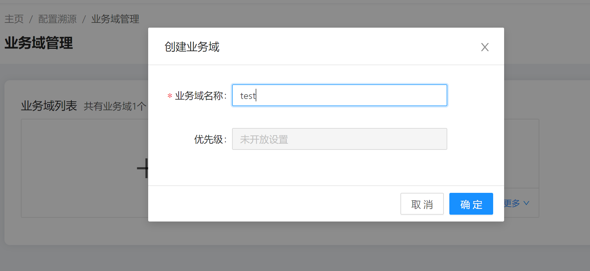

gala-ragdoll Usage Guide
============================

This section uses `/etc/yum.repos.d/openEuler.repo`, the configuration file of the supported Yum source as an example to describe how to manage the configuration file.

### Configuration File Description

```/etc/yum.repos.d/openEuler.repo``` is the configuration file used to specify the Yum source address. The content of the configuration file is as follows:

```
[OS]
name=OS
baseurl=http://repo.openeuler.org/openEuler-20.09/OS/$basearch/
enabled=1
gpgcheck=1
gpgkey=http://repo.openeuler.org/openEuler-20.09/OS/$basearch/RPM-GPG-KEY-openEuler
```

### YANG Model Description

`/etc/yum.repos.d/openEuler.repo` is expressed using the YANG language. For details, see `gala-ragdoll/yang_modules/openEuler-logos-openEuler.repo.yang`.
The following extended fields are added:

| Extended Field Name | Extended Field Format| Example|
| ------------ | ---------------------- | ----------------------------------------- |
| path         | OS_TYPE:CONFIGURATION_FILE_PATH | openEuler:/etc/yum.repos.d/openEuler.repo |
| type         | Configuration file type | ini, key-value, json, text, and more |
| spacer       | Spacer between a configuration item and its value | " ", "=", ":", and more |

Attachment: Learning the YANG language: https://datatracker.ietf.org/doc/html/rfc7950/.

### Creating Domains using Configuration Source Tracing

#### Viewing the configuration file.

gala-ragdoll contains the configuration file of the configuration source tracing.

```
[root@openeuler-development-1-1drnd ~]# cat /etc/ragdoll/gala-ragdoll.conf
[git] // Defines the current Git information, including the directory and user information of the Git repository.
git_dir = "/home/confTraceTestConf" 
user_name = "user"
user_email = "email"

[collect] // The collect interface provided by A-Ops.
collect_address = "http://192.168.0.0:11111"
collect_api = "/manage/config/collect"

[ragdoll]
port = 11114

```

#### Creating the Configuration Domain





#### Adding Managed Nodes to the Configuration Domain


#### Adding Configurations to the Configuration Domain 


#### Querying the Expected Configuration


#### Deleting Configurations


#### Querying the Actual Configuration


#### Verifying the Configuration


#### Configuration Synchronization

Not provided currently.
