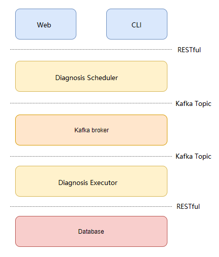
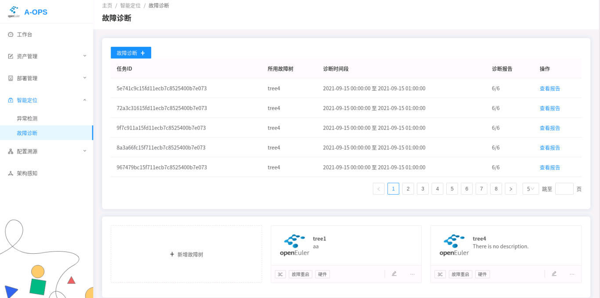
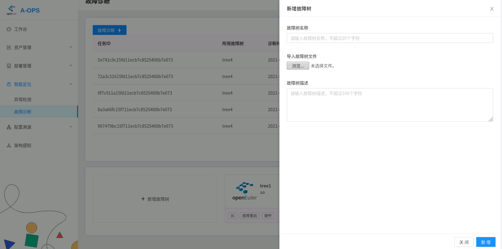
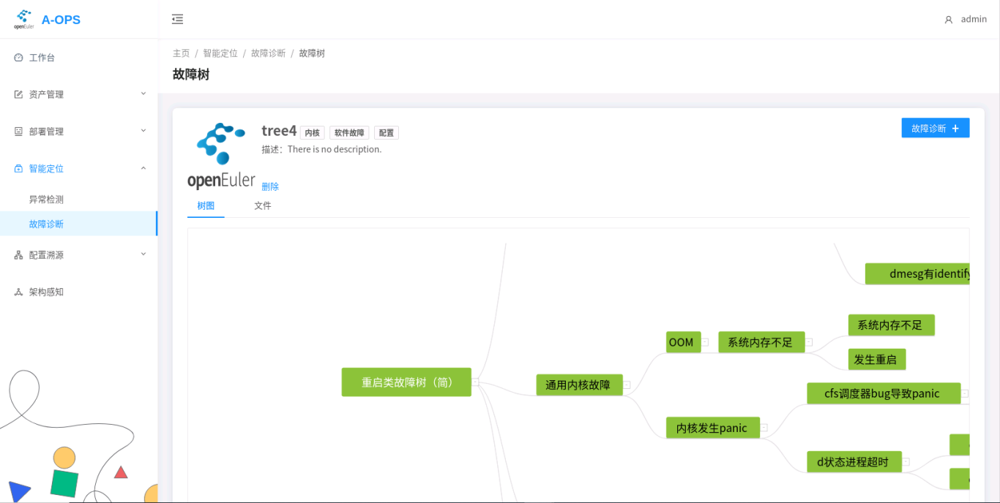
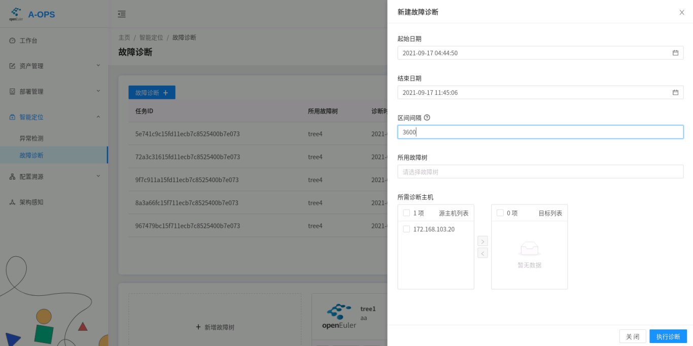
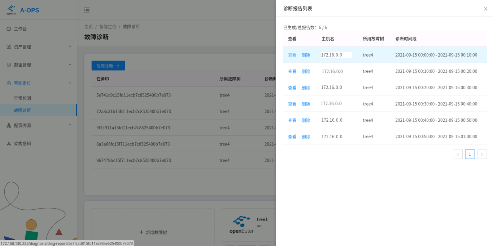
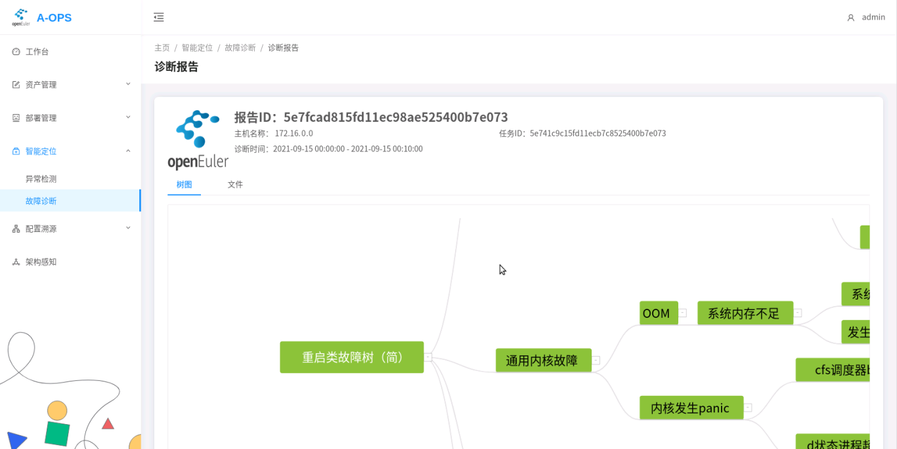
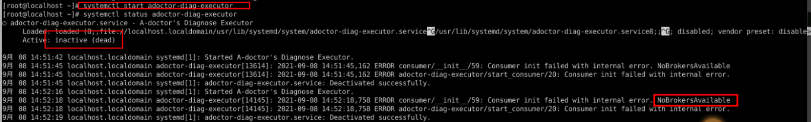

# Fault Diagnosis Module

<!-- TOC -->

- [Fault Diagnosis Module](#fault-diagnosis-module)
  - [Description](#description)
  - [Architecture](#architecture)
  - [Parameters](#parameters)
  - [Starting and Stopping the Service](#starting-and-stopping-the-service)
  - [Fault Diagnosis Operations](#fault-diagnosis-operations)
  - [Log viewing](#log-viewing)
  - [FAQ](#faq)

<!-- /TOC -->

## Description

The fault diagnosis module considers the combination of anomaly detection results, and analyzes and displays possible faults in a tree diagram.

This module consists of two sub-modules:

1. The diagnosis scheduler module: Responds to the RESTful requests sent by upper-layer users, generates diagnosis messages, and sends the messages to the message queue for the diagnosis executor to perform diagnosis.
2. The diagnosis executor module: Consumes messages from the message queue, performs diagnosis, and saves the diagnosis results to the database.

## Architecture

The system is developed using Flask-RESTful. The following figure shows the architecture.



## Parameters

1. Set the parameters in the configuration files. The default configuration files of the module are `/etc/aops/diag_scheduler.ini` and `/etc/aops/diag_executor.ini`. Modify the configuration files as needed.

```
vim /etc/aops/diag_scheduler.ini
```

```ini
[producer]
# IP address of the Kafka server. Use the actual IP address of the host.
kafka_server_list=10.0.0.0:9092
# Specify the Kafka API version.
api_version=0.11.5
# acks: The value 0 indicates that the producer ignores whether the message is successfully sent. The value 1 indicates that the producer waits for the leader to successfully write the logs. The value all indicates that the producer waits for all replications to write the logs.
acks=1
# Number of attempts to resend a message after the message fails to be sent.
retries=3
# Retry interval, in milliseconds.
retry_backoff_ms=100

[topic]
# Topic of the diagnosis.
name=DIAGNOSE_EXECUTE_REQ

[diag_scheduler]
# IP address used to start the Flask service.
ip=127.0.0.1
# Port number used to start the Flask service.
port=60116

[uwsgi]
# Script for starting the service.
wsgi-file=manage.py
# Operation log path.
daemonize=/var/log/aops/uwsgi/diag_scheduler.log
# Network connection timeout interval.
http-timeout=600
# Service running timeout interval.
harakiri=600
```

```
vim /etc/aops/diag_executor.ini
```

```ini
[consumer]
# IP address of the Kafka server. Use the actual IP address of the host.
kafka_server_list=10.0.0.0:9092
# Consumer group. The consumer of a message is unique within a consumer group.
group_id=DiagGroup
# Whether to automatically submit the offset.
enable_auto_commit=False
# How the offset is reset. The value earliest indicates that the offset is reset to the earliest available message. The value latest indicates that the offset is reset to the latest message.
auto_offset_reset=earliest
# The time in milliseconds that the consumer spends waiting before it polls messages from the buffer.
timeout_ms=5
# Number of messages polled at a time.
max_records=3

[topic]
# Diagnosis topic to be consumed.
name=DIAGNOSE_EXECUTE_REQ
```

## Starting and Stopping the Service
e systemctl to start the deployed diagnosis scheduler and diagnosis executor.

```shell
systemctl start adoctor-diag-scheduler # Start the diagnosis scheduler service.

systemctl stop adoctor-diag-scheduler # Stop the diagnosis scheduler service.

systemctl restart adoctor-diag-scheduler # Restart the diagnosis scheduler service.
```

```sh
systemctl start adoctor-diag-executor # Start the diagnosis executor service.

systemctl stop adoctor-diag-executor # Stop the diagnosis executor service.

systemctl restart adoctor-diag-executor # Restart the diagnosis executor service.
```

## Fault Diagnosis Operations

You can perform the following operations with the diagnosis module: fault tree operations, diagnosis operations, and diagnosis task operations. Most operations can be performed using the web interface or CLI commands. You can select the operation method based on the scenario.

> The following figure shows the fault diagnosis page.

   

1. ### Fault Tree Operations

- Importing a Fault Tree.

  * Web:

   Click **Add Fault Tree**. On the displayed page, specify the name, local file, and description of the diagnosis tree to add the diagnosis tree to the database:

   

   <div align=left> 


  * CLI:

    `adoctor faultree --action add --tree_list tree1 --conf [conf.json] [--access_token] [token]`

    * **`Mandatory parameters`**

      * **`--conf`**

        Specifies the fault tree file in JSON format. This parameter is mandatory when the action option is set to add.
      * **`--tree_list`**

        Specifies the name of the diagnosis tree to be inserted. (Note that you can only add one diagnosis tree at a time.)

      * **`--access_token`**

        Access Token.
    
    * **`Example`**
    
      * Import the fault tree tree1.
    
      `adoctor faultree --action add --tree_list tree1 --conf tree1.json --access_token token`

- Viewing, Exporting, and Deleting Fault Trees.

  * Web:

   On the right of the **Add Fault Tree** area, click the operation button in the lower right corner of a fault tree to delete the tree. Currently, exporting a fault tree is not supported on the web interface.

  Click a fault tree to view its details. You can also delete a fault tree on this page.

   <div align=left> 
  
  
  
    - CLI:
  
      `adoctor faultree [--action] [action] [--tree_list] [list] [--export] [path] [--access_token] [token]`
  
      * **`Mandatory parameters`**
  
        * **`--action`**
  
          **delete** indicates that the fault tree is deleted. **get** indicates that the fault tree is obtained.
  
        * **`--access_token`**
  
          Access Token.
  
      * **`Optional parameters`**
  
        * **`--tree_list`**
  
          Specifies the fault tree to be deleted or obtained. Multiple fault trees are separated by commas (,). If the action is **get** and this parameter is left blank , all fault trees are obtained. If the action is **delete** and this parameter is left blank, no operation is performed.
  
        * **`--export`**
  
          Specifies the path to which the fault tree is exported. This parameter is used when action is set to **get**.
  
      * **`Example`**
  
        * Obtain the fault tree tree1 and export it to `tree1.json`:
  
          `adoctor faultree --action get --tree_list tree1 --export tree1.json --access_token token`
  
        * Delete fault tree tree1:
  
          `adoctor faultree --action delete --tree_list tree1 --access_token token`

2. ### Diagnosis Operations

   > Note: Before performing fault diagnosis, ensure that the two services of the diagnosis module are started properly and are properly connected to the Kafka cluster.

- Performing Diagnosis.
  
   To perform the diagnosis, you need to set the following four parameters:
   
   1. ID of the host to be diagnosed.
   2. Diagnosis tree used for diagnosis.
   3. Time range of the diagnosis.
   4. Diagnosis interval, in seconds.
   
   The diagnosis interval is used to slice a large time range to perform diagnosis for multiple times on each slices.
   
   * Web:
   
   
   * CLI:
   
     `adoctor diag [--tree_list] [list] [--host_list] [list] [--start] [time1] [--end] [time2] [--interval] [int] [--access_token] [token]`
   
     * **`Mandatory parameters`**
   
       * **`--access_token`**
   
         Access Token.
   
       * **`--tree_list`**
   
         Specifies the fault tree. Multiple fault trees are separated by commas (,). The value cannot be empty.
   
       * **`--host_list`**
   
         Specifies the IDs of the hosts to be diagnosed. The IDs are separated by commas (,) and cannot be empty.
   
       * **`--start`**
   
         Specifies the start time of the fault diagnosis.
   
       * **`--end`**
         Specifies the end time of the fault diagnosis.
   
       * **`--interval`**
         Specifies the time interval of the fault diagnosis.
   
     * **`Example`**
   
       * Perform fault diagnosis on host1 based on tree1.
   
         `adoctor diag --tree_list tree1 --host_list host1 --start 20210908-11:11:11 --end 20210908-12:11:11 --interval 1800 --access_token token`

3. ### Diagnosis Task Operations
- Viewing the Diagnosis Task List.
	* Web:
	On the main page of Fault Diagnosis, you can view the task list and select a task to view it.
	
	* CLI:
	
	  After the diagnosis is performed, the CLI returns the ID of the diagnosis task. Currently, you can not use the CLI to query the task list based on the user ID.


- Viewing and Deleting Diagnosis Reports.
	* Web:
	  You can open the page of a diagnosis task and select a report to view it.

	  The following figure shows the diagnosis list.

	  <div align=left> 
	  
	  
	  The diagnosis report is as follows:
	  
	  <div align=left> 
	  
	* CLI:
	
	  `adoctor report [--action] [action] [--tree_list] [tree1] [--host_list] [list] [--start] [time1] [--end] [time2] [--report_list] [id1,id2] [--task_id] [id]`
	
	  * **`Mandatory parameters`**
	
	    * **`--action`**
	
	      **get** indicates that the report is obtained, and **delete** indicates that the report is deleted.
	
	    * **`--access_token`**
	
	      Access Token.
	
	  * **`Optional parameters`**
	
	    * **`--tree_list`**
	
	      Specifies the fault tree, which is separated by commas (,). If report_id and task_id are not specified, this parameter is used for query.
	
	    * **`--host_list`**
	
	      Specifies the IDs of the hosts to be diagnosed. The IDs are separated by commas (,). If report_id and task_id are not specified, the system queries the hosts based on the IDs.
	
	    * **`--start`**
	
	      Specifies the start time of fault diagnosis.
	
	    * **`--end`**
	      Specifies the end time of fault diagnosis.
	
	    * **`--task_id`**
	
	      You can query the report based on the task ID. If this parameter is specified, the report is queried based only on this parameter.
	
	    * **`--report_list`**
	
	      Report ID list, which is used for querying and deleting detailed reports.
	
	     **Example:**
	
	    * Delete a specified report.
	
	      `aops report --action delete --report_list r1,r2 --access_token token` 
	
	    * Obtaining the Diagnosis Report List of a Specified Host in a Specified Tree
	      `aops report --action get --tree_list tree1,tree2 --host_list id1,id2 --start xxx --end xx --access_token token` 
	
	    * Query the report list based on the task ID.
	
	      `aops report --action get --task_id id1 --access_token token`
	
	    * Query report details based on the report ID.
	
	      `aops report --action get --report_list id1,id2 --access_token token`


## Log viewing

There are two types of diagnosis module logs. The scheduler logs are recorded in /var/log/aops/uwsgi/diag_scheduler.log, and the executor logs are recorded in /var/log/aops.log. The log dump configuration is stored in the /etc/aops/system.ini file, which is the unified log configuration of aops.

## FAQ

1. The diagnosis executor fails to be started, and the message "NoBrokerAvailable." is displayed.

	This error is reported because the executor fails to connect to Kafka. Check whether Kafka is started properly and whether the kafka_server_list parameter in the executor configuration file correctly specifies the Kafka address.



The diagnosis scheduler also encounters the same problem. However, the Kafka producer is not directly created when the diagnosis scheduler is started. The Kafka producer is created only after the diagnosis command is triggered. Therefore, you need to view the command output or service logs after the diagnosis to check whether the connection to Kafka is normal.
