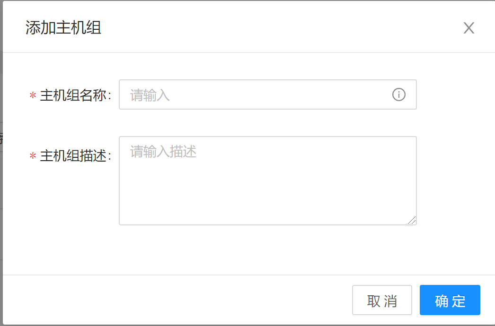
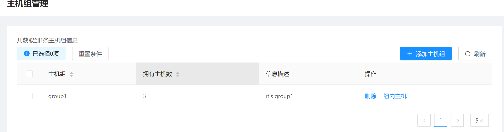
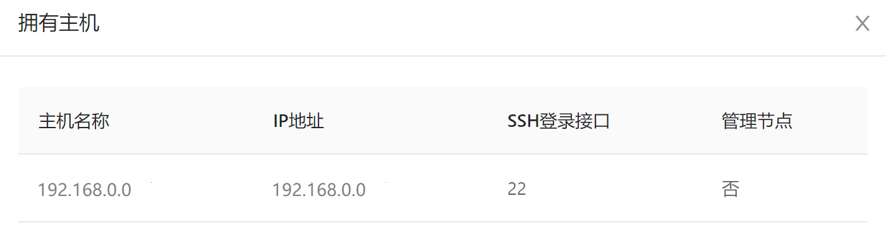
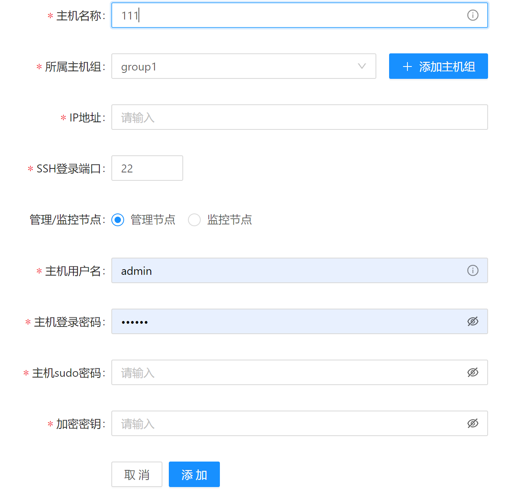
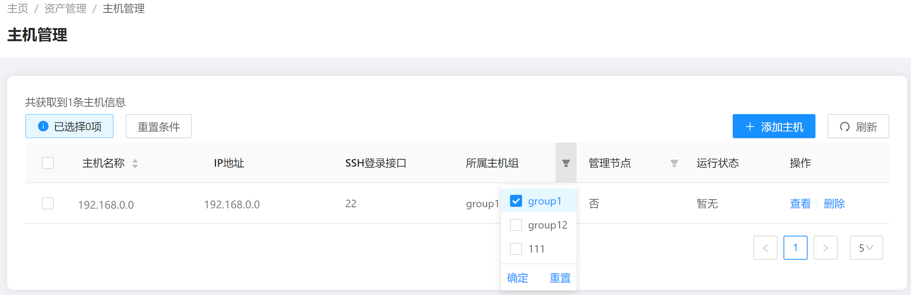
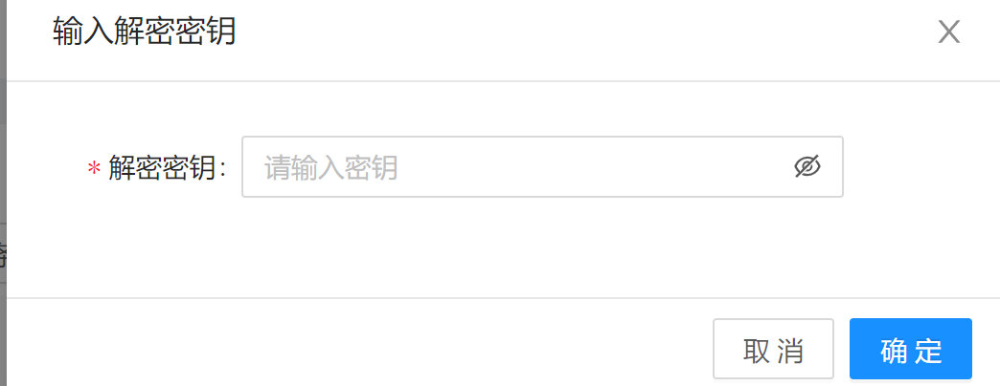
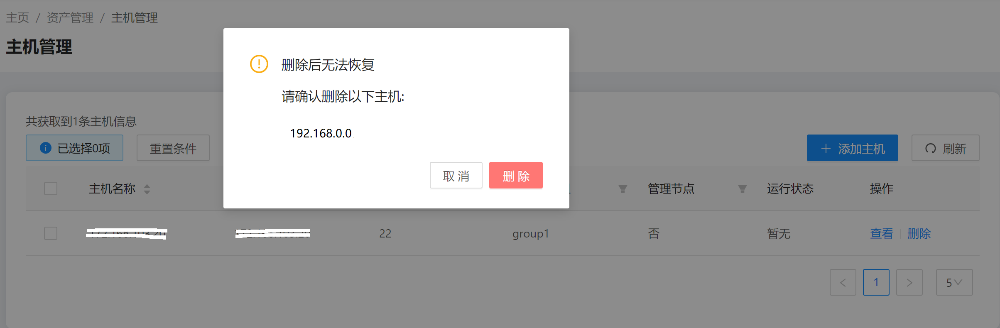
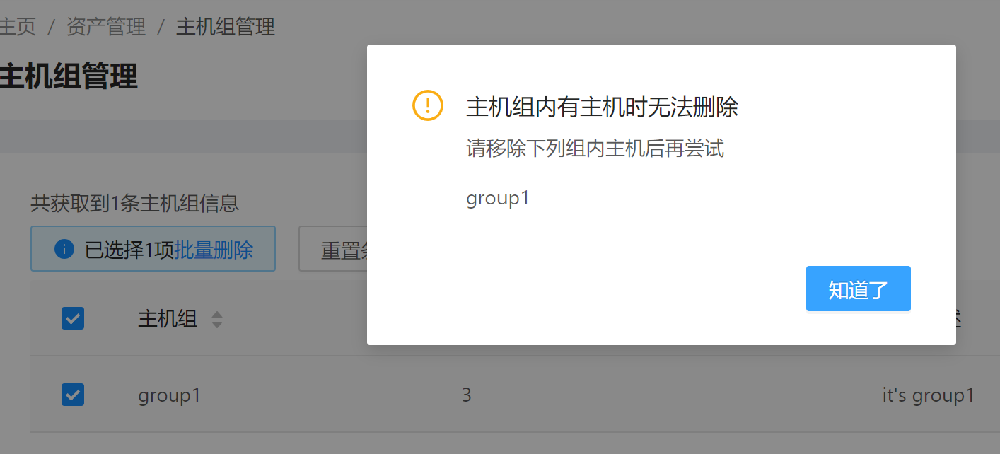

## Host Management

### 1. Adding Host Groups

When adding a host group, you need to enter the host group name and description.

- Web interface example:

	


- Command example:

	```aops group --action add --host_group_name group1 --description "it's group1" --access_token token```
### 2. Viewing Host Groups
After adding a host group, the host group information displays. You can view the number and information of the hosts in each host group.
- Web interface example:

 

 

- Command example:

  ```aops group --action query --access_token token```

### 3. Adding Hosts
To minimize permissions, perform the operations as a non-root user. If the host has only the root user, run the following command to add a user:

```
useradd -m aops
passwd aops
usermod -G wheel aops
```

The following parameters are required for adding a host:

- Host name. If the host name conflicts with an existing host name, the add operation will fail.
- Host group name. Select a host group from the drop-down list.
- Host IP address. It must be an accessible public IP address. Currently, only IPv4 address is supported.
- SSH login port number.
- management: Indicates whether the host is a management node.
- User name: The user name for logging in to the host.
- Password: The password for logging in to the host.
- Administrator Password: The password of the root user on the host.
- Key: Indicates the key used to encrypt the host information, such as the host password. This key is required for some subsequent operations. Due to function restrictions, the keys of all hosts must be the same currently.

After the host is added successfully, it is displayed in the list.

- Web interface example:

	

- Command example:

	```aops host --action add --host_name host1 --host_group_name group1 --public_ip 192.168.0.0 --ssh_port 22 --management False --username test --password 123 --sudo_password aaa123 --key mi --access_token token```

### 4. Viewing Hosts

You can filter the hosts to be viewed based on the host group and whether the host is the management node.

- Web interface example:

  

- Command example:

  ```aops host --action query --host_group_name group1 --access_token token```

### 5. Host Authentication

Operations like host deployment and configuration collection use the host password and other necessary information to log in to the host. The key that is set when adding the host is required for decrypting those information. The key needs to be authenticated only once.

- Web interface example:

	

- Command example:

  ```aops certificate --key mi --access_token token```

### 6. Deleting Hosts

Select one or more hosts and click **Delete**.

- Web interface example:

	

- Command example:

  ```aops host --action delete --host_list 111 --access_token token```

### 7. Deleting Host Groups

Select one or more host groups to delete. Host groups that contain any hosts cannot be deleted.

- Web interface example:

  

- Command example:

  ```aops group --action delete --host_group_list group1 --access_token token```
