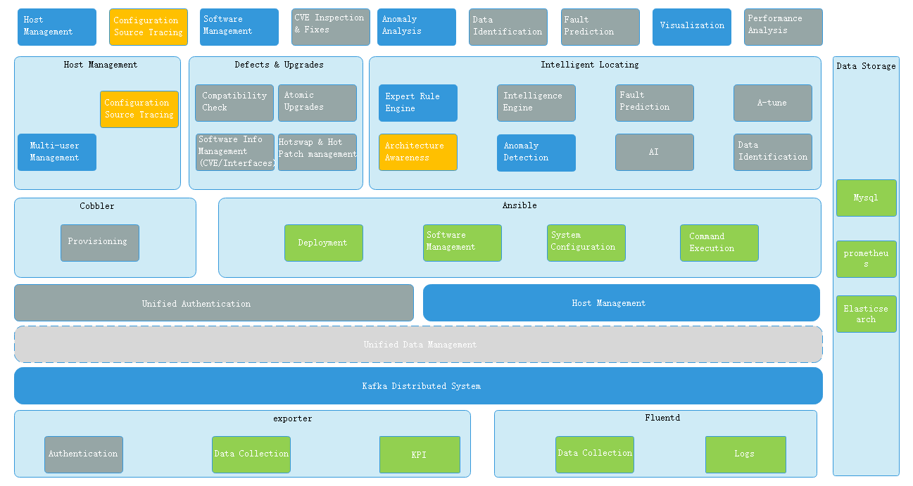
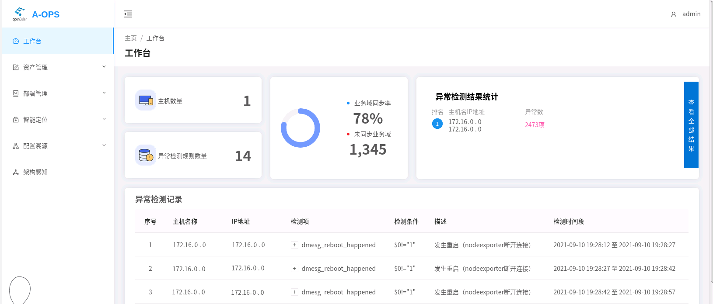
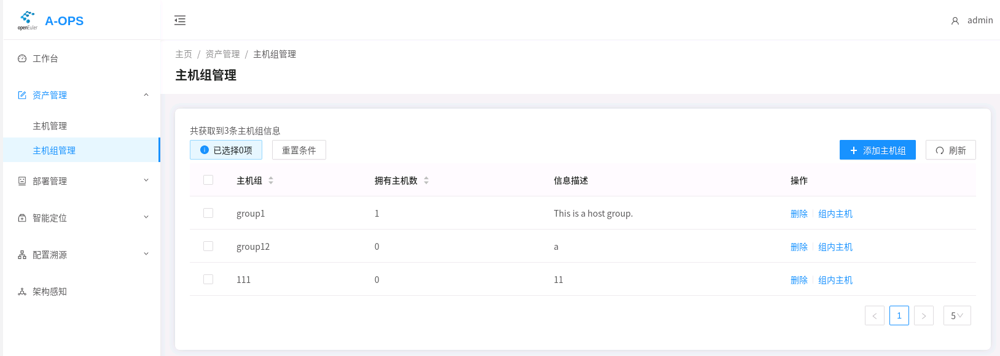
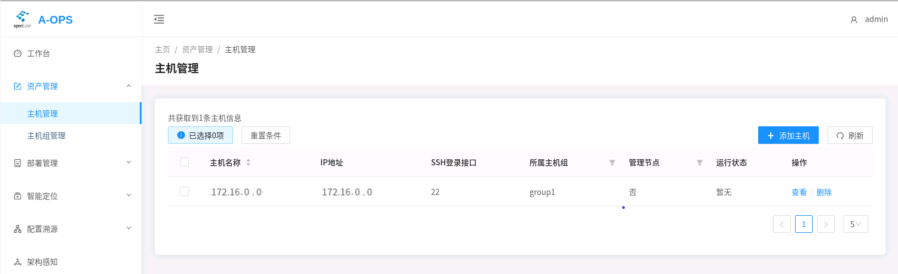
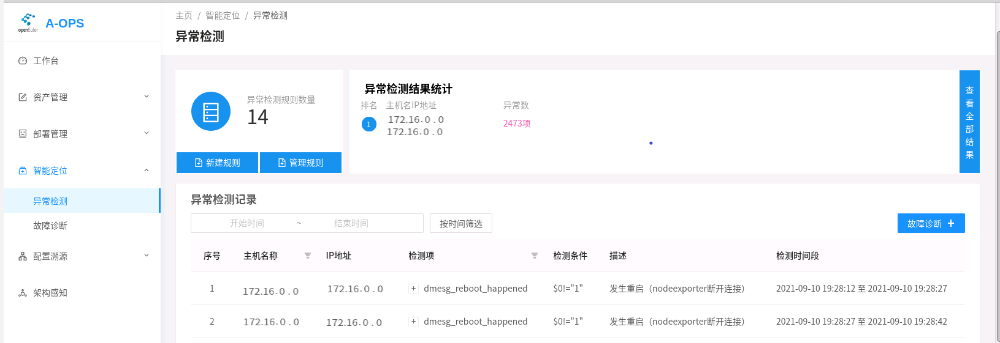
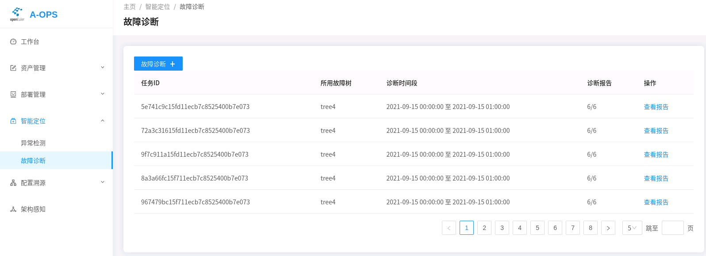
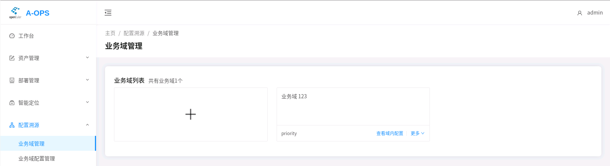
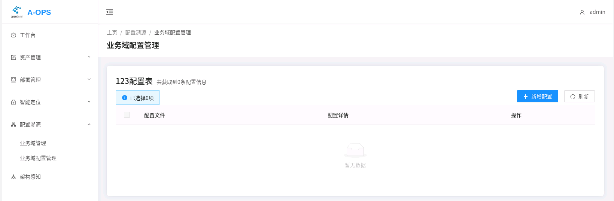
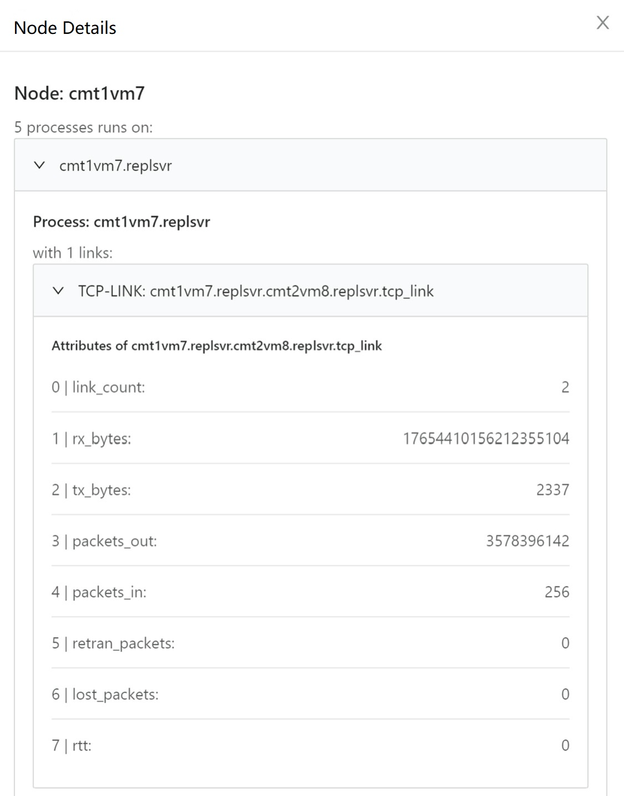

[TOC]

## A-Ops Service Deployment Guide

#### 1.1 Description

A-Ops is an intelligent O&M tool. It implements the basic intelligent O&M framework and provides configuration source tracing, architecture awareness, and the basic capabilities of fault locating. A-Ops supports quick troubleshooting and reduces O&M costs.

#### 1.2 Architecture



#### 1.3 Operating Environment

- Hardware configuration:


  | Configuration Item | Recommended Specification |
  | -------------------- | --------------------------- |
  | CPU                | 8 cores                   |
  | Memory             | 3G                        |
  | Network bandwidth  | 300M                      |
  | I/O                | 375MB/sec                 |
- Software configuration:


  | Software      | Version      |
  | --------------- | -------------- |
  | Python        | 3.8 or later |
  | MySQL         | 8.0.26       |
  | Elasticsearch | 7.14.0-1     |
  | Kafka         | 2.4.0        |
  | Prometheus    | 2.20.0       |

#### 1.4 Download and Installation

##### 1.4.1 Downloading and Installing using Yum

1. Configure the Yum sources: openEuler 21.09 and openEuler 21.09:Epol:

   ```repo
   [openEuler21.09] # openEuler 21.09 official source
   name=openEuler21.09
   baseurl=https://repo.openeuler.org/openEuler-21.09/everything/$basearch/ 
   enabled=1
   gpgcheck=1
   gpgkey=https://repo.openeuler.org/openEuler-21.09/everything/$basearch/RPM-GPG-KEY-openEuler

   [Epol] # openEuler 21.09: Epol official source
   name=Epol
   baseurl=https://repo.openeuler.org/openEuler-21.09/EPOL/$basearch/ 
   enabled=1
   gpgcheck=1
   gpgkey=https://repo.openeuler.org/openEuler-21.09/OS/$basearch/RPM-GPG-KEY-openEuler
   ```
2. Install using `yum install`:

   ```shell
   # On the management node:

   yum install aops-utils # A-Ops infrastructure, which is the dependency of the other A-Ops services.

   yum install aops-manager # A-Ops management center service, including the following 4 components: host management, deployment management, template management, and task management.

   yum install aops-database # A-Ops data center service: data storage and database management.

   yum install aops-cli # A-Ops basic CLI: host management, deployment management, template management, and task management.

   yum install adoctor-cli # A-Ops intelligent locating CLI: anomaly detection and fault locating.

   yum install gala-ragdoll # A-Ops configuration source tracing
   yum install python3-gala-ragdoll

   yum install gala-spider # A-Ops architecture awareness.
   yum install python3-gala-spider

   # On the management node and monitoring node:

   yum install adoctor-check-scheduler # A-Ops anomaly detection.

   yum install adoctor-check-executor # A-Ops anomaly detection.

   yum install adoctor-diag-scheduler # A-Ops fault locating.

   yum install adoctor-diag-executor # A-Ops fault locating.

   yum install gala-gopher # A-Ops architecture awareness probe.
   ```

##### 1.4.2 Downloading and Installing using RPM

1. Download the RPM packages from https://117.78.1.88/project/show/openEuler:21.09:Epol.
2. Run the following command to install (`x.x.x-x` in the command indicates the version. Replace it with the actual version number.):

   ```shell
   # On the management node:

   rpm -ivh adoctor-cli-vx.x.x-x.oe1.aarch64.rpm

   rpm -ivh aops-utils-vx.x.x-x.oe1.aarch64.rpm

   rpm -ivh aops-manager-vx.x.x-x.oe1.aarch64.rpm

   rpm -ivh aops-database-vx.x.x-x.oe1.aarch64.rpm

   rpm -ivh aops-cli-vx.x.x-x.oe1.aarch64.rpm

   rpm -ivh gala-spider-vx.x.x-x.oe1.aarch64.rpm

   rpm -ivh gala-gopher-vx.x.x-x.oe1.aarch64.rpm

   # On the management node and monitoring node:

   rpm -ivh adoctor-check-scheduler-vx.x.x-x.oe1.aarch64.rpm

   rpm -ivh adoctor-check-executor-vx.x.x-x.oe1.aarch64.rpm

   rpm -ivh adoctor-diag-scheduler-vx.x.x-x.oe1.aarch64.rpm

   rpm -ivh adoctor-diag-executor-vx.x.x-x.oe1.aarch64.rpm

   rpm -ivh gala-spider-vx.x.x-x.oe1.aarch64.rpm
   ```

##### 1.4.3 Downloading the Source Code

1. Source code download address: https://gitee.com/openeuler/A-Ops

#### 1.5 Database Configuraion After the Installation

If Elasticsearch or MySQL is not installed in the environment, you can run the automatic installation script after installing aops-utils.

```shell
aops-basedatabase mysql # Install and start the MySQL database in the 21.09 source.
```

```shell
aops-basedatabase elasticsearch # Install and start the Elasticsearch database from the Elasticsearch official source.
```

> **Note**: A-Ops connects to the database in the password-free mode. Elasticsearch and MySQL installed using the RPM packages are in password-free mode by default. For security purposes, you are advised to install Elasticsearch and MySQL on the same management node.

#### 1.6 Configuration Parameters

1. System configuration: The system configuration file is stored as `/etc/aops/system.ini` by default. Modify the configuration as required.

   ```shell
   vim /etc/aops/system.ini
   ```

   ```ini
   # Log module configurations
   [log]
   log_level=INFO # Log level. You can set it to DEBUG to view the running details.
   log_dir=/var/log/aops # The directory for storing logs.
   max_bytes=31457280 # Maximum storage size of the logs.
   backup_count=40 # Number of backups.

   # The IP addresses and port numbers of the services. Set these parameters as required. These parameters are mainly used for the RESTful requests of the CLI.
   [manager] # aops-manager port.
   ip=172.16.0.0
   port=11111

   [database] # aops-database port.
   ip=172.16.0.0
   port=11119

   [check_scheduler] # aops-check-scheduler port.
   ip=172.16.0.0
   port=11112

   [diag_scheduler] # aops-diag-scheduler port.
   ip=172.16.0.0
   port=11113
   ```
2. Management center configuration: The management center configuration file is stored as `/etc/aops/manager.ini` by default. Modify the configuration as required.

   ```shell
   vim /etc/aops/manager.ini
   ```

   ```ini
   [manager] 
   ip=172.16.0.0 # IP address of the management center.
   port=11111 # Port of the management center.
   host_vault_dir=/opt/aops # Encryption file folder.
   host_vars=/opt/aops/host_vars/ # Encryption host folder.

   [database]
   ip=172.16.0.0 # IP address of the data center.
   port=11112 # Port of the data center.

   [uwsgi]
   wsgi-file=manage.py # Flask startup script.
   daemonize=/var/log/aops/uwsgi/manager.log # Path of the management center log file.
   http-timeout=600 # Response timeout interval.
   harakiri=600 #Backend running timeout interval.
   ```
3. Data center configuration: The data center configuration file is stored as `/etc/aops/database.ini` by default. Modify the configuration as required.

   ```shell
   vim /etc/aops/database.ini
   ```

   ```ini
   [database]
   ip=172.16.0.0 # IP address of the data center.
   port=11119 # Port of the data center.

   [elasticsearch]
   ip=172.16.0.0 # IP address of elasticsearch.
   port=9200 # Port of elasticsearch.
   max_es_query_num=10000000 # Maximum number of Elasticsearch queries.

   [mysql]
   ip=172.16.0.0 # IP address of mysql.
   port=3306 # Port of mysql.
   database_name=aops # A-Ops database name.
   engine_format=mysql+pymysql://@%s:%s/%s # mysql connection. This is in password-free mode by default.
   pool_size=10000 # Maximum number of connections in the mysql connection pool.
   pool_recycle=7200 # Maximum keepalive time of mysql DBAPI.

   [prometheus]
   ip=172.16.0.0 # IP address of prometheus.
   port=9090 # Port of prometheus.
   disable_ssl=True # Disable SSL authentication.

   [uwsgi]
   wsgi-file=manage.py # Flask startup script.
   daemonize=/var/log/aops/uwsgi/database.log # Data center log file path.
   http-timeout=600 # Response timeout interval.
   harakiri=600 #Backend running timeout interval.
   ```
4. Anomaly detection configuration:

   1. The anomaly detection scheduler configuration file is stored as `/etc/aops/check_scheduler.ini` by default. Modify the configuration file as required. For details, see the Anomaly Detection Service Guide.

      ```ini
      [producer]
      kafka_server_list = 172.16.0.0:9092 # IP address and port of Kafka. Use the actual IP address and port number of the Kafka deployment.
      api_version = 0.11.5
      acks = 1
      retries = 3
      retry_backoff_ms = 100

      [consumer]
      kafka_server_list = 172.16.0.0:9092 # IP address and port of Kafka. Use the actual IP address and port number of the Kafka deployment.
      group_id = DiagGroup
      enable_auto_commit = False
      auto_offset_reset = earliest
      timeout_ms = 5
      max_records = 3

      [check_scheduler]
      ip = 172.16.0.0 # IP address of the anomaly detection scheduler.
      port = 11112 # Port of the anomaly detection scheduler.
      max_retry_num = 3
      cool_down_time = 120
      max_dead_retry_task = 10000
      dead_retry_task_discount = 0.5
      backward_task_step = 60
      backward_task_interval = 60
      ; Indicates the minimum timestamp, which is the end point of a historical task.
      ; Earliest detected Sep 1, 2021 at 01:01:00
      backward_min_timestamp = 1630429261
      forward_task_interval = 60
      ;forward max task step default 1 day
      forward_max_task_step = 86400

      [uwsgi]
      wsgi-file=manage.py # Flask startup script.
      daemonize=/var/log/aops/uwsgi/check_scheduler.log # The path of the anomaly detection scheduler log file.
      http-timeout=600 # Response timeout interval.
      harakiri=600 #Backend running timeout interval.

      ```
   2. The anomaly detection check_executor configuration file is stored as `/etc/aops/check_executor.ini` by default. Modify the configuration file as required. For details, see the Anomaly Detection Service Guide.

      ```ini
      [consumer]
      kafka_server_list=172.16.0.0:9092 # IP address and port of Kafka. Use the actual IP address and port number of the Kafka deployment.
      enable_auto_commit=False
      auto_offset_reset=earliest
      timeout_ms=5
      max_records=3

      [producer]
      kafka_server_list=172.16.0.0:9092 # IP address and port of Kafka. Use the actual IP address and port number of the Kafka deployment.
      api_version=0.11.5
      acks=1
      retries=3
      retry_backoff_ms=100

      [executor]
      plugin_path = adoctor_check_executor.check_rule_plugins
      do_check_consumer_num = 2
      sample_period = 15
      ```
5. Fault diagnosis configuration:

   1. The fault diagnosis diag_scheduler configuration file is stored as `/etc/aops/diag_scheduler.ini` by default. Modify the configuration file as required.

      ```ini
      [producer]
      kafka_server_list=172.16.0.0:9092 # IP address and port of Kafka. Use the actual IP address and port number of the Kafka deployment.
      api_version=0.11.5
      acks=1
      retries=3
      retry_backoff_ms=100

      [topic]
      name=DIAGNOSE_EXECUTE_REQ

      [diag_scheduler]
      ip=172.16.0.0 # IP address of diag_schedule of the fault diagnosis.
      Port=11113 # Port number of the diag_schedule process for fault diagnosis.

      [uwsgi]
      wsgi-file=manage.py # Flask startup script.
      daemonize=/var/log/aops/uwsgi/diag_scheduler.log # The path of the fault diagnosis scheduler log file.
      http-timeout=600 # Response timeout interval.
      harakiri=600 #Backend running timeout interval.
      ```
   2. The fault diagnosis diag_executor configuration file is stored as `/etc/aops/diag_executor.ini` by default. Modify the configuration file as required.

      ```ini
      [consumer]
      kafka_server_list=172.16.0.0:9092 # IP address and port of Kafka. Use the actual IP address and port number of the Kafka deployment.
      group_id=DiagGroup
      enable_auto_commit=False
      auto_offset_reset=earliest
      timeout_ms=5
      max_records=3

      [topic]
      name=DIAGNOSE_EXECUTE_REQ
      ```
6. Source tracing configuration:

   The source tracing configuration file is stored as `/etc/ragdoll/gala-ragdoll.conf` by default. Modify the configuration file as required.

   ```conf
   [git]
   git_dir = "/home/confTraceTest" # Path for storing the confTraceTest repository.
   user_name = "XXXXX-XXX" # git account.
   user_email = "XXXX@XXXX.com" # git email address.

   [collect]
   collect_address = "http://172.16.0.0:11111" # IP address and port of aops-manager.
   collect_api = "/manage/config/collect" # Route of the A-Ops configuration collecting interface.

   [ragdoll]
   port = 11114 # Port of gala-ragdoll.
   ```
7. Architecture awareness configuration:

   1. The gala-spider configuration file is stored as `/etc/spider/gala-spider.conf` by default. Modify the configuration file as required.

      ```
      [global]
      data_source = "kafka"
      ui_source = "xxx"

      [kafka]
      topic = gala_gopher # The topic in Kafka.
      broker = ["172.16.0.0"] # IP address and port of Kafka. Use the actual IP address and port number of the Kafka deployment.

      [prometheus]
      broker =

      [table_info] # Table name.
      base_table_name = ["tcp_link", "lvs_link"]
      other_table_name = ["nginx_statistic" , "lvs_link" , "haproxy_link" , "dnsmasq_link"]

      [option]
      exclude_addr = ['x.x.x.x'] # IP address of the host that is not used for awareness.

      [spider]
      port = 11115 # Port number of gala-spider.

      [temp_path]
      temp_tcp_file = "/var/tmp/spider/tcpline.txt" # Path for storing TCP data.
      temp_other_file = "/var/tmp/spider/otherline.txt" # Path for storing other data.

      ```
   2. The gala-gopher configuration file is stored as `/opt/gala-gopher/gala-gopher.conf` by default. Modify the file as required.

      ```conf
      global =
      {
          log_directory = "/var/log/gala-gopher"; # Log folder.
          log_level = "debug";
      };

      ingress =
      {
          interval = 5;
      };

      egress =
      {
          interval = 5;
          time_range = 5;
      };

      imdb =
      {
          max_tables_num = 1024;
          max_records_num = 1024;
          max_metrics_num = 1024;
      };

      # Network port:
      web_server =
      {
          port = 8888;
      };

      kafka =
      {
          kafka_broker = "172.16.0.0:9092"; # IP address and port of Kafka. Use the actual IP address and port number of the Kafka deployment.
          kafka_topic = "gala_gopher"; # The topic in Kafka.
          switch = "on";
      };

      #Probes and extended probes:
      probes =   
      (
          {
              name = "example";
              switch = "off";
              interval = 1;
          },
          {
              name = "system_meminfo";
              switch = "off";
              interval = 1;
          },
          {
              name = "system_vmstat";
              switch = "off";
              interval = 2;
          },
          {
              name = "system_tcp";
              switch = "off";
              interval = 2;
          },
          {
              name = "system_inode";
              switch = "off";
              interval = 2;
          },
      );

      extend_probes =
      (
          {
              name = "redis";
              command = "python3 /opt/gala-gopher/extend_probes/redis_probe.py";
              param = "";
              switch = "off";
          },
          {
              name = "tcp";
              command = "/opt/gala-gopher/extend_probes/tcpprobe";
              param = "";
              switch = "on";
          },
          {
              name = "dnsmasq";
              command = "/opt/gala-gopher/extend_probes/trace_dnsmasq";
              param = "";
              start_check = "ps axf | grep dnsmasq | grep -v grep | wc -l";
              check_type = "count";
              switch = "auto";
          },
          {
              name = "haproxy";
              command = "/opt/gala-gopher/extend_probes/trace_haproxy";
              param = "";
              start_check = "ps axf | grep haproxy | grep -v grep | wc -l";
              check_type = "count";
              switch = "auto";
          },
          {
              name = "nginx";
              command = "/opt/gala-gopher/extend_probes/nginx_probe";
              param = "";
              start_check = "ps axf | grep nginx | grep -v grep | wc -l";
              check_type = "count";
              switch = "auto";
          },
          {
              name = "lvs";
              command = "/opt/gala-gopher/extend_probes/trace_lvs";
              param = "";
              start_check = "lsmod | grep ip_vs | wc -l";
              check_type = "count";
              switch = "auto";
          }
      );
      ```
8. Other Configurations.

   1. Default task configuration: `/etc/aops/default.json` is used to change the IP addresses of the list of the hosts that execute the tasks by default. You need to change the IP address before starting the database. If the database service is started before changing the IP addresses, you need to run the **task delete** command to delete the tasks, then restart the database to import the default tasks properly.

      ```shell
      vim /etc/aops/default.json
      ```

      ```json
      {
          "tasks": [
              {
                  "task_id": "95c3e692ff3811ebbcd3a89d3a259eef",
                  "task_name": "Default deployment",
                  "username": "admin",
                  "host_list": [
                      {
                          "host_name": "xx.xx.xx.xx",
                          "host_id": "xxxxxxxxxxxxxxxxxxxxxxxxxxxxxxxxxxx"
                      },
                      {
                          "host_name": "xx.xx.xx.xx",
                          "host_id": "xxxxxxxxxxxxxxxxxxxxxxxxxxxxxxxxxxxx"
                      },
                      {
                          "host_name": "xx.xx.xx.xx",
                          "host_id": "xxxxxxxxxxxxxxxxxxxxxxxxxxxxxxxxxxxxx"
                      }
                  ]
              }
          ]
      }
      ```
   2. Modify the `/etc/ansible/ansible.cfg` file to uncomment `host_key_checking`.

      ```shell
      vim /etc/ansible/ansible.cfg
      ```

      ```cfg
      # uncomment this to disable SSH key host checking
      host_key_checking = False 
      ```

#### 1.7. Starting and Stopping Services

The A-Ops services can be started, stopped, and restarted using systemd.

```shell
systemctl start aops-database # Start the service.
systemctl stop aops-database # Stop the service.
systemctl restart aops-database # Restart the service.

# Other options are as follows:
aops-manager 
adoctor-check-scheduler 
adoctor-check-executor 
adoctor-diag-scheduler
adoctor-diag-executor
aops-web
gala-spider
gala-gopher
gala-ragdoll
```

#### 1.8. Starting the Web Service

- The web configuration file is `/etc/nginx/aops-nginx.conf`.
- The following contents need to be modified:
  - The port number of the web service. The default value is **80**.
  - Backend service route addresses, which must correspond to each backend service. `/api/` indicates the host management and user management services. `/api/domain`, `/api/host`, `/api/confs`, and `/api/management` indicate the configuration source tracing service. `/api/check` indicates the anomaly detection service. `/api/diag` indicates the diagnosis service, `/api/gala-spider` indicates the architecture awareness service. Set the IP addresses based on the actual service deployment.

```conf
	server {
        # Set the front-end port number. The default value is 80.
        listen       80 default_server;
        listen       [::]:80 default_server;
        # Set the IP address or domain name.
        server_name  localhost;

        location /api/ {
            proxy_pass http://172.16.0.0:11111/;
        }

        location /api/domain {
            proxy_pass http://172.16.0.0:11114/;
            rewrite ^/api/(.*) /$1 break;
        }

        location /api/host {
            proxy_pass http://172.16.0.0:11114/;
            rewrite ^/api/(.*) /$1 break;
        }

        location /api/confs {
            proxy_pass http://172.16.0.0:11114/;
            rewrite ^/api/(.*) /$1 break;
        }

        location /api/management {
            proxy_pass http://172.16.0.0:11114/;
            rewrite ^/api/(.*) /$1 break;
        }

        location /api/check {
            proxy_pass http://172.16.0.0:11112/;
            rewrite ^/api/(.*) /$1 break;
        }

        location /api/diag {
            proxy_pass http://172.16.0.0:11113/;
            rewrite ^/api/(.*) /$1 break;
        }
      
        location /api/gala-spider {
        	   proxy_pass http://172.16.0.0:11115/;
            rewrite ^/api/(.*) /$1 break;
        }
```

- Disable SELinux: 

  ```shell
  setenforce 0
  ```
- Disable the firewall:

  ```shell
  systemctl stop firewalld 
  ```
- Start the web service:

  ```shell
  systemctl start aops-web
  ```
- Access the service.

  - Method 1: Assuming the web service is started at 172.16.0.0:80, you can access the page by visiting 172.16.0.0:80. (Note that the host where the web service is hosted must be reachable from the PC where the browser is running.)
  - Method 2: Use VSCode for port forwarding.

    1. Install the remote_ssh extension in VSCode.
    2. Modify the remote_ssh configuration.
    3. Modify the `/etc/ssh/sshd_config` file on the host where the web service is deployed.

       ```conf
       StricModes yes 
       AllowTcpForwarding yes 
       AllowAgentForwarding yes 
       GatewayPorts yes 
       PermitTunnel yes  
       ```

       ```shell
       systemctl restart sshd.service 
       ```
    4. Start remote_ssh to use the VSCode extension to forward the port 80 of the host where the web service is deployed.
- Log in.

  The default user name is **admin**, and the default password is **changeme**.
- Web service pages:

    (1) Workbench: The data dashboard page. This page is displayed after you log in.

    

    You can view the information of the following data:

    - Number of current managed hosts.
    - Number of anomaly detection rules.
    - Statistics on anomalies of each host.
    - The detailed records of the anomalies.
    - Currently, service domain information is not included.

    User account operations (upper right corner):

    - Changing the password.
    - Entering the decryption key.
    - Logging out.

    (2) Asset management: Including the Host Management and Host Group Management pages.

    You can perform the following operations on the Host Group Management page:

    

    - Adding host groups.
    - Viewing all host groups (sorting by host group name or the amount of hosts in the group).
    - Viewing information about hosts in each host group.
    - Deleting host groups.

    You can perform the following operations on the Host Management page:

    

    - Adding hosts.
    - Viewing hosts (filtering by host group or manage node, and sorting by host name).
    - Viewing details about the hosts (not supported currently).
    - Deleting hosts.

    (3) Deployment management.

    

    The following operations are supported:

    - Viewing the deployment task list.
    - Creating deployment tasks.
    - Adding templates (in YAML format).
    - Viewing the current template.
    - Deleting templates.
    - Deleting tasks.
    - Executing tasks. (Only the default tasks can be executed. Currently, there is no API for querying the task progress. Therefore, a foreground message will display, indicating that the task is successfully executed, but the task is still being executed in the background.)

    (4) Intelligent Diagnosis

    You can perform the following operations on the Anomaly Detection page:

    

    - Viewing the number of existing anomaly detection rules.
    - Viewing the statistics of the anomaly detection results.
    - Creating rules (by importing JSON files).
    - Viewing all rules.
    - Viewing all anomaly detection records.

    You can perform the following operations on the Fault Diagnosis page:

    

    - Viewing all Tasks.
    - Creating and executing fault diagnosis tasks.
    - Viewing the progress of a task.
    - Viewing the report of a Task.
    - Deletion is currently not supported using web.
    - Adding fault trees (JSON files).
    - Viewing the current fault tree.
    - Deleting fault trees.
    - Viewing the details of a report.

    (5) Configuration Management

    You can perform the following operations on the Service Domain Management page:

    

    - Viewing the current service domain.
    - Adding service domains.
    - Adding hosts to a domain.
    - Viewing the list of the hosts in the service domain.
    - Entering the host list to view the current configuration (collecting configurations).
    - Deleting service domains.

    You can perform the following operations on the Service Domain Configuration Management page:

    

    - Viewing configuration items.
    - Adding configuration items. (Currently, you can only do this by adding items in `/etc/yum.repos.d/openEuler.repo` and `/etc/coremail/coremail.conf`. The format must be correct.)
    - Viewing the configuration file (expected configurations).
    - Viewing configuration change logs.

    (6) Architecture Awareness

    You can perform the following operations on the Architecture Awareness page:

    

    - Viewing the overall cluster architecture.
    - Viewing details about nodes and links.

    
    - The probe collects real-time TCP connection information, including the connection status of middlewares such as LVS and Nginx, and draws the topology to display the connection status between the nodes and between the processes.
    - The upper layer can locate and delimitate faults based on the topology and the link indicator data.

#### 1.9 Viewing Logs

##### 1.9.1 A-Ops Logs

**Path**: `/var/log/aops/`

Records information about A-Ops operations and internal running status for easy maintenance and fault checks. You can use the logging module of Python to set the log size and the number of backups.

> ; Maximum capacity of each file, the unit is byte, default is 30 M
>
> max_bytes=31457280
>
> ; Number of old logs to keep;default is 30
>
> backup_count=40

- aops.log: A-Ops overall running log.

  Displays the overall running logs of A-Ops, including the management center and data center.
- manager.log: The log of the management center.

  Displays running logs of the host management, host group management, template management, and task management modules.
- database.log: The log of the data center.

  Displays the logs of the interactions between other function modules and the database.
- check_scheduler.log: Anomaly detection log.

  Displays running logs of the anomaly detection module.
- diag_scheduler.log: Fault diagnosis log.

  Displays the running logs of the anomaly diagnosis module.
- Architecture awareness logs can be viewed by running `journal` and `systemctl status`.
- Configure source tracing logs can be viewed by running `journal` and `systemctl status`.

#### 1.10 Installation and Deployment in the Cluster

###### 1.10.1 A-Ops Service Deployment

A-Ops supports the installation and deployment of these 14 components in the cluster:

```
zookeeper, kafka, prometheus, node_exporter, mysql, elasticsearch, fluentd, adoctor_check_executor, adoctor_check_scheduler, adoctor_diag_executor, adoctor_diag_scheduler, gala_gopher, gala_spider, and gala_ragdoll.
```

###### 1.10.2 A-Ops Service Deployment Procedure

- Run the **task query** command to query the default task ID. Ensure that the host where the default task is executed is correctly added.
- Modify the `/usr/lib/python3.8/site-packages/aops_manager/deploy_manager/ansible_handler` file:

  - In the `inventory` directory, change the IP address of the host in the corresponding task to that of the host where the task is executed. The following uses **gala_spider** as an example:

    ```yml
    gala_spider_hosts:
      hosts:
       172.16.0.0: # Set this to the name of the target host.
          ansible_host: 172.16.0.0 # Set this to the IP address of the target host.
          ansible_python_interpreter: /usr/bin/python3
    ```
- Configure the tasks.

  - Default task configuration: `/etc/aops/default.json`. See section 1.6.

  ```shell
  vim /etc/aops/default.json
  ```
  - Modify the `/etc/ansible/ansible.cfg` file to uncomment `host_key_checking`.

  ```shell
  vim /etc/ansible/ansible.cfg
  ```
  ```cfg
  # uncomment this to disable SSH key host checking
  host_key_checking = False 
  ```
  - Modify the `/usr/lib/python3.8/site_packages/aops_manager/deploy_manager/tasks/95c3e692ff3811ebbcd3a89d3a259eef.yml` file. Select the components to be deployed as required. Set **enable** to **true**. The **continue** option indicates that the failure of a step does not block the other tasks.

    ```yml
    ---
    step_list:
     zookeeper:
      enable: true
      continue: false
     kafka:
      enable: false
      continue: false
     prometheus:
      enable: false
      continue: false
     node_exporter:
       enable: false
       continue: false
     mysql:
       enable: false
       continue: false
     elasticsearch:
       enable: false
       continue: false
     fluentd:
       enable: false
       continue: false
     adoctor_check_executor:
       enable: false
       continue: false
     adoctor_check_scheduler:
       enable: false
       continue: false
     adoctor_diag_executor:
       enable: false
       continue: false
     adoctor_diag_scheduler:
       enable: false
       continue: false
     gala_gopher:
       enable: false
       continue: false
     gala_spider:
       enable: false
       continue: false
     gala_ragdoll:
       enable: false
       continue: false
    ```
  - Certificate the account. **key** must be the one used when the host is added. The **certificate** command must be executed each time the manager component is restarted.

    ```shell
    aops certificate --key xxxx --access_token xxxx
    ```
  - Run the following command to execute the task:

    ```shell
    aops task --action execute --task_list 95c3e692ff3811ebbcd3a89d3a259eef --access_token xxx
    ```
