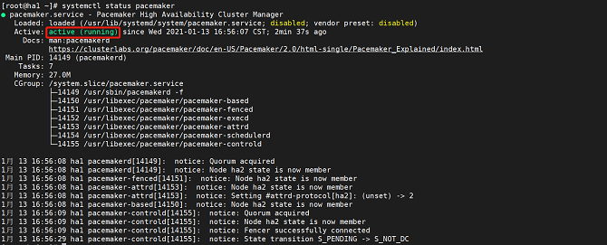
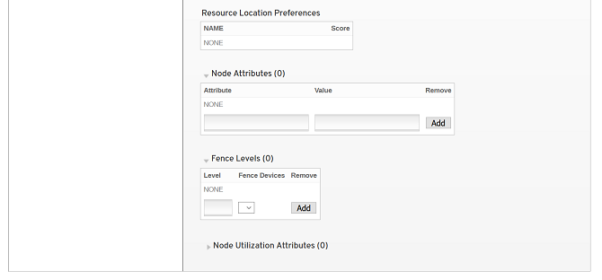
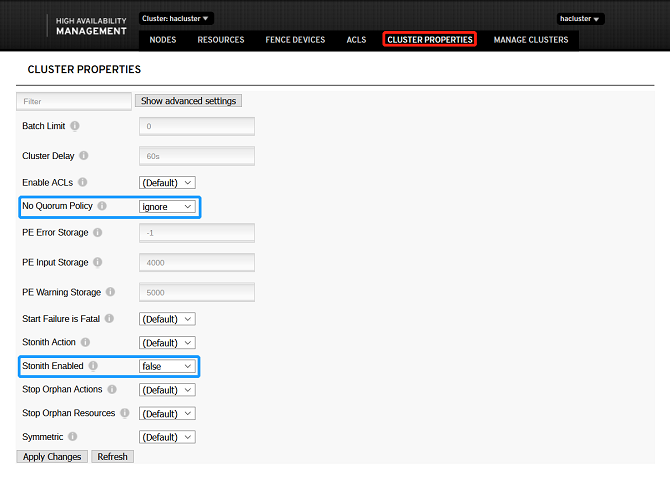
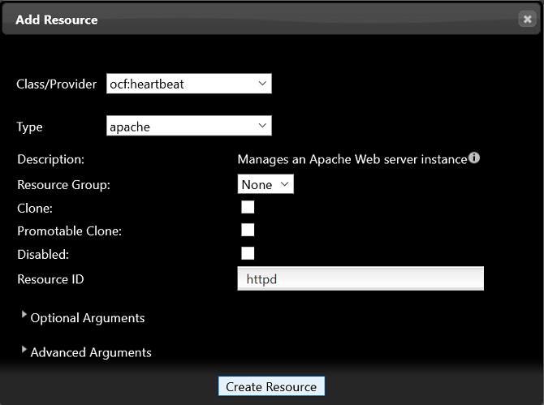
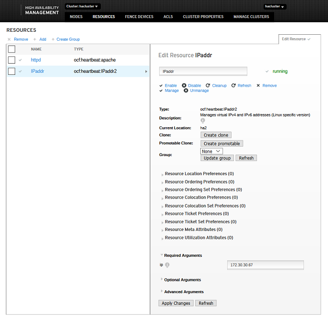
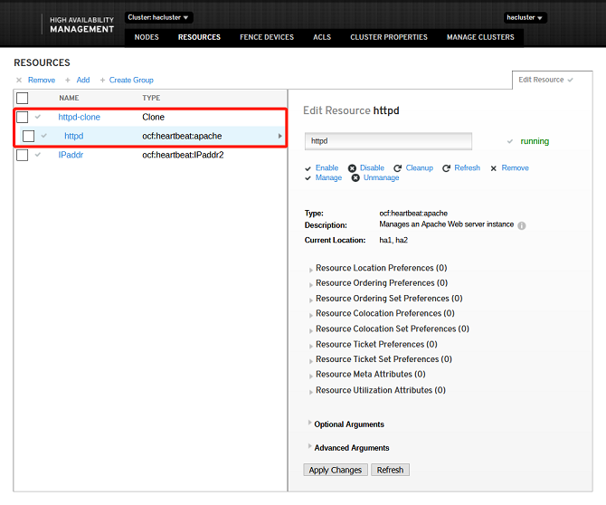

# Installing, Deploying, and Using HA

<!-- TOC -->
- [Installing, Deploying, and Using HA](#installing-deploying-and-using-ha)
  - [Installation and Configuration](#installation-and-configuration)
    - [Modifying the Host Name and the /etc/hosts File](#modifying-the-host-name-and-the-etchosts-file)
    - [Configuring the Yum Source](#configuring-the-yum-source)
    - [Installing HA Software Package Components](#installing-ha-software-package-components)
    - [Setting the hacluster User Password](#setting-the-hacluster-user-password)
    - [Modifying the `/etc/corosync/corosync.conf` File](#modifying-the-etccorosynccorosyncconf-file)
    - [Managing Services](#managing-services)
      - [Disabling the Firewall](#disabling-the-firewall)
      - [Managing the pcs Service](#managing-the-pcs-service)
      - [Managing the pacemaker Service](#managing-the-pacemaker-service)
      - [Managing the corosync Service](#managing-the-corosync-service)
    - [Performing Node Authentication](#performing-node-authentication)
    - [Accessing the Front-End Management Platform](#accessing-the-front-end-management-platform)
  - [Quick User Guide](#quick-user-guide)
    - [Login Page](#login-page)
    - [Home Page](#home-page)
    - [Managing Nodes](#managing-nodes)
      - [Node](#node)
    - [Preference Setting](#preference-setting)
      - [Adding Resources](#adding-resources)
        - [Adding Common Resources](#adding-common-resources)
        - [Adding Group Resources](#adding-group-resources)
        - [Adding Clone Resources](#adding-clone-resources)
      - [Editing Resources](#editing-resources)
      - [Setting Resource Relationships](#setting-resource-relationships)
      - [ACLS](#acls)
    
    <!-- /TOC -->


## Installation and Configuration

- Environment preparation: At least two physical machines or VMs with openEuler 20.03 LTS SP3 installed are required. (This section uses two physical machines or VMs as an example.) For details, see the *openEuler 20.03 LTS SP3 Installation Guide*.

### Modifying the Host Name and the /etc/hosts File

- **Note: You need to perform the following operations on both hosts. The following takes the operation on one host as an example.**

Before using the HA software, ensure that the host name has been changed and all host names have been written into the **/etc/hosts** file.

- Run the following command to change the host name:

```
# hostnamectl set-hostname ha1
```

- Edit the **/etc/hosts** file and write the following fields:

```
172.30.30.65 ha1
172.30.30.66 ha2
```

### Configuring the Yum Source

After the system is successfully installed, the Yum source is configured by default. The file location information is stored in the `/etc/yum.repos.d/openEuler.repo` file. The HA software package uses the following sources:

```
[OS]
name=OS
baseurl=http://repo.openeuler.org/openEuler-20.03-LTS-SP3/OS/$basearch/
enabled=1
gpgcheck=1
gpgkey=http://repo.openeuler.org/openEuler-20.03-LTS-SP3/OS/$basearch/RPM-GPG-KEY-openEuler

[everything]
name=everything
baseurl=http://repo.openeuler.org/openEuler-20.03-LTS-SP3/everything/$basearch/
enabled=1
gpgcheck=1
gpgkey=http://repo.openeuler.org/openEuler-20.03-LTS-SP3/everything/$basearch/RPM-GPG-KEY-openEuler

[EPOL]
name=EPOL
baseurl=http://repo.openeuler.org/openEuler-20.03-LTS-SP3/EPOL/main/$basearch/
enabled=1
gpgcheck=1
gpgkey=http://repo.openeuler.org/openEuler-20.03-LTS-SP3/OS/$basearch/RPM-GPG-KEY-openEuler
```

### Installing HA Software Package Components

```
# yum install corosync pacemaker pcs fence-agents fence-virt corosync-qdevice sbd drbd -y
```

### Setting the hacluster User Password

```
# passwd hacluster
```

### Modifying the `/etc/corosync/corosync.conf` File

```
totem {
        version: 2
        cluster_name: hacluster
         crypto_cipher: none
        crypto_hash: none
}
logging {         
        fileline: off
        to_stderr: yes
        to_logfile: yes
        logfile: /var/log/cluster/corosync.log
        to_syslog: yes
        debug: on
       logger_subsys {
               subsys: QUORUM
               debug: on
        }
}
quorum {
           provider: corosync_votequorum
           expected_votes: 2
           two_node: 1
       }
nodelist {
       node {
               name: ha1
               nodeid: 1
               ring0_addr: 172.30.30.65
               }
        node {
               name: ha2
               nodeid: 2
               ring0_addr: 172.30.30.66
               }
        }
```

### Managing Services

#### Disabling the Firewall

```
# systemctl stop firewalld
```

Change the status of SELINUX in the **/etc/selinux/config** file to **disabled**.

```
# SELINUX=disabled
```

#### Managing the pcs Service

- Run the following command to start the **pcs** service:

```
# systemctl start pcsd
```

- Run the following command to query service status:

```
# systemctl status pcsd
```

The service is started successfully if the following information is displayed:


#### Managing the pacemaker Service

- Run the following command to start the **pacemaker** service:

```
# systemctl start pacemaker
```

- Run the following command to query service status:

```
# systemctl status pacemaker
```

The service is started successfully if the following information is displayed:



#### Managing the corosync Service

- Run the following command to start the **corosync** service:

```
# systemctl start corosync
```

- Run the following command to query service status:

```
# systemctl status corosync
```

The service is started successfully if the following information is displayed:


### Performing Node Authentication

- **Note: Perform this operation on only one node.**

```
# pcs host auth ha1 ha2
```

### Accessing the Front-End Management Platform

After the preceding services are started, open the browser (Chrome or Firefox is recommended) and enter `https://IP:2224` in the address box.

## Quick User Guide

### Login Page

The username is `hacluster` and the password is the one set on the host.


### Home Page

The home page is the **MANAGE CLUSTERS** page, which includes four functions: remove, add existing, destroy, and create new clusters.


### Managing Nodes

#### Node

You can add and remove nodes. The following describes how to add an existing node.


Node management includes the following functions: start, stop, restart, standby, maintenance, and configure Fencing. You can view the enabled services and running resources of the node and manage the node.

 

### Preference Setting

You can perform the following operations using command lines. The following is a simple example. Run the `pcs --help` command to query more commands available.

```
# pcs property set stonith-enabled=false
# pcs property set no-quorum-policy=ignore
```

Run the `pcs property` command to view all settings.


- Change the default status of **No Quorum Policy** to **ignore**, and the default status of **Stonith Enabled** to **false**, as shown in the following figure:



#### Adding Resources

##### Adding Common Resources

The multi-option drop-down list box in the system supports keyword matching. You can enter the keyword of the item to be configured and quickly select it.

Apache and IPaddr are used as examples.

Run the following commands to add the Apache and IPaddr resources:

```
# pcs resource create httpd ocf:heartbeat:apache
# pcs resource create IPaddr ocf:heartbeat:IPaddr2 ip=172.30.30.67
```

Run the following command to check the cluster resource status:

```
# pcs status
```


- Add Apache resources.



- The resources are successfully added if the following information is displayed:


- The resources are created and started successfully, and run on a node, for example, **ha1**. The Apache page is displayed.


- Add IPaddr resources.


- The resources are successfully added if the following information is displayed:



- The resources are created and started successfully, and run on a node, for example, **ha1**. The HA web login page is displayed, and you can log in to the page and perform operations. When the resources are switched to **ha2**, the web page can still be accessed.


##### Adding Group Resources

When you add group resources, at least one common resource is needed in the cluster. Select one or more resources and click **Create Group**.

- **Note: Group resources are started in the sequence of subresources. Therefore, you need to select subresources in sequence.**


The resources are successfully added if the following information is displayed:


##### Adding Clone Resources


The resources are successfully added if the following information is displayed:



#### Editing Resources

- **Enable**: Select a target resource that is not running from the resource node list. Enable the resource.
- **Disable**: Select a target resource that is running from the resource node list. Disable the resource.
- **Clearup**: Select a target resource from the resource node list and clear the resource.
- **Porting**: Select a target resource from the resource node list. The resource must be a common resource or group resource that is running. You can port the resource to a specified node.
- **Rollback**: Select a target resource from the resource node list. Before rolling back a resource, ensure that the resource has been ported. You can clear the porting settings of the resource and roll the resource back to the original node. After you click the button, the status of the resource item in the list is the same as that when the resource is enabled.
- **Remove**: Select a target resource from the resource node list and remove the resource.

You can perform the preceding resource operations on the page shown in the following figure:


#### Setting Resource Relationships

The resource relationship is used to set restrictions for target resources. Resource restrictions are classified as follows: **resource location**, **resource colocation**, and **resource ordering**.

- **Resource location**: Set the runlevel of nodes in the cluster to determine the node where the resource runs during startup or switchover. The runlevels are Master and Slave in descending order.
- **Resource colocation**: Indicate whether the target resource and other resources in the cluster are running on the same node. For resources on the same node, the resource must run on the same node as the target resource. For resources on mutually exclusive nodes, the resource and the target resource must run on different nodes.
- **Resource ordering**: Set the ordering in which the target resource and other resources in the cluster are started. The preamble resource must run before the target resource runs. The postamble resource can run only after the target resource runs.

After adding common resources or group resources, you can perform the preceding resource operations on the page shown in the following figure:


#### ACLS

ACLS is an access control list. You can click **Add** to add a user and manage the user access.

