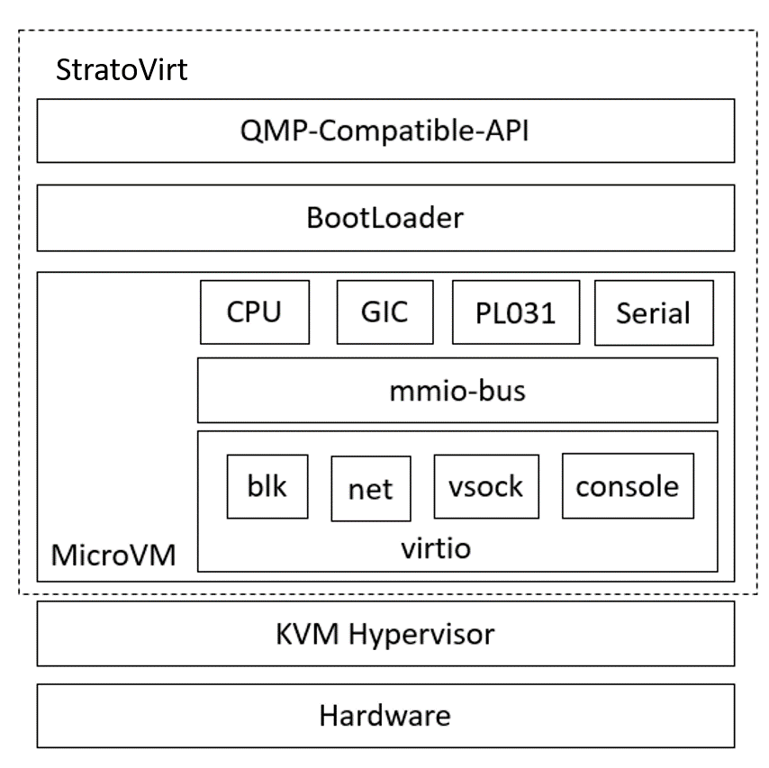

# Introduction to StratoVirt

[[toc]]

## Overview

StratoVirt is an enterprise-class virtualization platform for cloud data centers in the computing industry, enabling a unified architecture that supports virtual machines, containers and Serverless scenarios. On top of that, StratoVirt has a key technology competitive advantage in terms of lightweight, low noise, hard and soft collaboration, Rust language-level security, and more. StratoVirt reserves the capabilities and interfaces for component assembly in architectural design and interfaces. More importantly, StratoVirt has the flexibility to assemble advanced features on demand until it evolves to support standard virtualization, finding the best balance between feature requirements, applications scenarios, and light flexibility.

## Architecture Description

The StratoVirt core architecture is divided into three layers from top to bottom:

- OCI: compatible with the QEMU Machine Protocol (QMP), which has complete OCI compatibility capabilities.
- BootLoader: discards the traditional BIOS+GRUB boot mode and implements a lighter and faster bootloader.
- MicroVM: virtualization layer, which fully leverages the capability of software and hardware collaboration to simplify the device model and the capability of low-latency resource scaling.

The overall architecture is shown in **Figure 1**.

**Figure 1** Overall architecture of StratoVirt

