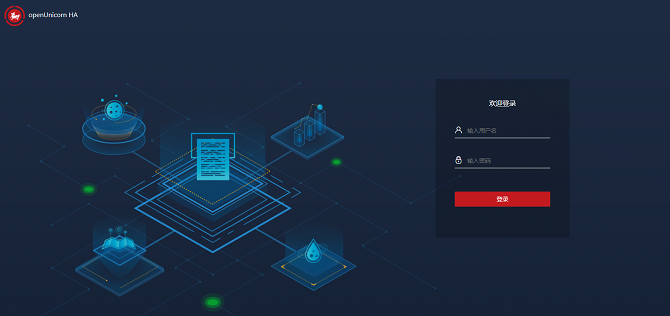
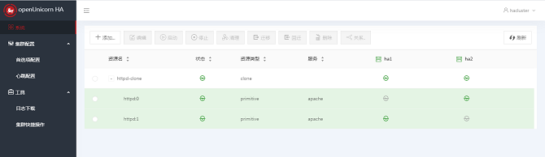
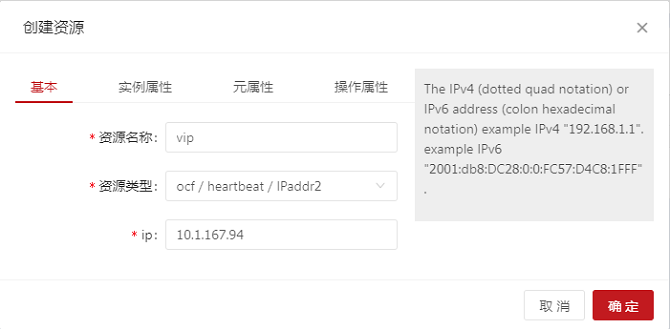
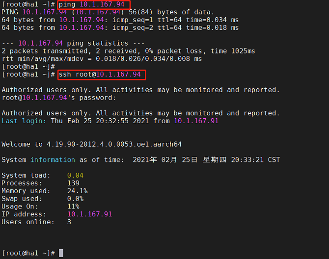
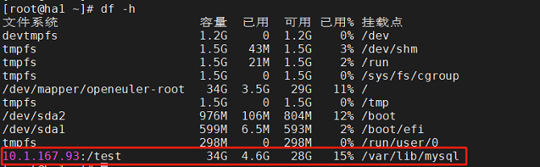
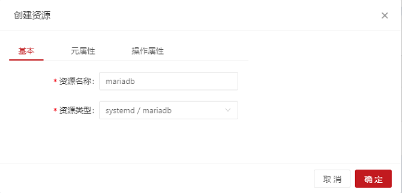
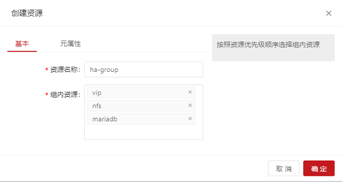
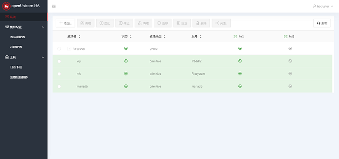

# HA Usage Example

This section describes how to get started with the HA cluster and add an instance. If you are not familiar with HA installation, see [Installing and Deploying HA](./install-deploy-HA.md\).


<!-- TOC -->
- [HA Usage Example](#ha-usage-example)
  - [Quick Start Guide](#quick-start-guide)
    - [Login Page](#login-page)
    - [Home Page](#home-page)
      - [Navigation Bar](#navigation-bar)
      - [Top Operation Area](#top-operation-area)
      - [Resource Node List Area](#resource-node-list-area)
      - [Node Operation Floating Area](#node-operation-floating-area)
    - [Preference Settings](#preference-settings)
      - [Adding Resources](#adding-resources)
        - [Adding Common Resources](#adding-common-resources)
        - [Adding Group Resources](#adding-group-resources)
        - [Adding Clone Resources](#adding-clone-resources)
      - [Editing Resources](#editing-resources)
      - [Setting Resource Relationships](#setting-resource-relationships)
  - [HA MySQL Configuration Example](#ha-mysql-configuration-example)
    - [Configuring the Virtual IP Address](#configuring-the-virtual-ip-address)
    - [Configuring NFS Storage](#configuring-nfs-storage)
    - [Configuring MySQL](#configuring-mysql)
    - [Adding the Preceding Resources as a Group Resource](#adding-the-preceding-resources-as-a-group-resource)
    <!-- /TOC -->


## Quick Start Guide

- The following operations use the management platform newly developed by the community as an example.

### Login Page
The user name is `hacluster`, and the password is the one set on the host by the user.



### Home Page
After logging in to the system, the main page is displayed. The main page consists of the side navigation bar, the top operation area, the resource node list area, and the node operation floating area.

The following describes the features and usage of the four areas in detail.


#### Navigation Bar
The side navigation bar consists of two parts: the name and logo of the HA cluster software, and the system navigation. The system navigation consists of three parts: System, Cluster Configurations, and Tools. System is the default option and the corresponding item to the home page. It displays the information and operation entries of all resources in the system. Preference Settings and Heartbeat Configurations are under Cluster Configurations. Log Download and Quick Cluster Operation are under Tools. These two items are displayed in a pop-up box after you click them.

#### Top Operation Area
The current login user is displayed statically. When you hover the mouse cursor on the user icon, the operation menu items are displayed, including Refresh Settings and Log Out. After you click Refresh Settings, the Refresh Settings dialog box is displayed with the option. You can set the automatic refresh modes for the system. The options are Do not refresh automatically, Refresh every 5 seconds, and Refresh every 10 seconds. By default, Do not refresh automatically is selected. Clicking Log Out to log out and jump to the login page. After that, a re-login is required if you want to continue to access the system.


#### Resource Node List Area
The resource node list displays the resource information such as Resource Name, Status, Resource Type, Service, and Running Node of all resources in the system, and the node information such as all nodes in the system and the running status of the nodes. In addition, you can Add, Edit, Start, Stop, Clear, Migrate, Migrate Back, and Delete the resources, and set Relationships for the resources.

#### Node Operation Floating Area
By default, the node operation floating area is collapsed. When you click a node in the heading of the resource node list, the node operation area is displayed on the right, as shown in the preceding figure. This area consists of the collapse button, the node name, the stop button, and the standby button, and provides the stop and standby operations. Click the arrow in the upper left corner of the area to collapse the area.

### Preference Settings
The following operations can be performed using command lines. The following is an example. For more command details, run the ``pcs --help`` command.

```
# pcs property set stonith-enabled=false
# pcs property set no-quorum-policy=ignore
```
Run ``pcs property`` to view all settings.


-  Click Preference Settings in the navigation bar, the Preference Settings dialog box is displayed. Change the values of No Quorum Policy and Stonith Enabled from the default values to the values shown in the figure below. Then, click OK.


#### Adding Resources
##### Adding Common Resources
Click Add Common Resource. The Create Resource dialog box is displayed. All mandatory configuration items of the resource are on the Basic page. After you select a Resource Type on the Basic page, other mandatory and optional configuration items of the resource are displayed. When you type in the resource configuration information, a gray text area is displayed on the right of the dialog box to describe the current configuration item. After all mandatory parameters are set, click OK to create a common resource or click Cancel to cancel the add operation. The optional configuration items on the Instance Attribute, Meta Attribute, or Operation Attribute page are optional. The resource creation process is not affected if they are not configured. You can modify them as required. Otherwise, the default values are used.

The following uses the Apache as an example to describe how to add an Apache resource.
```
# pcs resource create httpd ocf:heartbeat:apache
```
Check the resource running status:
```
# pcs status
```


-  Add the Apache resource:


-  If the following information is displayed, the resource is successfully added:


-  The resource is successfully created and started, and runs on a node, for example, ha1. The Apache page is displayed.


##### Adding Group Resources
Adding group resources requires at least one common resource in the cluster. Click Add Group Resource. The Create Resource dialog box is displayed. All the parameters on the Basic tab page are mandatory. After setting the parameters, click OK to add the resource or click Cancel to cancel the add operation.

-  **Note: Group resources are started in the sequence of child resources. Therefore, you need to select child resources in sequence.**


If the following information is displayed, the resource is successfully added:


##### Adding Clone Resources
Click Add Clone Resource. The Create Resource dialog box is displayed. On the Basic page, enter the object to be cloned. The resource name is automatically generated. After entering the object name, click OK to add the resource, or click Cancel to cancel the add operation.


If the following information is displayed, the resource is successfully added:


#### Editing Resources
-  Starting a resource: Select a target resource from the resource node list. The target resource must not be running. Start the resource.
-  Stopping a resource: Select a target resource from the resource node list. The target resource must be running. Stop the resource.
-  Clearing a resource: Select a target resource from the resource node list. Clear the resource.
-  Migrating a resource: Select a target resource from the resource node list. The resource must be a common resource or a group resource in the running status. Migrate the resource to migrate it to a specified node.
-  Migrating back a resource: Select a target resource from the resource node list. The resource must be a migrated resource. Migrate back the resource to clear the migration settings of the resource and migrate the resource back to the original node.
After you click Migrate Back, the status change of the resource item in the list is the same as that when the resource is started.
-  Deleting a resource: Select a target resource from the resource node list. Delete the resource.

#### Setting Resource Relationships
Resource relationships are used to set restrictions for the target resources. There are three types of resource restrictions: resource location, resource collaboration, and resource order.
-  Resource location: sets the running level of the nodes in the cluster for the resource to determine the node where the resource runs during startup or switchover. The running levels are Master Node and Slave 1 in descending order.
-  Resource collaboration: indicates whether the target resource and other resources in the cluster run on the same node. Same Node indicates that this resource must run on the same node as the target resource. Mutually Exclusive indicates that this resource cannot run on the same node as the target resource.
-  Resource order: Set the order in which the target resource and other resources in the cluster are started. Front Resource indicates that this resource must be started before the target resource. Follow-up Resource indicates that this resource can be started only after the target resource is started.

## HA MySQL Configuration Example
- Configure three common resources separately, then add them as a group resource.
### Configuring the Virtual IP Address
On the home page, choose Add > Add Common Resource and set the parameters as follows:



-  The resource is successfully created and started and runs on a node, for example, ha1. The resource can be pinged and connected, and allows various operations after login. The resource is switched to ha2 and can be accessed normally.
-  If the following information is displayed, the resource is successfully added:



### Configuring NFS Storage
-  Configure another host as the NFS server.

Install the software packages:

```
# yum install -y nfs-utils rpcbind
```
Run the following command to disable the firewall:
```
# systemctl stop firewalld && systemctl disable firewalld
```
Modify the /etc/selinux/config file to change the status of SELINUX to disabled.
```
# SELINUX=disabled
```
Start the services:
```
# systemctl start rpcbind && systemctl enable rpcbind
# systemctl start nfs-server && systemctl enable nfs-server
```
Create a shared directory on the server:
```
# mkdir -p /test
```
Modify the NFS configuration file:
```
# vim /etc/exports
# /test *(rw,no_root_squash)
```
Reload the service:
```
# systemctl reload nfs
```

Install the software packages on the client. Install MySQL first to mount the NFS to the path of the MySQL data.
```
# yum install -y nfs-utils mariadb-server
```
On the home page, choose Add > Add Common Resource and configure the NFS resource as follows:


-  The resource is successfully created and started and runs on a node, for example, ha1. The NFS is mounted to the /var/lib/mysql directory. The resource is switched to ha2. The NFS is unmounted from ha1 and automatically mounted to ha2.
-  If the following information is displayed, the resource is successfully added:



### Configuring MySQL
On the home page, choose Add > Add Common Resource and configure the MySQL resource as follows:



-  If the following information is displayed, the resource is successfully added:


### Adding the Preceding Resources as a Group Resource
-  Add the three resources in the resource startup sequence.

On the home page, choose Add > Add Group Resource and configure the group resource as follows:



-  The group resource is successfully created and started. If the command output is the same as that of the preceding common resources, the group resource is successfully added.



-  Use ha1 as the standby node and migrate the group resource to the ha2 node. The system is running properly.


