# Table of Contents

<!-- @import "[TOC]" {cmd="toc" depthFrom=1 depthTo=6 orderedList=false} -->

<!-- code_chunk_output -->

- [Table of Contents](#table-of-contents)
- [Xfce Desktop Environment](#xfce-desktop-environment)
  - [1. Overview](#1-overview)
  - [2. Desktop](#2-desktop)
    - [2.1 Desktop Icons](#21-desktop-icons)
    - [2.2 Shortcut Menu](#22-shortcut-menu)
  - [3. Taskbar](#3-taskbar)
    - [3.1 Basic Functions](#31-basic-functions)
      - [3.1.1 Applications](#311-applications)
      - [3.1.2 Window Display Area](#312-window-display-area)
      - [3.1.3 Multi-View Switching](#313-multi-view-switching)
      - [3.1.4 Tray](#314-tray)
        - [3.1.4.1 Network](#3141-network)
        - [3.1.4.2 Volume](#3142-volume)
        - [3.1.4.3 Power supply](#3143-power-supply)
        - [3.1.4.4 Notification Center](#3144-notification-center)
        - [3.1.4.5 Calendar](#3145-calendar)
      - [3.1.4.6 Advanced Settings](#3146-advanced-settings)
        - [3.1.4.7 Login User Actions](#3147-login-user-actions)
          - [3.1.4.7.1 Lock Screen](#31471-lock-screen)
          - [3.1.4.7.2 Switch User](#31472-switch-user)
          - [3.1.4.7.3 Suspend](#31473-suspend)
          - [3.1.4.7.3 Shut Down](#31473-shut-down)
          - [3.1.4.7.3 Log Out](#31473-log-out)
  - [4. Shortcut Operation Bar](#4-shortcut-operation-bar)
    - [4.1 Basic Functions](#41-basic-functions)
      - [4.1.1 Show Desktop](#411-show-desktop)
      - [4.1.2 Terminal](#412-terminal)
      - [4.1.3 File Manager](#413-file-manager)
      - [4.1.4 Web Browser](#414-web-browser)
      - [4.1.5 Application Finder](#415-application-finder)
      - [4.1.6 User Home Directory](#416-user-home-directory)

<!-- /code_chunk_output -->

# Xfce Desktop Environment

## 1. Overview

Xfce is a lightweight desktop environment running on Unix-like operating systems. Xfce provides multiple functional components, including all applications. This document describes how to use Xfce.

The following figure shows the WebUI.

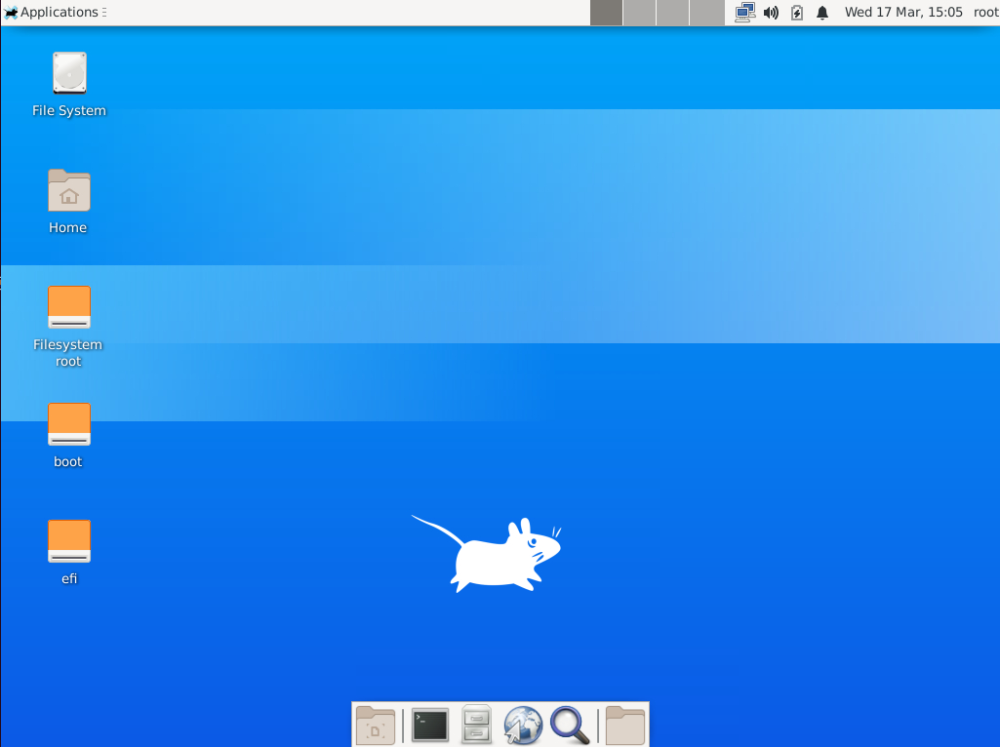

 

## 2. Desktop

### 2.1 Desktop Icons

By default, icons such as the file system, main folder, and mount directory are placed. You can double-click the icons to open the page.

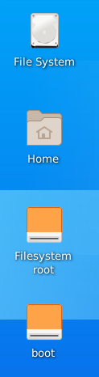

### 2.2 Shortcut Menu

Right-click in the blank area on the desktop. The shortcut menus are displayed, as shown in the following figure.

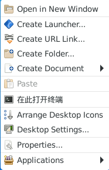

The following table describes some options.

| Parameter| Description|
|:----------|:----------|
| Open in New Window| Open the **Desktop** directory of the login user.|
| Create Launcher| Create a launcher.|
| Create URL Link| Create a URL link.|
| Create Folder| Create a folder.|
| Create Document| Create a text file.|
| Open Terminal Here| Create a terminal.|
| Arrange Desktop Icons| Automatically arrange desktop icons.|
| Desktop Settings| Set the background, menus, and icons.|
| Properties| Set desktop properties, such as the general, logo, and permission.|
| Applications| Applications|

 

## 3. Taskbar

### 3.1 Basic Functions

The taskbar is located at the top, including application, window display area, multi-view switch, and tray menus.

| Component| Description|
|:----------|:----------|
| Applications| Display all applications and settings, and allow you to search for applications and settings.|
| Window display area| The blank area in the middle of the horizontal bar, which displays running programs or opened documents. You can minimize, maximize, close, or pin the window to the top.|
| Switching views| Perform operations in multiple workspaces without interfering with each other.|
| Tray| Set the network connection, sound, power, notification center, calendar, and login user actions.|

#### 3.1.1 Applications

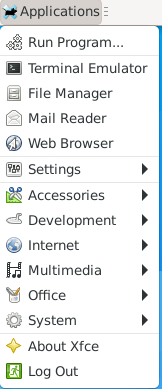

#### 3.1.2 Window Display Area

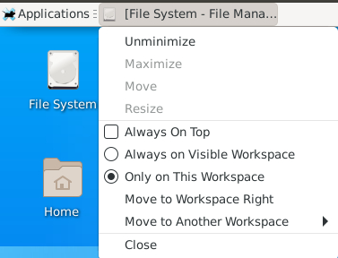

#### 3.1.3 Multi-View Switching

Click  in the taskbar to enter the corresponding work area.

For example, you can use the mouse to switch among multiple workspaces to select the operation area that you want to work in.

#### 3.1.4 Tray

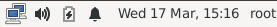

##### 3.1.4.1 Network

You can click  on the taskbar and select a network connection mode as required.

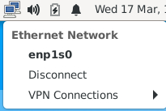

Network settings dialog box

Right-click the network icon  on the taskbar. The network setting menu is displayed.

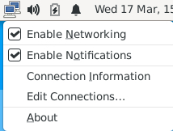

Click **Edit Connections**. The network setting dialog box is displayed.

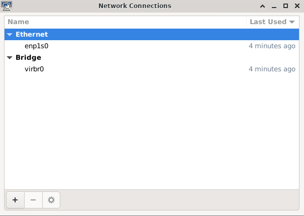

Double-click the specified network connection, for example, **enp1s0**. The page for setting the connection is displayed.

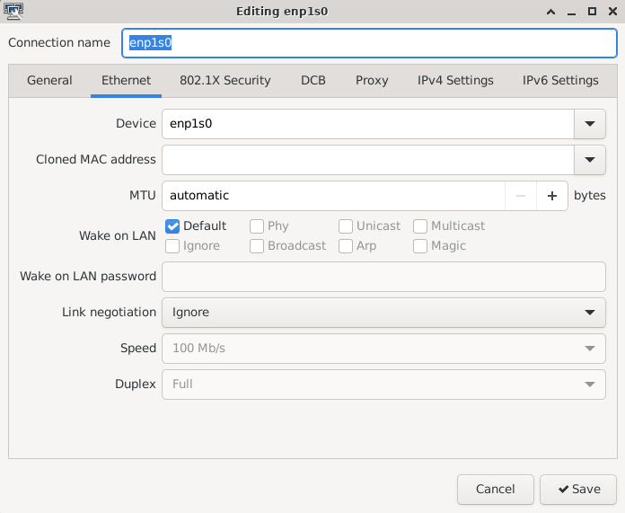

##### 3.1.4.2 Volume

Click the volume icon  on the taskbar to open the sound page.

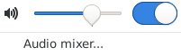

##### 3.1.4.3 Power supply

Click  on the taskbar.

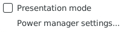

You can click **Power Manager Settings** to configure the display and nodes.

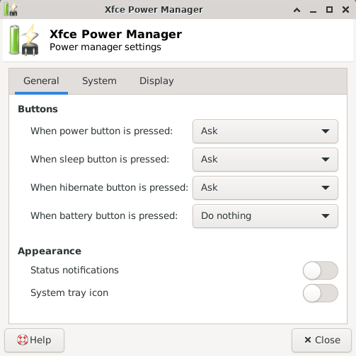

##### 3.1.4.4 Notification Center

Click  on the taskbar.

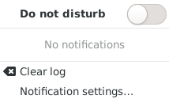

You can disable the notification function by selecting **Do not disturb**.

The notification center displays the latest important information list. You can click **Clear log** to clear the information list.

You can click **Notification settings** to go to the notification setting page of the control panel and set the applications to be displayed and the number of messages to be displayed.

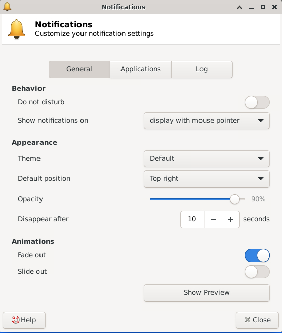

##### 3.1.4.5 Calendar

You can click the date and time on the taskbar to display the calendar window and view the calendar, month calendar, and annual calendar.

You can choose a year, a month and a day to view the information of a specific day.

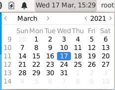

Right-click the time and date on the taskbar and click **Properties** to set the time.

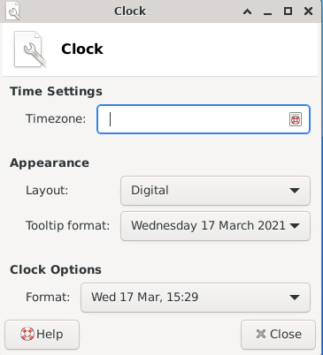

#### 3.1.4.6 Advanced Settings

Right-click the taskbar and choose **Panel** from the shortcut menu.

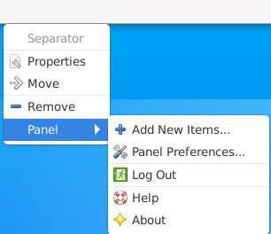

You can set the layout of the taskbar and add or delete items.

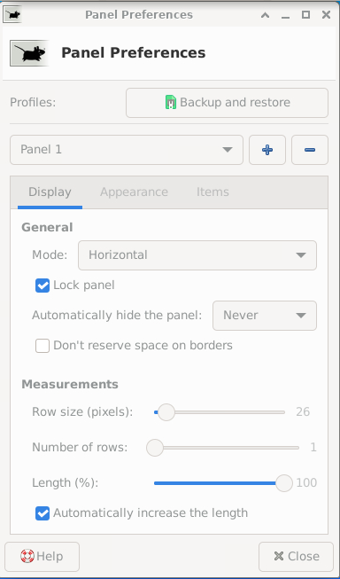

##### 3.1.4.7 Login User Actions

Click the login user on the task bar to view related actions.

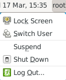

###### 3.1.4.7.1 Lock Screen

If you use the computer currently, you can lock the screen (which does not affect the current running status of the system) to prevent misoperations. After locking the screen, you can enter the password to log in to the system again.

By default, the system automatically locks the screen after a period of idle time.

###### 3.1.4.7.2 Switch User

If you want to log in to the computer as another user, choose **Switch User**.

Then, the system closes all running applications. Therefore, before performing this operation, save the current work.

###### 3.1.4.7.3 Suspend

For the sake of environmental protection and energy saving, you can select **Suspend****.**

After that, the related data is read into the memory. Do not switch the power supply.

###### 3.1.4.7.3 Shut Down

You can choose **Shut Down** to shut down a computer.

Before performing this operation, save the current work.

###### 3.1.4.7.3 Log Out

To log out of the GUI, click **Log Out**.

Then, the system closes all running applications. Therefore, before performing this operation, save the current work.

 

## 4. Shortcut Operation Bar

### 4.1 Basic Functions

The shortcut operation bar is located at the bottom, including the icons for displaying all the desktops, terminals, file managers, web browsers, application search, and user home directories.

| Component| Description |
|:----------|:----------|
| Show Desktop| Hide all windows and show the desktop. Click again to restore the window.|
| Terminal| Open a terminal.|
| File Manager| Open a file manager.|
| Web Browser| Open a web browser.|
| Application Finder| Open the application search window.|
| User Home Directory| Open the home directory of the login user.|

#### 4.1.1 Show Desktop

Click  on the shortcut operation bar to display the desktop.

#### 4.1.2 Terminal

Click  on the shortcut operation bar to open a terminal.

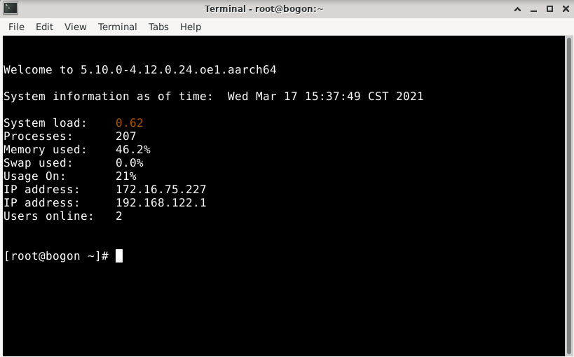

#### 4.1.3 File Manager

You can click the  icon on the shortcut operation bar to open a file manager.

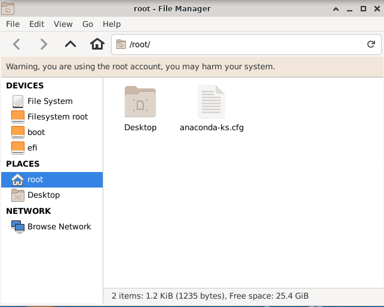

#### 4.1.4 Web Browser

You can click the  icon on the shortcut operation bar to open a web browser.

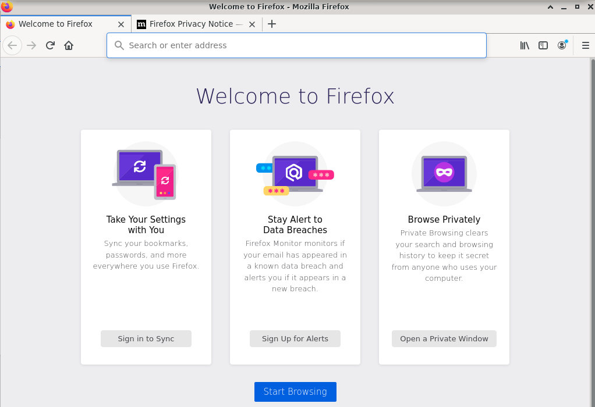

#### 4.1.5 Application Finder

You can click the  icon on the shortcut operation bar to open an application program search interface.

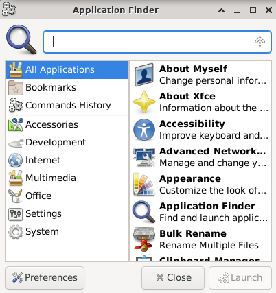

#### 4.1.6 User Home Directory

Click  on the shortcut operation bar and click **Open File**. The user home directory page is displayed.

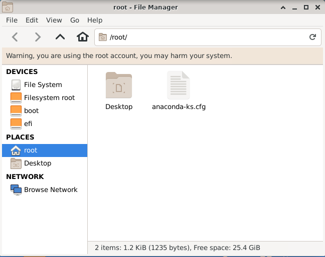

Click the  icon on the shortcut operation bar, and then click **Open in Terminal** to open a terminal. The current directory is the home directory of the user.

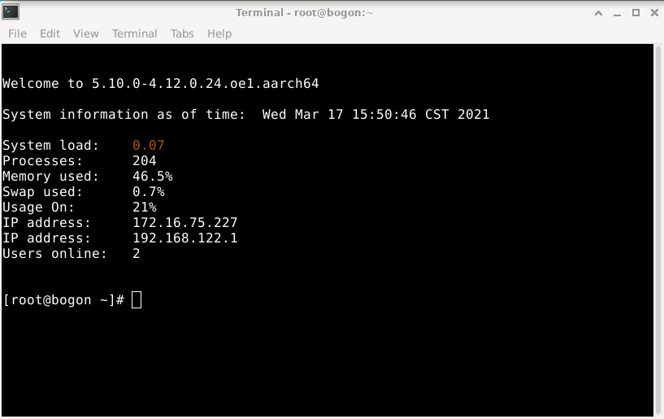