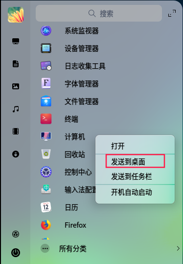

# DDE User Guide

This section describes how to install and use the Deepin Desktop Environment (DDE).

## FAQs

### 1. After the DDE is installed, why are the computer and recycle bin icons not displayed on the desktop when I log in as the **root** user?

* Issue

  After the DDE is installed, the computer and recycle bin icon is not displayed on the desktop when a user logs in as the **root** user.

* Cause

  The **root** user is created before the DDE is installed. During the installation, the DDE does not add desktop icons for existing users. This issue does not occur if the user is created after the DDE is installed.

* Solution

  Right-click the icon in the launcher and choose **Send to Desktop**. The icon functions the same as the one added by DDE.

  

