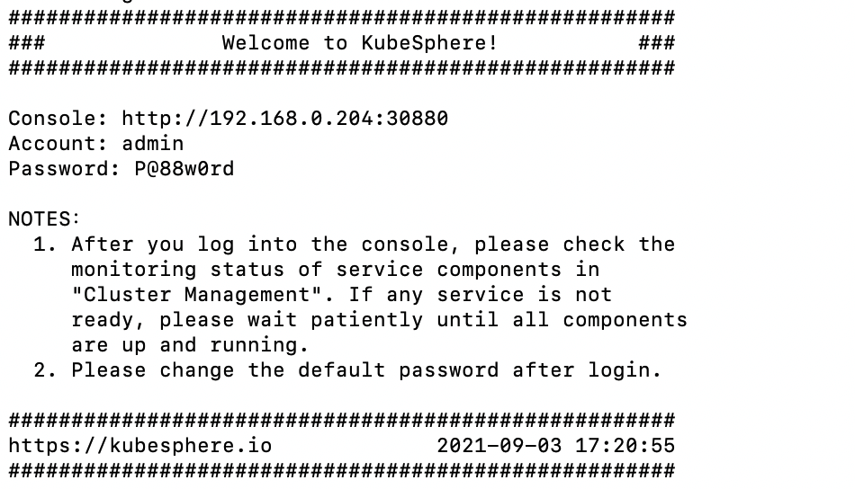
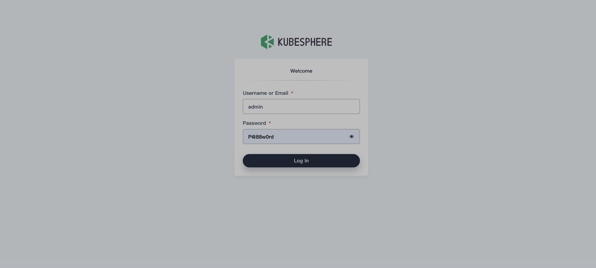

# KubeSphere Installation Guide

This document describes how to install and deploy Kubernetes and KubeSphere clusters on openEuler 21.09.

### What Is KubeSphere

[KubeSphere](https://kubesphere.io/) is an open source **distributed OS** built on [Kubernetes](https://kubernetes.io/) for cloud-native applications. It supports multi-cloud and multi-cluster management and provides full-stack automated IT O&M capabilities, simplifying DevOps-based workflows for enterprises. Its architecture enables plug-and-play integration between third-party applications and cloud-native ecosystem components. For more information, see the [KubeSphere official website](https://kubesphere.com.cn/).

### Prerequisites

Prepare a physical machine or VM with openEuler 21.09 installed. For details about the installation method, see the *openEuler 21.09 Installation Guide*.

### Software Installation

1. Install KubeKey.

   ```bash
   yum install kubekey
   ```

   > **Note**
   >Before the installation, manually deploy Docker on each node in the cluster in advance or use KubeKey to automatically deploy Docker. The Docker version automatically deployed by KubeKey is 20.10.8.

2. Deploy the KubeSphere cluster.

   ```bash
   kk create cluster --with-kubesphere v3.1.1
   ```

   > **Note**
   >After this command is executed, Kubernetes v1.19.8 is installed by default. To specify the Kubernetes version, add `--with-kubernetes < version_number >` to the end of the command line. The supported Kubernetes versions include `v1.17.9`, `v1.18.8`, `v.1.19.8`, `v1.19.9`, and `v1.20.6`.

3. Check whether the KubeSphere cluster is successfully installed.

   ```bash
   kubectl logs -n kubesphere-system $(kubectl get pod -n kubesphere-system -l app=ks-install -o jsonpath='{.items[0].metadata.name}') -f
   ```

   If the following information is displayed, the KubeSphere cluster is successfully installed:

   

   >**Note**
   >This document describes how to install KubeSphere in the x86 environment. In the ARM64 environment, you need to install Kubernetes before deploying KubeSphere.

### Accessing the KubeSphere Web Console

**Depending on your network environment, you may need to configure port forwarding rules and firewall policies. Ensure that port 30880 is allowed in the firewall rules.****

After the KubeSphere cluster is successfully deployed, enter  `<node_ IP_address>:30880` in the address box of a browser to access the KubeSphere web console.



### See Also

[What is KubeSphere](https://v3-1.docs.kubesphere.io/docs/introduction/what-is-kubesphere/)

[Install a Multi-node Kubernetes and KubeSphere Cluster](https://v3-1.docs.kubesphere.io/docs/installing-on-linux/introduction/multioverview/)

[Enable Pluggable Components](https://v3-1.docs.kubesphere.io/docs/quick-start/enable-pluggable-components/)
