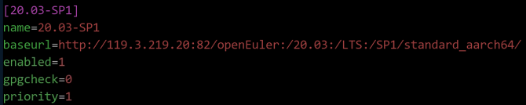
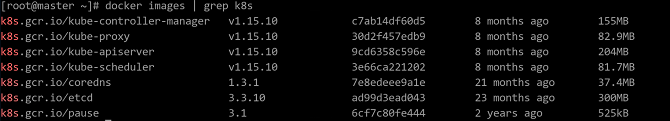

# Guide to Porting Kubernetes to openEuler

- [Software Overview](#software-overview)
- [Environment Configuration](#environment-configuration)
- [System Configuration](#system-configuration)
- [Software Installation](#software-installation)
- [Software Uninstallation](#software-uninstallation)

## Software Overview

The Kubernetes (K8s for short) is an open source container cluster management platform that implements the automatic deployment, automatic scaling, and maintenance of container clusters. The goal of Kubernetes is to promote a mature ecosystem of components and tools to run applications more easily on the cloud.

The Kubernetes cluster has two types of nodes: master and worker. The master node manages and controls the entire cluster. Control commands executed for the cluster are sent to the master node. The worker node is a workload node in the Kubernetes cluster. The workload on a worker node is allocated by the master node. When a worker node breaks down, the master node transfers the workload on the faulty worker node to other nodes.

This document describes how to use two nodes to set up a Kubernetes cluster. One is the master node, and the other is the worker node.

## Environment Configuration

**Software Platform**

|  Software   |Version Number  |Installation Method   |
|:---  |:----  |:----  |
| openEuler | 20.03-LTS-SP1 |ISO  |
| gnu | 7.3.0 |  |
| python3 | 3.7.4 | |
| bash | 5.0.11 |          |

**Required Dependency Packages**

|  Software   |Version Number  |Installation Method   |
|:---  |:----  |:----  |
| docker-engine | 18.09.0-101 |Refer to Installing Docker and Configuring the Yum Source  |
| kubelet | 1.15.10/1.18/1.16 | Refer to Installing K8s Components |
| kubeadm | 1.15.10/1.18/1.16 | Refer to Installing K8s Components |
| kubectl | 1.15.10/1.18/1.16 | Refer to Installing K8s Components |
| kubernetes-cni | 1.15.10/1.18/1.16 | Refer to Installing K8s Components |

>  **Note** 
>
> This document applies to K8s 1.15.10, 1.16, and 1.18, and uses K8s 1.15.10 as an example.

## System Configuration

### Modifying Host Configuration

Edit the `/etc/hosts` files of the master and worker nodes, and add the IP addresses of the master and worker nodes to the end of the files.

```
192.168.122.72 master
192.168.122.130 worker 
```

### Installing Docker and Configuring the Yum Source

1. This operation is optional. The Yum source has been configured in the officially released image. If the openEuler Yum source is not configured in the system, perform the following operations to add a repo file. The `baseurl` value uses the source address in the released version.

* AArch64 architecture

    ```
    $ vim /etc/yum.repos.d/openEuler_aarch64.repo
    ```
  
    

* x86 architecture
  
    ```
    $ vim /etc/yum.repos.d/openEuler_x86_64.repo
    ```
  
    

2. Perform the preceding operation on the master and worker nodes, respectively. Clear the software packages and old headers in the cache and create the cache again.
   
    ```
    $ yum clean all
    $ yum makecache
    ```

3. Install Docker, start related services, and output the Docker status information.
   
    ```
    $ yum -y install docker-engine
    $ systemctl daemon-reload
    $ systemctl status docker
    $ systemctl restart docker
    $ systemctl status docker
    $ systemctl enable docker
    ```

### Disabling the Firewall and SELinux

Due to the back-end compatibility issue of nftables, duplicate firewall rules are generated. You need to disable the firewall. To enable the container to access the file system of the host, you need to disable SELinux.

Run the following commands on the master and worker nodes to disable the firewall and SELinux:

```
$ systemctl stop firewalld
$ systemctl disable firewalld
$ setenforce 0
$ sed -i '/^SELINUX=/s/enforcing/disabled/' /etc/selinux/config
```

### Configuring the Kubernetes Yum Source

1. Run the following command on the master and worker nodes to configure the Yum source of Kubernetes:
   
    * AArch64 architecture
   
        ```
        cat <<EOF > /etc/yum.repos.d/kubernetes.repo
   
        [kubernetes]
        name=Kubernetes
        baseurl=https://mirrors.aliyun.com/kubernetes/yum/repos/kubernetes-el7-aarch64
        enable=1
        gpgcheck=1
        repo_gpgcheck=1
        gpgkey=http://mirrors.aliyun.com/kubernetes/yum/doc/yum-key.gpg
               http://mirrors.aliyun.com/kubernetes/yum/doc/rpm-package-key.gpg
        EOF
        ```
   
    * x86 architecture
   
        ```
        cat <<EOF > /etc/yum.repos.d/kubernetes.repo
   
        [kubernetes]
        name=Kubernetes
        baseurl=https://mirrors.aliyun.com/kubernetes/yum/repos/kubernetes-el7-x86_64
        enable=1
        gpgcheck=1
        repo_gpgcheck=1
        gpgkey=http://mirrors.aliyun.com/kubernetes/yum/doc/yum-key.gpg
   	       http://mirrors.aliyun.com/kubernetes/yum/doc/rpm-package-key.gpg
        EOF
        ```

2. After the configuration is completed, run the following commands to clear the software packages and old headers in the cache and create the cache again:
   
    ```
    $ yum clean all
    $ yum makecache
    ```

### Disabling the Swap Partition

When installing the K8s cluster, you need to disable the swap memory exchange mechanism of the Linux OS. Otherwise, the system performance and stability will be affected due to memory exchange.

1. Run the following commands on the master and worker nodes to disable the swap partition:
   
    ```
    $ swapoff -a
    $ cp -p /etc/fstab /etc/fstab.bak$(date '+%Y%m%d%H%M%S')
    $ sed -i "s/\/dev\/mapper\/openeuler-swap/\#\/dev\/mapper\/openeuler-swap/g" /etc/fstab
    ```

2. Run the following command to check whether the modification is successful:
   
    ```
    $ cat /etc/fstab
    ```
   
    

3. Run the following command to reboot the system:
   
    ```
    $ reboot
    ```

## Software Installation

### Installing K8s Components

Run the following command on the master and worker nodes to install the K8s components:

```
$ yum install -y kubelet-1.15.10 kubeadm-1.15.10 kubectl-1.15.10 kubernetes-cni-0.7.5
```

### Configuring Startup Items

1. Run the following command on the master and worker nodes to set kubelet to start upon system boot:
   
    ```
    $ systemctl enable kubelet
    ```

2. Create the `/etc/sysctl.d/k8s.conf` files on the master and worker nodes and add the following content to the files:
   
    ```
    net.bridge.bridge-nf-call-ip6tables = 1
    net.bridge.bridge-nf-call-iptables = 1
    net.ipv4.ip_forward = 1
    vm.swappiness=0
    ```

3. Run the following commands on the master and worker nodes to make the modification take effect:
   
    ```
    $ modprobe br_netfilter
    $ sysctl -p /etc/sysctl.d/k8s.conf
    ```

### Downloading Components Using Docker

The master and worker nodes download other components using Docker. When downloading images, you need to select the version that corresponds to the architecture. Perform the following operations on the two nodes:

1. Run the following command to view the images required for initialization:
   
    ```
    $ kubeadm config images list
    ```
   
   
   
   >  **Note**   
The image versions required by K8s may change. Therefore, you need to check the list to select the proper Docker images to be downloaded. The following image versions are for reference only.

2. Run the following commands to download the images from Docker Hub:
   
    * AArch64 architecture
   
        ```
        $ docker pull gcmirrors/kube-apiserver-arm64:v1.15.10
        $ docker pull gcmirrors/kube-controller-manager-arm64:v1.15.10
        $ docker pull gcmirrors/kube-scheduler-arm64:v1.15.10
        $ docker pull gcmirrors/kube-proxy-arm64:v1.15.10
        $ docker pull gcmirrors/pause-arm64:3.1
        $ docker pull gcmirrors/etcd-arm64:3.3.10
        $ docker pull coredns/coredns:1.3.1
        ```
   
    * x86 architecture
   
        ```
        $ docker pull gcmirrors/kube-apiserver-amd64:v1.15.10
        $ docker pull gcmirrors/kube-controller-manager-amd64:v1.15.10
        $ docker pull gcmirrors/kube-scheduler-amd64:v1.15.10
        $ docker pull gcmirrors/kube-proxy-amd64:v1.15.10
        $ docker pull gcmirrors/pause-amd64:3.1
        $ docker pull gcmirrors/etcd-amd64:3.3.10
        $ docker pull coredns/coredns:1.3.1
        ```
   
    >  **Note**   
    > If the Docker image library proxy is configured, you can directly change the tag to **k8s.gcr.io** and skip the following steps.

3. Run the following commands to tag the downloaded images:
   
    * AArch64 architecture
   
        ```
        $ docker tag gcmirrors/kube-apiserver-arm64:v1.15.10 k8s.gcr.io/kube-apiserver:v1.15.10
        $ docker tag gcmirrors/kube-controller-manager-arm64:v1.15.10 k8s.gcr.io/kube-controller-manager:v1.15.10
        $ docker tag gcmirrors/kube-scheduler-arm64:v1.15.10 k8s.gcr.io/kube-scheduler:v1.15.10
        $ docker tag gcmirrors/kube-proxy-arm64:v1.15.10 k8s.gcr.io/kube-proxy:v1.15.10
        $ docker tag gcmirrors/pause-arm64:3.1 k8s.gcr.io/pause:3.1
        $ docker tag gcmirrors/etcd-arm64:3.3.10 k8s.gcr.io/etcd:3.3.10
        $ docker tag coredns/coredns:1.3.1 k8s.gcr.io/coredns:1.3.1
        ```
   
    * x86 architecture
   
        ```
        $ docker tag gcmirrors/kube-apiserver-amd64:v1.15.10 k8s.gcr.io/kube-apiserver:v1.15.10
        $ docker tag gcmirrors/kube-controller-manager-amd64:v1.15.10 k8s.gcr.io/kube-controller-manager:v1.15.10
        $ docker tag gcmirrors/kube-scheduler-amd64:v1.15.10 k8s.gcr.io/kube-scheduler:v1.15.10
        $ docker tag gcmirrors/kube-proxy-amd64:v1.15.10 k8s.gcr.io/kube-proxy:v1.15.10
        $ docker tag gcmirrors/pause-amd64:3.1 k8s.gcr.io/pause:3.1
        $ docker tag gcmirrors/etcd-amd64:3.3.10 k8s.gcr.io/etcd:3.3.10
        $ docker tag coredns/coredns:1.3.1 k8s.gcr.io/coredns:1.3.1
        ```

4. Run the following command to check whether the K8s tag is successfully added to the images:
   
    ```
    $ docker images | grep k8s
    ```
   
   

5. After the tag is added, run the following commands to delete the old images in the current environment:
   
    * AArch64 architecture
   
        ```
        $ docker rmi gcmirrors/kube-apiserver-arm64:v1.15.10
        $ docker rmi gcmirrors/kube-controller-manager-arm64:v1.15.10
        $ docker rmi gcmirrors/kube-scheduler-arm64:v1.15.10
        $ docker rmi gcmirrors/kube-proxy-arm64:v1.15.10
        $ docker rmi gcmirrors/pause-arm64:3.1
        $ docker rmi gcmirrors/etcd-arm64:3.3.10
        $ docker rmi coredns/coredns:1.3.1  
        ```
   
    * x86 architecture
   
        ```
        $ docker rmi gcmirrors/kube-apiserver-amd64:v1.15.10
        $ docker rmi gcmirrors/kube-controller-manager-amd64:v1.15.10
        $ docker rmi gcmirrors/kube-scheduler-amd64:v1.15.10
        $ docker rmi gcmirrors/kube-proxy-amd64:v1.15.10
        $ docker rmi gcmirrors/pause-amd64:3.1
        $ docker rmi gcmirrors/etcd-amd64:3.3.10
        $ docker rmi coredns/coredns:1.3.1
        ```

### Configuring the Master Node

1. Run the following commands on the master node to initialize the cluster:
   
    ```
    $ systemctl daemon-reload
    $ systemctl restart kubelet
    $ kubeadm init --kubernetes-version v1.15.10 --pod-network-cidr=10.244.0.0/16  
    ```
   
    After the cluster is initialized, the following information is displayed:
   
    
   
    Save the `kubeadm join` command in the preceding figure. Run this command when [adding the worker node to the cluster](#jump2).
   
    >  **Note** 
    >
    > The Kubernetes installed using kubeadm automatically generates the certificates required by the cluster. All certificates are stored in the `/etc/kubernetes/pki` directory.
   
2. Configure the cluster based on the information displayed on the console upon successful initialization, and run the following commands:
   
    ```
    $ mkdir -p $HOME/.kube
    $ cp -i /etc/kubernetes/admin.conf $HOME/.kube/config
    $ chown $(id -u):$(id -g) $HOME/.kube/config  
    ```

3. Run the following command on the master node to view the cluster node information:
   
    ```
    $ kubectl get node 
    ```
   
   The node is not ready because the Calico network is not configured.

### Installing the Calico Network Plug-in

1. Run the following commands on the master and worker nodes to download the Calico container image:
   
    * AArch64 architecture
   
        ```
        $ docker pull calico/cni:v3.14.2-arm64
        $ docker pull calico/node:v3.14.2-arm64
        $ docker pull calico/kube-controllers:v3.14.2-arm64
        $ docker pull calico/pod2daemon-flexvol:v3.14.2-arm64
        ```
   
    * x86 architecture
   
        ```
        $ docker pull calico/cni:v3.14.2-amd64
        $ docker pull calico/node:v3.14.2-amd64
        $ docker pull calico/kube-controllers:v3.14.2-amd64
        $ docker pull calico/pod2daemon-flexvol:v3.14.2-amd64
        ```

2. Run the following commands on the master and worker nodes to modify the downloaded image tags:
   
    * AArch64 architecture
   
        ```
        $ docker tag calico/cni:v3.14.2-arm64 calico/cni:v3.14.2
        $ docker tag calico/node:v3.14.2-arm64 calico/node:v3.14.2
        $ docker tag calico/kube-controllers:v3.14.2-arm64 calico/kube-controllers:v3.14.2
        $ docker tag calico/pod2daemon-flexvol:v3.14.2-arm64 calico/pod2daemon-flexvol:v3.14.2
        ```
   
    * x86 architecture
   
        ```
        $ docker tag calico/cni:v3.14.2-amd64 calico/cni:v3.14.2
        $ docker tag calico/node:v3.14.2-amd64 calico/node:v3.14.2
        $ docker tag calico/kube-controllers:v3.14.2-amd64 calico/kube-controllers:v3.14.2
        $ docker tag calico/pod2daemon-flexvol:v3.14.2-amd64 calico/pod2daemon-flexvol:v3.14.2
        ```

3. Run the following command to check whether the Calico tag is successfully added:
   
    ```
    $ docker images | grep calico
    ```
   
    

4. Run the following commands on the master and worker nodes to delete the old image:
   
    * AArch64 architecture
   
        ```
        $ docker rmi calico/cni:v3.14.2-arm64
        $ docker rmi calico/node:v3.14.2-arm64
        $ docker rmi calico/kube-controllers:v3.14.2-arm64
        $ docker rmi calico/pod2daemon-flexvol:v3.14.2-arm64
        ```
   
    * x86 architecture
   
        ```
        $ docker rmi calico/cni:v3.14.2-amd64
        $ docker rmi calico/node:v3.14.2-amd64
        $ docker rmi calico/kube-controllers:v3.14.2-amd64
        $ docker rmi calico/pod2daemon-flexvol:v3.14.2-amd64
        ```

5. Run the following command on the master node to download the YAML file:
   
    ```
    $ wget https://docs.projectcalico.org/v3.14/getting-started/kubernetes/installation/hosted/kubernetes-datastore/calico-networking/1.7/calico.yaml --no-check-certificate
    ```

6. Run the following command on the master node to deploy Calico:
   
    ```
    $ kubectl apply -f calico.yaml
    ```

7. Run the following command on the master node to check the node status. If the node status is **Ready**, the installation is successful.
   
    ```
    $ kubectl get nodes
    ```

### Adding Nodes to the Cluster

1. Run the command saved in [Configuring the Master Node](#jump1) to add the worker node to the cluster.
   
    ```
    $ kubeadm join 192.168.122.72:6443 --token 9hyjsw.102m4qpmr93msfdv --discovery-token-ca-cert-hash sha256:ccf9a7762c7ae08fab3ec0649897b1de8e3ef37cf789517f42ea95fad0bd29b1
    ```
   
    >  **Note** 
    >
    > The default validity period of a token is 24 hours. If the token times out, run the `kubeadm token create --print-join-command` command on the master node to generate a new token.
   
2. Run the following command on the master node to check the subnodes added to the cluster:
   
    ```
    $ kubectl get nodes
    ```

3. Run the following command on the master node to check the pod status in the cluster. If the status of all pods is **Running**, the configuration is successful. The page of successful configuration is shown in the following figure:
   
    ```
    $ kubectl get pods -A
    ```
   
   

### Commands for Viewing Status Information

* Information of all pods:
  
    ```
    kubectl get pods -A
    ```

* Information of all pods running in a namespace on the current node:
  
    ```
    kubectl get pods -n $namespace
    ```

* Information of all pods running in a namespace:
  
    ```
    kubectl get pods -n $namespace -o wide
    ```

* Information of a single pod, which can be used to locate pod status exceptions:
  
    ```
    kubectl describe pod $podname -n $namespace
    ```

* Pod deletion: After a running pod is deleted, the controller immediately creates a pod.
  
    ```
    kubectl delete pods $podname
    ```

## Software Uninstallation

If you do not need the K8s cluster, perform the operations in this section to delete the K8s cluster. The following commands must be executed on the master and worker nodes.

1. Run the following commands to clear the K8s cluster settings:
   
    ```
    $ kubeadm reset
    $ rm –rf $HOME/.kube/config
    ```

2. Run the following commands to delete the basic component image:
   
    ```
    $ docker rmi k8s.gcr.io/kube-apiserver:v1.15.10
    $ docker rmi k8s.gcr.io/kube-controller-manager:v1.15.10
    $ docker rmi k8s.gcr.io/kube-scheduler:v1.15.10
    $ docker rmi k8s.gcr.io/kube-proxy:v1.15.10
    $ docker rmi k8s.gcr.io/pause:3.1
    $ docker rmi k8s.gcr.io/etcd:3.3.10
    $ docker rmi k8s.gcr.io/coredns:1.3.1 
    ```

3. Run the following command to uninstall the management software:
   
    ```
    $ yum erase –y kubelet kubectl kubeadm kubernetes-cni 
    ```