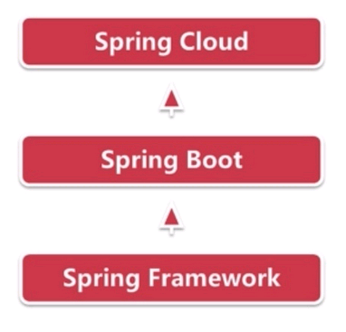
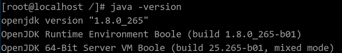
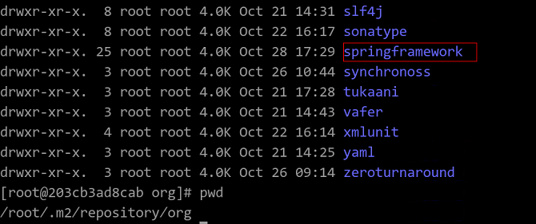
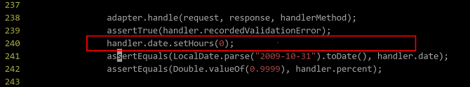
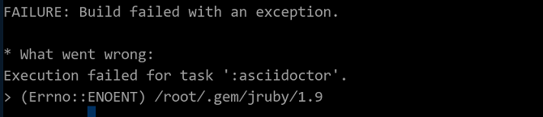
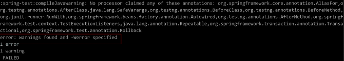
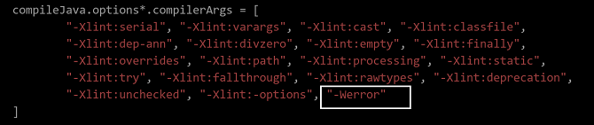
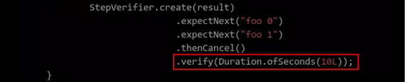

# Guide to Porting Spring Framework to openEuler

[[toc]]

## Software Overview

### Spring Framework

Spring Framework is an open source framework that aims to solve problems that occur when a Java EE application is developed using the Enterprise JavaBean (EJB), such as redundant code and complex configurations. Spring is a container that supports multiple technologies, such as JMS, MQ, and UnitTest. It also uses aspect oriented programming (AOP) to facilitate transaction and log management, indicating its solid support for mainstream frameworks.

[Figure 1](#fig1601161484619) shows the Spring Framework architecture.

**Figure 1** Spring Framework structure <a name="fig1601161484619"></a>  


The Spring Framework consists of three core modules: Spring-Core, Spring-Context, and Spring-Beans. It also incorporates basic modules such as Spring-AOP, Spring-Web, and Spring-Webmvc. The functions of each module are described as follows:

**Spring-Core**

The core container provides basic functions of the Spring Framework, including the main module BeanFactory that manages the Bean.

**Spring-Context** 

A configuration file that provides context for the Spring Framework. The context includes enterprise services such as JNDI, EJB, e-mail, internationalization, validation, and scheduling.

**Spring-Beans** 

The package that implements the inversion of control (IoC), which is a key feature of the Spring Framework.

**Spring-AOP** 

This module integrates the aspect-oriented programming (AOP) into the Spring Framework, making it easy to manage any object with the Spring Framework. The Spring-AOP module provides a transaction management service for objects in Spring-based applications, allowing applications to perform declarative transaction management without EJB components.

**Spring-Web** 

This module is built on top of the Spring-Context module and provides context for web-based applications.

**Spring-Webmvc** 

This module implements all the basic features of a core spring framework. It helps build web applications and incorporates a large number of view technologies. The MVC framework becomes highly configurable using the policy interface.

According to the preceding description, the Spring-Beans (implementation package of IOC) and the Spring-AOP (implementation package of AOP) are the basis of the entire framework, and Spring-Core is the core of the entire framework. Spring-Context provides the context environment and binds each module. The web functions are implemented by Spring-Web and Spring-Webmvc.

### Spring Boot and Spring Cloud

After introducing the Spring Framework to the local Maven repository, you can use this framework to build Maven for Java programs. However, Spring build requires configuring a large number of XML files, which is complex. Building Spring Boot based on the Spring Framework helps quickly build Spring applications. Spring Cloud is a distributed environment for building Spring Boot, that is, cloud applications. Spring Boot connects the upper layer to the lower layer.

[Figure 2](#fig1601161484620) shows the relationship between Spring Framework, Spring Boot, and Spring Cloud.

**Figure 2** Module relationship <a name="fig1601161484620"></a>  


Spring Boot is a quick configuration solution of Spring and can be used to quickly develop a single microservice. It focuses on conveniently deploying services on a single server. Spring Cloud is a cloud application development tool based on Spring Boot, and is the global service governance framework. Spring Boot can be used for development projects without Spring Cloud, but Spring Cloud cannot be used without Spring Boot.

## Environment Configuration

It is recommended that the memory of the deployment environment be greater than 2 GB.

### Software platform

|  Software   |Version Number |Installation Method   |
|:---  |:----  |:----  |
| openEuler | 20.03-LTS-SP1 |iso  |
| tar | 1.32 |yum install  |
| wget | 1.20.3 |yum install |
| git | 2.27 |yum install |

### Required dependency packages

|  Software   |Version Number  |Installation Method   |
|:---  |:----  |:----  |
| jdk | 1.8.0 |Refer to Basic Software Installation  |
| maven | 3.5.4 |Refer to Basic Software Installation  |

## System Configuration

### Configuring the Local Yum Source

If the Internet is available in the environment, you can use the configured source or add other network sources without configuring the local source.

1. Run the following command to configure the source file and view the repo file of the configured Yum source:

    ```
    # cat /etc/yum.repos.d/openEuler.repo
    [base]
    name=base
    baseurl=file:///mnt
    enable=1
    gpgcheck=0
    ```

2. Run the following command to mount the source image:
   
    ```
    # mount /root/openEuler-20.03-LTS-SP1-everything-aarch64-dvd.iso /mnt
    ```

## Software Compilation

### Using the Local Yum Source to Install Basic Software

1. Run the following command to install the Maven build tool:
   
    ```
    # yum -y install maven
    ```

2. Run the following command to install JDK using the Yum source:
   
    ```
    # yum -y install java-1.8.0-openjdk-devel
    ```

3. Verify the installation. After the installation is completed, run the following commands to check the Maven and Java versions and the javac usage:
   
    ```
    # mvn -version
    # java -version
    # javac -help
    ```
   
    

### Installing Spring Framework to the Local Maven Repository

1. Run the following commands to obtain the Spring Framework source code package:
   
    ```
    # cd /home
    # wget https://github.com/Spring-projects/Spring-framework/archive/v5.2.10.RELEASE.tar.gz
    # tar -xvf v5.2.10.RELEASE.tar.gz
    ```

2. Run the following commands to compile the Spring Framework source code package. If the compilation is successful, the following information is displayed:
   
    ```
    # cd /home/spring-framework-5.2.10.RELEASE
    # ./gradlew build
    ```
   
   

3. Run the following command to install Spring Framework to the local Maven repository:
   
    ```
    # ./gradlew publishToMavenLocal -x javadoc -x dokka -x asciidoctor
    ```
   
    After the installation is completed, the **springframework** folder is generated in `/root/.m2/repository/org/`. 
   
    

### Compiling Tomcat Cases of the Spring Boot Project

1. Run the following commands to obtain the case source code:
   
    ```
    # cd /home
    # wget https://github.com/Spring-projects/Spring-boot/archive/v1.5.4.RELEASE.tar.gz
    # tar -xvf v1.5.4.RELEASE.tar.gz
    # cd /home/spring-boot-1.5.4.RELEASE/spring-boot-samples/spring-boot-sample-tomcat
    ```

2. Run the following command to compile the project:
   
    ```
    # mvn package -DskipTests
    ```

### Compiling Cases of the Spring Cloud Project

1. Run the following commands to compile the Spring-cloud-gateway-sample project:
   
    ```
    # cd /home
    # git clone https://github.com/Spring-cloud-samples/Spring-cloud-gateway-sample.git
    # cd /home/Spring-cloud-gateway-sample
    # mvn package -DskipTests
    ```

2. Run the following commands to compile the zuul-server-1.0.0.BUILD-SNAPSHOT project:
   
    ```
    # cd /home
    # git clone https://github.com/Spring-cloud-samples/zuul-server.git 
    # cd /home/zuul-server
    # mvn package -DskipTests
    ```

3. Run the following commands to compile the eureka-0.0.1-SNAPSHOT project:
   
    ```
    # cd /home
    # git clone https://github.com/Spring-cloud-samples/eureka.git 
    # cd /home/eureka
    # mvn package -DskipTests
    ```

4. Run the following commands to compile the feign-eureka project:
   
    ```
    # cd /home
    # git clone https://github.com/Spring-cloud-samples/feign-eureka.git
    # cd /home/feign-eureka
    # mvn package -DskipTests
    ```

## Software Running

### Examples of Running Spring Boot on a Single-Node System

1. If the spring-boot-sample-tomcat is compiled successfully, the **spring-boot-sample-tomcat-1.5.4.RELEASE.jar** file is generated in the `/home/spring-boot-1.5.4.RELEASE/spring-boot-samples/spring-boot-samples-tomcat/target` folder in the project directory. Run the following command to execute the JAR file:
   
    ```
    # java -jar spring-boot-sample-tomcat-1.5.4.RELEASE.jar
    ```

2. After `tomcat start` is displayed on the console, open a new window and run the following command to check the running status of the Tomcat service:
   
    ```
    # curl http://localhost:8080
    ```
   
    If **helloworld** is displayed in the command output, the execution is successful.

3. To disable the Spring-Boot service, press **Ctrl+C** in the window displayed in Step 1.

### Examples of Running Spring Cloud on a Single-Node System

#### Example of running the spring-cloud-gateway-sample project

1. If the spring-cloud-gateway-sample project is compiled successfully, the **spring-cloud-gateway-sample-0.0.1-SNAPSHOT.jar** file is generated in the **/home/Spring-cloud-gateway-sample/target** folder in the project directory. Run the following commands:
  
    ```
    # java -jar spring-cloud-gateway-sample-0.0.1-SNAPSHOT.jar
    ```
2. After the message **Started DemogatewayApplication** is displayed on the console, start a new window and run the following command to check the service running status.If the command output shown in the following figure is displayed, the execution is successful.

    ```
    # curl http://localhost:8080/get
    ```
    
	
3. To stop the service, press **Ctrl+C** in the windows in Step 1.

#### Example of running the zuul-server project

1. Run the zuul-server service after running the eureka project. In the **/home/eureka/target** directory, run the following command to start the eureka service:

    ```
    # java -jar eureka-0.0.1-SNAPSHOT.jar
    ```

2. After the message **Started EurekaApplicattion** is displayed on the console, start a new window and run the following command in the project directory **/home/zuul-server/target** to start the zuul-server service:

    ```
    # java -jar zuul-server-1.0.0.BUILD-SNAPSHOT.jar
    ```

3. After the message Started ZuulServerApplicatttion is displayed on the console, start a new window and run the following command to check the service running status:

    ```
    # curl http://localhost:8765
    ```
    
	After the zuul-server service is started, the console displays the access port 8765. When you access the local port 8765 using curl, the 404 information with the timestamp is returned, and an access event is recorded on the server.	 
  
    The following figure shows how to access the port 8765 using curl:

     	
  
    The following figure shows the log information printed by the server when the user accesses the port:

    

4. To stop the service, press **Ctrl+C** in the windows in Step 2 and Step 3.

#### Example of running the feign-eureka project 

1. Run the zuul-server service after running the eureka project. In the **/home/eureka/target** directory, run the following command to start the eureka service:

    ```
    # java -jar eureka-0.0.1-SNAPSHOT.jar
    ```

2. After the message **Started EurekaApplicattion** is displayed on the console, start a new window and run the following command in the project directory **/home/feign-eureka/server/target** to start the zuul-server service:

    ```
    # java -jar feign-eureka-hello-server-0.0.1-SNAPSHOT.jar
    ```

3. After the message **Started HelloServerApplication** is displayed on the console, start a new window and run the following command in the project directory **/home/feign-eureka/client/target** to start the zuul-server service:

    ```
    # java -jar feign-eureka-hello-client-0.0.1-SNAPSHOT.jar
    ```

4. After the message **Started HelloClientApplication**  is displayed on the console, start a new window and run the following command to check the service running status:

    ```
    # curl http://localhost:7211
    ```

    After the service is started, you can see that port 7211 is enabled on the client console. Access this port using curl to obtain the Hello Server information.
  
    The following figure shows the opened port 7211 of the feign-eureka project:
  
    
  
    Access the feign-eureka service to view the returned result, as shown in the following figure:
  
    

## FAQs

### Spring-webmvc:test Fails During Spring Framework Compilation

**Symptom**

The assertion in MvcNamespaceTests.java fails to pass the test. The following figure shows the failure message:


**Cause Analysis**

There is an 8-hour difference between the message return time displayed on two servers.

**Solution**

Modify the `spring-webmvc/src/test/java/org/springframework/web/servlet/config/MvcNamespaceTests.java` file in the project directory.

Forcibly set the date member time of the handler to **0**, which is the same as the default time converted from the local date.



### Fails to Execute the asciidoctor Task

**Symptom**

The system prompts that the `/root/.gem/jruby/1.9` folder cannot be found.



**Cause Analysis**

The Gradle release used by some Spring Framework versions may have problems when running on JDK 9 (due to the upgrade from AspectJ to 1.9).

**Solution**

Run the `./gradlew clean test` command to build the environment.

### Fails to Execute the Spring-test:compileJava Task

**Symptom**

The Spring-test:compileJava task fails to be executed, and the error message in the following figure is displayed:



**Cause Analysis**

The error message is displayed due to the warning. According to the cause analysis, some old packages do not exist in the repo (the repo source is specified by the **build.gradle** script). As a result, a warning is reported during compilation.

**Solution**

Edit the **build.gradle** script of the project and delete the **-Werror** option from the compilation parameters.



### The repo Source Is Invalid

**Symptom**

The repo source is invalid, and the error message in the following figure is displayed: 


**Cause Analysis**

This issue occasionally occurs because the network is unstable or the repo source specified in the compilation script fails to provide the required package.

**Solution**

Check whether the repo source settings of the **build.gradle** file are correct. Log in to the repo source and check whether any file is missing.


The following valid repo sources are for reference:

[https://repo.Spring.io/plugins-release](https://repo.Spring.io/plugins-release)

[https://repo.Springsource.org/plugins-release](https://repo.Springsource.org/plugins-release)

### Build Failed Due to Timeout Error

**Symptom**

The network-related modules fail to pass the test, and the message Task: spring-webflux:test FAILED is displayed. In addition, the code line that fails is not reported in each time of compilation.

**Cause Analysis**

According to the code analysis, the build fails because the response from the remote service is not received within the specified period and a timeout error occurs.


**Solution**

Prolong the timeout period based on the code line prompted in the error message. You can modify .verify\(Duration.ofSeconds\(TIMEOUT\)\) or .block\(TIMEOUT\) in the code prompted to double the value of TIMEOUT. For example, the timeout period is changed from 5 seconds to 10 seconds in the following figure:


