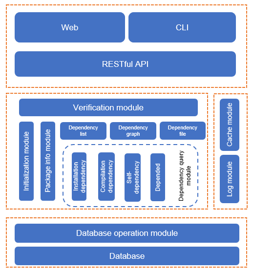

# pkgship

<!-- TOC -->
- [pkgship](#pkgship)
  - [Introduction](#Introduction)
  - [Architecture](#Architecture)
  - [Downloading the Software](#Downloading the Software)
  - [Operating Environment](#Operating Environment)
  - [Installing the Tool](#Installing the Tool)
  - [Configuring Parameters](#Configuring Parameters)
  - [Starting and Stopping the Service](#Starting and Stopping the Service)
  - [Using the Tool](#Using the Tool)
  - [Viewing and Dumping Logs](#Viewing and Dumping Logs)

<!-- /TOC -->

## Introduction

The pkgship is a query tool used to manage the dependency of OS software packages and provide a complete dependency graph. The pkgship provides functions such as software package dependency query, lifecycle management, and patch query.

1. Software package dependency query: Allow community personnel to understand the impact on software when software packages are introduced, updated, or deleted.
2. Patch query: Allow community personnel to learn about the patches in the openEuler software package and obtain the patch information. For details, see [patch-tracking](../patch-tracking/README.md).

## Architecture

The system uses the Flask-RESTful development mode. The following figure shows the architecture:



## Downloading the Software

* The repo source is officially released at: <https://repo.openeuler.org/>
* You can obtain the source code at: <https://gitee.com/openeuler/pkgship>
* You can obtain the RPM package at: <https://117.78.1.88/project/show/openEuler:Mainline>

## Operating Environment

- Hardware configuration:

| Item| Recommended Specification|
|----------|----------|
| CPU| 8 cores|
| Memory| 32 GB (minimum: 4 GB)|
| Network bandwidth| 300 Mbit/s|
| I/O| 375 MB/s|

- Software configuration:

| Name| Specifications|
|----------|----------|
| Elasticsearch| 7.10.1. Single-node and cluster deployment is available.|
| Redis| 5.0.4 or later is recommended. You are advised to set the size to 3/4 of the memory.|
| Python| 3.8 or later.|

## Installing the Tool

**1\. Installing the pkgship**

You can use either of the following methods to install the pkgship:

* Method 1: Mount the repo source using DNF.   
Use DNF to mount the repo source where the pkgship is located (for details, see the [Application Development Guide](https://openeuler.org/zh/docs/20.09/docs/ApplicationDev/%E5%BC%80%E5%8F%91%E7%8E%AF%E5%A2%83%E5%87%86%E5%A4%87.html)). Then run the following command to download and install the pkgship and its dependencies:
  
  ```bash
  dnf install pkgship
  ```

* Method 2: Install the RPM package. Download the RPM package of the pkgship and run the following command to install the pkgship (x.x-x indicates the version number and needs to be replaced with the actual one):
  
  ```bash
  rpm -ivh pkgship-x.x-x.oe1.noarch.rpm
  ```
  
  Or
  
  ```bash
  dnf install pkgship-x.x-x.oe1.noarch.rpm
  ```

**2\. Installing Elasticsearch and Redis**

If Elasticsearch or Redis is not installed in the environment, you can execute the automatic installation script after the pkgship is installed.

The default script path is as follows:

```
/etc/pkgship/auto_install_pkgship_requires.sh
```

Run the following command:

```
/bin/bash auto_install_pkgship_requires.sh elasticsearch
```

Or

```
 /bin/bash auto_install_pkgship_requires.sh redis
```

**3\. Adding a User After the Installation**

After the pkgship software is installed, the system automatically creates a user named **pkgshipuser** and a user group named **pkgshipuser**. They will be used when the service is started and running.

## Configuring Parameters

1\. Configure the parameters in the configuration file. The default configuration file of the system is stored in **/etc/pkgship/package.ini**. Modify the configuration file as required.

```
vim /etc/pkgship/package.ini
```

```ini
[SYSTEM-System Configuration]
; Path for storing the .yaml file imported during database initialization. The .yaml file records the location of the imported .sqlite file.
init_conf_path=/etc/pkgship/conf.yaml

; Service query port
query_port=8090

; Service query IP address
query_ip_addr=127.0.0.1

; Address of the remote service. The command line can directly call the remote service to complete the data request.
remote_host=https://api.openeuler.org/pkgmanage

; Directory for storing temporary files during initialization and download. The directory will not be occupied for a long time. It is recommended that the available space be at least 1 GB.
temporary_directory=/opt/pkgship/tmp/

[LOG-Logs]
; Service log storage path
log_path=/var/log/pkgship/

; Log level. The options are as follows:
; INFO DEBUG WARNING ERROR CRITICAL
log_level=INFO

; Maximum size of a service log file. If the size of a service log file exceeds the value of this parameter, the file is automatically compressed and dumped. The default value is 30 MB.
max_bytes=31457280

; Maximum number of backup log files. The default value is 30.
backup_count=30

[UWSGI-Web Server Configuration]
; Operation log path
daemonize=/var/log/pkgship-operation/uwsgi.log
; Size of data transmitted between the front end and back end
buffer-size=65536
; Network connection timeout interval
http-timeout=600
; Service response time
harakiri=600

[REDIS-Cache Configuration]
; The address of the Redis cache server can be the released domain or IP address that can be accessed.
; The default link address is 127.0.0.1.
redis_host=127.0.0.1

; Port number of the Redis cache server. The default value is 6379.
redis_port=6379

; Maximum number of connections allowed by the Redis server at a time.
redis_max_connections=10

[DATABASE-Database]
; Database access address. The default value is the IP address of the local host.
database_host=127.0.0.1

; Database access port. The default value is 9200.
database_port=9200

```

2\. Create a YAML configuration file to initialize the database. The **conf.yaml** file is stored in the **/etc/pkgship/** directory by default. The pkgship reads the name of the database to be created and the SQLite file to be imported based on this configuration. You can also configure the repo address of the SQLite file. An example of the **conf.yaml** file is as follows:

```yaml
dbname: oe20.03   #Database name
src_db_file: /etc/pkgship/repo/openEuler-20.09/src  #Local path of the source package
bin_db_file: /etc/pkgship/repo/openEuler-20.09/bin  #Local path of the binary package
priority: 1 #Database priority

dbname: oe20.09
src_db_file: https://repo.openeuler.org/openEuler-20.09/source  #Repo source of the source package
bin_db_file: https://repo.openeuler.org/openEuler-20.09/everything/aarch64 #Repo source of the binary package
priority: 2
```

> To change the storage path, change the value of **init\_conf\_path** in the **package.ini** file.
> 
> The SQLite file path cannot be configured directly.
> 
> The value of **dbname** can contain only lowercase letters and digits.

## Starting and Stopping the Service

The pkgship can be started and stopped in two modes: systemctl mode and pkgshipd mode. In systemctl mode, the automatic startup mechanism can be stopped when an exception occurs. You can run any of the following commands:

```shell
systemctl start pkgship.service Start the service.

systemctl stop pkgship.service Stop the service.

systemctl restart pkgship.service Restart the service.
```

```sh
pkgshipd start Start the service.

pkgshipd stop Stop the service.
```

> Only one mode is supported in each start/stop period. The two modes cannot be used at the same time.
> 
> The pkgshipd startup mode can be used only by the **pkgshipuser** user.

## Using the Tool

1. Initialize the database.
   
   > Application scenario: After the service is started, to query the package information and dependency in the corresponding database (for example, oe20.03 and oe20.09), you need to import the SQLite (including the source code library and binary library) generated by the **createrepo** to the service. Then insert the generated JSON body of the package information into the corresponding database of Elasticsearch. The database name is the value of d**bname-source/binary** generated based on the value of **dbname** in the **conf.yaml** file.
   
   ```bash
   pkgship init [-filepath path]
   ```
   
   > Parameter description:   
**-filepath**: (Optional) Specifies the path of the initialization configuration file **config.yaml.** You can use either a relative path or an absolute path. If no parameter is specified, the default configuration is used for initialization.

2. Query a single package.
   
   You can query details about a source package or binary package (**packagename**) in the specified **database** table.
   
   > Application scenario: You can query the detailed information about the source package or binary package in a specified database.
   
   ```bash
   pkgship pkginfo $packageName $database [-s]
   ```
   
   > Parameter description:   
**packagename**: (Mandatory) Specifies the name of the software package to be queried.   
**database**: (Mandatory) Specifies the database name.
   > 
   > **-s**: (Optional) Specifies that the source package `src` is to be queried by `-s`. If this parameter is not specified, the binary package information of `bin` is queried by default.

3. Query all packages.
   
   Query information about all packages in the database.
   
   > Application scenario: You can query information about all software packages in a specified database.
   
   ```bash
   pkgship list $database [-s]
   ```
   
   > Parameter description:   
**database**: (Mandatory) Specifies the database name.   
**-s**: (Optional) Specifies that the source package `src` is to be queried by `-s`. If this parameter is not specified, the binary package information of `bin` is queried by default.

4. Query the installation dependency.
   
   Query the installation dependency of the binary package (**binaryName**).
   
   > Application scenario: When you need to install the binary package A, you need to install B, the installation dependency of A, and C, the installation dependency of B, etc. A can be installed only after all the installation dependencies are installed in the system. Therefore, before installing the binary package A, you may need to query all installation dependencies of A. You can run the following command to query multiple databases based on the default priority of the platform, and to customize the database query priority.
   
   ```bash
   pkgship installdep [$binaryName $binaryName1 $binaryName2...] [-dbs] [db1 db2...] [-level] $level
   ```
   
   > Parameter description:   
**binaryName**: (Mandatory) Specifies the name of the dependent binary package to be queried. Multiple packages can be transferred.
   > 
   > **-dbs:** (Optional) Specifies the priority of the database to be queried. If this parameter is not specified, the database is queried based on the default priority.
   > 
   > **-level**: (Optional) Specifies the dependency level to be queried. If this parameter is not specified, the default value **0** is used, indicating that all levels are queried.

5. Query the compilation dependency.
   
   Query all compilation dependencies of the source code package (**sourceName**).
   
   > Application scenario: To compile the source code package A, you need to install B, the compilation dependency package of A. To install B, you need to obtain all installation dependency packages of B. Therefore, before compiling the source code package A, you need to query the compilation dependencies of A and all installation dependencies of these compilation dependencies. You can run the following command to query multiple databases based on the default priority of the platform, and to customize the database query priority.
   
   ```bash
   pkgship builddep [$sourceName $sourceName1 $sourceName2..] -dbs [db1 db2 ..] [-level] $level
   ```
   
   > Parameter description:   
**sourceName**: (Mandatory) Specifies the name of the source package on which the compilation depends. Multiple packages can be queried.
   > 
   > **-dbs:** (Optional) Specifies the priority of the database to be queried. If this parameter is not specified, the database is queried based on the default priority.
   > 
   > **-level**: (Optional) Specifies the dependency level to be queried. If this parameter is not specified, the default value **0** is used, indicating that all levels are queried.

6. Query the self-compilation and self-installation dependencies.
   
   Query the installation and compilation dependencies of a specified binary package (**binaryName**) or source package (**sourceName**). In the command, **\[pkgName]** indicates the name of the binary package or source package to be queried. When querying a binary package, you can query all installation dependencies of the binary package, and the compilation dependencies of the source package corresponding to the binary package, as well as all installation dependencies of these compilation dependencies. When querying a source package, you can query its compilation dependency, and all installation dependencies of the compilation dependency, as well as all installation dependencies of the binary packages generated by the source package. In addition, you can run this command together with the corresponding parameters to query the self-compilation dependency of a software package and the dependency of a subpackage.
   
   > Application scenario: If you want to introduce a new software package based on the existing version library, you need to introduce all compilation and installation dependencies of the software package. You can run this command to query these two dependency types at the same time to know the packages introduced by the new software package, and to query binary packages and source packages.
   
   ```bash
    pkgship selfdepend [$pkgName1 $pkgName2 $pkgName3 ..] [-dbs] [db1 db2..] [-b] [-s] [-w]
   ```
   
   > Parameter description:
   > 
   > **pkgName**: (Mandatory) Specifies the name of the software package on which the installation depends. Multiple software packages can be transferred.
   > 
   > **-dbs:** (Optional) Specifies the priority of the database to be queried. If this parameter is not specified, the database is queried based on the default priority.
   > 
   > **-b**: (Optional) Specifies that the package to be queried is a binary package. If this parameter is not specified, the source package is queried by default.
   > 
   > **-s**: (Optional) If **-s** is specified, all installation dependencies, compilation dependencies (that is, compilation dependencies of the source package on which compilation depends), and installation dependencies of all compilation dependencies of the software package are queried. If **-s** is not added, all installation dependencies and layer-1 compilation dependencies of the software package, as well as all installation dependencies of layer-1 compilation dependencies, are queried.
   > 
   > **-w**: (Optional) If **-s** is specified, when a binary package is introduced, the query result displays the source package corresponding to the binary package and all binary packages generated by the source package. If **-w** is not specified, only the corresponding source package is displayed in the query result when a binary package is imported.

7. Query dependency.   
Query the packages that depend on the software package (**pkgName**) in a database (**dbName**).
   
   > Application scenario: You can run this command to query the software packages that will be affected by the upgrade or deletion of the software source package A. This command displays the source packages (for example, B) that depend on the binary packages generated by source package A (if it is a source package or the input binary package for compilation). It also displays the binary packages (for example, C1) that depend on A for installation. Then, it queries the source package (for example, D) that depend on the binary package generated by B C1 for compilation and the binary package (for example E1) for installation. This process continues until it traverses the packages that depend on the binary packages.
   
   ```bash
    pkgship bedepend dbName [$pkgName1 $pkgName2 $pkgName3] [-w] [-b] [-install/build]
   ```
   
   > Parameter description:
   > 
   > **dbName**: (Mandatory) Specifies the name of the repository whose dependency needs to be queried. Only one repository can be queried each time.
   > 
   > **pkgName**: (Mandatory) Specifies the name of the software package to be queried. Multiple software packages can be queried.
   > 
   > **-w**: (Optional) If **-w** is not specified, the query result does not contain the subpackages of the corresponding source package by default. If **\[-w]** is specified after the command, not only the dependency of binary package C1 is queried, but also the dependency of other binary packages (such as C2 and C3) generated by source package C corresponding to C1 is queried.
   > 
   > **-b**: (Optional) Specifies `-b` and indicates that the package to be queried is a binary package. By default, the source package is queried.
   > 
   > **-install/build**: (Optional) `-install` indicates that installation dependencies are queried. `-build` indicates that build dependencies are queried. By default, all dependencies are queried. `-install` and `-build` are exclusive to each other.

8. Query the database information.
   
   > Application scenario: Check which databases are initialized in Elasticsearch. This function returns the list of initialized databases based on the priority.
   
   `pkgship dbs`

9. Obtain the version number.
   
   > Application scenario: Obtain the version number of the pkgship software.
   
   `pkgship -v`

## Viewing and Dumping Logs

**Viewing Logs**

When the pkgship service is running, two types of logs are generated: service logs and operation logs.

1\. Service logs:

Path: **/var/log/pkgship/log\_info.log**. You can customize the path through the **log\_path** field in the **package.ini** file.

Function: This log records the internal running of the code to facilitate fault locating.

Permission: The permissions on the path and the log file are 755 and 644, respectively. Common users can view the log file.

2\. Operation logs:

Path: **/var/log/pkgship-operation/uwsgi.log**. You can customize the path through the **daemonize** field in the **package.ini** file.

Function: This log records user operation information, including the IP address, access time, URL, and result, to facilitate subsequent queries and record attacker information.

Permission: The permissions on the path and the log file are 700 and 644, respectively. Only the **root** and **pkgshipuser** users can view the log file.

**Dumping Logs**

1\. Service log dumping:

- Dumping mechanism
  
  Use the dumping mechanism of the logging built-in function of Python to back up logs based on the log size.

> The items are used to configure the capacity and number of backups of each log in the **package.ini** file.
> 
> ```ini
> ; Maximum capacity of each file, the unit is byte, default is 30M
> max_bytes=31457280
> 
> ; Number of old logs to keep;default is 30
> backup_count=30
> ```

- Dumping process
  
  After a log is written, if the size of the log file exceeds the configured log capacity, the log file is automatically compressed and dumped. The compressed file name is **log\_info.log.***x***.gz**, where *x* is a number. A smaller number indicates a later backup.
  
  When the number of backup log files reaches the threshold, the earliest backup log file is deleted and the latest compressed log file is backed up.

2\. Operation log dumping:

- Dumping mechanism
  
  A script is used to dump data by time. Data is dumped once a day and is retained for 30 days. Customized configuration is not supported.
  
  > The script is stored in **/etc/pkgship/uwsgi\_logrotate.sh**.

- Dumping process
  
  When the pkgship is started, the script for dumping data runs in the background. From the startup, dumping and compression are performed every other day. A total of 30 compressed files are retained. The compressed file name is **uwsgi.log-20201010***x***.zip**, where *x* indicates the hour when the file is compressed.
  
  After the pkgship is stopped, the script for dumping data is stopped and data is not dumped . When the pkgship is started again, the script for dumping data is executed again.
