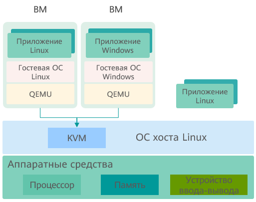

# Введение в понятие виртуализации

## Обзор

В компьютерных системах виртуализация применяется для управления ресурсами. Данная технология абстрагирует различные физические ресурсы компьютера (например, процессоры, модули памяти, диски и сетевые адаптеры), преобразует их и предоставляет для дальнейшей сегментации и объединения в одну или несколько конфигурационных сред компьютера. Виртуализация ломает привычные барьеры, делающие физическую структуру неделимой, и не ограничивает эти ресурсы архитектурой, географическим местоположением или физической конфигурацией существующих ресурсов. Таким образом, пользователи, оптимизируя загрузку аппаратных ресурсов компьютера, получают максимум выгоды от их использования.

С помощью данной технологии на физическом сервере работают несколько виртуальных машин (ВМ). Виртуальные машины совместно используют процессор, память и модули ввода-вывода физического сервера, но логически изолированы друг от друга. В технологии виртуализации физический сервер называется хост-машиной, виртуальная машина, работающая на хост-машине, называется гостевой, а операционная система (ОС), работающая на виртуальной машине, называется гостевой ОС. Между хост-машиной и ВМ существует уровень программного обеспечения, называемый уровнем виртуализации, на котором эмулируется виртуальное оборудование. Этот уровень виртуализации называется монитором виртуальной машины (см. следующий рисунок).

**Рис. 1** Виртуализированная архитектура

## Виртуализированная архитектура

В настоящее время основные технологии виртуализации делятся на два типа, в основе которых лежат разные структуры реализации монитора виртуальных машин:

- Модель гипервизора
  
  В этой модели монитор ВМ рассматривается как полная операционная система, имеющая функцию виртуализации. Монитор ВМ непосредственно управляет всеми физическими ресурсами, включая процессоры, память и устройства ввода-вывода.

- Хост-модель
  
  В этой модели физические ресурсы управляются традиционной операционной системой хоста, например Linux, Windows. ОС хоста не имеет функционала виртуализации. Монитор ВМ с функционалом виртуализации работает на ОС хоста как драйвер или программное обеспечение системы. Запуская службу ОС хоста, монитор ВМ получает ресурсы и эмулирует виртуальные процессор, память и устройства ввода-вывода. Виртуализация в данной модели реализована посредством KVM и Virtual Box.

Kernel-based Virtual Machine (KVM) — модуль ядра Linux, который делает Linux гипервизором. На [Рис. 2](#fig310953013541) показана архитектура KVM. KVM не эмулирует аппаратные устройства, а используется для реализации таких технологий аппаратной виртуализации, как Intel VT-x, AMD-V, Arm. QEMU в пользовательском режиме эмулирует материнскую плату, память и устройства ввода-вывода. Работая вместе с модулем KVM ядра, QEMU в пользовательском режиме эмулирует аппаратные ресурсы ВМ. Гостевая ОС работает на оборудовании, которое эмулируется посредством QEMU и KVM.

**Рис. 2** Архитектура KVM

## Компоненты виртуализации

Компоненты виртуализации в программном пакете openEuler:

- KVM: предоставляет базовую инфраструктуру виртуализации, в которой система Linux выступает в роли гипервизора. Несколько виртуальных машин могут работать одновременно на одном хосте.
- QEMU: эмулирует процессор и предоставляет набор моделей устройств для работы с KVM, ускоряя эмуляцию оборудования.
- Libvirt: предоставляет набор инструментов для управления виртуальными машинами, в том числе унифицированные, стабильные и открытые интерфейсы API, процесс демона (libvirtd) и инструмент управления командной строки по умолчанию (virsh).
- Open vSwitch: предоставляет набор инструментов для создания виртуальных сетей, поддерживает программные расширения, стандартные интерфейсы и протоколы управления (например, NetFlow, sFlow, IPFIX, RSPAN, CLI, LACP и 802.1ag).

## Характеристики виртуализации

Виртуализация имеет следующие характеристики:

- Раздел
  
  Технология виртуализации логически разделяет программные ресурсы на физическом сервере для запуска нескольких виртуальных машин (виртуальных серверов) с различными характеристиками.

- Изоляция
  
  Технология виртуализации эмулирует аппаратные ресурсы, создавая аппаратную среду под виртуальные машины, на которых запускаются операционные системы. Операционные системы каждой виртуальной машины работают независимо и изолировано друг от друга. Например, если операционная система какой-либо виртуальной машины завершает работу по причине ошибки или злонамеренного повреждения, это не влияет на ОС и приложения остальных ВМ.

- Инкапсуляция
  
  Инкапсуляция выполняется для каждой отдельной виртуальной машины. Функции инкапсуляции делают виртуальные машины более гибкими, чем физические машины. Возможна реализация таких функций, как миграция в реальном времени, создание мгновенных снимков и клонирование виртуальных машин. Функции помогут быстро развертывать и автоматически эксплуатировать центры обработки данных.

- Аппаратное обеспечение не играет роли
  
  После абстрагирования на виртуальный уровень виртуальные машины не привязаны напрямую к базовому аппаратному обеспечению и могут работать на других серверах без внесения изменений.

## Преимущества виртуализации

Для инфраструктуры центра обработки данных виртуализация дает следующие преимущества:

- Гибкость и масштабируемость
  
  Пользователи могут динамически выделять и перераспределять ресурсы в соответствии с динамическими изменениями потребностей в сервисах. Кроме того, в соответствии с требованиями к продукту пользователи могут планировать виртуальные машины с разными спецификациями и регулировать объем логических ресурсов без изменения конфигурации физических ресурсов.

- Более высокая доступность и усовершенствованные методы O\&M
  
  Виртуализация дает возможность использовать такие новые инструменты, как миграция в реальном времени, мгновенные снимки, обновление в реальном времени и автоматическое аварийное восстановление. Физические ресурсы можно удалять, обновлять или изменять, и это не отразится на восприятии пользователей. Новый подход создаст условия для непрерывной работы сервисов и автоматизации процессов эксплуатации и техобслуживания.

- Усиление безопасности
  
  Виртуализация обеспечивает изоляцию на уровне ОС и аппаратное управление привилегиями на операции, выполняемые процессором. По сравнению с простыми механизмами общего доступа виртуализация повышает безопасность и реализует контролируемый и защищенный доступ к данным и сервисам.

- Высокая эффективность использования ресурсов
  
  Виртуализация поддерживает совместное использование физических ресурсов и пулов ресурсов в динамическом режиме, оптимизируя их загрузку.

## Виртуализация openEuler

openEuler предоставляет компоненты для виртуализации KVM с поддержкой архитектур процессоров AArch64 и x86\_64.