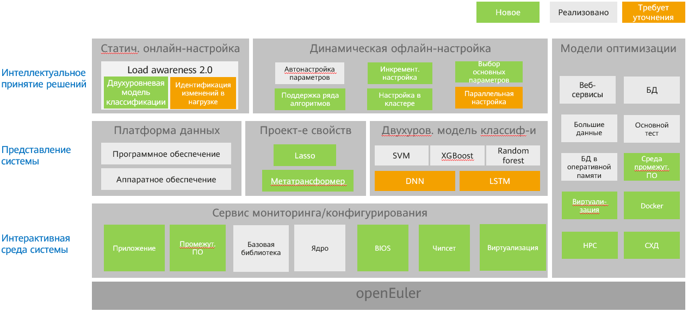

# Ознакомительная информация о приложении A-Tune

- [Ознакомительная информация о приложении A-Tune](#getting-to-know-a-tune)
  - [Введение](#introduction)
  - [Архитектура](#architecture)
  - [Поддерживаемые функции и сервисные модели](#supported-features-and-service-models)

## Введение

Операционная система (ОС) представляет собой базовое программное обеспечение, которое связывает приложения с аппаратными средствами. Поэтому настройка конфигураций ОС и приложений является важным моментом в работе пользователя. От настройки зависит производительность работы служб, оптимальность которой достигается полной загрузкой программных и аппаратных ресурсов. Однако в операционной системе функционируют многочисленные типы рабочих нагрузок и различные приложения, которым требуются разные ресурсы. В настоящее время среда работы приложений, компонуемая из аппаратного и программного обеспечения, включает более 7000 объектов конфигурации. По мере усложнения сервисов и увеличения числа объектов оптимизации временные затраты на оптимизацию растут по экспоненте. В результате резко снижается эффективность данного процесса. Оптимизация становится сложной задачей, создавая пользователям серьезные проблемы.

Кроме того, являясь инфраструктурным программным обеспечением, ОС предоставляет большой набор функций управления программными и аппаратными ресурсами. То, какие функции потребуются, определяет сценарий применения. Поэтому решение о том, какие функции включить, а какие отключить, принимается на основе сценария, а определенной комбинацией функций можно добиться наиболее оптимальной производительности работы приложений.

В реальной среде любого предприятия могут работать сотни и тысячи сценариев, и каждый сценарий требует большого числа аппаратных конфигураций для ресурсов вычисления и хранения, сетевых ресурсов. В лабораторных условиях невозможно предусмотреть все приложения, бизнес-сценарии и комбинации аппаратных средств.

Для решения описанных задач сообщество openEuler разработало приложение A-Tune.

A-Tune — это движок, оптимизирующий производительность системы на основе искусственного интеллекта. С помощью технологий искусственного интеллекта A-Tune точно определяет рабочий сценарий, набор рабочих характеристик и формирует логический вывод, который позволит принять правильное решение, оптимально скомбинировать системные параметры и разработать рекомендации для достижения оптимального состояния работы приложений.

## Архитектура

На следующем рисунке показана основная техническая архитектура A-Tune, состоящая из модуля интеллектуального принятия решений, системного профиля и системы взаимодействия.

- Уровень интеллектуального принятия решений состоит из подсистемы осведомленности, которая выполняет функции интеллектуального анализа и оповещения о состоянии приложений, и подсистемы принятия решений, которая принимает решения по оптимизации работы системы.
- Уровень системного профиля состоит из модуля компоновки функций и двухуровневой модели классификации. Модуль компоновки функций служит для автоматического выбора сервисных функций, а двухуровневая модель классификации используется для обучения и классификации сервисных моделей.
- Уровень системы взаимодействия отслеживает и конфигурирует различные системные ресурсы и выполняет политики оптимизации.

## Поддерживаемые функции и сервисные модели

### Поддерживаемые функции

В [Табл. 1](#table1919220557576) приведены основные функции, поддерживаемые приложением A-Tune, их уровень зрелости и рекомендации по использованию.

**Табл. 1** Перечень функций с уровнями зрелости

| **Функция**                                                  | **Уровень зрелости** | **Рекомендации по использованию** |
| ------------------------------------------------------------ | -------------------- | --------------------------------- |
| Автоматическая оптимизация 11 приложений в 7 типах рабочих нагрузок | Протестировано       | Пробное использование             |
| Пользовательский профиль и сервисные модели                  | Протестировано       | Пробное использование             |
| Автоматическая оптимизация параметров                        | Протестировано       | Пробное использование             |

### Поддерживаемые сервисные модели

Исходя из характеристик рабочей нагрузки приложений, A-Tune выделяет 11 типов сервисов. Подробная информация о факторах, снижающих производительность каждого типа сервиса, и о приложениях, поддерживаемых A-Tune, приведена в [Табл. 2](#table2819164611311).

**Табл. 2** Поддерживаемые типы рабочих нагрузок и приложения

| **Категория сервиса**              | **Тип**                                      | **Узкое место**                                                                | **Поддерживаемые приложения**     |
| -----------------------------------| -------------------------------------------- | ------------------------------------------------------------------------------ | ----------------------------------- |
| default                            | Тип по умолчанию                                             |Низкая загрузка ресурсов процессора, пропускной способности памяти, сети и устройств ввода-вывода.          | --       |
| webserver                          |Приложение HTTPS                             |Высокая загрузка ресурсов процессора.                                                          | Nginx      |
| big_database                       |База данных                                      | - Реляционная база данных  Чтение: высокая загрузка ресурсов процессора, пропускной способности памяти и сети.  Запись: высокая загрузка ресурсов устройств ввода-вывода.  - Нереляционная база данных  Высокая загрузка ресурсов процессора и устройств ввода-вывода. |MongoDB, MySQL, PostgreSQL, and MariaDB        |
| big_data                           |Большие данные                                      |Высокая загрузка ресурсов процессора и устройств ввода-вывода.                                                                       |Hadoop and Spark   |
| in-memory_computing                |Приложение с интенсивным потреблением памяти                  |Высокая загрузка ресурсов процессора и пропускной способности памяти.                                                          |SPECjbb2015        |
| in-memory_database                 |Приложение с интенсивным потреблением вычислительных и сетевых ресурсов   |Высокая загрузка одноядерного процессора и сетевых ресурсов в многоэкземплярных сценариях.      | Redis             |
| single_computer_intensive_jobs     |Приложение с интенсивным потреблением вычислительных ресурсов               |Высокая загрузка ресурсов одноядерного процессора и пропускной способности памяти некоторых подэлементов.     | SPECCPU2006       |
| communication                      |Приложение с интенсивным потреблением сетевых ресурсов                 |Высокая загрузка ресурсов процессора и сети.                                                                   | Dubbo             |
| idle                               |Система в состоянии ожидания                          |Система находится в состоянии ожидания, и на ней не запущены никакие приложения.                                            | --             |

