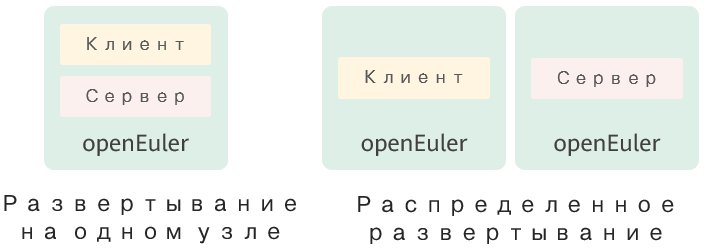

# Установка и развертывание

В этой главе описывается процесс установки и развертывания A-Tune.

- [Установка и развертывание](#installation-and-deployment)
  - [Требования к программному и аппаратному обеспечению](#software-and-hardware-requirements)
  - [Подготовка среды](#environment-preparation)
  - [Установка A-Tune](#a-tune-installation)
    - [Режимы установки](#installation-modes)
    - [Процедура установки](#installation-procedure)
  - [Развертывание A-Tune](#a-tune-deployment)
  - [Запуск A-Tune](#starting-a-tune)

## Требования к программному и аппаратному обеспечению

### Требования к аппаратному обеспечению

- Процессор Huawei Kunpeng 920

### Требования к программному обеспечению

- Операционная система openEuler 20.03 LTS

## Подготовка среды

Подробная информация об установке операционной системы openEuler приведена в документе _Руководство по установке openEuler *20.03*_.

## Установка A-Tune

В этом разделе описываются режимы и методы установки A-Tune.

### Режимы установки

A-Tune можно установить в режиме с одним узлом или распределенном режиме.

- Режим с одним узлом
  
  Клиент и сервер устанавливаются в одной системе.

- Распределенный режим
  
  Клиент и сервер устанавливаются в разных системах.

Данные режимы показаны на следующем рисунке:



  

### Процедура установки

Для установки A-Tune выполните следующие действия:

1. Смонтируйте ISO-файл образа openEuler.
   
   ```
   # mount openEuler-20.03 LTS-aarch64-dvd.iso /mnt
   ```

2. Сконфигурируйте локальный источник Yum.
   
   ```
   # vim /etc/yum.repos.d/local.repo
   ```
   
   Содержимое сконфигурированного файла выглядит следующим образом:
   
   ```
   [local]
   name=local
   baseurl=file:///mnt
   gpgcheck=1
   enabled=1
   ```

3. Импортируйте в систему открытый ключ GPG цифровой подписи RPM.
   
   ```
   # rpm --import /mnt/RPM-GPG-KEY-openEuler
   ```

4. Установите сервер A-Tune.
   
   >  ПРИМЕЧАНИЕ:  
На этом шаге устанавливаются пакеты программного обеспечения сервера и клиента. В режиме развертывания с одним узлом пропустите **Шаг 5**.
   
   ```
   # yum install atune -y
   ```

5. В распределенном режиме установите клиент A-Tune на соответствующий сервер.
   
   ```
   # yum install atune-client -y
   ```

6. Убедитесь, что установка выполнена.
   
   ```
   # rpm -qa | grep atune
   atune-client-xxx
   atune-db-xxx
   atune-xxx
   ```
   
   Установка считается успешно выполненной, если на экране появляется приведенная информация.

## Развертывание A-Tune

В этой главе описывается способ развертывания A-Tune.

### Обзор

Далее приводится описание элементов конфигурации, содержащихся в конфигурационном файле**/etc/atuned/atuned.cnf**:

- Конфигурация для запуска службы A-Tune
  
  Укажите значения параметров в соответствии с фактической ситуацией.
  
  - **protocol**: протокол, используемый службой gRPC. Принимаемые значения — **unix** или **tcp**.  **unix** — режим обмена данными по локальным процессам посредством сокета, **tcp** — режим прослушивания порта сокета. Значение по умолчанию — **unix**.
  - **address**: IP-адрес прослушивающего сокета службы gRPC. Значение по умолчанию — **unix socket**. Если служба gRPC развертывается в распределенном режиме, задайте этому параметру значение IP-адреса прослушивающего сокета.
  - **port**: порт прослушивающего сокета сервера gRPC. Диапазон принимаемых значений — от 0 до 65535. Если параметру **protocol** задано значение **unix**, то настраивать этот параметр не требуется.
  - **rest\_port**: порт прослушивающего сокета службы REST. Диапазон принимаемых значений — от 0 до 65535. 
  - **sample\_num**: количество выборок, сделанных системой во время выполнения процесса анализа. 

- Информация о системе
  
  Это информация о параметрах, которая требуется для оптимизации работы системы. Данная информация изменяется в соответствии с фактической ситуацией.
  
  - **disk**: информация о диске, собираемая в процессе анализа, или об указанном диске, собираемая во время его оптимизации.
  - **network**: информация о сетевой карте NIC, собираемая в процессе анализа, или об указанной карте NIC, собираемая во время ее оптимизации.
  - **user**: имя пользователя, применяемое для оптимизации команды ulimit. В настоящее время поддерживается только пользователь **root**.
  -   **tls**: данным параметром включается проверка сертификата SSL/TLS для сервисов gRPC и HTTP A-Tune. По умолчанию эта функция выключена. Если вы включили функцию TLS, то прежде чем выполнять команду **atune-adm**, чтобы установить связь с сервером, задайте следующие переменные среды:
    -   export ATUNE\_TLS=yes
    -   export ATUNE\_CLICERT=<Client certificate path\>
  - **tlsservercertfile**: путь к сертификату сервера gPRC.
  - **tlsserverkeyfile**: путь к ключу сервера gPRC.
  - **tlshttpcertfile**: путь к сертификату сервера HTTP.
  - **tlshttpkeyfile**: путь к ключу сервера HTTP.
  - **tlshttpcacertfile**: путь к сертификату CA сервера HTTP.


- Информация о журнале
  
  Измените уровень журнала в соответствии с фактической ситуацией. Информация о журнале записывается в файл **/var/log/messages**.

- Информация о мониторе
  
  Информация об оборудовании, которая по умолчанию собирается при запуске системы.


#### Пример

```
#################################### server ###############################
# atuned config
[server]
# the protocol grpc server running on
# ranges: unix or tcp
protocol = unix

# the address that the grpc server to bind to
# default is unix socket /var/run/atuned/atuned.sock
# ranges: /var/run/atuned/atuned.sock or ip 
address = /var/run/atuned/atuned.sock

# the atuned grpc listening port, default is 60001
# the port can be set between 0 to 65535 which not be used
port = 60001

# the rest service listening port, default is 8383
# the port can be set between 0 to 65535 which not be used
rest_port = 8383

# when run analysis command, the numbers of collected data.
# default is 20
sample_num = 20

# Enable gRPC and http server authentication SSL/TLS
# default is false
# tls = true
# tlsservercertfile = /etc/atuned/server.pem
# tlsserverkeyfile = /etc/atuned/server.key
# tlshttpcertfile = /etc/atuned/http/server.pem
# tlshttpkeyfile = /etc/atuned/http/server.key
# tlshttpcacertfile = /etc/atuned/http/cacert.pem

#################################### log ###############################
# Either "debug", "info", "warn", "error", "critical", default is "info"
level = info

#################################### monitor ###############################
[monitor]
# With the module and format of the MPI, the format is {module}_{purpose}
# The module is Either "mem", "net", "cpu", "storage"
# The purpose is "topo"
module = mem_topo, cpu_topo

#################################### system ###############################
# you can add arbitrary key-value here, just like key = value
# you can use the key in the profile
[system]
# the disk to be analysis
disk = sda

# the network to be analysis
network = enp189s0f0

user = root
```

## Запуск A-Tune

После установки необходимо запустить A-Tune.

- Запустите службу atuned.
  
  ```
  # systemctl start atuned
  ```

- Запросите статус службы atuned.
  
  ```
  # systemctl status atuned
  ```
  
  Служба считается успешно запущенной, если на экране появляются следующие выходные данные команды:
  
  
